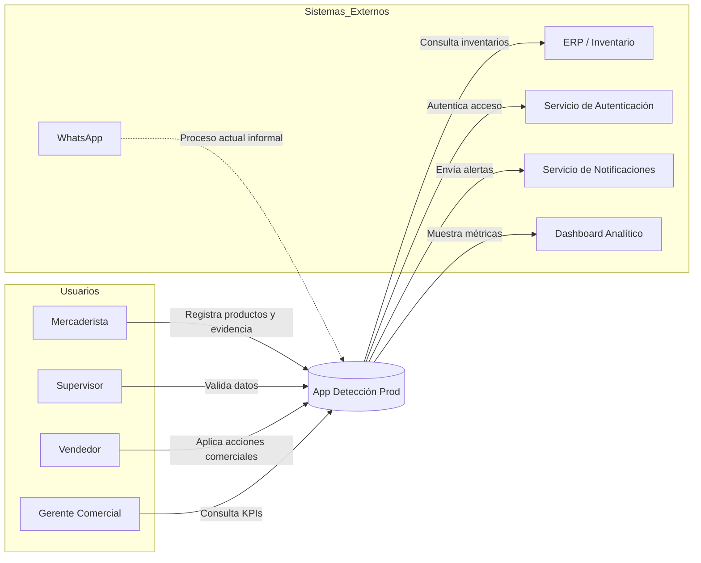

# Documento Técnico Inicial (DTI)
## Proyecto: App Detección Prod

---

# §0 Contexto y Alcance

## 0.1 Contexto del Negocio

El proyecto “App Detección Prod” está dirigido a empresas distribuidoras e importadoras que operan en el canal retail, como supermercados, farmacias, micromercados y tiendas especializadas. El objetivo es transformar el proceso manual y desorganizado de gestión de productos próximos a vencer en una solución digital y estructurada.

Actualmente, los procesos de gestión de productos próximos a vencer se realizan a través de canales informales, como reportes en WhatsApp, fotografías no estandarizadas y comunicación fragmentada, lo que impide un control eficiente y la trazabilidad de las acciones comerciales. Los problemas resultantes incluyen pérdidas económicas por vencimiento, mala rotación de productos, desalineación entre áreas y falta de métricas clave para la toma de decisiones.

---

## 0.2 Objetivo del Sistema

El sistema tiene como objetivo principal centralizar la gestión de productos próximos a vencer y las acciones comerciales asociadas. A través de una plataforma digital, se pretende mejorar la visibilidad, trazabilidad y toma de decisiones estratégicas en tiempo real, optimizando la rotación de productos y reduciendo pérdidas económicas.

---

## 0.3 Alcance Inicial del MVP

El MVP (Minimum Viable Product) incluirá las siguientes funcionalidades clave:

- **Registro de Productos**: Ingreso de productos próximos a vencer con fecha de vencimiento, cantidad y precio.
- **Acciones Comerciales**: Registro de descuentos, promociones, bandeo y retiros de productos.
- **Evidencia Fotográfica**: Captura de fotos para validación de la acción comercial.
- **Dashboard para Supervisores**: Visualización de los productos, acciones tomadas y métricas clave.
- **Alertas en Tiempo Real**: Notificaciones automáticas para acciones urgentes sobre productos próximos a vencer.
- **KPIs Estratégicos**: Indicadores de rotación de productos, impacto de acciones comerciales y eficiencia operativa.

---

## 0.4 Actores Principales

| Actor             | Rol dentro del sistema                                             |
|-------------------|--------------------------------------------------------------------|
| Mercaderista      | Registra productos y acciones comerciales en campo.               |
| Supervisor        | Valida la información registrada y monitorea las acciones comerciales. |
| Vendedor          | Ejecuta acciones comerciales y controla la promoción de productos. |
| Gerente Comercial | Supervisa las métricas estratégicas del negocio, como los KPIs de rotación de productos, y toma decisiones comerciales. |

---

## 0.5 Necesidades Operativas y Estratégicas

### Necesidades Operativas:
- Centralización de información.
- Reducción de carga cognitiva.
- Visibilidad en tiempo real.
- Reducción de errores manuales.
- Trazabilidad de productos y acciones comerciales.
- Mejora en la coordinación entre áreas.

### Necesidades Estratégicas:
- KPIs en tiempo real para la toma de decisiones.
- Métricas clave de rotación de productos y eficiencia.
- Visibilidad ejecutiva consolidada por región y producto.
- Análisis de impacto financiero de las acciones comerciales.

---

## 0.6 Beneficios Esperados

### Beneficios Operativos:
- Reducción de tiempos de validación.
- Mayor control sobre la rotación de productos.
- Mejora en la eficiencia operativa.
- Reducción de errores manuales.

### Beneficios Estratégicos:
- Mejora en la visibilidad y toma de decisiones.
- Reducción de pérdidas por vencimiento.
- Optimización de la gestión comercial y financiera.

### Beneficios Tecnológicos:
- Solución escalable con soporte para nuevos módulos.
- Centralización de datos y accesibilidad en tiempo real.
- Mejor gestión de la infraestructura tecnológica.

---

# §1 C4 Model — Nivel 1 (System Context Diagram)

## 1.1 Introducción al Modelo C4 – Nivel 1

El modelo C4 proporciona una forma de visualizar y describir la arquitectura de un sistema. El Nivel 1 se centra en mostrar el contexto del sistema, destacando los actores involucrados y sus interacciones con el sistema. Este nivel permite ver cómo los usuarios interactúan con el sistema y qué sistemas externos influyen en su funcionamiento.

---

## 1.2 Sistema Principal

| Sistema                    | Descripción                                                             |
|----------------------------|-------------------------------------------------------------------------|
| App Detección Prod          | Plataforma centralizada para la gestión de productos próximos a vencer y la ejecución de acciones comerciales. |

---

## 1.3 Tabla de Actores

| Actor             | Descripción                                  | Interacción principal                  |
|-------------------|----------------------------------------------|----------------------------------------|
| Mercaderista      | Registra productos y acciones comerciales.   | Interactúa para registrar productos y realizar acciones comerciales. |
| Supervisor        | Valida información y supervisa la calidad de los datos. | Verifica y aprueba los datos ingresados. |
| Vendedor          | Ejecuta acciones comerciales.  | Aplica promociones, descuentos y bandeo en productos próximos a vencer. |
| Gerente Comercial | Supervisa el desempeño estratégico del negocio. | Consulta KPIs, métricas y toma decisiones estratégicas. |

---

## 1.4 Tabla de Sistemas Externos

| Sistema Externo           | Descripción                                |
|---------------------------|--------------------------------------------|
| WhatsApp                  | Canal actual de comunicación informal.     |
| ERP/Inventario            | Sistema de gestión de inventarios y productos.         |
| Servicio de Autenticación | Sistema para validar identidad y roles.    |
| Servicio de Notificaciones| Canal para enviar alertas en tiempo real. |
| Dashboard Analítico       | Herramienta de análisis y visualización de métricas. |

---

## 1.5 Relaciones del Sistema

| Origen          | Destino              | Relación                                  |
|-----------------|----------------------|-------------------------------------------|
| Mercaderista    | App Detección Prod    | Registra información de productos y acciones comerciales. |
| Supervisor      | App Detección Prod    | Supervisa la validación de datos e informa al equipo. |
| Vendedor        | App Detección Prod    | Ejecuta acciones comerciales en productos próximos a vencer. |
| Gerente Comercial | App Detección Prod    | Consulta y analiza los KPIs para decisiones estratégicas. |
| App Detección Prod | ERP/Inventario        | Consulta inventarios y productos disponibles. |
| App Detección Prod | Servicio de Autenticación | Autentica el acceso a la plataforma.   |
| App Detección Prod | Servicio de Notificaciones | Envía alertas sobre acciones urgentes. |
| App Detección Prod | Dashboard Analítico   | Expone KPIs y métricas clave de desempeño. |

---

## 1.6 Diagrama C4 Nivel 1

---

