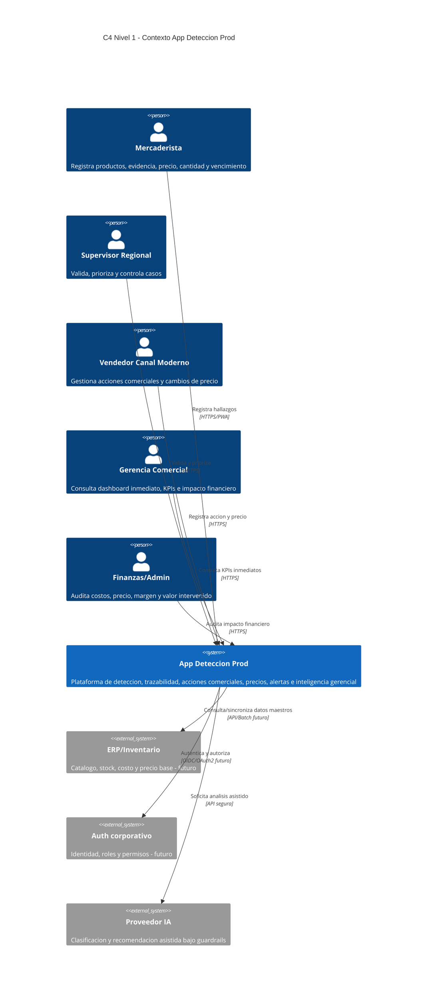
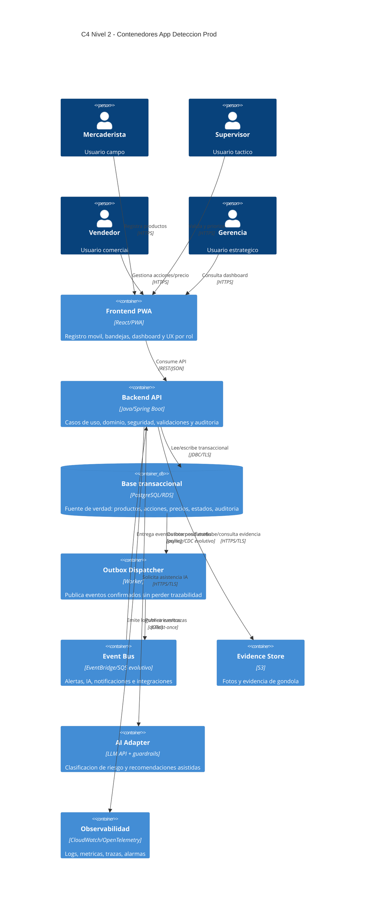
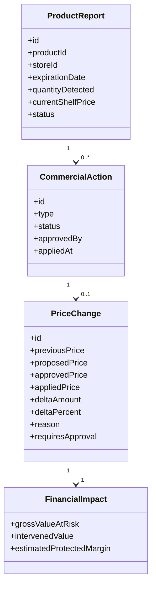
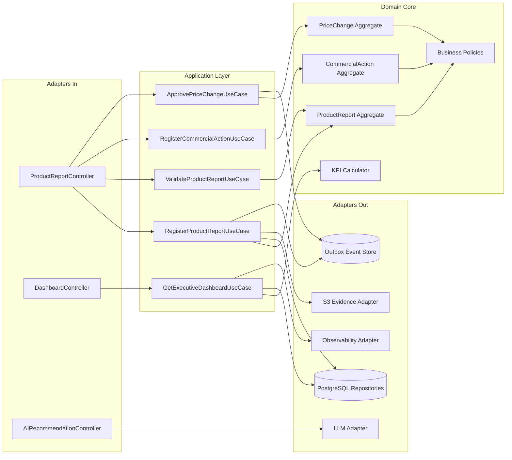
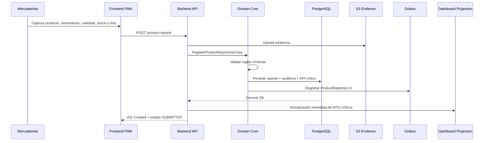
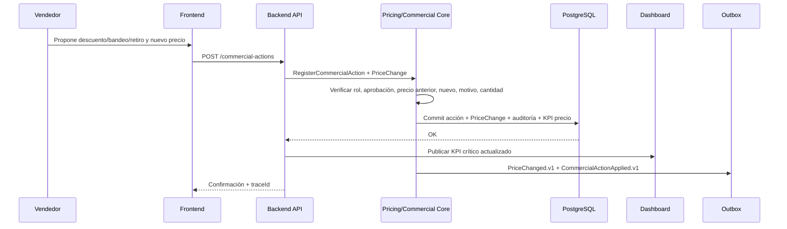
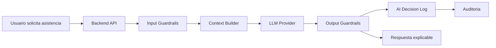
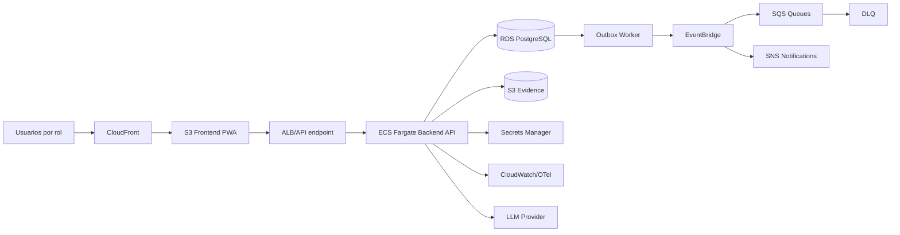

# Documento Técnico Inicial vFinal — App Detección Prod

**Versión:** v1.3 — Defensa final / nivel master-doctorado  
**Estado:** En revisión  
**Autora:** Gina Fabiana Villanueva Viscarra  
**Rama evaluable:** `release/2.0.0`  
**Audiencia:** dual: humanos + agentes IA  

---

## 0. Metadatos, propósito y control de coherencia `[máquina]`

### 0.1 Propósito rector

Este Documento Técnico Inicial es el **contrato técnico rector** de App Detección Prod. No reemplaza al BRD, MRD, PRD, FSD ni ADRs; los integra, los conecta y los convierte en una arquitectura defendible. Su función principal es demostrar que la solución no es un CRUD aislado, sino una **plataforma de inteligencia operativa y comercial** para detectar, gestionar, auditar y medir productos próximos a vencer en canal retail.

La solución responde a un problema de negocio concreto: empresas distribuidoras/importadoras gestionan vencimientos con WhatsApp, Excel, fotos dispersas y comunicación manual. Ese proceso genera baja trazabilidad, decisiones tardías, ausencia de control de precios, imposibilidad de medir acciones comerciales y pérdida de visibilidad gerencial. El DTI traduce ese problema en arquitectura, flujos, datos, eventos, métricas, IA controlada, AWS, observabilidad, seguridad, POCs y roadmap.

### 0.2 Artefactos fuente aprobados

| Artefacto | Ruta esperada en repo | Estado | Cómo alimenta el DTI |
|---|---|---:|---|
| BRD vFinal | `docs/brd/BRD_vFinal.md` | Aprobado v1.1 KPI precio | Define problema de negocio, objetivos, stakeholders, RACI, KPIs e impacto esperado. |
| MRD vFinal | `docs/mrd/MRD_vFinal.md` | Aprobado v1.1 KPI precio | Define mercado objetivo, segmentos, alternativas, oportunidad, adopción y diferenciación. |
| PRD vFinal | `docs/prd/PRD_vFinal.md` | Aprobado v1.1 KPI precio | Define visión de producto, épicas, capacidades, historias, NFRs, roadmap y métricas. |
| FSD vFinal | `docs/fsd/FSD_vFinal.md` | Aprobado v1.1 KPI precio | Define actores, casos de uso, reglas, flujos, Gherkin, eventos, datos y criterios funcionales. |
| ADR-0001 | `docs/adr/0001-estilo-arquitectonico.md` | Aprobado | Decide monolito modular evolutivo. |
| ADR-0002 | `docs/adr/0002-arquitectura-hexagonal-core.md` | Aprobado | Decide arquitectura hexagonal para proteger el core. |
| ADR-0003 | `docs/adr/0003-event-driven-outbox-dashboard-tiempo-real.md` | Aprobado | Decide dashboard inmediato + event-driven/outbox para procesos secundarios. |
| ADR-0004 | `docs/adr/0004-capa-ia-guardrails-human-in-the-loop.md` | Aprobado | Decide IA asistiva con guardrails y control humano. |
| ADR-0005 | `docs/adr/0005-cloud-aws-despliegue-observabilidad.md` | Aprobado | Decide AWS, operación, seguridad y observabilidad. |

### 0.3 Regla de oro del DTI

> Si una decisión técnica relevante no está en este DTI o no está referenciada desde un ADR, no existe para la defensa final.

### 0.4 Trazabilidad mínima exigida por defensa

| Exigencia de defensa | Evidencia dentro de este DTI | Archivo complementario |
|---|---|---|
| MRD → PRD → FSD → DTI | §15 y §16 | `docs/mrd`, `docs/prd`, `docs/fsd` |
| C4 nivel 1, 2 y 3 | §3, §4, §6.4 | `docs/diagrams/*.mmd` |
| Hexagonal | §6 | ADR-0002 |
| Distribuido / event-driven | §8 y §9 | ADR-0003 |
| AWS justificado por servicio | §12 | ADR-0005 |
| IA + guardrails | §10 | ADR-0004 |
| AGENTS.md ejecutable | §20 | `AGENTS.md` |
| POCs ejecutadas con métricas | §17 | `pocs/POC-01`, `pocs/POC-02` |
| Prompt Mapping | §19 | `docs/PROMPT_MAPPING.md`, `prompts/PR-*.md` |
| ≥ 8 diagramas `.mmd` | §14 | `docs/diagrams/` |
| Roadmap | §21 | `docs/roadmap.md` |
| Aportes individuales | §23 | `docs/aportes/release-2.0.0.md` |

### 0.5 Rol de agentes IA en el SDLC `[máquina]`

| Agente | Fase SDLC | Output esperado | Supervisor humano | Skill | Qué se actualiza si falla |
|---|---|---|---|---|---|
| `dti-author` | Diseño / documentación | DTI coherente con BRD-MRD-PRD-FSD-ADR | Arquitecta del proyecto | `docs/skills/dti-author.md` | DTI + AGENTS.md + ADR afectado |
| `c4-architect` | Diseño arquitectónico | C4 L1-L3 en Mermaid | Arquitecta del proyecto | `docs/skills/c4.md` | DTI §3-§6 + diagramas |
| `poc-runner` | Validación | POC reproducible con log y métricas | Arquitecta / QA | `docs/skills/poc-runner.md` | POC + DTI §17 + ADR validado |
| `prompt-auditor` | IA / QA | Validación de prompts, guardrails y trazabilidad | Responsable IA | `docs/skills/prompt-auditor.md` | PROMPT_MAPPING + ADR-0004 |
| `repo-auditor` | Release | Checklist release/2.0.0 | Responsable entrega | `docs/skills/repo-auditor.md` | Issues + checklist de cierre |

---

## 1. Visión del producto `[humano]`

### 1.1 Problema estratégico

App Detección Prod resuelve la brecha entre la operación en campo y la inteligencia comercial. En el proceso actual, los mercaderistas detectan productos próximos a vencer y reportan por WhatsApp, fotografías o Excel. Supervisores y vendedores intentan consolidar, validar y tomar decisiones comerciales con información incompleta. Gerencia recibe datos tardíos, dispersos o no cuantificables, por lo que no puede medir con precisión la merma, el impacto de descuentos, los cambios de precio, las devoluciones o las acciones correctivas.

El problema no es solamente “falta de app”; es la ausencia de un **sistema socio-técnico trazable** que conecte: detección → validación → acción comercial → control de precio → evidencia → indicador financiero → decisión gerencial.

### 1.2 Usuarios objetivo

| Rol | Necesidad principal | Dolor actual | Valor que aporta App Detección Prod |
|---|---|---|---|
| Mercaderista | Registrar rápido en tienda | Alta carga cognitiva, fotos sin estándar, múltiples chats | Registro guiado, evidencia, precio, cantidad y vencimiento en una sola vista. |
| Supervisor | Validar y priorizar | Pierde tiempo revisando WhatsApp/Excel y completando datos | Bandeja centralizada, alertas, estados, SLA y trazabilidad. |
| Vendedor | Ejecutar acción comercial | Decide con incertidumbre, no sabe si hubo descuento o retiro | Acciones claras, historial, precio aprobado/aplicado y prioridad. |
| Gerencia | Decidir con KPIs | No mide impacto financiero ni rotación en tiempo real | Dashboard inmediato, merma, precio, valor intervenido y riesgos. |
| Finanzas/Admin | Auditar impacto | No puede relacionar acción-precio-cantidad-costo | Auditoría de precio, costo, margen, devolución y valor protegido. |

### 1.3 Propuesta de valor técnica

La plataforma centraliza el registro de productos próximos a vencer, valida datos críticos, registra acciones comerciales, controla precio anterior/nuevo, mide cantidad intervenida, actualiza el dashboard gerencial en tiempo casi real y genera eventos auditables para alertas, IA, reportes históricos e integración futura.

### 1.4 North Star Metric

**NSM:** porcentaje de productos próximos a vencer gestionados con acción comercial trazable antes del umbral crítico.

Esta métrica une negocio y arquitectura porque exige datos correctos, estados consistentes, precio auditado, dashboard actualizado, workflow operativo y trazabilidad completa.

### 1.5 Métricas secundarias críticas

| KPI | Definición | Meta inicial | Fuente | Implicancia técnica |
|---|---|---:|---|---|
| Tiempo de validación | Validación - registro | Reducir ≥ 50 % | PRD/FSD | Workflow y dashboard operativo. |
| Cobertura de acción comercial | Casos con acción / casos validados | ≥ 85 % | BRD/PRD | Estados y alertas. |
| Cobertura de precio intervenido | Acciones con precio anterior+nuevo / acciones de precio | 100 % | FSD v1.1 | `PriceChange` obligatorio. |
| Diferencia precio aprobado vs aplicado | |precio_aplicado - precio_aprobado| | ≤ 2 % salvo excepción | FSD/ADR-0005 | Auditoría, alarmas, permisos. |
| Valor económico intervenido | Σ(cantidad × variación precio) | Medición mensual | BRD/DTI | Dashboard financiero. |
| Frescura dashboard crítico | Tiempo commit → KPI visible | p95 ≤ 5 s | ADR-0003 | Actualización transaccional/proyección inmediata. |
| Casos críticos sin acción | Casos críticos abiertos > SLA | Tendencia descendente | PRD | Alertas + SLA. |
| Tasa de errores de registro | Casos rechazados por datos incompletos | Reducir ≥ 40 % | FSD | Validaciones UX/API. |
| Recomendaciones IA aceptadas | IA aceptada / IA emitida | Medir, no automatizar | ADR-0004 | IA asistiva auditada. |

---

## 2. Drivers arquitectónicos `[humano+máquina]`

### 2.1 Drivers de negocio → diseño técnico

| Driver de negocio | Consecuencia técnica | Decisión/Sección |
|---|---|---|
| Reducir merma por vencimiento | Priorización por fecha, cantidad, valor económico y estado | §5, §7, §9 |
| Medir impacto comercial | Modelo explícito de acción, precio, cantidad, costo y resultado | §5, §9 |
| Controlar cambios de precio | `PriceChange` con auditoría, aprobación y evidencia | §5.4, §11 |
| Visibilidad gerencial inmediata | Dashboard de KPIs críticos actualizado al confirmar transacción | ADR-0003, §9 |
| Evitar sobreingeniería | Monolito modular con seams para evolución | ADR-0001, §4 |
| Proteger reglas de negocio | Hexagonal: dominio aislado de UI, BD, IA y AWS | ADR-0002, §6 |
| Usar IA sin riesgo comercial | IA recomienda/clasifica, humano decide | ADR-0004, §10 |
| Entrega defendible | Trazabilidad documental + diagramas + POCs + prompts | §14-§20 |

### 2.2 Drivers de calidad ISO/arquitectura

| Atributo | Umbral/criterio | Mecanismo | Evidencia |
|---|---|---|---|
| Modificabilidad | Cambios de flujo sin reescribir infraestructura | Hexagonal + módulos | ADR-0002 |
| Trazabilidad | 100 % de acciones críticas con auditoría | Audit log + outbox | §8, §11 |
| Frescura | p95 ≤ 5 s KPIs críticos | Proyección inmediata | §9 |
| Seguridad | Sin cambio de precio sin rol/aprobación | RBAC + audit | §11 |
| Resiliencia | 0 pérdida lógica de eventos críticos | Outbox + idempotencia | §8 |
| Observabilidad | traceId en registro-validación-acción | OpenTelemetry | §13 |
| Explicabilidad IA | Toda recomendación con prompt_id/modelo/confianza | AI Decision Log | §10 |
| Portabilidad evolutiva | Extracción futura por bounded context | eventos + módulos | §4, §8 |

### 2.3 Principio rector de consistencia

El sistema usa una política deliberada de consistencia:

1. **Consistencia fuerte/transaccional** para datos que afectan operación inmediata: registro, validación, acción, precio, cantidad, estado, aprobaciones y dashboard crítico.
2. **Consistencia casi en tiempo real** para proyecciones de dashboard operacional y gerencial, con SLO explícito y fallback a datos fuente.
3. **Consistencia eventual controlada** para tareas no bloqueantes: notificaciones, IA, auditoría enriquecida, reportes históricos y futuras integraciones.

Esto evita dos errores: no se sacrifica la inmediatez gerencial y tampoco se bloquea la experiencia operativa esperando procesos secundarios.

---

## 3. Contexto del sistema — C4 Nivel 1 `[humano+máquina]`

### 3.1 Actores y dependencias

| Actor/Sistema | Tipo | Dirección | Criticidad | Justificación |
|---|---|---|---:|---|
| Mercaderista | Humano | Entrada | Alta | Fuente primaria de datos en campo. |
| Supervisor | Humano | Entrada/salida | Alta | Valida y prioriza casos. |
| Vendedor | Humano | Entrada/salida | Alta | Ejecuta acciones comerciales y cambios de precio. |
| Gerencia Comercial | Humano | Salida | Alta | Consume dashboard inmediato e impacto financiero. |
| Finanzas/Admin | Humano | Salida/auditoría | Media/Alta | Audita precio, margen, devolución, costos. |
| ERP/Inventario | Sistema futuro | Entrada/salida | Media | Catálogo, stock, costo, precio base. |
| Auth corporativo | Sistema futuro | Entrada | Alta | Identidad y permisos. |
| Proveedor IA | Servicio externo | Salida/entrada | Media | Clasificación y recomendación asistida. |

### 3.2 C4 Context



### 3.3 Lectura del contexto

El sistema opera como puente entre la realidad física de góndola y la dirección comercial. La arquitectura debe aceptar que el dato nace en condiciones imperfectas: presión de tiempo, conectividad variable, evidencia visual heterogénea y múltiples roles. Por eso el diseño privilegia validaciones tempranas, evidencia obligatoria, estado compartido y trazabilidad.

---

## 4. Arquitectura de alto nivel — C4 Nivel 2 `[humano+máquina]`

### 4.1 Estilo adoptado

Se adopta una **arquitectura híbrida: monolito modular + hexagonal + event-driven interno/evolutivo + AWS administrado + IA asistiva**.

| Estilo | Adoptado | Motivo |
|---|---:|---|
| Monolito modular | Sí | Equipo y dominio en consolidación; reduce costo operativo y permite modularidad real. |
| Hexagonal | Sí | Protege reglas de negocio de UI, BD, AWS e IA. |
| Microservicios completos | No, por ahora | Sería prematuro; se dejan seams por bounded context. |
| Event-driven | Sí, selectivo | Para outbox, alertas, auditoría, IA, integración futura y resiliencia. |
| Serverless | Parcial/evolutivo | Útil para jobs, notificaciones o analítica, no como core inicial. |
| IA runtime | Sí, asistiva | Clasifica, prioriza, resume y recomienda con guardrails. |

### 4.2 C4 Container



### 4.3 Decisión clave de arquitectura de contenedores

El backend API no es un CRUD acoplado; contiene módulos de dominio separados: `ProductDetection`, `SupervisionWorkflow`, `CommercialActions`, `PricingControl`, `ExecutiveAnalytics`, `Audit`, `Notification` y `AIAssistance`. Estos módulos comparten proceso de despliegue en la primera etapa, pero no deben compartir lógica de dominio de forma indiscriminada. La separación modular permite evolucionar a servicios separados cuando existan señales reales de escala, equipos autónomos, tráfico diferenciado o regulación específica.

---

## 5. Modelo de dominio `[humano+máquina]`

### 5.1 Bounded contexts

| Contexto | Responsabilidad | Entidades/agregados | Integración | Riesgo que controla |
|---|---|---|---|---|
| Product Detection | Registro de producto próximo a vencer | `ProductReport`, `Evidence`, `ExpirationRisk` | Sync core + evento | Datos incompletos desde campo. |
| Supervision Workflow | Validación, priorización, SLA | `ValidationCase`, `SupervisorDecision` | Sync core | Incertidumbre y reprocesos. |
| Commercial Actions | Descuento, bandeo, retiro, promoción | `CommercialAction`, `ActionApproval` | Sync core + evento | Acciones no registradas. |
| Pricing Control | Precio anterior/nuevo/aprobado/aplicado | `PriceChange`, `PricePolicy`, `PriceAudit` | Sync fuerte | Cambios de precio sin control. |
| Executive Analytics | Dashboard e indicadores | `KpiSnapshot`, `FinancialImpact` | Sync crítico + async histórico | Decisiones con datos desactualizados. |
| Audit & Compliance | Historial, trazabilidad, permisos | `AuditEntry`, `TraceRecord` | Sync/evento | Falta de evidencia y accountability. |
| AI Assistance | Clasificación y recomendación | `AIRecommendation`, `PromptExecution` | Async/sync controlado | Recomendaciones sin control humano. |
| Notifications | Alertas y recordatorios | `Notification`, `Escalation` | Async | Casos críticos no atendidos. |

### 5.2 Aggregates, Entities y Value Objects

| Tipo | Nombre | Invariantes principales | Ciclo de vida |
|---|---|---|---|
| Aggregate Root | `ProductReport` | Debe tener tienda, producto, vencimiento, cantidad, precio actual, evidencia y usuario. | Draft → Submitted → Validated/Rejected → Managed → Closed |
| Aggregate Root | `CommercialAction` | Toda acción debe asociarse a un reporte validado y responsable. | Proposed → Approved → Applied → Measured/Cancelled |
| Aggregate Root | `PriceChange` | Si existe cambio, precio anterior, precio nuevo, motivo y aprobación son obligatorios. | Requested → Approved → Applied → Audited |
| Entity | `Evidence` | Archivo con hash, fecha, geolocalización opcional, relación a reporte. | Uploaded → Linked → Archived |
| Entity | `ValidationCase` | Una validación debe registrar decisión, responsable y motivo. | Pending → Validated/Rejected |
| Entity | `KpiSnapshot` | Se calcula desde estado transaccional o proyección marcada con freshness. | Generated → Published |
| Value Object | `Money` | Monto + moneda; no negativo salvo ajuste contable explícito. | Inmutable |
| Value Object | `ExpirationWindow` | Días al vencimiento + umbral de criticidad. | Inmutable |
| Value Object | `RiskLevel` | `LOW`, `MEDIUM`, `HIGH`, `CRITICAL`. | Inmutable |
| Value Object | `PriceDelta` | Diferencia absoluta y porcentual entre precio anterior/nuevo/aprobado/aplicado. | Inmutable |

### 5.3 Reglas de negocio críticas

| ID | Regla | Implicancia técnica |
|---|---|---|
| BR-001 | No se puede validar un producto sin evidencia mínima y fecha de vencimiento. | Validación en caso de uso + UI. |
| BR-002 | No se puede aplicar acción comercial a reporte rechazado. | Estado del aggregate. |
| BR-003 | Todo cambio de precio requiere precio anterior, precio nuevo, motivo y responsable. | `PriceChange` obligatorio. |
| BR-004 | La diferencia entre precio aprobado y aplicado debe disparar alerta si supera umbral. | KPI + alerta + auditoría. |
| BR-005 | La IA no puede aprobar cambios de precio, descuentos, retiros ni cierres. | Guardrail + RBAC. |
| BR-006 | El dashboard crítico debe reflejar cambios transaccionales p95 ≤ 5 s. | Proyección inmediata/fallback. |
| BR-007 | Toda acción que afecte dinero debe tener `traceId`, usuario y timestamp. | Auditoría y observabilidad. |

### 5.4 Modelo conceptual de precio



---

## 6. Arquitectura hexagonal del core `[humano+máquina]`

### 6.1 Justificación

La arquitectura hexagonal es necesaria porque el valor del sistema está en reglas de negocio y trazabilidad, no en el framework. El core debe poder responder preguntas de negocio sin depender de React, PostgreSQL, AWS o el proveedor IA:

- ¿Puede registrarse este producto?
- ¿Debe escalarse por criticidad?
- ¿La acción comercial requiere aprobación?
- ¿El precio aplicado coincide con el aprobado?
- ¿Qué impacto financiero genera la acción?
- ¿Qué datos deben mostrarse de inmediato a gerencia?

### 6.2 Puertos de entrada

| Puerto de entrada | Caso de uso FSD | Responsabilidad |
|---|---|---|
| `RegisterProductReportUseCase` | FSD-UC-001 | Registrar producto, vencimiento, precio, cantidad y evidencia. |
| `ValidateProductReportUseCase` | FSD-UC-002 | Validar/rechazar reporte y dejar auditoría. |
| `RegisterCommercialActionUseCase` | FSD-UC-003 | Registrar acción comercial. |
| `ApprovePriceChangeUseCase` | FSD-UC-004/Precio | Aprobar o rechazar cambio de precio. |
| `ApplyCommercialActionUseCase` | FSD-UC-004 | Aplicar acción y actualizar estado. |
| `GetExecutiveDashboardUseCase` | FSD-UC-005 | Consultar KPIs inmediatos. |
| `ClassifyRiskWithAIUseCase` | FSD-UC-007 | Clasificar riesgo con IA bajo guardrails. |
| `AuditCaseHistoryUseCase` | FSD-UC-008 | Consultar trazabilidad completa. |

### 6.3 Puertos de salida

| Puerto de salida | Tipo | Adaptador inicial | Evolución |
|---|---|---|---|
| `ProductReportRepository` | Persistencia | PostgreSQL/JPA | RDS + read replica |
| `CommercialActionRepository` | Persistencia | PostgreSQL/JPA | Servicio independiente futuro |
| `PriceChangeRepository` | Persistencia | PostgreSQL/JPA | Auditoría especializada futura |
| `EvidenceStoragePort` | Objetos | Local/S3 | S3 + lifecycle |
| `DomainEventPublisherPort` | Eventos | Outbox table | EventBridge/SQS |
| `AIRecommendationPort` | IA | LLM externo | Router/modelos múltiples |
| `NotificationPort` | Notificación | Email/mock | SNS/WhatsApp API futuro |
| `MetricsPort` | Observabilidad | OTel/CloudWatch | OpenSearch/Grafana |

### 6.4 C4 nivel 3 — componente crítico



### 6.5 Regla de dependencia

Las dependencias solo apuntan hacia adentro:

`Adapters → Application → Domain`

El dominio nunca importa clases de Spring, React, AWS SDK, JPA o proveedor IA. Si esto ocurre, se considera drift arquitectónico y debe corregirse en el mismo commit que actualice `AGENTS.md`.

---

## 7. Flujos críticos y consistencia `[humano+máquina]`

### 7.1 Flujo crítico: registro y validación de producto próximo a vencer



### 7.2 Flujo crítico: acción comercial con cambio de precio



### 7.3 Decisión de consistencia síncrona/asíncrona

| Información | Consistencia requerida | Motivo | Implementación |
|---|---|---|---|
| Estado del caso | Fuerte | Operación necesita estado confiable | Transacción PostgreSQL |
| Precio anterior/nuevo/aprobado/aplicado | Fuerte | Afecta dinero, auditoría y margen | Transacción + RBAC |
| Cantidad intervenida | Fuerte | Impacta valor económico | Transacción |
| Dashboard KPIs críticos | Casi inmediata | Gerencia decide con datos vigentes | Actualización en commit + fallback a fuente |
| Notificaciones | Eventual | No debe bloquear operación | Outbox + worker |
| IA/recomendación | Eventual/controlada | Asiste, no decide | Evento + guardrails |
| Reportes históricos | Eventual | Análisis no bloqueante | Jobs/proyecciones |

---

## 8. Arquitectura asíncrona / Event-driven / Outbox `[humano+máquina]`

### 8.1 Propósito

El event-driven no se usa para reemplazar la consistencia del core, sino para aumentar trazabilidad, desacoplar tareas secundarias, habilitar alertas, permitir auditoría enriquecida y preparar una evolución a arquitectura distribuida sin convertir el MVP en un monolito distribuido.

### 8.2 Catálogo de eventos

| Evento | Productor | Consumidores | Uso | Garantía |
|---|---|---|---|---|
| `ProductReported.v1` | Product Detection | Supervision, Audit, Notifications | Nuevo caso registrado | At-least-once + idempotencia |
| `ProductValidated.v1` | Supervision | Commercial Actions, Dashboard, Audit | Caso listo para acción | At-least-once |
| `CommercialActionProposed.v1` | Commercial Actions | Supervision, Pricing | Acción requiere aprobación | At-least-once |
| `CommercialActionApplied.v1` | Commercial Actions | Dashboard, Audit, Notifications | Acción aplicada | At-least-once |
| `PriceChanged.v1` | Pricing Control | Dashboard, Finance, Audit | Cambio de precio | At-least-once + auditoría fuerte |
| `CriticalRiskDetected.v1` | Risk Engine/AI | Notifications, Supervision | Riesgo alto/crítico | At-least-once |
| `AIRecommendationGenerated.v1` | AI Assistance | Audit, UI | Recomendación disponible | At-least-once |
| `CaseClosed.v1` | Workflow | Dashboard, Audit | Cierre de caso | At-least-once |

### 8.3 Payload mínimo de `PriceChanged.v1`

```json
{
  "eventId": "uuid",
  "eventType": "PriceChanged.v1",
  "occurredAt": "2026-05-27T15:30:00Z",
  "traceId": "trace-uuid",
  "caseId": "case-123",
  "productId": "prod-456",
  "storeId": "store-789",
  "previousPrice": 10.50,
  "approvedPrice": 8.90,
  "appliedPrice": 8.90,
  "currency": "BOB",
  "quantityIntervened": 24,
  "deltaAmount": -1.60,
  "deltaPercent": -15.24,
  "approvedBy": "user-supervisor",
  "appliedBy": "user-vendedor",
  "reason": "Descuento por proximidad de vencimiento",
  "evidenceRef": "s3://evidence/..."
}
```

### 8.4 Idempotencia, reintentos y DLQ

| Riesgo | Mitigación |
|---|---|
| Evento duplicado | `eventId` único + tabla `processed_events`. |
| Evento no publicado tras commit | Outbox transaccional en misma BD. |
| Worker caído | Reintentos con backoff. |
| Consumidor falla repetidamente | DLQ y alerta CloudWatch. |
| KPI crítico no actualizado por worker | No depende del worker: se actualiza en commit o consulta fuente. |
| Reprocesamiento incorrecto | Consumidores idempotentes por `eventId` + versión de schema. |

---

## 9. Dashboard gerencial y KPIs `[humano+máquina]`

### 9.1 Principio de diseño

El dashboard de gerencia no es un reporte decorativo; es un instrumento de decisión. Por tanto, los KPIs críticos no pueden depender exclusivamente de procesos asíncronos lentos. Deben actualizarse desde el estado transaccional o desde una proyección inmediata con indicador de frescura.

### 9.2 KPIs gerenciales críticos

| KPI | Fórmula | Actualización | Uso gerencial |
|---|---|---|---|
| Casos críticos abiertos | Count casos `CRITICAL` no cerrados | Inmediata | Priorizar intervención. |
| Valor económico en riesgo | Σ(cantidad × precio actual/costo estimado) | Inmediata | Medir exposición. |
| Valor intervenido | Σ(cantidad × precio aplicado) | Inmediata | Medir gestión. |
| Variación de precio promedio | Avg(delta %) por acción | Inmediata | Evaluar agresividad comercial. |
| Diferencia precio aprobado/aplicado | applied - approved | Inmediata + alerta | Detectar desviaciones. |
| Cobertura de precio | acciones con precio completo / acciones precio | Inmediata | Control de calidad de datos. |
| Merma evitada estimada | valor riesgo - pérdida real estimada | Diario/semanal | Evaluar ROI. |
| SLA de validación | tiempo validación - registro | Inmediata | Control táctico. |
| Acciones pendientes | casos validados sin acción | Inmediata | Gestión comercial. |
| Casos por región/tienda | agregación por sala/región | Inmediata/histórica | Priorización territorial. |

### 9.3 Freshness visible

Cada tablero debe mostrar `Última actualización`, `Fuente`, `Frescura`, `traceId último cálculo` y advertencia si el dato supera el SLO.

| Tipo de dato | SLO | Fallback |
|---|---:|---|
| KPI crítico operativo | p95 ≤ 5 s | Consulta directa al estado transaccional. |
| KPI financiero consolidado | p95 ≤ 60 s | Último snapshot + etiqueta de frescura. |
| Reporte histórico | Diario/semanal | Último cierre disponible. |
| IA / explicación | p95 ≤ 30 s si se solicita | Mostrar “análisis pendiente”, nunca bloquear decisión. |

---

## 10. Capa IA / agentes `[humano+máquina]`

### 10.1 Alcance de IA

La IA se usa como **asistente explicativo y de priorización**, no como actor autónomo de decisión comercial. Puede:

- Clasificar riesgo sugerido.
- Resumir historial del caso.
- Sugerir acción probable según reglas.
- Detectar inconsistencias de datos.
- Explicar por qué un caso parece crítico.
- Ayudar a limpiar/transcribir información de entrevistas o documentación.

No puede:

- Aprobar descuentos.
- Cambiar precios.
- Retirar productos.
- Cerrar casos.
- Sobrescribir reglas de negocio.
- Ocultar evidencia o modificar auditoría.

### 10.2 Arquitectura IA



### 10.3 Guardrails obligatorios

| Guardrail | Regla |
|---|---|
| Human-in-the-loop | Toda acción irreversible requiere aprobación humana. |
| No money action | La IA no cambia precios ni aprueba descuentos. |
| Grounding | Toda recomendación debe basarse en datos del caso. |
| Confidence visible | La UI debe mostrar confianza o advertencia de incertidumbre. |
| Auditabilidad | Guardar prompt_id, modelo, versión, usuario, timestamp, respuesta. |
| Prompt injection | Rechazar instrucciones que pidan ignorar reglas. |
| PII/secrets | No exponer datos sensibles o secretos. |

### 10.4 Métricas IA

| Métrica | Umbral inicial |
|---|---:|
| Rechazo prompt injection | 100 % en suite básica |
| Recomendaciones sin grounding | 0 permitidas |
| Acciones irreversibles ejecutadas por IA | 0 |
| Tasa de aceptación humana | Medición exploratoria |
| Tiempo de respuesta IA | p95 ≤ 30 s para análisis no crítico |

---

## 11. Seguridad, permisos y auditoría `[humano+máquina]`

### 11.1 Matriz RBAC

| Acción | Mercaderista | Supervisor | Vendedor | Gerencia | Finanzas/Admin |
|---|---:|---:|---:|---:|---:|
| Registrar producto | Sí | Sí | No | No | No |
| Editar reporte propio en borrador | Sí | No | No | No | No |
| Validar/rechazar reporte | No | Sí | No | No | No |
| Proponer acción comercial | No | Sí | Sí | No | No |
| Aprobar cambio de precio | No | Sí* | Sí* | Excepción | No |
| Aplicar precio aprobado | No | Sí | Sí | No | No |
| Consultar dashboard ejecutivo | No | Parcial | Parcial | Sí | Sí |
| Auditar precio/margen | No | Parcial | Parcial | Sí | Sí |
| Ejecutar recomendación IA | No | Sí con control | Sí con control | No | No |

`*` Según política comercial y umbral de variación.

### 11.2 Auditoría mínima por acción crítica

Todo cambio de estado, acción comercial o precio debe registrar:

- `traceId`
- usuario
- rol
- timestamp
- entidad afectada
- estado anterior/nuevo
- precio anterior/nuevo/aprobado/aplicado si aplica
- cantidad
- motivo
- evidencia
- origen: humano / sistema / IA sugerida

### 11.3 Amenazas principales

| Amenaza | Mitigación |
|---|---|
| Cambio de precio no autorizado | RBAC + aprobación + auditoría + alerta. |
| Manipulación de evidencia | S3 con hash, metadata y permisos mínimos. |
| Pérdida de trazabilidad | Audit log transaccional + outbox. |
| Dashboard engañoso por atraso | freshness visible + fallback a fuente. |
| Prompt injection | guardrails + tests. |
| Exposición de datos | cifrado, secrets manager, roles mínimos. |

---

## 12. Despliegue AWS y justificación por servicio `[humano+máquina]`

### 12.1 Mapeo AWS

| Componente | Servicio AWS | Justificación | Etapa |
|---|---|---|---|
| Frontend PWA | S3 + CloudFront | Bajo costo, distribución rápida, cache controlado. | MVP |
| Backend API | ECS Fargate / App Runner | Ejecutar monolito modular sin administrar servidores. | MVP/evolutivo |
| Base transaccional | RDS PostgreSQL | Fuente fuerte de verdad, transacciones, SQL, auditoría. | MVP |
| Evidencia fotográfica | S3 | Objetos, lifecycle, hash, escalabilidad. | MVP |
| Secrets | AWS Secrets Manager | Protección credenciales, rotación. | MVP |
| Observabilidad | CloudWatch + OTel | Logs, métricas, trazas y alarmas. | MVP |
| Outbox dispatcher | ECS Scheduled/Worker | Publicación confiable de eventos. | Evolutivo |
| Event bus | EventBridge | Enrutamiento desacoplado por evento. | Evolutivo |
| Cola | SQS + DLQ | Reintentos, desacople, DLQ. | Evolutivo |
| Notificaciones | SNS / integración futura WhatsApp API | Alertas sin acoplar core. | Evolutivo |
| Analítica | RDS read replica / Athena futuro | Reportes sin afectar operación. | Futuro |
| IA | LLM externo via API + Secrets | Asistencia controlada sin alojar modelo inicialmente. | MVP/evolutivo |

### 12.2 Diagrama deployment AWS



### 12.3 RPO/RTO propuesto

| Nivel | RPO | RTO | Estrategia |
|---|---:|---:|---|
| MVP académico | 24 h | 8 h | Backup/restore RDS + versionado S3. |
| Piloto empresarial | 4 h | 2 h | Snapshots automáticos + IaC + monitoreo. |
| Producción madura | ≤ 1 h | ≤ 1 h | Multi-AZ + warm standby parcial. |

---

## 13. Observabilidad `[máquina]`

### 13.1 Golden signals

| Señal | Métrica | Umbral |
|---|---|---:|
| Latencia API | p95 endpoints críticos | ≤ 500 ms |
| Error rate | 5xx API | ≤ 1 % |
| Saturación | CPU/memoria backend | alerta > 75 % |
| Frescura dashboard | commit → KPI visible | p95 ≤ 5 s |
| Outbox lag | evento pendiente más antiguo | alerta > 60 s |
| DLQ count | mensajes en DLQ | alerta > 0 |
| Error precio | diferencia aprobado/aplicado fuera umbral | alerta inmediata |
| IA guardrail failure | violación detectada | 0 tolerancia |

### 13.2 Trazas críticas

Cada flujo debe propagar `traceId`:

- Registro producto.
- Validación supervisor.
- Acción comercial.
- Cambio de precio.
- Cálculo KPI.
- Publicación outbox.
- Recomendación IA.

---

## 14. Diagramas versionados `.mmd` `[humano+máquina]`

| # | Archivo | Tipo | Propósito | Estado |
|---:|---|---|---|---|
| 1 | `docs/diagrams/c4-context.mmd` | C4 L1 | Actores y sistema | Requerido |
| 2 | `docs/diagrams/c4-container.mmd` | C4 L2 | Contenedores | Requerido |
| 3 | `docs/diagrams/c4-component-core.mmd` | C4 L3 | Core hexagonal | Requerido |
| 4 | `docs/diagrams/hexagonal-core.mmd` | Hexagonal | Puertos/adaptadores | Requerido |
| 5 | `docs/diagrams/domain-model.mmd` | Dominio | Agregados/entidades | Requerido |
| 6 | `docs/diagrams/sequence-registro-vencimiento.mmd` | Secuencia | Registro producto | Requerido |
| 7 | `docs/diagrams/sequence-cambio-precio.mmd` | Secuencia | Acción + precio | Requerido |
| 8 | `docs/diagrams/event-driven-outbox.mmd` | Event-driven | Outbox/eventos | Requerido |
| 9 | `docs/diagrams/aws-deployment.mmd` | Deployment | AWS | Requerido |
| 10 | `docs/diagrams/ai-guardrails-flow.mmd` | IA | Guardrails | Requerido |

> Los diagramas deben guardarse como texto Mermaid para revisión por diff. PNG o capturas solo pueden ser material de apoyo, no fuente de verdad.

---

## 15. NFRs consolidados `[máquina]`

| ID | Categoría | Umbral | Verificación | Origen |
|---|---|---:|---|---|
| NFR-001 | Rendimiento | p95 API crítica ≤ 500 ms | k6/Locust | PRD/FSD |
| NFR-002 | Frescura dashboard | p95 ≤ 5 s KPIs críticos | test integración | ADR-0003 |
| NFR-003 | Disponibilidad | ≥ 99.5 % piloto | CloudWatch | ADR-0005 |
| NFR-004 | Seguridad | 0 cambios precio sin permiso | test RBAC | FSD/ADR-0005 |
| NFR-005 | Auditoría | 100 % acciones críticas auditadas | query audit log | FSD |
| NFR-006 | Trazabilidad | 100 % flujos críticos con traceId | OTel | ADR-0005 |
| NFR-007 | Resiliencia eventos | 0 pérdida lógica de eventos outbox | POC-01 | ADR-0003 |
| NFR-008 | IA guardrails | 0 acciones irreversibles por IA | tests guardrails | ADR-0004 |
| NFR-009 | Usabilidad campo | registro guiado ≤ 2 min | test usuario | PRD/FSD |
| NFR-010 | Evidencia | 100 % casos críticos con evidencia | validación FSD | FSD |

---

## 16. Matriz de trazabilidad documental `[humano+máquina]`

| Dolor/objetivo | BRD/MRD | PRD | FSD | ADR | DTI |
|---|---|---|---|---|---|
| Falta trazabilidad | BRD problema operativo | Épica registro/seguimiento | UC-001, UC-008 | ADR-0002/0003 | §5, §8, §11 |
| Gerencia sin visibilidad | BRD KPI/gerencia | Dashboard ejecutivo | UC-005 | ADR-0003/0005 | §9, §12 |
| Descuentos no medibles | BRD impacto financiero | Gestión comercial | UC-003/004 | ADR-0002/0003 | §5, §7, §9 |
| Cambio de precio sin control | BRD v1.1 KPI precio | Pricing control | UC precio + BR-003/004 | ADR-0003/0005 | §5.4, §9, §11 |
| Fotos dispersas | MRD alternativas manuales | Evidencia estructurada | UC-001 | ADR-0002/0005 | §4, §12 |
| Supervisor valida manualmente | Research supervisor | Bandeja validación | UC-002 | ADR-0002 | §6, §7 |
| IA con riesgo | PRD capa IA | UC-007 | reglas IA | ADR-0004 | §10 |
| Futuro crecimiento | MRD mercado | Roadmap | NFR escalabilidad | ADR-0001/0005 | §21 |

### 16.1 Mapeo rápido símbolo → archivo/sección → métrica

| Símbolo/capacidad | Archivo/sección | Métrica antes | Métrica después esperada |
|---|---|---:|---:|
| Registro producto | FSD-UC-001 / DTI §7.1 | Reporte disperso por chat | 100 % reportes con estructura mínima |
| Validación supervisor | FSD-UC-002 / DTI §7 | 15 min a horas/días | reducción ≥ 50 % |
| Acción comercial | FSD-UC-003 / DTI §7.2 | sin historial confiable | ≥ 85 % casos validados con acción |
| Cambio precio | FSD precio / DTI §5.4, §9 | no medido | 100 % cambios con precio anterior/nuevo |
| Dashboard gerencia | FSD-UC-005 / DTI §9 | datos tardíos | p95 ≤ 5 s críticos |
| IA asistencia | FSD-UC-007 / DTI §10 | no existe | 0 acciones irreversibles por IA |
| Outbox eventos | ADR-0003 / DTI §8 | riesgo pérdida eventos | 0 pérdida lógica en POC |
| AWS observabilidad | ADR-0005 / DTI §12-13 | sin monitoreo | logs/trazas/métricas por flujo |

---

## 17. POCs críticas `[humano+máquina]`

### 17.1 POC-01 — Outbox + dashboard crítico actualizado

| Campo | Valor |
|---|---|
| Riesgo | Que el sistema pierda eventos o que el dashboard quede desactualizado. |
| Hipótesis | El core puede confirmar transacción, actualizar KPI crítico y registrar outbox sin pérdida lógica. |
| Criterio éxito | 1.000 registros simulados, 0 eventos perdidos, p95 KPI visible ≤ 5 s. |
| Evidencia | Script de carga + log + tabla outbox + screenshot dashboard/metric. |
| ADR validado | ADR-0003, ADR-0005 |
| Aprendizaje esperado | Definir si basta polling outbox o si se requiere EventBridge/SQS desde piloto. |

### 17.2 POC-02 — IA con guardrails para clasificación de riesgo

| Campo | Valor |
|---|---|
| Riesgo | Que la IA sugiera acciones erróneas o intente ejecutar decisiones comerciales. |
| Hipótesis | La IA clasifica riesgo y explica sugerencia sin aprobar descuentos ni precios. |
| Criterio éxito | ≥ 85 % consistencia contra reglas FSD, 100 % rechazo de acciones irreversibles. |
| Evidencia | Dataset de casos, prompts versionados, log de respuestas, tests guardrails. |
| ADR validado | ADR-0004 |
| Aprendizaje esperado | Ajustar prompt-contratos, thresholds y mensajes de incertidumbre. |

---

## 18. Riesgos arquitectónicos y mitigaciones `[humano]`

| Riesgo | Prob. | Impacto | Mitigación | Dueño |
|---|---:|---:|---|---|
| Dashboard no refleja estado real | Media | Alto | KPI transaccional + freshness + fallback | Arquitectura/Backend |
| Cambio precio no autorizado | Media | Alto | RBAC + aprobación + auditoría + alerta | Seguridad/Negocio |
| Monolito se vuelve bola de lodo | Media | Alto | módulos, hexagonal, boundaries, tests | Arquitectura |
| Event-driven mal usado genera inconsistencia | Media | Alto | regla sync/async, outbox, idempotencia | Backend |
| IA genera recomendación insegura | Media | Alto | guardrails + human-in-the-loop | IA/QA |
| Fotos/evidencia crecen en costo | Media | Medio | S3 lifecycle + compresión | DevOps |
| Integración ERP incompleta | Media | Medio | adaptador y sincronización incremental | Integraciones |
| POCs no ejecutadas | Media | Alto evaluación | scripts + evidencia mínima reproducible | Proyecto |
| Falta de AGENTS.md ejecutable | Media | Alto evaluación | sincronizar DTI/AGENTS/prompts | Proyecto |

---

## 19. Prompt Mapping `[máquina]`

### 19.1 Catálogo inicial de prompts

| Prompt | Origen | Output | Archivo | Métrica |
|---|---|---|---|---|
| `PR-UC-001` | FSD-UC-001 | Implementación/validación registro | `prompts/PR-UC-001.md` | registro completo |
| `PR-UC-002` | FSD-UC-002 | Validación supervisor | `prompts/PR-UC-002.md` | tiempo validación |
| `PR-UC-003` | FSD-UC-003 | Acción comercial | `prompts/PR-UC-003.md` | cobertura acción |
| `PR-PRICE-001` | FSD Precio | Cambio de precio auditado | `prompts/PR-PRICE-001.md` | cobertura precio 100 % |
| `PR-DASH-001` | FSD-UC-005 | Dashboard gerencial | `prompts/PR-DASH-001.md` | freshness ≤ 5 s |
| `PR-IA-001` | FSD-UC-007 | Clasificación IA | `prompts/PR-IA-001.md` | guardrails pass |
| `PR-AUDIT-001` | FSD-UC-008 | Auditoría histórica | `prompts/PR-AUDIT-001.md` | trazabilidad 100 % |

### 19.2 Anatomía mínima de prompt-contrato

Cada prompt debe tener: objetivo, contexto, input schema, output schema, invariantes, failure modes, guardrails, ejemplos, tests y vínculo a FSD/DTI.

---

## 20. AGENTS.md y sincronización `[máquina]`

`AGENTS.md` debe ser la versión ejecutable de este DTI para agentes IA. Debe incluir:

- Stack autorizado.
- Estructura del repo.
- Rutas oficiales (`docs/`, `pocs/`, `prompts/`, `docs/diagrams/`).
- Comandos de validación.
- Reglas de arquitectura: monolito modular, hexagonal, no saltar puertos.
- Reglas de seguridad: no cambiar precios sin autorización, no secretos, no PII.
- Reglas IA: no aprobar acciones irreversibles.
- Referencias a ADR-0001..0005.
- Política de commits atómicos DTI + ADR + AGENTS si cambia una decisión.

---

## 21. Roadmap técnico `[humano]`

| Hito | Objetivo | Entregable |
|---|---|---|
| M0 Defensa | Documentación final coherente | DTI, ADRs, diagramas, POCs, AGENTS, prompts |
| M1 MVP campo | Registro producto + evidencia + validación | PWA + API + RDS + S3 |
| M2 Comercial | Acción comercial + cambio precio | módulo pricing + audit |
| M3 Dashboard | KPIs gerenciales inmediatos | dashboard + freshness |
| M4 Event-driven | Outbox + alertas + DLQ | worker + eventos |
| M5 IA asistiva | Clasificación riesgo + guardrails | prompt mapping + evals |
| M6 Piloto | AWS + observabilidad + seguridad | despliegue piloto |
| M7 Evolución | Integración ERP y posibles servicios | seams por bounded context |

---

## 22. Checklist final DTI `[máquina]`

| Checklist plantilla/defensa | Estado | Evidencia |
|---|---:|---|
| Frontmatter YAML completo | ✅ | Inicio del documento |
| Visión producto + métricas | ✅ | §1 |
| C4 Nivel 1 | ✅ | §3 |
| C4 Nivel 2 | ✅ | §4 |
| C4 Nivel 3 módulo crítico | ✅ | §6.4 |
| Data flow / Dynamic diagram crítico | ✅ | §7 |
| Modelo de dominio con aggregates/entities/VOs | ✅ | §5 |
| Arquitectura hexagonal | ✅ | §6 |
| Arquitectura distribuida/evolutiva | ✅ | §4, §8, §12 |
| Event-driven + Outbox | ✅ | §8 |
| AWS mapeado y justificado | ✅ | §12 |
| IA/agentes/guardrails | ✅ | §10 |
| Prompt Mapping trazado | ✅ | §19 |
| NFRs consolidados | ✅ | §15 |
| POCs críticas | ✅ | §17 |
| Seguridad y auditoría | ✅ | §11 |
| Observabilidad | ✅ | §13 |
| Diagramas ≥ 8 `.mmd` | ✅ | §14 |
| AGENTS.md sincronizable | ✅ | §20 |
| Roadmap | ✅ | §21 |
| Aportes release 2.0.0 | ✅ | §23 |

---

## 23. Aportes individuales y release `[humano]`

Este proyecto se documenta como trabajo individual de **Gina Fabiana Villanueva Viscarra**. Para cumplir la plantilla de aportes, `docs/aportes/release-2.0.0.md` debe listar tareas verificables, no descripciones genéricas. Ejemplos:

| # | Integrante | Categoría | Tarea | Referencia |
|---:|---|---|---|---|
| 1 | Gina Fabiana Villanueva Viscarra | BRD | Redacción BRD vFinal v1.1 | `docs/brd/BRD_vFinal.md` |
| 2 | Gina Fabiana Villanueva Viscarra | MRD | Redacción MRD vFinal v1.1 | `docs/mrd/MRD_vFinal.md` |
| 3 | Gina Fabiana Villanueva Viscarra | PRD | Redacción PRD vFinal v1.1 | `docs/prd/PRD_vFinal.md` |
| 4 | Gina Fabiana Villanueva Viscarra | FSD | Casos de uso, reglas, NFRs y precio | `docs/fsd/FSD_vFinal.md` |
| 5 | Gina Fabiana Villanueva Viscarra | ADR | ADR-0001 a ADR-0005 | `docs/adr/` |
| 6 | Gina Fabiana Villanueva Viscarra | DTI | DTI vFinal defensa | `docs/DTI.md` |
| 7 | Gina Fabiana Villanueva Viscarra | Diagramas | ≥ 8 Mermaid | `docs/diagrams/` |
| 8 | Gina Fabiana Villanueva Viscarra | POC | POC-01/POC-02 | `pocs/` |
| 9 | Gina Fabiana Villanueva Viscarra | Prompt Mapping | prompts versionados | `docs/PROMPT_MAPPING.md` + `prompts/` |

---

## 24. Guion técnico para defensa oral `[humano]`

### 24.1 Mensaje central

> App Detección Prod no es una aplicación de registro; es una plataforma de trazabilidad operativa y decisión comercial que transforma un proceso disperso en WhatsApp/Excel en un flujo gobernado por dominio, estados, precios, eventos, auditoría, dashboard inmediato e IA asistiva controlada.

### 24.2 Preguntas esperables y respuestas

| Pregunta docente | Respuesta defendible |
|---|---|
| ¿Por qué no microservicios desde el inicio? | Porque el dominio aún se está estabilizando y el equipo no requiere complejidad operativa distribuida. Se usa monolito modular con seams claros y eventos para evolución. |
| ¿Cómo aseguras que gerencia vea datos actualizados? | Los KPIs críticos se actualizan desde la transacción o proyección inmediata; no dependen solo de workers asíncronos. Hay freshness y fallback. |
| ¿Por qué hexagonal? | Para proteger reglas de negocio: precios, acciones, validaciones, SLA, auditoría e IA no deben depender de React, AWS o JPA. |
| ¿La IA decide descuentos? | No. Clasifica y recomienda. Toda decisión irreversible requiere humano, rol y auditoría. |
| ¿Qué valida la POC? | Que outbox/dashboard no pierden eventos y que IA respeta guardrails. |
| ¿Dónde está el cambio de precio? | En BRD/PRD/FSD v1.1, `PriceChange`, KPI precio, evento `PriceChanged.v1`, dashboard, RBAC y ADR-0005. |

---

## 25. Conclusión arquitectónica

La arquitectura propuesta es coherente con la madurez del producto, la evidencia de investigación y las exigencias de defensa final. El sistema prioriza trazabilidad, consistencia de datos críticos, control de precio, visibilidad gerencial inmediata, modularidad, auditabilidad e IA segura. La combinación de monolito modular, hexagonal, outbox, dashboard transaccional, AWS administrado y guardrails IA permite entregar valor sin sobrediseño, pero deja un camino técnico claro para escalar hacia servicios distribuidos cuando existan señales reales de negocio y operación.

El DTI demuestra la cadena completa:

**problema real → necesidad de negocio → producto → especificación funcional → decisión arquitectónica → implementación futura → validación por POCs → defensa trazable.**

---

## 26. Historial de versión

| Versión | Fecha | Cambio |
|---|---|---|
| v1.0 | 2026-05-27 | DTI inicial integrador. |
| v1.1 | 2026-05-27 | Incorporación transversal de KPI y control de cambio de precio. |
| v1.2 | 2026-05-27 | Mejora nivel doctorado con C4, hexagonal, event-driven, AWS e IA. |
| v1.3 | 2026-05-27 | Reestructuración contra defensa final, checklist, plantilla DTI, prompt mapping, diagramas, aportes y trazabilidad completa. |
