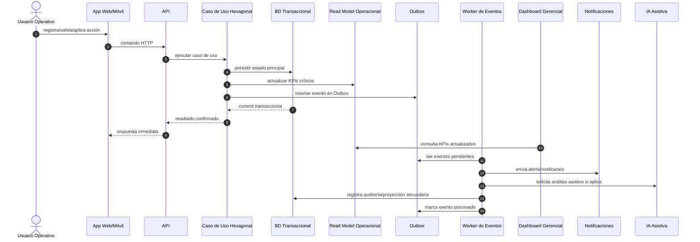

# ADR-0003: Arquitectura event-driven con Outbox transaccional y dashboard operacional actualizado en tiempo real

## Metadatos

| Campo | Valor |
|---|---|
| Número | ADR-0003 |
| Título | Arquitectura event-driven con Outbox transaccional y dashboard operacional actualizado en tiempo real |
| Producto | App Detección Prod |
| Autora | Gina Fabiana Villanueva Viscarra |
| Fecha | 27/05/2026 |
| Estado | Propuesta para revisión |
| Rama objetivo | `release/2.0.0` |
| Ubicación esperada | `docs/adr/0003-event-driven-outbox-dashboard-tiempo-real.md` |
| ADRs previos relacionados | ADR-0001 — Estilo arquitectónico: monolito modular evolutivo; ADR-0002 — Arquitectura hexagonal del core |
| Documentos fuente aprobados | `docs/brd/BRD_vFinal.md`, `docs/mrd/MRD_vFinal.md`, `docs/prd/PRD_vFinal.md`, `docs/fsd/FSD_vFinal.md` |
| Secciones DTI impactadas | §3 Arquitectura de Alto Nivel, §5 Arquitectura Hexagonal, §7 Arquitectura Asíncrona/Event-Driven, §8 AWS, §11 NFRs, §12 POCs, §14 Observabilidad, §17 Trade-offs, §18 Riesgos Técnicos, §21 ADRs |
| Casos FSD impactados | FSD-UC-001 Registro de producto próximo a vencer; FSD-UC-002 Validación/priorización; FSD-UC-003 Acción comercial; FSD-UC-004 Aprobación/rechazo; FSD-UC-005 Dashboard gerencial; FSD-UC-006 Alertas; FSD-UC-007 IA asistiva; FSD-UC-008 Auditoría/historial; FSD-UC-009 Consulta/seguimiento; FSD-UC-010 Cierre y medición de resultado |
| Categoría | Consistencia de datos, event-driven architecture, Outbox pattern, dashboard operacional, auditoría, trazabilidad, evolución distribuida |

---

## 1. Decisión ejecutiva

Se decide adoptar una **arquitectura event-driven interna con Outbox transaccional**, complementada por un **modelo de lectura operacional actualizado de forma síncrona para el dashboard gerencial crítico**.

La decisión no consiste en “hacer todo asíncrono”. Para App Detección Prod, eso sería incorrecto porque la gerencia, supervisión y ventas necesitan información actualizada para tomar decisiones inmediatas sobre productos próximos a vencer, precios, acciones comerciales, cantidades intervenidas, riesgo financiero y avance de gestión. Por tanto, el diseño diferencia tres niveles de consistencia:

1. **Consistencia transaccional fuerte para el estado operativo principal**: registro, validación, acción comercial, precio, cantidad, estado del caso y responsable deben quedar confirmados en la misma transacción del caso de uso.
2. **Dashboard operacional inmediato para decisiones gerenciales y tácticas**: los indicadores críticos del dashboard se calculan desde el estado transaccional vigente o desde tablas/vistas de lectura actualizadas dentro de la misma transacción del comando. No dependen únicamente de un worker asíncrono.
3. **Procesamiento event-driven para efectos derivados**: notificaciones, auditoría enriquecida, proyecciones analíticas históricas, IA asistiva, exportaciones, integración futura y métricas no críticas se procesan por eventos mediante Outbox, con SLO de frescura y monitoreo de lag.

Esta decisión preserva la coherencia con el ADR-0001 y ADR-0002: el sistema sigue siendo un **monolito modular evolutivo** con **core hexagonal**, pero incorpora eventos internos confiables para desacoplar efectos secundarios sin sacrificar la inmediatez del tablero ejecutivo.

---

## 2. Por qué este ADR existe y qué NO repite

Este ADR no vuelve a decidir el estilo macroarquitectónico ni la arquitectura interna del core. Esos asuntos ya están resueltos:

| ADR | Decisión ya tomada | Alcance | Qué NO se repite aquí |
|---|---|---|---|
| ADR-0001 | Monolito modular evolutivo | Define el estilo base y evita microservicios prematuros | No volvemos a comparar monolito vs microservicios como decisión principal |
| ADR-0002 | Arquitectura hexagonal del core | Define puertos, adaptadores, casos de uso y protección del dominio | No volvemos a explicar la separación controller/use case/domain/repository |
| ADR-0003 | Event-driven + Outbox + dashboard inmediato | Define consistencia, eventos, actualización del dashboard, auditoría, alertas, IA y evolución distribuida | Profundiza la estrategia de datos y eventos que los ADR anteriores preparan, pero no detallan |

La pregunta específica que responde este ADR es:

> ¿Cómo garantizamos que App Detección Prod tenga trazabilidad, alertas, auditoría, IA asistiva y evolución futura basada en eventos, sin que el dashboard de gerencia quede desactualizado ni dependa de procesos asíncronos lentos?

---

## 3. Contexto de negocio y problema que debe resolver la arquitectura

El proyecto nace en un entorno de distribuidoras e importadoras que operan en canal retail, donde el proceso actual de control de productos próximos a vencer está fragmentado en WhatsApp, Excel, fotografías sin estandarización y comunicación verbal. Esta situación genera pérdida de trazabilidad, ausencia de métricas, retrasos, desalineación entre operación y estrategia, incremento de merma y falta de medición del impacto de descuentos, bandeos, promociones o retiros.

La cadena documental aprobada establece una necesidad clara:

- **BRD aprobado**: el negocio necesita reducir merma, ordenar el proceso, medir impacto financiero, mejorar trazabilidad y dejar de decidir con información dispersa.
- **MRD aprobado**: el mercado objetivo requiere una solución que conecte operación en campo, supervisión táctica, gestión comercial y gerencia en una sola plataforma.
- **PRD aprobado**: el producto debe soportar registro, validación, priorización, acción comercial, alertas, dashboard, auditoría e IA asistiva.
- **FSD aprobado**: los casos de uso críticos especifican cambios de estado que generan efectos derivados: alertas, actualización de indicadores, auditoría, seguimiento, recomendación IA y cierre de caso.

El punto crítico es que **gerencia no solo quiere reportes posteriores**. Gerencia necesita ver información vigente para decidir:

- qué productos están por vencer,
- qué productos ya tienen acción comercial,
- qué productos siguen sin gestión,
- qué cantidad está intervenida,
- qué valor financiero está en riesgo,
- cuánto se recuperó con descuentos o bandeos,
- qué tiendas o rutas concentran mayor riesgo,
- qué decisiones requieren aprobación o escalamiento.

Por ello, un modelo puramente eventual sería insuficiente si permite que el dashboard muestre datos atrasados sin control. La arquitectura debe ser event-driven, pero con una **línea operacional de lectura inmediata**.

---

## 4. Principio rector de consistencia

La decisión se rige por el siguiente principio:

> Todo dato que soporta una decisión comercial inmediata debe estar disponible en el dashboard operacional al confirmar la transacción del caso de uso. Todo efecto derivado que no bloquee la decisión puede procesarse por eventos con Outbox, SLO de frescura y control de lag.

Esto evita dos errores extremos:

1. **Error 1: todo síncrono**. Haría que registrar un producto espere notificaciones, cálculos pesados, IA, auditoría expandida y actualizaciones analíticas. Resultado: latencia alta, mala UX y acoplamiento.
2. **Error 2: todo asíncrono**. Haría que dashboard, gerencia y supervisión dependan de consumidores eventuales. Resultado: riesgo de decisiones con información atrasada.

La solución adoptada es híbrida y deliberada:

```text
Comando crítico del negocio
  → Transacción principal: estado operativo + read model crítico + outbox
  → Respuesta inmediata al usuario
  → Worker Outbox: notificaciones + auditoría enriquecida + IA + analytics histórico + integraciones
```

---

## 5. Clasificación de datos por nivel de inmediatez

| Categoría de dato | Ejemplos | Nivel de consistencia | Estrategia |
|---|---|---|---|
| Estado principal del caso | reporte creado, validado, rechazado, en acción, cerrado | Fuerte / transaccional | Tabla principal del dominio actualizada en el caso de uso |
| Datos críticos para dashboard operacional | casos abiertos por riesgo, productos sin acción, valor financiero en riesgo, cantidad intervenida, acciones pendientes, alertas activas | Inmediata al commit | Tabla/vista de lectura operacional actualizada en la misma transacción o consulta directa optimizada al estado vigente |
| Alertas tácticas | alerta a supervisor/vendedor, SLA por atención, recordatorio | Casi tiempo real | Evento Outbox con SLO p95 <= 5 s y reintentos |
| Auditoría mínima | usuario, fecha, acción, antes/después, motivo | Fuerte / transaccional | Registro mínimo en la transacción del comando |
| Auditoría enriquecida | trazas extendidas, payload completo, correlación de eventos, histórico de procesamiento | Casi tiempo real | Eventos Outbox + almacenamiento append-only |
| Analytics histórico | tendencias, ranking por tienda/ruta/producto, evolución semanal/mensual | Eventual controlada | Proyecciones asíncronas con SLO p95 <= 60 s |
| IA asistiva | clasificación de riesgo sugerida, recomendación no vinculante, explicación | Eventual controlada | Worker IA con guardrails y human-in-the-loop |
| Integraciones externas futuras | ERP, BI externo, mensajería, data lake | Eventual | Broker/cola desde Outbox |

---

## 6. Decisión detallada

Adoptamos una arquitectura event-driven interna con cinco componentes obligatorios:

### 6.1 Estado operacional transaccional

El core de la aplicación mantiene el estado vigente en tablas de dominio o tablas de lectura operacional. Los casos de uso del FSD que cambian estado deben actualizar estos datos de forma síncrona. Ejemplos:

- `RegistroProductoVencimiento` crea `ReporteVencimiento` y actualiza contadores operativos críticos.
- `ValidarReporte` cambia estado del reporte y actualiza el dashboard operacional.
- `RegistrarAccionComercial` guarda tipo de acción, precio anterior, nuevo precio, cantidad y responsable; también actualiza valor intervenido y casos pendientes.
- `CerrarCaso` guarda resultado financiero y actualiza indicadores de recuperación/merma evitada.

### 6.2 Read model operacional para dashboard inmediato

El dashboard gerencial y táctico no debe depender solo de consumidores asíncronos. Debe leer de:

- tablas del estado vigente optimizadas por índices, o
- vistas/materialized tables operacionales actualizadas dentro de la misma transacción, o
- una combinación: consulta directa para KPIs críticos + proyecciones para analítica secundaria.

El read model operacional debe cubrir al menos:

| KPI / vista | Consumidor | Actualización |
|---|---|---|
| Casos abiertos por nivel de riesgo | Gerencia / Supervisor | En la misma transacción que crea/valida/cierra caso |
| Productos próximos a vencer por tienda | Supervisor / Vendedor / Gerencia | En la misma transacción que registra o valida reporte |
| Productos sin acción comercial | Gerencia / Supervisor | En la misma transacción que cambia estado o registra acción |
| Valor financiero en riesgo | Gerencia | En la misma transacción que registra cantidad/precio/riesgo |
| Cantidad intervenida | Gerencia / Vendedor | En la misma transacción que aplica acción comercial |
| Acciones pendientes de aprobación | Supervisor / Gerencia | En la misma transacción que propone/aprueba acción |
| Alertas activas y vencidas por SLA | Supervisor / Gerencia | Estado inmediato + alertas emitidas por Outbox |

### 6.3 Outbox transaccional

En la misma transacción del caso de uso se inserta un registro en `outbox_event` por cada evento relevante. Esto resuelve el problema de doble escritura:

- Sin Outbox: se puede guardar en DB pero fallar al publicar evento.
- Sin Outbox: se puede publicar evento pero revertir la transacción de DB.
- Con Outbox: estado y evento quedan confirmados juntos.

Estructura mínima propuesta:

```sql
CREATE TABLE outbox_event (
    id UUID PRIMARY KEY,
    aggregate_type VARCHAR(80) NOT NULL,
    aggregate_id UUID NOT NULL,
    event_type VARCHAR(120) NOT NULL,
    event_version INT NOT NULL,
    payload JSONB NOT NULL,
    correlation_id UUID NOT NULL,
    causation_id UUID NULL,
    actor_id UUID NULL,
    actor_role VARCHAR(60) NULL,
    occurred_at TIMESTAMP NOT NULL,
    available_at TIMESTAMP NOT NULL,
    processed_at TIMESTAMP NULL,
    status VARCHAR(30) NOT NULL,
    retry_count INT NOT NULL DEFAULT 0,
    error_message TEXT NULL,
    idempotency_key VARCHAR(160) NOT NULL,
    created_at TIMESTAMP NOT NULL
);

CREATE UNIQUE INDEX ux_outbox_idempotency_key
ON outbox_event(idempotency_key);

CREATE INDEX ix_outbox_status_available
ON outbox_event(status, available_at);

CREATE INDEX ix_outbox_aggregate
ON outbox_event(aggregate_type, aggregate_id);
```

### 6.4 Workers idempotentes

Los consumidores de eventos deben ser idempotentes. Cada evento debe procesarse con clave única para evitar doble efecto:

```text
idempotency_key = event_type + aggregate_id + version + business_sequence
```

Ejemplo:

```text
CommercialActionApplied.v1:actionId=ACT-123:sequence=1
```

Un consumidor puede recibir dos veces el mismo evento por reintento, pero no debe duplicar:

- una alerta,
- una notificación,
- una fila de auditoría,
- una recomendación IA,
- una proyección analítica,
- una métrica financiera.

### 6.5 Observabilidad y fallback de dashboard

El dashboard debe mostrar datos vigentes y, además, indicar estado de frescura cuando use proyecciones secundarias:

- `lastOperationalUpdateAt`: última actualización del estado crítico.
- `projectionLagSeconds`: retraso de proyecciones event-driven.
- `outboxPendingCount`: cantidad de eventos pendientes.
- `outboxFailedCount`: cantidad de eventos fallidos.
- `dashboardDataMode`: `LIVE_SOURCE`, `LIVE_READ_MODEL`, `DEGRADED_WITH_LAG`, `FALLBACK_SOURCE_QUERY`.

Regla de producto:

> Si una proyección secundaria supera el SLO de frescura, el dashboard debe mostrar advertencia de frescura o consultar directamente el estado transaccional para KPIs críticos.

---

## 7. Qué se mantiene síncrono y qué se mantiene asíncrono

### 7.1 Flujo FSD-UC-001 — Registrar producto próximo a vencer

| Paso | Síncrono | Asíncrono | Justificación |
|---|---:|---:|---|
| Validar campos obligatorios | Sí | No | El mercaderista necesita saber si el reporte es aceptado |
| Guardar reporte | Sí | No | Es el hecho principal del negocio |
| Guardar evidencia referenciada | Sí, referencia y hash | Carga/optimización secundaria puede ser async | La trazabilidad depende de la evidencia |
| Calcular días al vencimiento | Sí | No | Dato requerido para dashboard y criticidad inicial |
| Actualizar dashboard operacional | Sí | No | Gerencia/supervisión necesitan visibilidad inmediata |
| Insertar evento Outbox | Sí | No | Garantiza procesamiento posterior |
| Enviar notificación | No | Sí | No debe bloquear el registro |
| Auditoría enriquecida | No | Sí | Puede completarse luego sin perder evento |
| IA asistiva | No | Sí | Puede tener latencia variable |

### 7.2 Flujo FSD-UC-003 — Registrar acción comercial

| Paso | Síncrono | Asíncrono | Justificación |
|---|---:|---:|---|
| Validar permisos y reglas | Sí | No | Evita acciones no autorizadas |
| Guardar acción, precio, cantidad y responsable | Sí | No | Es el estado contractual del caso |
| Actualizar indicadores de cantidad intervenida y valor gestionado | Sí | No | Gerencia requiere información actualizada |
| Insertar evento `CommercialActionApplied.v1` | Sí | No | Garantiza trazabilidad posterior |
| Notificar a supervisor/gerencia si supera umbral | No | Sí | Puede reintentarse |
| Actualizar analytics histórico | No | Sí | No debe bloquear la acción |

### 7.3 Flujo FSD-UC-005 — Consultar dashboard gerencial

| Elemento del dashboard | Fuente primaria | Requisito de frescura |
|---|---|---|
| Casos críticos abiertos | Estado transaccional/read model operacional | Inmediato al commit |
| Valor financiero en riesgo | Estado transaccional/read model operacional | Inmediato al commit |
| Productos sin acción | Estado transaccional/read model operacional | Inmediato al commit |
| Cantidad intervenida | Estado transaccional/read model operacional | Inmediato al commit |
| Acciones pendientes de aprobación | Estado transaccional/read model operacional | Inmediato al commit |
| Alertas activas | Estado operativo + worker de alertas | p95 <= 5 s para entrega; estado visible al commit si el caso es crítico |
| Tendencias semanales/mensuales | Proyección analítica event-driven | p95 <= 60 s |
| IA sugerida | Worker IA | p95 <= 30 s o marcado como pendiente |

---

## 8. Catálogo de eventos de dominio e integración

| Evento | Productor | Consumidores | Payload mínimo | FSD | ¿Actualiza dashboard crítico? | Consistencia requerida |
|---|---|---|---|---|---|---|
| `ProductNearExpiryReported.v1` | FSD-UC-001 | Alertas, auditoría, dashboard, IA | `reportId`, `productId`, `storeId`, `expiryDate`, `quantity`, `currentPrice`, `reportedBy`, `evidenceId`, `occurredAt`, `correlationId` | UC-001 | Sí, por transacción antes del evento | Estado fuerte + evento confiable |
| `CriticalityCalculated.v1` | Motor de criticidad | Alertas, dashboard, IA | `reportId`, `daysToExpire`, `riskLevel`, `rulesApplied`, `calculatedAt` | UC-002/006 | Sí si cambia riesgo del caso | Estado fuerte + evento confiable |
| `ReportValidated.v1` | FSD-UC-002 | Dashboard, acciones comerciales, auditoría | `reportId`, `validatedBy`, `decision`, `reason`, `validatedAt` | UC-002 | Sí | Estado fuerte + evento confiable |
| `ReportRejected.v1` | FSD-UC-002 | Auditoría, notificación | `reportId`, `rejectedBy`, `reason`, `rejectedAt` | UC-002 | Sí, reduce pendientes | Estado fuerte + evento confiable |
| `CommercialActionProposed.v1` | FSD-UC-003 | Aprobación, dashboard, auditoría | `actionId`, `reportId`, `actionType`, `proposedPrice`, `quantity`, `proposedBy`, `reason` | UC-003 | Sí, aumenta pendientes de aprobación | Estado fuerte + evento confiable |
| `CommercialActionApproved.v1` | FSD-UC-004 | Dashboard, notificación, auditoría | `actionId`, `approvedBy`, `approvalLevel`, `approvedAt` | UC-004 | Sí | Estado fuerte + evento confiable |
| `CommercialActionApplied.v1` | FSD-UC-003/004 | Dashboard, métricas, auditoría | `actionId`, `reportId`, `actionType`, `oldPrice`, `newPrice`, `quantityApplied`, `appliedBy`, `appliedAt` | UC-003/004 | Sí, por transacción antes del evento | Estado fuerte + evento confiable |
| `PriceChanged.v1` | Acción comercial | Auditoría, métricas | `productId`, `storeId`, `oldPrice`, `newPrice`, `reason`, `changedBy` | UC-003 | Sí si afecta valor en riesgo | Estado fuerte + evento confiable |
| `AlertRaised.v1` | Alert Engine | Notificación, supervisor, dashboard | `alertId`, `reportId`, `riskLevel`, `recipientRole`, `slaDueAt` | UC-006 | Sí, visible como alerta activa | Casi tiempo real p95 <= 5 s |
| `AlertAcknowledged.v1` | Supervisor/Vendedor | Auditoría, SLA | `alertId`, `acknowledgedBy`, `acknowledgedAt` | UC-006 | Sí | Estado fuerte + evento confiable |
| `AiRiskAssessmentRequested.v1` | Worker/caso de uso | AI Assistant | `requestId`, `reportId`, `promptId`, `riskContext`, `requestedBy` | UC-007 | No bloquea; muestra “pendiente IA” | Eventual controlada |
| `AiRiskAssessmentCompleted.v1` | AI Assistant | Auditoría, dashboard, supervisor | `requestId`, `reportId`, `riskSuggestion`, `confidence`, `guardrailStatus`, `model`, `promptId` | UC-007 | No sustituye estado; enriquece vista | Eventual controlada |
| `CaseClosed.v1` | FSD-UC-010 | Métricas, dashboard, gerencia | `caseId`, `reportId`, `closeReason`, `financialOutcome`, `closedBy`, `closedAt` | UC-010 | Sí, por transacción | Estado fuerte + evento confiable |
| `DashboardProjectionRebuilt.v1` | Projection Worker | Observabilidad | `projectionName`, `rebuiltAt`, `sourceRange`, `status` | UC-005 | No crítico | Eventual |

---

## 9. Diseño de actualización del dashboard gerencial

### 9.1 Dos capas de dashboard

El dashboard se divide en dos capas:

#### A. Dashboard operacional vivo

Sirve para decisiones inmediatas. Debe mostrar:

- casos críticos abiertos,
- productos por vencer por tienda/ruta,
- acciones pendientes,
- valor financiero en riesgo,
- productos sin acción comercial,
- acciones aplicadas,
- cantidad intervenida,
- SLA de atención.

**Fuente:** estado transaccional o read model actualizado síncronamente.

**Frescura:** inmediata después del commit.

#### B. Dashboard analítico/estratégico

Sirve para análisis agregado y tendencia:

- evolución semanal/mensual,
- comparativos por región,
- rotación histórica,
- impacto acumulado de promociones,
- ranking de tiendas/productos,
- efectividad de acciones comerciales,
- patrones sugeridos por IA.

**Fuente:** proyecciones event-driven.

**Frescura:** p95 <= 60 segundos; si supera umbral, se muestra indicador de frescura.

### 9.2 Regla para gerencia

> Ningún KPI usado para tomar decisiones urgentes de gestión comercial debe depender exclusivamente de una proyección asíncrona. Si es urgente, se calcula desde el estado vigente o desde un read model actualizado en la transacción del comando.

### 9.3 Indicadores de frescura obligatorios

El dashboard debe exponer:

```text
Última actualización operacional: 2026-05-27T10:32:15-04:00
Última actualización analítica: 2026-05-27T10:31:55-04:00
Retraso de proyección: 20 segundos
Estado de datos: Actualizado / Con retraso / Modo degradado
```

### 9.4 Modo degradado

Si el worker de proyecciones falla:

1. El estado principal sigue funcionando.
2. Registro, validación y acción comercial no se bloquean.
3. Dashboard operacional sigue leyendo del estado transaccional.
4. Dashboard analítico muestra advertencia de retraso.
5. Outbox conserva eventos pendientes para reproceso.
6. Observabilidad alerta a soporte.

---

## 10. Diagrama de flujo propuesto



---

## 11. Matriz de trazabilidad BRD/MRD/PRD/FSD/ADR/DTI

| Necesidad de negocio/producto | Documento fuente | Caso FSD | Decisión ADR-0003 | Sección DTI a reflejar |
|---|---|---|---|---|
| Reducir merma por vencimiento | BRD/MRD/PRD | UC-001, UC-003, UC-010 | Eventos de reporte, acción y cierre; dashboard actualizado | §7 Event-driven, §11 NFRs |
| Visibilidad gerencial inmediata | BRD/MRD/PRD | UC-005 | Read model operacional síncrono + dashboard vivo | §3, §7, §14 |
| Trazabilidad completa | BRD/FSD | UC-001, UC-008 | Outbox + auditoría mínima transaccional + auditoría enriquecida | §7, §13, §14 |
| Alertas tempranas | PRD/FSD | UC-006 | Eventos `AlertRaised` con SLO p95 <= 5 s | §7, §11, §12 |
| Gestión de acciones comerciales | PRD/FSD | UC-003, UC-004 | Eventos `CommercialAction*`, estado fuerte y métricas | §5, §7, §17 |
| Medición de impacto financiero | BRD/PRD/FSD | UC-005, UC-010 | KPIs críticos síncronos + analytics event-driven | §8, §11, §14 |
| IA asistiva con control humano | PRD/FSD | UC-007 | Eventos IA, guardrails, no acción irreversible automática | §9, §22, §23 |
| Evolución a microservicios futura | DTI/ADR-0001 | Todos los flujos críticos | Eventos versionados y contratos estables | §6, §7, §21 |

---

## 12. Alternativas evaluadas

| Alternativa | Descripción | Ventajas | Riesgos / contras | Decisión |
|---|---|---|---|---|
| A. Todo síncrono | Registro, alertas, dashboard, IA, auditoría y notificación en una sola ejecución | Simplicidad conceptual; dashboard inmediato | Latencia alta; acoplamiento; falla de notificación podría bloquear negocio; no escala | Rechazada |
| B. Todo asíncrono | El comando solo genera evento; dashboard se actualiza por consumidores | Desacoplamiento fuerte | Riesgo de dashboard desactualizado; gerencia decide con datos atrasados | Rechazada |
| C. CRUD + reportes SQL sin eventos | Tablas principales y dashboard por consultas SQL | Simple para MVP | Auditoría débil; notificaciones acopladas; sin evolución distribuida clara | Insuficiente |
| D. Event Sourcing completo | Todo el estado se reconstruye desde eventos | Auditoría máxima | Complejidad excesiva; sobreingeniería para etapa actual | Rechazada por ahora |
| E. Outbox + read model operacional síncrono + proyecciones event-driven | Estado crítico y dashboard vivo al commit; eventos confiables para efectos derivados | Balance entre inmediatez, trazabilidad, robustez y evolución | Requiere disciplina, worker, métricas y pruebas | Aceptada |
| F. Microservicios event-driven desde el inicio | Cada contexto publica/consume eventos por broker | Escalabilidad futura | Prematuro, alto costo operacional, riesgo de distributed monolith | Rechazada por etapa actual |

---

## 13. Consecuencias positivas

- Gerencia puede consultar información crítica inmediatamente después de cada registro, validación o acción comercial.
- El sistema conserva trazabilidad completa sin depender de WhatsApp, Excel o comunicaciones informales.
- Los eventos no se pierden aunque falle el worker, una notificación, una proyección o una integración.
- El dashboard distingue datos vivos de datos analíticos con posible retraso controlado.
- El core hexagonal permanece limpio: publica intención de evento por puerto, no por infraestructura acoplada.
- La arquitectura queda preparada para evolucionar hacia microservicios sin rediseñar todo el dominio.
- La IA queda trazable: cada recomendación se registra con prompt, modelo, confianza, guardrail y humano responsable.
- La defensa puede explicar con claridad el balance entre consistencia fuerte y asincronía controlada.

---

## 14. Consecuencias negativas y costos

| Costo / consecuencia | Impacto | Mitigación |
|---|---|---|
| Mayor complejidad que CRUD simple | Media | Documentar contratos de evento y limitar eventos a casos relevantes |
| Necesidad de tabla Outbox y worker | Media | POC específica y monitoreo desde inicio |
| Riesgo de duplicidad por reintentos | Alta si no se controla | Idempotency key obligatoria y tests |
| Riesgo de dashboard pesado si todo consulta DB transaccional | Media | Read model operacional con índices y actualización transaccional |
| Riesgo de proyecciones desfasadas | Media | Indicador de frescura + fallback al estado fuente |
| Mayor carga de pruebas | Media | Contract tests de eventos y pruebas de lag |
| Mayor disciplina documental | Baja/Media | Reflejar en DTI, AGENTS.md y PROMPT_MAPPING |

---

## 15. Reglas arquitectónicas obligatorias

1. Ningún controller publica eventos directamente.
2. Ningún repositorio decide eventos de negocio por sí solo.
3. Todo evento nace de un caso de uso o servicio de dominio validado por FSD.
4. Todo comando crítico actualiza el estado operativo y el read model crítico antes de responder.
5. Todo evento crítico se registra en Outbox dentro de la misma transacción.
6. Todo consumidor debe ser idempotente.
7. Todo evento debe incluir `correlationId`, `occurredAt`, `actorId`, `actorRole` cuando aplique.
8. Todo evento que alimente IA debe incluir `promptId` y guardrails aplicables.
9. Todo dashboard que use proyecciones debe mostrar frescura de datos.
10. Si una proyección está atrasada, el dashboard crítico debe degradar hacia consulta del estado transaccional.
11. Ninguna recomendación IA puede aplicar descuentos, retiros o cambios de precio sin aprobación humana.
12. Todo cambio de contrato de evento debe versionarse.

---

## 16. Diseño mínimo de contratos de evento

Formato base:

```json
{
  "eventId": "uuid",
  "eventType": "CommercialActionApplied",
  "eventVersion": 1,
  "aggregateType": "CommercialAction",
  "aggregateId": "uuid",
  "correlationId": "uuid",
  "causationId": "uuid",
  "actor": {
    "actorId": "uuid",
    "role": "VENDEDOR_CANAL_MODERNO"
  },
  "occurredAt": "2026-05-27T10:30:00-04:00",
  "payload": {
    "reportId": "uuid",
    "actionType": "DESCUENTO",
    "oldPrice": 20.50,
    "newPrice": 16.90,
    "quantityApplied": 24,
    "storeId": "uuid"
  }
}
```

Campos obligatorios:

| Campo | Motivo |
|---|---|
| `eventId` | Identificación única |
| `eventType` | Enrutamiento y contrato |
| `eventVersion` | Evolución compatible |
| `aggregateType` / `aggregateId` | Relación con entidad principal |
| `correlationId` | Trazabilidad end-to-end |
| `causationId` | Cadena causal |
| `actor` | Auditoría de responsabilidad |
| `occurredAt` | Orden temporal de negocio |
| `payload` | Datos mínimos del evento |

---

## 17. Observabilidad y métricas obligatorias

| Métrica | Umbral objetivo | Uso |
|---|---:|---|
| `outbox_pending_count` | 0 en operación estable | Detectar backlog |
| `outbox_processing_lag_seconds_p95` | <= 5 s para alertas; <= 60 s para analytics | Garantizar frescura |
| `outbox_failed_count` | 0 crítico; alerta si > 0 | Detectar DLQ |
| `event_duplicate_discarded_count` | Medido, no necesariamente 0 | Validar idempotencia |
| `dashboard_operational_freshness_seconds` | 0-2 s | Garantizar dashboard vivo |
| `dashboard_projection_lag_seconds` | <= 60 s | Medir analytics |
| `alert_delivery_latency_p95` | <= 5 s | Efectividad de alertas |
| `ai_assessment_latency_p95` | <= 30 s | UX de IA asistiva |
| `event_processing_error_rate` | < 1 % | Salud de consumidores |
| `manual_fallback_count` | Tendencia decreciente | Calidad operativa |

---

## 18. DLQ, reintentos y recuperación

### 18.1 Política de reintentos

```text
Intento 1: inmediato
Intento 2: +30 segundos
Intento 3: +2 minutos
Intento 4: +10 minutos
Intento 5: +30 minutos
Luego: DLQ lógica y alerta a soporte
```

### 18.2 DLQ lógica

Los eventos fallidos no se eliminan. Pasan a estado:

```text
FAILED_RETRYABLE
FAILED_DEAD_LETTER
REPROCESSED
CANCELLED_BY_OPERATOR
```

### 18.3 Reproceso

El sistema debe permitir reprocesar eventos por:

- `eventId`,
- rango de fecha,
- tipo de evento,
- agregado,
- correlationId.

### 18.4 Regla de seguridad

El reproceso no puede duplicar acciones comerciales, cambiar precios dos veces ni generar alertas duplicadas visibles al usuario. Por eso la idempotencia es obligatoria.

---

## 19. Implicaciones sobre AWS

La arquitectura puede evolucionar en dos fases:

### Fase 1 — Monolito modular con Outbox interna

| Componente | Servicio recomendado | Justificación |
|---|---|---|
| API / Backend | ECS Fargate o Elastic Beanstalk | Ejecución controlada del monolito modular |
| Base transaccional | Amazon RDS PostgreSQL | Estado principal + Outbox + read model operacional |
| Evidencia/fotos | Amazon S3 | Almacenamiento de imágenes y evidencias |
| Observabilidad | CloudWatch + OpenTelemetry | Métricas y trazas |
| Secretos | Secrets Manager / KMS | Seguridad |

### Fase 2 — Event-driven gestionado

| Componente | Servicio recomendado | Justificación |
|---|---|---|
| Publicación de eventos | EventBridge | Ruteo desacoplado y contratos |
| Colas por consumidor | SQS | Reintentos, DLQ y aislamiento |
| Notificaciones | SNS | Comunicación a múltiples canales |
| Orquestación de procesos largos | Step Functions | Sagas simples y flujos compensables |
| Analytics histórico | S3 + Athena/QuickSight o RDS read replica | BI y reporting ejecutivo |

Regla de evolución:

> La Fase 2 solo debe activarse cuando POCs y volumen justifiquen separar consumidores. Antes de eso, el monolito modular con Outbox interna es suficiente y más gobernable.

---

## 20. Relación con IA y guardrails

La IA participa como consumidor/asistente, no como autoridad final.

| Flujo IA | Evento origen | Acción IA | Restricción |
|---|---|---|---|
| Clasificación de riesgo | `ReportValidated.v1` | Sugiere riesgo bajo/medio/alto | No modifica estado sin humano |
| Recomendación de acción | `CriticalityCalculated.v1` | Sugiere descuento, bandeo o retiro | Debe pasar por aprobación |
| Explicación para gerencia | `CaseClosed.v1` | Resume impacto y aprendizaje | Debe citar datos del sistema |
| Detección de anomalía | Eventos de acción/precio | Marca posible inconsistencia | No bloquea automáticamente salvo regla explícita |

Guardrails mínimos:

- no cambiar precios automáticamente,
- no retirar productos automáticamente,
- no enviar mensajes externos sin aprobación,
- no inventar datos financieros,
- no usar datos sin trazabilidad a FSD/BRD/PRD,
- registrar `promptId`, modelo, versión, input hash y output resumido.

---

## 21. POC obligatoria recomendada

### POC-01/POC-03 sugerida: Outbox + dashboard operacional inmediato

**Hipótesis:**

> Creemos que App Detección Prod puede registrar una acción comercial y actualizar el dashboard operacional en la misma transacción, mientras publica eventos confiables por Outbox para notificaciones/auditoría, con p95 de respuesta del comando <= 500 ms y lag de procesamiento de eventos p95 <= 5 s.

**Criterios de éxito:**

| Métrica | Umbral |
|---|---:|
| Latencia p95 del comando `RegistrarAccionComercial` | <= 500 ms |
| Frescura del dashboard operacional | inmediata al commit |
| Eventos perdidos | 0 |
| Eventos duplicados con efecto visible | 0 |
| Lag p95 de Outbox para alertas | <= 5 s |
| Reproceso de evento fallido | exitoso sin duplicidad |

**Experimento mínimo:**

1. Insertar 1.000 reportes simulados.
2. Aplicar 300 acciones comerciales.
3. Verificar que dashboard operacional refleja inmediatamente acciones y valor intervenido.
4. Simular caída de worker.
5. Reanudar worker.
6. Confirmar que Outbox procesa pendientes sin pérdida ni duplicados.

---

## 22. Riesgos y mitigaciones

| Riesgo | Probabilidad | Impacto | Mitigación |
|---|---|---:|---|
| Dashboard lento por consultas directas | Media | Alto | Índices, read model operacional, caché controlada, paginación |
| Dashboard desactualizado por worker caído | Media | Alto | KPIs críticos no dependen del worker; fallback a estado fuente |
| Eventos duplicados | Alta en sistemas con reintento | Medio/Alto | Idempotencia obligatoria |
| Eventos perdidos | Media sin Outbox | Alto | Outbox transaccional |
| Contratos de eventos mal versionados | Media | Medio | Versionado semántico y pruebas de contrato |
| IA produce recomendación inconsistente | Media | Alto | Guardrails, human-in-the-loop, auditoría |
| Sobrecarga operativa | Media | Medio | Fase 1 interna antes de AWS EventBridge/SQS |
| Distributed monolith prematuro | Media | Alto | Mantener módulos internos hasta que volumen/equipo lo justifiquen |

---

## 23. Criterios de validación de la decisión

La decisión será correcta si:

- El dashboard operacional refleja cambios críticos inmediatamente después del commit.
- La Outbox no pierde eventos ante caída del worker.
- Los consumidores procesan eventos de forma idempotente.
- Los eventos permiten reconstruir historia del caso.
- Las alertas se entregan con p95 <= 5 segundos.
- Las proyecciones analíticas indican frescura y no engañan a gerencia.
- La IA queda auditada y no ejecuta acciones irreversibles.
- El DTI puede trazar BRD → PRD → FSD → ADR → componente → evento → métrica.

---

## 24. Plan de reversión

Si esta decisión resulta demasiado compleja para el alcance del módulo:

1. Mantener estado transaccional y dashboard operacional.
2. Desactivar temporalmente procesamiento automático de algunos consumidores.
3. Mantener Outbox como bitácora técnica aunque no publique a broker.
4. Reemplazar notificaciones automáticas por consulta manual al dashboard.
5. Posponer IA asistiva y analytics histórico.
6. No eliminar la Outbox: conserva trazabilidad y permite retomar evolución.

Señales para revertir parcialmente:

- p95 de comandos > 1 segundo por actualización excesiva de read model,
- complejidad de eventos supera capacidad del equipo,
- no se logra idempotencia confiable,
- dashboard puede resolverse temporalmente con consultas directas indexadas.

---

## 25. Impacto en repositorio

| Archivo / carpeta | Cambio requerido |
|---|---|
| `docs/DTI.md` | Reflejar arquitectura event-driven, Outbox, dashboard inmediato, SLOs y AWS |
| `docs/fsd/FSD_vFinal.md` | Confirmar eventos por UC crítico y criterios de frescura del dashboard |
| `docs/adr/0003-event-driven-outbox-dashboard-tiempo-real.md` | Registrar este ADR |
| `docs/PROMPT_MAPPING.md` | Mapear prompts de IA/eventos/auditoría |
| `AGENTS.md` | Instruir a agentes a no publicar eventos desde controllers y respetar idempotencia |
| `pocs/POC-xx/` | Crear POC de Outbox + dashboard inmediato |
| `docs/diagrams/event-driven-flow.mmd` | Diagrama del flujo Outbox |
| `docs/diagrams/dashboard-realtime-flow.mmd` | Diagrama de actualización del dashboard vivo |

---

## 26. Guion breve para defensa oral

> En este ADR no decidimos hacer todo asíncrono. Eso sería peligroso para nuestro negocio, porque gerencia necesita ver información actualizada para tomar decisiones inmediatas sobre productos próximos a vencer. La decisión es más precisa: los cambios críticos del estado operativo y del dashboard gerencial se actualizan en la misma transacción del caso de uso. Al mismo tiempo, registramos eventos en una Outbox transaccional para garantizar que alertas, auditoría, IA, notificaciones e integraciones futuras no se pierdan. Así combinamos consistencia fuerte donde el negocio la necesita, con asincronía controlada donde aporta desacoplamiento y resiliencia.

---

## 27. Estado final de la decisión

**Decisión:** Aceptar arquitectura event-driven interna con Outbox transaccional, read model operacional actualizado síncronamente para dashboard crítico, consumidores idempotentes, SLOs de frescura y evolución futura hacia AWS EventBridge/SQS/SNS cuando el volumen lo justifique.

**Estado:** Propuesta para revisión.

**Aprobación esperada:** al aprobarse, este ADR debe quedar como `docs/adr/0003-event-driven-outbox-dashboard-tiempo-real.md` y alimentar directamente el DTI vFinal.
---

## Actualización transversal v1.1 — Control de cambios de precio y KPI de precio intervenido

> **Motivo de la actualización:** durante la revisión del paquete aprobado se identificó que el cambio de precio estaba mencionado como dato operativo, pero no suficientemente elevado a indicador estratégico, regla de trazabilidad, evento auditable y métrica de decisión gerencial. Esta actualización corrige ese vacío y alinea BRD → MRD → PRD → FSD → ADR → DTI.

### 1. Principio de negocio actualizado

En App Detección Prod, todo producto próximo a vencer que reciba una acción comercial debe conservar una trazabilidad completa de precio:

- **precio base / precio actual en sala** antes de la intervención;
- **precio sugerido**, cuando exista recomendación previa;
- **precio aprobado**, cuando supervisor, vendedor o política comercial autorice la acción;
- **precio aplicado en sala**, cuando la acción se ejecuta físicamente;
- **motivo del cambio**: descuento, bandeo, promoción, liquidación, retiro, corrección de sala u otra política comercial;
- **responsable y fecha/hora** de cada cambio;
- **cantidad intervenida** asociada a ese precio;
- **impacto financiero estimado y real**.

Sin esta trazabilidad, el sistema podría registrar que “se hizo una acción comercial”, pero no podría demostrar si la acción protegió margen, redujo merma o solo trasladó pérdida por descuento excesivo.

### 2. KPIs nuevos o reforzados

| ID | KPI | Definición | Fórmula / cálculo | Fuente | Consumidor | Frecuencia / frescura |
|---|---|---|---|---|---|---|
| KPI-PRECIO-01 | **Cobertura de precio intervenido** | Porcentaje de acciones comerciales que registran precio anterior y precio nuevo. | acciones con `oldPrice` + `newPrice` / total de acciones comerciales | Acción comercial / auditoría | Supervisor, Gerencia, Finanzas | Inmediata al registrar acción |
| KPI-PRECIO-02 | **Variación promedio de precio por intervención** | Mide el descuento o cambio promedio aplicado sobre productos próximos a vencer. | promedio((precio anterior - precio nuevo) / precio anterior) × 100 | Acción comercial | Gerencia, Finanzas | Dashboard diario y consulta inmediata |
| KPI-PRECIO-03 | **Valor económico intervenido por cambio de precio** | Monto económico afectado por descuentos, bandeos o promociones. | (precio anterior - precio nuevo) × cantidad intervenida | Acción comercial + cantidad | Gerencia, Finanzas | Inmediata para dashboard crítico |
| KPI-PRECIO-04 | **Acciones con cambio de precio sin aprobación** | Detecta riesgo de control interno. | acciones con `newPrice` distinto de `oldPrice` y sin aprobador / total acciones con cambio | Auditoría / workflow | Supervisor, Gerencia | Inmediata y con alerta |
| KPI-PRECIO-05 | **Diferencia entre precio aprobado y precio aplicado** | Controla desviaciones entre decisión comercial y ejecución en sala. | abs(precio aplicado - precio aprobado) | Validación / evidencia de sala | Supervisor, Vendedor, Auditoría | Inmediata cuando se valida ejecución |
| KPI-PRECIO-06 | **Margen protegido estimado** | Estima valor recuperado frente al escenario de vencimiento o devolución. | ingreso por venta intervenida - pérdida esperada por vencimiento/devolución | Dashboard financiero | Gerencia, Finanzas | Diario / cierre de caso |

### 3. Regla transversal de trazabilidad

**RB-PRECIO-001:** Ninguna acción comercial que implique descuento, bandeo, promoción, liquidación o modificación de precio puede cerrarse sin registrar precio anterior, precio nuevo, cantidad intervenida, responsable, fecha/hora, motivo y evidencia de ejecución cuando aplique.

**RB-PRECIO-002:** Todo cambio de precio debe generar una entrada de auditoría y, si el cambio supera el umbral definido por política comercial, debe requerir aprobación humana explícita.

**RB-PRECIO-003:** El dashboard gerencial debe mostrar KPIs críticos de cambio de precio desde estado confirmado/transaccional o desde una proyección operacional con frescura controlada. No debe basarse únicamente en procesos batch manuales.

### 4. Trazabilidad actualizada

| Capa | Elemento actualizado | Trazabilidad |
|---|---|---|
| BRD | Objetivos, KPIs y reglas de negocio | Control de precio como indicador de rentabilidad y no solo como campo operativo |
| MRD | Necesidad de mercado y propuesta de valor | Diferenciación frente a WhatsApp/Excel: medición formal del impacto de precio |
| PRD | Requerimientos y user stories | Registro, aprobación, consulta y auditoría de cambios de precio |
| FSD | Casos de uso, reglas, datos y Gherkin | `FSD-UC-003`, `FSD-UC-004`, `FSD-UC-005`, `FSD-UC-010` |
| ADR-0001 | Estilo arquitectónico | El precio intervenido es parte del dominio core, no un reporte periférico |
| ADR-0002 | Arquitectura hexagonal | Los cambios de precio deben vivir en casos de uso y puertos del dominio |
| ADR-0003 | Event-driven + dashboard | `PriceChanged.v1` y KPIs críticos de precio se actualizan con consistencia operacional inmediata |
| ADR-0004 | IA con guardrails | La IA puede sugerir o explicar, pero no cambiar precios automáticamente |
| ADR-0005 | AWS / observabilidad | Métricas de precio deben observarse, auditarse y protegerse como dato comercial sensible |

### 5. Impacto en defensa

Esta actualización permite defender que App Detección Prod no solo detecta productos próximos a vencer, sino que mide si la intervención comercial fue económicamente correcta. El precio deja de ser un campo de formulario y se convierte en variable de gobierno comercial, trazabilidad, auditoría, rentabilidad y decisión gerencial.


### 6. Impacto específico en ADR-0003

El evento `PriceChanged.v1` queda definido como evento de dominio relevante, pero los KPIs críticos de cambio de precio para gerencia no deben depender solo del consumo asíncrono del evento. Al confirmar la transacción de acción comercial se actualiza el estado fuerte y el read model operacional crítico. El evento se usa para auditoría enriquecida, notificaciones, analítica histórica, detección de anomalías y futuras integraciones.

**SLO actualizado:** KPI-PRECIO-01, KPI-PRECIO-03 y KPI-PRECIO-04 deben reflejarse en el dashboard crítico con frescura objetivo ≤ 5 segundos y p95 de consulta ≤ 800 ms.
