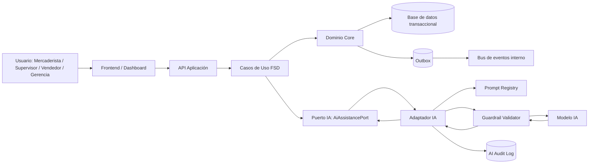

# ADR-0004: Incorporar capa IA asistiva con guardrails, auditoría y human-in-the-loop

| Campo | Valor |
|---|---|
| Número | ADR-0004 |
| Título | Incorporar capa IA asistiva con guardrails, auditoría y human-in-the-loop |
| Producto | App Detección Prod |
| Estado | Propuesta para revisión |
| Fecha | 27/05/2026 |
| Autor | Gina Fabiana Villanueva Viscarra |
| Alcance | Capa IA del producto, priorización operativa, clasificación de riesgo, explicación de KPIs y asistencia a decisión comercial |
| ADRs relacionados | ADR-0001, ADR-0002, ADR-0003 |
| Documentos trazados | BRD vFinal, MRD vFinal, PRD vFinal, FSD vFinal, DTI vFinal, PROMPT_MAPPING.md |
| Release objetivo | release/2.0.0 |

---

## 0. Resumen ejecutivo de la decisión

Se decide incorporar una **capa de IA asistiva, auditable y no autónoma para decisiones irreversibles** dentro de App Detección Prod. La IA podrá clasificar riesgo, priorizar casos, resumir evidencia, explicar indicadores, sugerir acciones comerciales y detectar inconsistencias; sin embargo, **no podrá aprobar descuentos, modificar precios, retirar productos, cerrar casos ni ejecutar acciones con impacto financiero sin confirmación humana explícita**.

Esta decisión responde al problema central del producto: las distribuidoras e importadoras gestionan productos próximos a vencer mediante reportes informales por WhatsApp, fotografías no estandarizadas, Excel y comunicación fragmentada. Ese modelo genera pérdida de trazabilidad, ausencia de métricas, demoras, desalineación entre operación y estrategia, incremento de merma y dificultad para medir el impacto de descuentos, bandeos, promociones o retiros.

La IA se adopta como **capacidad de aumento cognitivo** para mercaderistas, supervisores, vendedores y gerencia; no como sustituto de responsabilidad comercial. Su diseño debe ser consistente con:

- **ADR-0001**: monolito modular evolutivo.
- **ADR-0002**: arquitectura hexagonal del core.
- **ADR-0003**: event-driven + outbox + dashboard operacional actualizado.

---

## 1. Diferencia precisa entre ADR-0004 y ADRs previos

| ADR | Pregunta que responde | Decisión principal | Qué NO cubre |
|---|---|---|---|
| ADR-0001 | ¿Cuál es el estilo arquitectónico macro del producto? | Monolito modular evolutivo con preparación a distribución futura. | No define componentes internos ni IA. |
| ADR-0002 | ¿Cómo se protege el core funcional? | Arquitectura hexagonal con puertos, adaptadores, casos de uso y dominio aislado. | No define política de IA ni gobernanza de prompts. |
| ADR-0003 | ¿Cómo se manejan eventos, alertas, auditoría y dashboard actualizado? | Outbox, eventos, consistencia operacional y dashboard inmediato para gerencia. | No define decisión agéntica ni guardrails IA. |
| ADR-0004 | ¿Cómo se incorpora IA sin romper trazabilidad, control humano ni responsabilidad comercial? | IA asistiva, auditada, explicable y limitada por guardrails/human-in-the-loop. | No reemplaza reglas de negocio ni workflows humanos. |

Este ADR profundiza exclusivamente la **capa IA** y su gobernanza. No redefine el estilo arquitectónico, no redefine la arquitectura hexagonal y no reemplaza el diseño event-driven ya aprobado.

---

## 2. Contexto de negocio y evidencia

App Detección Prod nace para convertir un proceso reactivo, desorganizado y manual en un sistema digital trazable, medible y centrado en el usuario. El problema no se limita a registrar productos vencidos; el verdadero desafío es conectar:

1. Operación de campo.
2. Validación táctica.
3. Gestión comercial.
4. Impacto financiero.
5. Decisión estratégica.

### 2.1 Dolor operativo

Los mercaderistas registran productos en campo con alta presión de tiempo, conectividad variable y reportes informales. El sistema debe reducir carga cognitiva y evitar registros incompletos.

### 2.2 Dolor táctico

Los supervisores deben validar información dispersa, fotografías poco claras y reportes incompletos. Esto consume tiempo, genera incertidumbre y puede causar errores comerciales.

### 2.3 Dolor comercial

Los vendedores toman decisiones sobre descuentos, bandeos, activaciones, promociones o retiros sin certeza total de si un producto ya fue tratado, vendido, descontado o reportado previamente.

### 2.4 Dolor estratégico

Gerencia necesita visibilidad completa, indicadores de rotación, impacto financiero, costos de devolución, costos de reposición, costos de distribución, rentabilidad por producto y priorización de productos realmente críticos.

### 2.5 Oportunidad de IA

La IA puede aportar valor si actúa como una **capa de asistencia contextual** sobre datos estructurados y trazables:

- Detectar reportes incompletos.
- Clasificar criticidad.
- Sugerir prioridad de atención.
- Resumir evidencia para supervisión.
- Explicar por qué un producto aparece como crítico.
- Recomendar alternativas comerciales con base en reglas del FSD.
- Detectar anomalías: precio inconsistente, foto faltante, vencimiento fuera de rango, acción duplicada, cantidad sospechosa.
- Apoyar al gerente con lectura ejecutiva de KPIs.

Pero, debido al impacto financiero, reputacional y operativo, la IA debe estar **limitada por reglas duras, auditoría y validación humana**.

---

## 3. Problema arquitectónico

El producto necesita IA, pero no cualquier IA. Una incorporación ingenua de IA podría generar riesgos mayores que el problema original:

- Recomendaciones comerciales sin trazabilidad.
- Descuentos sugeridos fuera de política.
- Clasificación de riesgo no explicable.
- Decisiones basadas en datos incompletos.
- Alucinaciones sobre stock, precio o vencimiento.
- Falta de auditoría sobre qué prompt produjo qué recomendación.
- Exposición accidental de datos comerciales sensibles.
- Dependencia excesiva del modelo.
- Reemplazo indebido del criterio humano.

Por tanto, el desafío arquitectónico es:

> Diseñar una capa IA que mejore velocidad, priorización y comprensión sin comprometer trazabilidad, responsabilidad humana, consistencia de datos, seguridad ni control financiero.

---

## 4. Drivers arquitectónicos

| Driver | Tipo | Implicación arquitectónica |
|---|---|---|
| Trazabilidad | Negocio / cumplimiento | Toda recomendación IA debe vincularse a caso, datos fuente, prompt, versión y usuario. |
| Inmediatez gerencial | Negocio | La IA no debe bloquear actualización de KPIs críticos; opera sobre dashboard actualizado. |
| Control humano | Riesgo / ética | Acciones comerciales irreversibles requieren aprobación humana. |
| Explicabilidad | Producto | Supervisores y gerencia deben entender por qué un caso fue priorizado. |
| Seguridad de datos | Técnico / legal | No exponer PII, precios sensibles ni información comercial en logs inseguros. |
| Calidad de recomendación | Producto | Salidas deben cumplir invariantes y reglas del FSD. |
| Resiliencia | Técnico | Si la IA falla, el flujo core continúa sin degradar registro/validación. |
| Auditoría | Evaluación / operación | PROMPT_MAPPING y DTI deben poder reconstruir prompt → output → decisión. |
| Evolución incremental | Arquitectura | La IA debe integrarse vía puertos/adaptadores, no como dependencia directa del dominio. |

---

## 5. Decisión

Se adopta una **capa IA asistiva con guardrails, human-in-the-loop, auditoría y degradación segura**, organizada como un módulo/adaptador dentro del monolito modular evolutivo.

La IA se integrará mediante puertos definidos en la capa de aplicación, sin contaminar el dominio:

```text
Application Use Cases
   ↓
AI Assistance Port
   ↓
AI Adapter / Model Router / Prompt Registry
   ↓
Modelo IA + Guardrails + RAG opcional
```

### 5.1 La IA puede hacer

| Capacidad | Permitida | Condición |
|---|---:|---|
| Clasificar riesgo de producto | Sí | Debe explicar factores usados. |
| Priorizar casos críticos | Sí | Debe usar reglas del FSD y datos disponibles. |
| Detectar datos faltantes | Sí | Debe devolver lista verificable. |
| Resumir evidencia para supervisor | Sí | No debe inventar datos. |
| Sugerir acción comercial | Sí | Solo como recomendación, no ejecución. |
| Explicar KPIs a gerencia | Sí | Usando datos del dashboard actualizado. |
| Generar alerta contextual | Sí | Debe registrar fuente y motivo. |
| Preparar borrador de decisión | Sí | Requiere aprobación humana. |

### 5.2 La IA no puede hacer

| Acción | Prohibición |
|---|---|
| Cambiar precio automáticamente | Prohibido sin aprobación humana. |
| Aprobar descuento | Prohibido sin supervisor/vendedor autorizado. |
| Retirar producto | Prohibido sin acción humana registrada. |
| Cerrar caso | Prohibido sin validación de flujo FSD. |
| Alterar evidencia | Prohibido. |
| Inventar stock, ventas o rotación | Prohibido. |
| Exponer datos sensibles en logs | Prohibido. |
| Tomar decisión financiera irreversible | Prohibido. |

---

## 6. Alternativas consideradas

| Alternativa | Descripción | Pros | Contras | Veredicto |
|---|---|---|---|---|
| A. Sin IA | Producto solo transaccional y dashboard. | Menor complejidad, menor riesgo. | Menor diferenciación, más carga cognitiva para supervisores/gerencia. | Rechazada como opción final, válida como fallback. |
| B. IA libre integrada en pantallas | Chat o asistente sin restricciones fuertes. | Rápido de construir, visible para demo. | Alto riesgo de alucinación, baja trazabilidad, decisiones poco auditables. | Rechazada. |
| C. IA asistiva con guardrails e HITL | IA clasifica, explica y recomienda; humano decide. | Balance entre valor y control; auditable; defendible. | Requiere diseño de prompts, métricas y validación. | Elegida. |
| D. IA autónoma que ejecuta acciones | Agente decide descuentos/retiros. | Máxima automatización. | Riesgo financiero, ético y operativo alto. | Rechazada. |
| E. IA externa SaaS sin gobierno interno | Usar herramienta externa sin trazabilidad propia. | Menor desarrollo. | Lock-in, fuga de datos, baja integración con FSD/DTI. | Rechazada. |

---

## 7. Matriz ponderada de decisión

Escala: 1 = bajo, 5 = alto. Peso total = 100.

| Criterio | Peso | Sin IA | IA libre | IA asistiva gobernada | IA autónoma |
|---|---:|---:|---:|---:|---:|
| Valor para supervisión y gerencia | 20 | 2 | 4 | 5 | 5 |
| Control de riesgo financiero | 20 | 5 | 2 | 5 | 1 |
| Trazabilidad/auditoría | 20 | 4 | 1 | 5 | 2 |
| Coherencia con FSD/DTI | 15 | 3 | 2 | 5 | 2 |
| Complejidad implementable | 10 | 5 | 3 | 3 | 1 |
| Diferenciación del producto | 10 | 2 | 4 | 5 | 5 |
| Degradación segura | 5 | 5 | 2 | 5 | 1 |
| **Total ponderado** | **100** | **350** | **260** | **475** | **255** |

La alternativa elegida es **IA asistiva gobernada** porque maximiza valor sin sacrificar trazabilidad ni control humano.

---

## 8. Arquitectura lógica propuesta



La capa IA no se comunica directamente con la base de datos ni modifica estado de dominio. Toda mutación pasa por casos de uso del FSD y reglas de negocio del core.

---

## 9. Diseño hexagonal de la IA

### 9.1 Puertos de entrada

| Puerto | Consumidor | Propósito |
|---|---|---|
| `ClassifyProductRiskUseCase` | Supervisor / sistema | Clasificar riesgo de producto reportado. |
| `ExplainCasePriorityUseCase` | Supervisor / gerente | Explicar por qué un caso está priorizado. |
| `SuggestCommercialActionUseCase` | Vendedor / supervisor | Sugerir acción comercial no vinculante. |
| `SummarizeExecutiveKpisUseCase` | Gerencia | Explicar estado del negocio y anomalías. |
| `DetectReportInconsistencyUseCase` | Mercaderista / supervisor | Detectar datos faltantes o inconsistentes. |

### 9.2 Puertos de salida

| Puerto | Adaptador | Observación |
|---|---|---|
| `AiModelPort` | LLM provider / modelo local futuro | No se invoca desde dominio. |
| `PromptRegistryPort` | Archivos versionados en `docs/prompts/` | Cada prompt tiene ID y versión. |
| `AiAuditLogPort` | Tabla/log de auditoría IA | Registra prompt, output, usuario, decisión. |
| `KnowledgeRetrievalPort` | RAG opcional | Solo fuentes aprobadas: FSD, PRD, políticas, catálogos. |
| `GuardrailValidationPort` | Validador de schema/invariantes | Bloquea outputs inseguros. |

---

## 10. Casos de uso IA trazados al FSD

| FSD | Necesidad funcional | Capacidad IA | Resultado esperado |
|---|---|---|---|
| FSD-UC-001 Registro de producto próximo a vencer | Evitar datos incompletos | Detectar inconsistencias | Lista de campos faltantes o sospechosos. |
| FSD-UC-002 Validar y priorizar alerta | Reducir carga de supervisor | Clasificar riesgo | Riesgo bajo/medio/alto/crítico + explicación. |
| FSD-UC-003 Registrar acción comercial | Apoyar decisión del vendedor | Sugerir acción | Recomendación no vinculante basada en reglas. |
| FSD-UC-004 Aprobar/rechazar acción | Evitar decisiones erróneas | Explicar impacto | Motivos, riesgos, datos usados. |
| FSD-UC-005 Dashboard gerencial | Facilitar lectura ejecutiva | Resumen ejecutivo IA | Explicación de KPIs y anomalías. |
| FSD-UC-006 Alertas automáticas | Priorizar urgencia | Enriquecer alerta | Motivo y nivel de criticidad. |
| FSD-UC-007 Clasificación IA | Formalizar asistencia IA | Ejecutar clasificación controlada | Output estructurado y auditable. |
| FSD-UC-008 Auditoría de historial | Reconstruir decisiones | Resumir trazabilidad | Línea de tiempo explicable. |

---

## 11. Política de datos y fuentes permitidas

La IA solo podrá usar datos provenientes de fuentes aprobadas:

| Fuente | Permitida | Condición |
|---|---:|---|
| Caso registrado en el sistema | Sí | Debe tener ID trazable. |
| Historial de acciones comerciales | Sí | Solo datos del producto/caso autorizado. |
| Dashboard operacional | Sí | Datos actualizados desde fuente transaccional/proyección validada. |
| FSD/PRD/BRD/MRD/DTI | Sí | Como contexto de reglas y trazabilidad. |
| Políticas comerciales aprobadas | Sí | Si están versionadas. |
| Mensajes sueltos de WhatsApp | No | Solo si fueron estructurados y registrados. |
| Fotos sin metadatos | Parcial | Solo como evidencia, no como fuente única de decisión. |
| Datos inventados por el modelo | No | Deben rechazarse. |
| Datos personales innecesarios | No | Minimización de datos. |

---

## 12. Guardrails obligatorios

### 12.1 Guardrails de entrada

- Validar que el caso existe.
- Validar permisos del usuario.
- Enmascarar datos sensibles innecesarios.
- Enviar solo el contexto mínimo necesario.
- Bloquear prompts con instrucciones que contradigan políticas comerciales.
- No enviar secretos, credenciales ni datos no requeridos.

### 12.2 Guardrails de salida

- Output debe cumplir schema JSON definido.
- Debe incluir `confidence` y `rationale_summary`.
- Debe citar datos fuente usados.
- Debe indicar `requires_human_approval` cuando corresponda.
- Debe rechazar cuando falten datos críticos.
- No debe inventar precio, stock, fecha, cantidad o política.
- No debe ejecutar acciones, solo recomendar.

### 12.3 Guardrails de decisión

| Tipo de decisión | Puede IA decidir | Requiere humano | Observación |
|---|---:|---:|---|
| Riesgo preliminar | Sí | No siempre | Si confidence baja, escalar. |
| Prioridad sugerida | Sí | Supervisión para críticos | No cambia estado final automáticamente. |
| Acción comercial sugerida | Sí | Sí | Descuento/retiro/bandeo requiere aprobación. |
| Cambio de precio | No | Sí | Acción financiera. |
| Retiro de producto | No | Sí | Impacto operativo y comercial. |
| Cierre de caso | No | Sí | Debe cumplir flujo FSD. |
| Explicación de KPI | Sí | No | Solo lectura. |

---

## 13. Esquema de salida IA recomendado

```json
{
  "prompt_id": "PR-IA-001",
  "prompt_version": "v1.0.0",
  "case_id": "CASE-2026-000123",
  "risk_level": "HIGH",
  "confidence": 0.87,
  "recommendation_type": "COMMERCIAL_ACTION_SUGGESTION",
  "recommendation": "Evaluar descuento controlado o bandeo antes de retiro.",
  "rationale_summary": [
    "Producto dentro de ventana crítica de vencimiento.",
    "Cantidad intervenida alta respecto al promedio de sala.",
    "No existe acción comercial registrada en las últimas 48 horas."
  ],
  "source_evidence": [
    "FSD-UC-002",
    "BR-004",
    "CASE-2026-000123",
    "KPI-MERMA-001"
  ],
  "missing_data": [],
  "requires_human_approval": true,
  "allowed_next_actions": [
    "SUPERVISOR_REVIEW",
    "SELLER_COMMERCIAL_ACTION_DRAFT"
  ],
  "blocked_actions": [
    "AUTO_PRICE_CHANGE",
    "AUTO_PRODUCT_WITHDRAWAL",
    "AUTO_CASE_CLOSURE"
  ]
}
```

---

## 14. Auditoría IA

Toda interacción IA que influya en decisión operativa, táctica o estratégica debe quedar auditada.

| Campo | Descripción |
|---|---|
| `ai_decision_id` | ID único de la interacción IA. |
| `case_id` | Caso de producto asociado. |
| `prompt_id` | Prompt versionado usado. |
| `prompt_version` | Versión del prompt. |
| `model` | Modelo usado. |
| `input_hash` | Hash del contexto enviado. |
| `output_hash` | Hash del resultado. |
| `confidence` | Confianza reportada. |
| `guardrail_result` | PASS / BLOCKED / NEEDS_REVIEW. |
| `user_id` | Usuario que solicitó la asistencia. |
| `human_decision` | Decisión final humana, si aplica. |
| `timestamp` | Fecha/hora con zona horaria. |
| `latency_ms` | Latencia de respuesta. |
| `tokens_used` | Consumo aproximado. |
| `cost_estimate` | Costo estimado. |

---

## 15. Relación con PROMPT_MAPPING.md

Cada prompt IA debe existir como archivo versionado y estar registrado en `docs/PROMPT_MAPPING.md`.

| Prompt | Caso de uso | Tipo | Salida esperada | Métrica |
|---|---|---|---|---|
| PR-IA-001 | FSD-UC-007 | Clasificación | Riesgo + explicación | Accuracy ≥ 85 % |
| PR-IA-002 | FSD-UC-002 | Priorización | Score + motivo | Schema pass ≥ 95 % |
| PR-IA-003 | FSD-UC-003 | Recomendación | Acción sugerida | Aprobación humana obligatoria |
| PR-IA-004 | FSD-UC-005 | Resumen ejecutivo | Explicación KPI | Hallucination rate ≤ 5 % |
| PR-IA-005 | FSD-UC-008 | Auditoría | Línea de tiempo | Trazabilidad completa |

---

## 16. Métricas de calidad IA

| Métrica | Definición | Umbral inicial |
|---|---|---:|
| `schema_pass_rate` | % outputs que cumplen JSON schema | ≥ 95 % |
| `classification_accuracy` | coincidencia con criterio humano experto | ≥ 85 % |
| `human_override_rate` | % recomendaciones cambiadas por humano | Monitoreo; investigar si > 30 % |
| `hallucination_rate` | afirmaciones sin fuente verificable | ≤ 5 % |
| `guardrail_block_rate` | % outputs bloqueados por guardrail | Monitoreo |
| `p95_ai_latency` | latencia p95 de asistencia IA | ≤ 3 s para flujos tácticos |
| `dashboard_summary_latency` | latencia resumen gerencial | ≤ 5 s |
| `cost_per_1000_cases` | costo IA por 1000 casos | Definir en POC |
| `fallback_success_rate` | flujo continúa sin IA | 100 % |

---

## 17. Consistencia con dashboard inmediato

La IA no debe ser la fuente de verdad del dashboard. El dashboard gerencial se actualiza desde datos transaccionales y proyecciones operacionales definidas en ADR-0003.

La IA puede:

- Explicar KPIs.
- Detectar patrones.
- Sugerir preguntas ejecutivas.
- Resumir riesgos.
- Destacar anomalías.

La IA no puede:

- Calcular oficialmente la merma si contradice fuente transaccional.
- Modificar KPIs.
- Ocultar casos críticos.
- Presentar una hipótesis como dato confirmado.

Principio:

> El dashboard informa; la IA interpreta. La base transaccional decide la verdad; la IA ayuda a comprenderla.

---

## 18. Seguridad y privacidad

| Riesgo | Mitigación |
|---|---|
| Prompt injection | Sanitización de entradas, prompts cerrados, validación de salida. |
| Exfiltración de datos | Minimización de contexto, no enviar secretos, control por rol. |
| Alucinación | Requerir evidencia fuente y bloquear outputs sin fuente. |
| Sesgo en priorización | Evaluar muestras por tienda, categoría, vendedor, región. |
| Dependencia del modelo | Fallback no IA obligatorio. |
| Recomendación peligrosa | Human-in-the-loop y reglas duras. |
| Logs con datos sensibles | Hash, masking y retención limitada. |
| Modelo no disponible | Flujo core continúa sin IA. |

---

## 19. Degradación segura

Si la IA falla:

1. El registro del producto continúa.
2. La validación del supervisor continúa.
3. El dashboard se actualiza igual.
4. La acción comercial se registra igual.
5. Se marca `ai_assistance_status = unavailable`.
6. Se permite priorización por reglas determinísticas.
7. Se registra incidente de IA para análisis posterior.

La IA nunca debe ser single point of failure.

---

## 20. POC recomendada

### POC-02: Clasificación IA de riesgo con guardrails y human-in-the-loop

**Hipótesis:**  
Creemos que una capa IA asistiva puede clasificar productos próximos a vencer en riesgo bajo/medio/alto/crítico con al menos 85 % de consistencia respecto a evaluación humana experta, manteniendo 100 % de outputs auditables y sin ejecutar acciones comerciales automáticamente.

**Criterios de éxito:**

| Métrica | Umbral |
|---|---:|
| Accuracy clasificación | ≥ 85 % |
| Schema pass rate | ≥ 95 % |
| Recomendaciones con evidencia | 100 % |
| Acciones irreversibles bloqueadas | 100 % |
| Hallucination rate | ≤ 5 % |
| p95 latency | ≤ 3 s |

**Datos de prueba:**

- 30 casos sintéticos basados en FSD.
- 10 casos incompletos.
- 10 casos adversariales.
- 10 casos críticos de alto impacto financiero.

---

## 21. Impacto en DTI

Este ADR debe reflejarse en el DTI en:

| Sección DTI | Impacto |
|---|---|
| §3.5 Contenedores agénticos | Incorporar `ai-assistance-module`, `prompt-registry`, `guardrail-validator`. |
| §9 Capa IA / Agentes | Describir arquitectura IA asistiva. |
| §10 Prompt Mapping | Registrar prompts PR-IA. |
| §13 Seguridad | Agregar prompt injection, data exfiltration, hallucination. |
| §14 Observabilidad | Métricas IA, tokens, latencia, guardrails. |
| §15 DevOps | Feature flags, fallback IA, versionado de prompts. |
| §22 Auditoría de decisiones IA | Registrar campos auditables. |
| §23 Evaluación de agentes y prompts | Métricas de calidad IA. |

---

## 22. Impacto en AGENTS.md

`AGENTS.md` debe incluir reglas para agentes IA:

- No modificar reglas de negocio sin FSD/ADR.
- No generar prompts no registrados.
- No exponer PII o datos comerciales sensibles.
- No proponer acciones comerciales irreversibles como automáticas.
- Toda salida IA debe tener trazabilidad a FSD/PRD/BRD.
- Toda modificación de prompt debe actualizar `PROMPT_MAPPING.md`.
- Todo agente debe respetar human-in-the-loop.

---

## 23. Consecuencias positivas

- Reduce carga cognitiva de supervisores y vendedores.
- Mejora priorización de casos críticos.
- Aumenta valor diferencial del producto.
- Mejora comprensión ejecutiva de KPIs.
- Fortalece trazabilidad de recomendaciones.
- Permite evaluar IA con métricas objetivas.
- Mantiene control humano sobre decisiones financieras.
- Facilita defensa académica del AI-SDLC.

---

## 24. Consecuencias negativas / costos

- Mayor complejidad documental y técnica.
- Necesidad de prompts versionados.
- Necesidad de POC específica.
- Costos por consumo de modelo.
- Riesgo de latencia adicional.
- Requiere observabilidad IA.
- Requiere entrenamiento del equipo en lectura crítica de recomendaciones.

---

## 25. Riesgos residuales

| Riesgo | Probabilidad | Impacto | Mitigación |
|---|---|---|---|
| Recomendación incorrecta | Media | Alto | Human-in-the-loop y métricas. |
| Usuarios confían demasiado en IA | Media | Alto | UI debe mostrar “sugerencia”, no “decisión”. |
| Datos incompletos producen mala clasificación | Alta | Medio | IA debe declarar `missing_data`. |
| Costos IA crecen | Media | Medio | Router de modelo y cache. |
| Prompt drift | Media | Alto | Versionado y tests de prompt. |
| Hallucination | Media | Alto | Evidencia obligatoria y bloqueo. |
| Latencia | Media | Medio | Fallback determinístico. |

---

## 26. Plan de reversión

Si la capa IA no cumple criterios de calidad:

1. Desactivar feature flag `ai_assistance_enabled`.
2. Mantener flujos core sin IA.
3. Usar reglas determinísticas de priorización.
4. Conservar auditoría histórica.
5. Revisar prompts y dataset.
6. Reejecutar POC-02.
7. Reactivar gradualmente en modo shadow.

---

## 27. Validación

La decisión será correcta si:

- La IA mejora priorización sin reemplazar responsabilidad humana.
- Las recomendaciones son trazables y explicables.
- El flujo core funciona aunque la IA falle.
- Los outputs cumplen schema.
- Los casos críticos se detectan con mayor rapidez.
- El docente puede auditar prompt → salida → decisión → documento.

---

## 28. Guion de defensa oral

> “En App Detección Prod incorporamos IA, pero no como agente autónomo que decide descuentos o retiros. La usamos como una capa asistiva para clasificar riesgo, priorizar casos, resumir evidencia y explicar KPIs. Esto responde al problema real de sobrecarga cognitiva y falta de visibilidad en supervisión, ventas y gerencia. La fuente de verdad sigue siendo el core transaccional y el dashboard actualizado; la IA interpreta y recomienda, pero las decisiones comerciales irreversibles requieren aprobación humana. Por eso el ADR-0004 define guardrails, auditoría, prompt mapping, métricas de calidad, fallback y human-in-the-loop.”

---

## 29. Decisión final

Se acepta incorporar una **capa IA asistiva, gobernada, auditable y subordinada al dominio**, integrada mediante puertos/adaptadores y controlada por guardrails, PROMPT_MAPPING y human-in-the-loop.

La IA será una capacidad de apoyo para acelerar comprensión, priorización y análisis, pero **no será autoridad de decisión comercial ni fuente de verdad del sistema**.

---

## 30. Historial

| Versión | Fecha | Cambio |
|---|---|---|
| v0.1 | 27/05/2026 | Creación inicial del ADR-0004 para revisión. |
---

## Actualización transversal v1.1 — Control de cambios de precio y KPI de precio intervenido

> **Motivo de la actualización:** durante la revisión del paquete aprobado se identificó que el cambio de precio estaba mencionado como dato operativo, pero no suficientemente elevado a indicador estratégico, regla de trazabilidad, evento auditable y métrica de decisión gerencial. Esta actualización corrige ese vacío y alinea BRD → MRD → PRD → FSD → ADR → DTI.

### 1. Principio de negocio actualizado

En App Detección Prod, todo producto próximo a vencer que reciba una acción comercial debe conservar una trazabilidad completa de precio:

- **precio base / precio actual en sala** antes de la intervención;
- **precio sugerido**, cuando exista recomendación previa;
- **precio aprobado**, cuando supervisor, vendedor o política comercial autorice la acción;
- **precio aplicado en sala**, cuando la acción se ejecuta físicamente;
- **motivo del cambio**: descuento, bandeo, promoción, liquidación, retiro, corrección de sala u otra política comercial;
- **responsable y fecha/hora** de cada cambio;
- **cantidad intervenida** asociada a ese precio;
- **impacto financiero estimado y real**.

Sin esta trazabilidad, el sistema podría registrar que “se hizo una acción comercial”, pero no podría demostrar si la acción protegió margen, redujo merma o solo trasladó pérdida por descuento excesivo.

### 2. KPIs nuevos o reforzados

| ID | KPI | Definición | Fórmula / cálculo | Fuente | Consumidor | Frecuencia / frescura |
|---|---|---|---|---|---|---|
| KPI-PRECIO-01 | **Cobertura de precio intervenido** | Porcentaje de acciones comerciales que registran precio anterior y precio nuevo. | acciones con `oldPrice` + `newPrice` / total de acciones comerciales | Acción comercial / auditoría | Supervisor, Gerencia, Finanzas | Inmediata al registrar acción |
| KPI-PRECIO-02 | **Variación promedio de precio por intervención** | Mide el descuento o cambio promedio aplicado sobre productos próximos a vencer. | promedio((precio anterior - precio nuevo) / precio anterior) × 100 | Acción comercial | Gerencia, Finanzas | Dashboard diario y consulta inmediata |
| KPI-PRECIO-03 | **Valor económico intervenido por cambio de precio** | Monto económico afectado por descuentos, bandeos o promociones. | (precio anterior - precio nuevo) × cantidad intervenida | Acción comercial + cantidad | Gerencia, Finanzas | Inmediata para dashboard crítico |
| KPI-PRECIO-04 | **Acciones con cambio de precio sin aprobación** | Detecta riesgo de control interno. | acciones con `newPrice` distinto de `oldPrice` y sin aprobador / total acciones con cambio | Auditoría / workflow | Supervisor, Gerencia | Inmediata y con alerta |
| KPI-PRECIO-05 | **Diferencia entre precio aprobado y precio aplicado** | Controla desviaciones entre decisión comercial y ejecución en sala. | abs(precio aplicado - precio aprobado) | Validación / evidencia de sala | Supervisor, Vendedor, Auditoría | Inmediata cuando se valida ejecución |
| KPI-PRECIO-06 | **Margen protegido estimado** | Estima valor recuperado frente al escenario de vencimiento o devolución. | ingreso por venta intervenida - pérdida esperada por vencimiento/devolución | Dashboard financiero | Gerencia, Finanzas | Diario / cierre de caso |

### 3. Regla transversal de trazabilidad

**RB-PRECIO-001:** Ninguna acción comercial que implique descuento, bandeo, promoción, liquidación o modificación de precio puede cerrarse sin registrar precio anterior, precio nuevo, cantidad intervenida, responsable, fecha/hora, motivo y evidencia de ejecución cuando aplique.

**RB-PRECIO-002:** Todo cambio de precio debe generar una entrada de auditoría y, si el cambio supera el umbral definido por política comercial, debe requerir aprobación humana explícita.

**RB-PRECIO-003:** El dashboard gerencial debe mostrar KPIs críticos de cambio de precio desde estado confirmado/transaccional o desde una proyección operacional con frescura controlada. No debe basarse únicamente en procesos batch manuales.

### 4. Trazabilidad actualizada

| Capa | Elemento actualizado | Trazabilidad |
|---|---|---|
| BRD | Objetivos, KPIs y reglas de negocio | Control de precio como indicador de rentabilidad y no solo como campo operativo |
| MRD | Necesidad de mercado y propuesta de valor | Diferenciación frente a WhatsApp/Excel: medición formal del impacto de precio |
| PRD | Requerimientos y user stories | Registro, aprobación, consulta y auditoría de cambios de precio |
| FSD | Casos de uso, reglas, datos y Gherkin | `FSD-UC-003`, `FSD-UC-004`, `FSD-UC-005`, `FSD-UC-010` |
| ADR-0001 | Estilo arquitectónico | El precio intervenido es parte del dominio core, no un reporte periférico |
| ADR-0002 | Arquitectura hexagonal | Los cambios de precio deben vivir en casos de uso y puertos del dominio |
| ADR-0003 | Event-driven + dashboard | `PriceChanged.v1` y KPIs críticos de precio se actualizan con consistencia operacional inmediata |
| ADR-0004 | IA con guardrails | La IA puede sugerir o explicar, pero no cambiar precios automáticamente |
| ADR-0005 | AWS / observabilidad | Métricas de precio deben observarse, auditarse y protegerse como dato comercial sensible |

### 5. Impacto en defensa

Esta actualización permite defender que App Detección Prod no solo detecta productos próximos a vencer, sino que mide si la intervención comercial fue económicamente correcta. El precio deja de ser un campo de formulario y se convierte en variable de gobierno comercial, trazabilidad, auditoría, rentabilidad y decisión gerencial.


### 6. Impacto específico en ADR-0004

La IA puede detectar anomalías de precio, explicar variaciones, sugerir revisión y priorizar casos; sin embargo, no puede modificar `precioNuevo`, aprobar descuentos, cerrar acciones ni alterar KPIs financieros. Todo output IA relacionado con precios debe citar datos fuente, mostrar confianza y quedar auditado con `prompt_id`, modelo, versión, usuario solicitante y timestamp.
