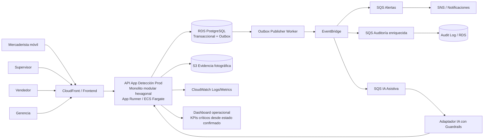

# ADR-0005: Adoptar despliegue cloud-native evolutivo en AWS para App Detección Prod

## Metadatos

| Campo | Valor |
|---|---|
| Número | ADR-0005 |
| Título | Adoptar despliegue cloud-native evolutivo en AWS para App Detección Prod |
| Producto | App Detección Prod |
| Fecha | 27/05/2026 |
| Estado | Propuesta para revisión |
| Autora | Gina Fabiana Villanueva Viscarra |
| Alcance | Infraestructura, despliegue, seguridad, observabilidad, operación, escalabilidad y soporte a DTI |
| ADRs relacionados | ADR-0001, ADR-0002, ADR-0003, ADR-0004 |
| Artefactos relacionados | BRD_vFinal, MRD_vFinal, PRD_vFinal, FSD_vFinal, DTI.md, AGENTS.md, POCs |
| Decisión relacionada del DTI | DTI §8 Despliegue Cloud Native, §11 NFRs, §13 Seguridad, §14 Observabilidad, §15 DevOps, §18 Riesgos técnicos |

---

## 1. Contexto

App Detección Prod busca transformar un proceso operativo y comercial actualmente fragmentado —basado en WhatsApp, Excel, fotografías no estandarizadas y validaciones manuales— en una plataforma digital trazable, medible y orientada a decisiones en tiempo real. El problema de negocio no es solamente registrar productos próximos a vencer: el sistema debe conectar el relevamiento operativo, la validación supervisora, la acción comercial, el control de precio, la evidencia visual, la auditoría y la visibilidad ejecutiva.

Los documentos aprobados establecen una línea de trazabilidad clara:

- **BRD aprobado**: define el problema de negocio, el impacto financiero de la merma, la falta de trazabilidad, la necesidad de métricas y la matriz RACI corregida donde gerencia es principalmente consumidora informada de indicadores ejecutivos, no ejecutora operativa diaria.
- **MRD aprobado**: valida que el mercado objetivo —distribuidoras e importadoras del canal retail— necesita centralización, trazabilidad, reducción de pérdida y visibilidad por tienda, producto, acción, precio e impacto financiero.
- **PRD aprobado**: traduce esa necesidad en capacidades de producto: registro móvil, validación, acción comercial, dashboard gerencial, alertas, KPIs, evidencia y asistencia IA.
- **FSD aprobado**: baja estas capacidades a casos de uso críticos, reglas de negocio, datos funcionales, criterios Gherkin, NFRs, prompt-contratos y trazabilidad.
- **ADR-0001 aprobado**: decide iniciar con monolito modular evolutivo para evitar complejidad distribuida prematura.
- **ADR-0002 aprobado**: define arquitectura hexagonal para proteger el core de dominio, puertos, adaptadores y pruebas.
- **ADR-0003 aprobado**: define el uso de event-driven + outbox, aclarando que el dashboard crítico de gerencia debe actualizarse desde estado transaccional inmediato y no depender exclusivamente de proyecciones eventuales.
- **ADR-0004 aprobado**: define la capa IA con guardrails y human-in-the-loop; la IA asiste y prioriza, pero no ejecuta decisiones comerciales irreversibles.

En este contexto, falta decidir la estrategia de despliegue, operación y servicios cloud. Esta decisión no debe contradecir el enfoque evolutivo: no se busca una arquitectura cloud excesivamente distribuida desde el día uno, sino una base cloud-native que permita operar el MVP con bajo riesgo, habilitar observabilidad, proteger datos sensibles, soportar evidencia fotográfica, mantener dashboard actualizado y evolucionar hacia componentes desacoplados cuando el producto lo justifique.

---

## 2. Problema arquitectónico que resuelve este ADR

La plataforma debe cumplir simultáneamente con seis necesidades:

1. **Operación móvil en campo**: mercaderistas registran productos, fotos, cantidad, vencimiento, precio actual y tienda desde dispositivos móviles, con conectividad variable.
2. **Validación táctica**: supervisores necesitan revisar, validar, priorizar y corregir información sin buscar en múltiples chats o archivos.
3. **Gestión comercial**: vendedores necesitan registrar acciones comerciales, descuentos, bandeos, retiros o cambios de precio de manera trazable.
4. **Dashboard gerencial inmediato**: gerencia requiere visibilidad actualizada sobre productos críticos, impacto financiero, rotación, acciones pendientes y riesgo de merma.
5. **Auditoría e IA controlada**: el sistema debe registrar quién hizo qué, cuándo, por qué y con qué evidencia; la IA debe asistir sin tomar decisiones irreversibles.
6. **Evolución técnica**: el sistema debe poder iniciar simple y crecer hacia event-driven, analítica, colas, jobs, notificaciones y servicios especializados sin reescribir todo.

La decisión cloud debe evitar dos extremos:

- **Infraestructura demasiado básica**: desplegar todo en un único servidor sin observabilidad, backups, seguridad ni escalabilidad comprometería el valor de negocio.
- **Arquitectura demasiado compleja**: partir directamente con microservicios, Kubernetes, múltiples bases y pipelines complejos introduciría sobrecosto operativo y riesgo de entrega.

---

## 3. Drivers arquitectónicos

| Driver | Descripción | Impacto en la decisión |
|---|---|---|
| Trazabilidad operacional | Todo registro, validación, acción y cambio de precio debe quedar auditado. | Requiere base transaccional confiable, logs estructurados y almacenamiento durable de evidencia. |
| Dashboard actualizado | Gerencia necesita información crítica actualizada para decidir rápido. | Requiere que los KPIs críticos se calculen desde estado transaccional o proyección inmediata con SLO explícito. |
| Evidencia visual | Las fotos deben conservarse, asociarse a producto/tienda/caso y no perderse. | Requiere almacenamiento de objetos separado de la base de datos. |
| Seguridad | El sistema maneja información comercial, precios, acciones, usuarios y evidencia de tiendas. | Requiere IAM, cifrado, secretos gestionados, backups y mínimos privilegios. |
| Evolución event-driven | ADR-0003 exige outbox, eventos, alertas y auditoría enriquecida. | Requiere servicios cloud que permitan colas/event buses sin migración traumática. |
| Operación del equipo | El proyecto es académico/evolutivo; no conviene operar complejidad innecesaria. | Se priorizan servicios administrados sobre infraestructura autogestionada. |
| Costo controlado | Debe ser viable para prototipo, demo y evolución. | Se evitan Kubernetes y arquitecturas multi-cuenta complejas al inicio. |
| IA gobernada | ADR-0004 exige trazabilidad de prompts, outputs, guardrails y aprobaciones humanas. | Se requieren logs, métricas, almacenamiento de auditoría y capacidad de desactivar IA con feature flag. |

---

## 4. Alternativas consideradas

### 4.1 Alternativa A — Servidor único/VPS tradicional

**Descripción:** desplegar API, frontend, base de datos y almacenamiento en una sola VM o VPS.

| Ventajas | Desventajas |
|---|---|
| Bajo costo inicial. | Alto riesgo operativo: backups, parches, seguridad y escalabilidad manual. |
| Fácil de entender. | No separa evidencia visual, base transaccional y jobs. |
| Útil para prototipo mínimo local. | Débil para observabilidad, auditoría, alta disponibilidad y crecimiento. |

**Evaluación:** descartada como arquitectura objetivo. Puede servir para pruebas locales, pero no para el DTI final ni para una defensa profesional.

---

### 4.2 Alternativa B — Kubernetes/EKS desde el inicio

**Descripción:** desplegar contenedores en EKS, con microservicios, ingress, service mesh y pipelines avanzados.

| Ventajas | Desventajas |
|---|---|
| Alta flexibilidad y escalabilidad. | Complejidad operativa excesiva para etapa inicial. |
| Compatible con microservicios futuros. | Requiere madurez DevOps superior. |
| Permite despliegues granulares. | Incrementa costos, configuración, monitoreo y curva de aprendizaje. |

**Evaluación:** descartada para v1.0. Puede aparecer como evolución si el producto escala y el equipo tiene capacidad operativa real.

---

### 4.3 Alternativa C — Serverless puro

**Descripción:** API Gateway + Lambda + DynamoDB + S3 + EventBridge + Step Functions.

| Ventajas | Desventajas |
|---|---|
| Escalado automático y pago por uso. | Puede complicar dominio transaccional con reglas de negocio ricas. |
| Muy bueno para eventos, jobs y notificaciones. | DynamoDB exige modelado de acceso más rígido. |
| Reduce operación de servidores. | Cold starts y debugging distribuido pueden afectar demo y aprendizaje. |

**Evaluación:** no se elige como base completa, pero sí se adoptan componentes serverless para eventos, colas, notificaciones, jobs y evolución.

---

### 4.4 Alternativa D — AWS administrado con monolito modular contenedorizado + RDS + S3 + servicios event-driven

**Descripción:** desplegar frontend, API monolito modular/hexagonal y workers en servicios administrados de AWS, usando RDS PostgreSQL como base transaccional, S3 para evidencia visual, CloudWatch/OpenTelemetry para observabilidad y EventBridge/SQS/SNS para eventos y notificaciones.

| Ventajas | Desventajas |
|---|---|
| Equilibra simplicidad y escalabilidad. | Requiere diseño cuidadoso de IAM, redes y costos. |
| Respeta ADR-0001 y ADR-0002. | Más complejo que un VPS simple. |
| Permite dashboard inmediato desde datos transaccionales. | Requiere definir SLOs y monitoreo desde el inicio. |
| Soporta ADR-0003 con outbox y eventos. | Requiere disciplina para no convertir todo en servicios prematuros. |
| Permite gobernar IA según ADR-0004. | Integraciones IA deben auditarse y limitarse por feature flags. |

**Evaluación:** elegida como arquitectura objetivo evolutiva.

---

## 5. Decisión

**Adoptamos AWS como plataforma cloud objetivo, con una arquitectura cloud-native evolutiva basada en servicios administrados, manteniendo el core como monolito modular hexagonal y usando componentes especializados para persistencia, evidencia visual, eventos, observabilidad, seguridad y despliegue.**

La decisión concreta es:

1. **Frontend web/dashboard** desplegado en **Amazon S3 + CloudFront** o alternativa administrada equivalente, con distribución segura y bajo costo.
2. **API principal** desplegada inicialmente como contenedor en **AWS App Runner** o **ECS Fargate**, evitando operar Kubernetes en la etapa inicial.
3. **Base transaccional** en **Amazon RDS PostgreSQL**, porque el dominio requiere consistencia fuerte en registros, validaciones, acciones comerciales, precios, cantidades, estados, auditoría mínima y KPIs críticos.
4. **Evidencia visual** en **Amazon S3**, con metadatos referenciados desde PostgreSQL; las imágenes no se almacenan como blobs en la base relacional.
5. **Outbox transaccional** en PostgreSQL, con worker que publica a **EventBridge/SQS/SNS** según evolución.
6. **Dashboard gerencial crítico** alimentado desde el estado transaccional confirmado o una proyección inmediata con SLO de frescura explícito; no depende únicamente de analítica eventual.
7. **Notificaciones y procesos asíncronos** mediante **SQS/SNS/EventBridge**, respetando idempotencia, reintentos y DLQ definidos en ADR-0003.
8. **Secretos y cifrado** mediante **AWS Secrets Manager**, **KMS** y políticas IAM de mínimo privilegio.
9. **Observabilidad** con **CloudWatch**, logs estructurados, métricas de negocio y trazas OpenTelemetry cuando aplique.
10. **IA gobernada** integrada como adaptador externo auditable, con logs de prompt, versión, output, decisión humana y feature flags, en coherencia con ADR-0004.

---

## 6. Mapeo de componentes a AWS

| Componente lógico | Servicio AWS propuesto | Justificación | Relación con ADRs |
|---|---|---|---|
| Frontend operativo y dashboard | S3 + CloudFront / Amplify Hosting | Distribución web segura, escalable y económica. | ADR-0001, ADR-0003 |
| API monolito modular | App Runner o ECS Fargate | Permite desplegar contenedor sin operar Kubernetes. | ADR-0001, ADR-0002 |
| Base transaccional | RDS PostgreSQL | Consistencia fuerte, SQL, reporting operacional, auditoría y outbox. | ADR-0002, ADR-0003 |
| Evidencia fotográfica | S3 | Almacenamiento durable, económico y separado de datos transaccionales. | PRD/FSD, DTI §8 |
| Outbox publisher | Worker en ECS/App Runner job/Lambda programada | Lee outbox y publica eventos con control de reintentos. | ADR-0003 |
| Eventos de dominio | EventBridge | Enrutamiento evolutivo de eventos sin acoplar productores y consumidores. | ADR-0003 |
| Colas de procesamiento | SQS + DLQ | Procesamiento resiliente de alertas, auditoría enriquecida e IA. | ADR-0003 |
| Notificaciones | SNS / Pinpoint en evolución | Alertas a supervisores/vendedores según criticidad. | ADR-0003 |
| Jobs analíticos | Lambda / ECS Scheduled Tasks | Recalcular agregados, detectar atrasos, generar snapshots. | ADR-0003 |
| Secretos | Secrets Manager | Evita credenciales en código o repositorio. | DTI §13 |
| Cifrado | KMS | Cifrado de base, S3, logs y secretos. | DTI §13 |
| Observabilidad | CloudWatch + OpenTelemetry | Logs, métricas, trazas, alarmas y evidencia operacional. | DTI §14 |
| IA asistiva | Adaptador a proveedor LLM vía API controlada | IA desacoplada del dominio, auditada y con guardrails. | ADR-0004 |

---

## 7. Decisión sobre dashboard gerencial inmediato

Este ADR formaliza una regla importante para evitar contradicciones con ADR-0003:

> El dashboard gerencial crítico no se alimenta únicamente de procesos asíncronos eventuales. Los indicadores necesarios para decisiones inmediatas deben provenir de estado transaccional confirmado o de una proyección actualizada con SLO estricto y fallback a la fuente transaccional.

### 7.1 KPIs críticos de actualización inmediata

| KPI | Fuente recomendada | Frescura requerida | Motivo |
|---|---|---|---|
| Productos críticos sin acción | Consulta/proyección transaccional | Inmediata o ≤ 5 segundos | Gerencia y supervisión deben actuar rápido. |
| Valor financiero en riesgo | Transaccional + cálculo controlado | Inmediata o ≤ 5 segundos | Impacta decisiones comerciales y priorización. |
| Casos validados pendientes de acción | Estado transaccional | Inmediata | Evita pérdida de oportunidades. |
| Acciones comerciales aplicadas | Estado transaccional | Inmediata | Permite saber si descuento/retiro/bandeo ya fue ejecutado. |
| Cantidad intervenida | Estado transaccional | Inmediata | Necesario para estimar impacto. |
| Casos vencidos sin cierre | Estado transaccional | Inmediata o ≤ 5 segundos | Riesgo operativo y financiero. |

### 7.2 KPIs que pueden ser asíncronos

| KPI/Proceso | Frescura aceptable | Justificación |
|---|---:|---|
| Tendencias históricas por región | ≤ 15 minutos | No bloquea decisiones operativas inmediatas. |
| Ranking mensual de productos | ≤ 1 hora | Es analítica estratégica, no acción urgente. |
| Modelos de recomendación IA | Según batch/ejecución | La IA asiste, no define estado fuente. |
| Reportes ejecutivos descargables | Batch programado | No afecta flujo operativo. |
| Auditoría enriquecida | Asíncrona con garantía de entrega | Puede completarse después si no bloquea operación. |

---

## 8. Arquitectura de despliegue propuesta



---

## 9. Seguridad y cumplimiento

### 9.1 Principios de seguridad

1. **Mínimo privilegio** para usuarios, servicios y workers.
2. **Cifrado en tránsito** con HTTPS/TLS.
3. **Cifrado en reposo** para RDS, S3, logs y secretos.
4. **Separación de datos e imágenes**: metadatos en RDS, evidencia en S3.
5. **No exposición pública de buckets S3**.
6. **URLs prefirmadas** para carga/lectura de evidencia, con expiración.
7. **Auditoría de accesos** para acciones críticas.
8. **No guardar secretos en repositorio**.
9. **Logs sin PII innecesaria** ni datos sensibles de precios si no corresponde.
10. **Human-in-the-loop** para decisiones comerciales irreversibles asistidas por IA.

### 9.2 Riesgos de seguridad

| Riesgo | Probabilidad | Impacto | Mitigación |
|---|---|---|---|
| Exposición accidental de fotos | Media | Alto | S3 privado, IAM mínimo, URLs prefirmadas, auditoría. |
| Credenciales filtradas | Media | Alto | Secrets Manager, rotación, no secretos en Git. |
| Manipulación de precios/acciones | Media | Alto | RBAC, auditoría, doble validación para acciones críticas. |
| Prompt injection contra IA | Media | Alto | Guardrails, validación de outputs, no ejecución automática. |
| Dashboard con datos obsoletos | Media | Alto | SLO de frescura, health indicator, fallback transaccional. |
| Pérdida de eventos | Baja-media | Alto | Outbox, reintentos, idempotencia, DLQ. |

---

## 10. Observabilidad obligatoria

La arquitectura cloud debe hacer visible tanto el comportamiento técnico como el valor de negocio.

### 10.1 Métricas técnicas

| Métrica | Umbral inicial | Uso |
|---|---:|---|
| Latencia p95 API registro producto | ≤ 500 ms | Verificar experiencia de campo. |
| Latencia p95 dashboard crítico | ≤ 800 ms | Gerencia y supervisión requieren consulta rápida. |
| Error rate API | < 1 % | Salud operativa. |
| Tiempo de publicación outbox | ≤ 30 s | Garantía event-driven. |
| Edad máxima de mensaje en cola | ≤ 2 min alertas críticas | Evitar alertas tardías. |
| DLQ messages | 0 sostenido | Detectar fallas de procesamiento. |
| Uptime mensual | ≥ 99.5 % MVP / ≥ 99.9 % evolución | NFR de disponibilidad. |

### 10.2 Métricas de negocio

| Métrica | Fuente | Uso gerencial |
|---|---|---|
| Productos próximos a vencer activos | RDS/dashboard | Ver riesgo actual. |
| Productos críticos sin acción | RDS/dashboard | Priorizar intervención. |
| Valor financiero en riesgo | RDS + cálculo | Medir impacto potencial. |
| Cantidad intervenida | RDS | Medir acción ejecutada. |
| Acciones comerciales por tipo | RDS/eventos | Evaluar descuentos, bandeos, retiros. |
| Tiempo promedio registro → validación | Eventos + RDS | Medir eficiencia supervisora. |
| Tiempo validación → acción | Eventos + RDS | Medir eficiencia comercial. |
| Casos cerrados con evidencia | RDS + S3 metadata | Auditar cierre. |

### 10.3 Observabilidad de IA

| Métrica | Justificación |
|---|---|
| prompt_id ejecutado | Trazabilidad con PROMPT_MAPPING. |
| modelo usado | Auditoría y control de costo. |
| latencia de IA | Experiencia y costo operativo. |
| tasa de outputs rechazados | Calidad de guardrails. |
| tasa de recomendaciones aceptadas/rechazadas | Medir utilidad real. |
| decisiones humanas posteriores | Confirmar que IA no toma decisiones finales. |

---

## 11. Impacto en el DTI

Este ADR alimenta directamente las siguientes secciones del DTI:

| Sección DTI | Contenido que debe reflejar este ADR |
|---|---|
| §8 Despliegue Cloud Native | Mapeo AWS, diagrama deployment, entornos, estrategia DR. |
| §11 NFRs Consolidados | Latencia, disponibilidad, seguridad, observabilidad y frescura de dashboard. |
| §12 POCs Críticas | POC de carga/latencia y POC de outbox/eventos. |
| §13 Seguridad | IAM, KMS, Secrets Manager, S3 privado, auditoría. |
| §14 Observabilidad | CloudWatch, métricas técnicas, negocio e IA. |
| §15 DevOps | CI/CD, entornos, rollback, feature flags. |
| §17 Trade-offs | Simplicidad administrada vs. Kubernetes; consistencia inmediata vs. analítica eventual. |
| §18 Riesgos técnicos | Costos AWS, obsolescencia de dashboard, pérdida de eventos, seguridad de evidencia. |
| §21 Registro ADR | Registrar ADR-0005 como aceptado cuando sea aprobado. |

---

## 12. Impacto en AGENTS.md

El archivo `AGENTS.md` debe incorporar reglas operativas para agentes IA o asistentes de desarrollo:

```md
## Reglas de infraestructura y cloud

- No crear servicios AWS fuera de los definidos en ADR-0005 sin proponer un nuevo ADR.
- No almacenar fotos como blobs en PostgreSQL; usar S3 y referenciar metadatos.
- No introducir Kubernetes/EKS sin ADR nuevo y justificación operativa.
- No modificar métricas críticas del dashboard sin revisar ADR-0003 y ADR-0005.
- Todo cambio que afecte IAM, secretos, buckets, colas o base de datos debe incluir análisis de seguridad.
- Toda integración IA debe respetar ADR-0004: guardrails, auditoría y human-in-the-loop.
```

---

## 13. Impacto en POCs

Este ADR exige o refuerza dos POCs prioritarias:

### POC-01 — Latencia y consistencia del dashboard crítico

**Hipótesis:** el dashboard gerencial puede mostrar KPIs críticos con p95 ≤ 800 ms y frescura ≤ 5 segundos usando RDS PostgreSQL y proyección operacional.

| Métrica | Umbral éxito |
|---|---:|
| Latencia p95 dashboard | ≤ 800 ms |
| Frescura de datos críticos | ≤ 5 s |
| Error rate | < 1 % |
| Consistencia con estado fuente | 100 % para casos muestreados |

### POC-02 — Outbox + publicación resiliente de eventos

**Hipótesis:** el patrón Outbox permite garantizar que ningún evento crítico se pierda cuando se confirma una transacción de negocio.

| Métrica | Umbral éxito |
|---|---:|
| Eventos transaccionales no publicados | 0 sostenido tras reintento |
| Duplicados procesados incorrectamente | 0 por idempotencia |
| Tiempo publicación p95 | ≤ 30 s |
| Mensajes en DLQ sin atención | 0 al cierre de prueba |

---

## 14. Consecuencias positivas

1. Permite iniciar con una arquitectura profesional sin sobredimensionar complejidad.
2. Respeta el monolito modular y arquitectura hexagonal ya aprobados.
3. Da soporte real al dashboard inmediato que necesita gerencia.
4. Separa correctamente base transaccional, evidencia visual, eventos, IA y observabilidad.
5. Reduce riesgo operativo frente a un VPS manual.
6. Evita Kubernetes prematuro.
7. Facilita evolución hacia microservicios o serverless parcial cuando existan señales reales.
8. Permite auditar acciones, prompts, eventos y decisiones.
9. Mejora seguridad mediante servicios administrados.
10. Genera material defendible para DTI, POCs y presentación final.

---

## 15. Consecuencias negativas y costos

| Consecuencia | Impacto | Mitigación |
|---|---|---|
| Mayor complejidad que despliegue local | Medio | Documentar arquitectura y automatizar despliegue. |
| Costos AWS si no se controla uso | Medio | Presupuestos, alarmas, apagado de entornos no usados. |
| Dependencia de proveedor cloud | Medio | Mantener core desacoplado por puertos y contenedores. |
| Curva de aprendizaje IAM/RDS/S3/EventBridge | Media | POCs guiadas, documentación en AGENTS.md y DTI. |
| Riesgo de dashboard mal diseñado | Alto | SLO de frescura, fallback transaccional, pruebas de carga. |
| Riesgo de sobrearquitectura | Medio | No activar servicios hasta que un caso de uso/POC lo justifique. |

---

## 16. Plan de reversión

Si AWS administrado resulta demasiado costoso o complejo para el alcance académico/prototipo:

1. Mantener el core monolítico hexagonal y contenedorizado.
2. Reemplazar App Runner/ECS por Docker Compose en entorno demo.
3. Mantener PostgreSQL como base principal.
4. Simular S3 con MinIO en local.
5. Simular SQS/EventBridge con una tabla outbox + worker local.
6. Mantener la misma estructura lógica para no romper DTI/FSD/ADRs.

La reversión no afecta el dominio porque ADR-0002 protege el core mediante puertos y adaptadores.

---

## 17. Señales para evolucionar la arquitectura

| Señal | Evolución recomendada |
|---|---|
| Alto volumen de fotos | Optimizar S3, lifecycle policies, compresión y CDN. |
| Dashboard crece en complejidad | Crear read model optimizado o servicio analítico separado. |
| Alertas críticas con alto volumen | SQS dedicado + autoscaling worker. |
| IA aumenta en uso/costo | Model router, caching, evaluación offline, presupuestos. |
| Equipo crece por bounded contexts | Evaluar extracción de módulos a servicios. |
| Requisitos de alta disponibilidad aumentan | Multi-AZ, RDS read replicas, estrategia DR formal. |

---

## 18. Validación

La decisión se considerará correcta si:

- El MVP puede desplegarse sin operar Kubernetes.
- El dashboard crítico cumple p95 ≤ 800 ms y frescura ≤ 5 segundos.
- La base transaccional conserva consistencia en registros, validaciones, acciones y precios.
- Las fotos se almacenan en S3 o equivalente, no en la base relacional.
- El outbox no pierde eventos críticos.
- CloudWatch registra métricas técnicas, negocio e IA.
- No hay secretos en Git.
- La IA cumple ADR-0004 y no ejecuta acciones irreversibles automáticamente.
- El DTI puede representar la arquitectura con un diagrama deployment claro.

---

## 19. Guion de defensa oral

> “Elegimos AWS administrado porque App Detección Prod necesita más que un despliegue simple: necesita trazabilidad, evidencia visual, dashboard gerencial actualizado, seguridad, auditoría y evolución event-driven. No usamos Kubernetes desde el inicio porque sería sobreingeniería para el MVP. Tampoco usamos un VPS único porque pondría en riesgo backups, seguridad, observabilidad y escalabilidad. La decisión equilibra simplicidad y madurez: mantenemos el core como monolito modular hexagonal, usamos PostgreSQL para consistencia transaccional, S3 para evidencia, servicios event-driven para alertas y auditoría, y CloudWatch/OpenTelemetry para observabilidad. El dashboard crítico se alimenta desde estado confirmado para que gerencia no tome decisiones con datos atrasados.”

---

## 20. Estado de la decisión

**Estado actual:** Propuesta para revisión.

**Siguiente paso:** aprobar como `ADR-0005` y reflejar en:

- `docs/DTI.md` §8, §11, §13, §14, §15, §17, §18 y §21.
- `AGENTS.md` reglas de infraestructura.
- `pocs/POC-01` latencia/frescura del dashboard.
- `pocs/POC-02` outbox/eventos.
- `docs/diagrams/aws-deployment.mmd`.

---

## 21. Historial

| Versión | Fecha | Autor | Cambio |
|---|---|---|---|
| v0.1 | 27/05/2026 | Gina Fabiana Villanueva Viscarra | Propuesta inicial del ADR-0005 para revisión. |
---

## Actualización transversal v1.1 — Control de cambios de precio y KPI de precio intervenido

> **Motivo de la actualización:** durante la revisión del paquete aprobado se identificó que el cambio de precio estaba mencionado como dato operativo, pero no suficientemente elevado a indicador estratégico, regla de trazabilidad, evento auditable y métrica de decisión gerencial. Esta actualización corrige ese vacío y alinea BRD → MRD → PRD → FSD → ADR → DTI.

### 1. Principio de negocio actualizado

En App Detección Prod, todo producto próximo a vencer que reciba una acción comercial debe conservar una trazabilidad completa de precio:

- **precio base / precio actual en sala** antes de la intervención;
- **precio sugerido**, cuando exista recomendación previa;
- **precio aprobado**, cuando supervisor, vendedor o política comercial autorice la acción;
- **precio aplicado en sala**, cuando la acción se ejecuta físicamente;
- **motivo del cambio**: descuento, bandeo, promoción, liquidación, retiro, corrección de sala u otra política comercial;
- **responsable y fecha/hora** de cada cambio;
- **cantidad intervenida** asociada a ese precio;
- **impacto financiero estimado y real**.

Sin esta trazabilidad, el sistema podría registrar que “se hizo una acción comercial”, pero no podría demostrar si la acción protegió margen, redujo merma o solo trasladó pérdida por descuento excesivo.

### 2. KPIs nuevos o reforzados

| ID | KPI | Definición | Fórmula / cálculo | Fuente | Consumidor | Frecuencia / frescura |
|---|---|---|---|---|---|---|
| KPI-PRECIO-01 | **Cobertura de precio intervenido** | Porcentaje de acciones comerciales que registran precio anterior y precio nuevo. | acciones con `oldPrice` + `newPrice` / total de acciones comerciales | Acción comercial / auditoría | Supervisor, Gerencia, Finanzas | Inmediata al registrar acción |
| KPI-PRECIO-02 | **Variación promedio de precio por intervención** | Mide el descuento o cambio promedio aplicado sobre productos próximos a vencer. | promedio((precio anterior - precio nuevo) / precio anterior) × 100 | Acción comercial | Gerencia, Finanzas | Dashboard diario y consulta inmediata |
| KPI-PRECIO-03 | **Valor económico intervenido por cambio de precio** | Monto económico afectado por descuentos, bandeos o promociones. | (precio anterior - precio nuevo) × cantidad intervenida | Acción comercial + cantidad | Gerencia, Finanzas | Inmediata para dashboard crítico |
| KPI-PRECIO-04 | **Acciones con cambio de precio sin aprobación** | Detecta riesgo de control interno. | acciones con `newPrice` distinto de `oldPrice` y sin aprobador / total acciones con cambio | Auditoría / workflow | Supervisor, Gerencia | Inmediata y con alerta |
| KPI-PRECIO-05 | **Diferencia entre precio aprobado y precio aplicado** | Controla desviaciones entre decisión comercial y ejecución en sala. | abs(precio aplicado - precio aprobado) | Validación / evidencia de sala | Supervisor, Vendedor, Auditoría | Inmediata cuando se valida ejecución |
| KPI-PRECIO-06 | **Margen protegido estimado** | Estima valor recuperado frente al escenario de vencimiento o devolución. | ingreso por venta intervenida - pérdida esperada por vencimiento/devolución | Dashboard financiero | Gerencia, Finanzas | Diario / cierre de caso |

### 3. Regla transversal de trazabilidad

**RB-PRECIO-001:** Ninguna acción comercial que implique descuento, bandeo, promoción, liquidación o modificación de precio puede cerrarse sin registrar precio anterior, precio nuevo, cantidad intervenida, responsable, fecha/hora, motivo y evidencia de ejecución cuando aplique.

**RB-PRECIO-002:** Todo cambio de precio debe generar una entrada de auditoría y, si el cambio supera el umbral definido por política comercial, debe requerir aprobación humana explícita.

**RB-PRECIO-003:** El dashboard gerencial debe mostrar KPIs críticos de cambio de precio desde estado confirmado/transaccional o desde una proyección operacional con frescura controlada. No debe basarse únicamente en procesos batch manuales.

### 4. Trazabilidad actualizada

| Capa | Elemento actualizado | Trazabilidad |
|---|---|---|
| BRD | Objetivos, KPIs y reglas de negocio | Control de precio como indicador de rentabilidad y no solo como campo operativo |
| MRD | Necesidad de mercado y propuesta de valor | Diferenciación frente a WhatsApp/Excel: medición formal del impacto de precio |
| PRD | Requerimientos y user stories | Registro, aprobación, consulta y auditoría de cambios de precio |
| FSD | Casos de uso, reglas, datos y Gherkin | `FSD-UC-003`, `FSD-UC-004`, `FSD-UC-005`, `FSD-UC-010` |
| ADR-0001 | Estilo arquitectónico | El precio intervenido es parte del dominio core, no un reporte periférico |
| ADR-0002 | Arquitectura hexagonal | Los cambios de precio deben vivir en casos de uso y puertos del dominio |
| ADR-0003 | Event-driven + dashboard | `PriceChanged.v1` y KPIs críticos de precio se actualizan con consistencia operacional inmediata |
| ADR-0004 | IA con guardrails | La IA puede sugerir o explicar, pero no cambiar precios automáticamente |
| ADR-0005 | AWS / observabilidad | Métricas de precio deben observarse, auditarse y protegerse como dato comercial sensible |

### 5. Impacto en defensa

Esta actualización permite defender que App Detección Prod no solo detecta productos próximos a vencer, sino que mide si la intervención comercial fue económicamente correcta. El precio deja de ser un campo de formulario y se convierte en variable de gobierno comercial, trazabilidad, auditoría, rentabilidad y decisión gerencial.


### 6. Impacto específico en ADR-0005

Los datos de precio son información comercial sensible. En AWS deben tratarse con controles de seguridad y observabilidad específicos:

- cifrado en tránsito y reposo para tablas de acciones comerciales, auditoría y reportes;
- logs sin exposición innecesaria de precios sensibles;
- alarmas CloudWatch para cambios de precio fuera de umbral, diferencias entre precio aprobado y aplicado, o acciones sin aprobación;
- métricas de negocio `price_change_coverage`, `price_change_variation_avg`, `price_change_value_impacted`, `unauthorized_price_change_rate`;
- auditoría consultable para investigación comercial o financiera.
