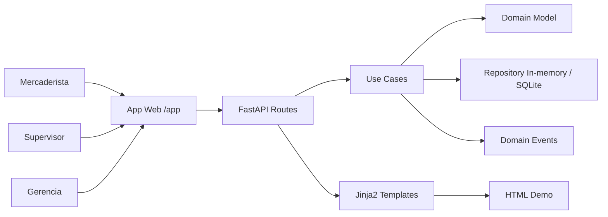

# Design Doc — Demo aplicada de dos features

**Producto:** App Detección Prod  
**Documento:** DD-FEAT-001-002-demo-aplicada  
**Estado:** PARA REVISIÓN  
**Decisión base:** usar FastAPI + HTML server-side render para demo aplicada local.

## 1. Objetivo técnico

Implementar una demo visible y navegable de dos features del producto:

1. Registro visual de producto crítico con acción comercial y cambio de precio.
2. Bandeja de supervisión con validación y dashboard gerencial actualizado.

El objetivo no es reemplazar la API anterior, sino ampliarla con una interfaz sencilla para que el docente vea el flujo del producto como aplicación.

## 2. Arquitectura propuesta



## 3. Rutas de UI propuestas

| Ruta | Método | Vista | Propósito |
|---|---|---|---|
| `/app` | GET | Inicio | Menú de demo aplicada |
| `/app/register` | GET | Formulario mercaderista | Registrar producto crítico |
| `/app/cases` | POST | Acción formulario | Crear caso y redirigir a detalle |
| `/app/cases/{case_id}` | GET | Detalle | Ver cálculo, riesgo, precio y eventos |
| `/app/supervisor` | GET | Bandeja | Ver casos pendientes y validados |
| `/app/cases/{case_id}/validate` | POST | Acción supervisor | Aprobar o rechazar caso |
| `/app/dashboard` | GET | Dashboard | Ver KPIs gerenciales |
| `/app/events` | GET | Eventos | Ver eventos de dominio |
| `/app/traceability` | GET | Trazabilidad | Ver cadena documental y técnica |

## 4. Reutilización del backend existente

La implementación debe reutilizar:

- Entidades de dominio existentes.
- Casos de uso existentes.
- Repositorio en memoria o SQLite existente.
- Cálculo de scoring ya implementado.
- Endpoints API existentes como base de lógica.
- Tests existentes como regresión.

No se debe duplicar lógica en templates. Los templates solo presentan datos.

## 5. Estructura técnica esperada

```text
src/app_deteccion/
├── adapters/
│   ├── api.py
│   ├── web_ui.py
│   ├── templates/
│   │   ├── base.html
│   │   ├── index.html
│   │   ├── register_case.html
│   │   ├── case_detail.html
│   │   ├── supervisor.html
│   │   ├── dashboard.html
│   │   ├── events.html
│   │   └── traceability.html
│   └── static/
│       └── app.css
├── application/
│   ├── use_cases.py
│   └── ports.py
├── domain/
│   ├── entities.py
│   ├── scoring.py
│   ├── events.py
│   └── guardrails.py
├── infrastructure/
│   ├── memory.py
│   └── sqlite_repository.py
└── main.py
```

## 6. Diseño de interfaz

### Pantalla 1 — Inicio

Debe mostrar tarjetas:

- Registrar producto crítico.
- Bandeja supervisor.
- Dashboard gerencial.
- Eventos y trazabilidad.

### Pantalla 2 — Registro mercaderista

Formulario con secciones:

1. Identificación del producto.
2. Vencimiento y cantidad.
3. Acción comercial.
4. Control de precio.
5. Evidencia.
6. Botón registrar.

### Pantalla 3 — Detalle de caso

Debe mostrar:

- Estado del caso.
- Riesgo y score.
- Valor financiero en riesgo.
- Cantidad intervenida.
- Precio actual y nuevo precio.
- Descuento calculado.
- Eventos generados.
- Enlace a validación.

### Pantalla 4 — Bandeja supervisor

Debe mostrar tabla con:

- Producto.
- Tienda.
- Riesgo.
- Acción.
- Estado.
- Botón revisar.

El detalle debe permitir aprobar o rechazar con comentario.

### Pantalla 5 — Dashboard gerencial

Debe mostrar KPIs en tarjetas:

- Total de casos.
- Validados.
- Pendientes.
- Riesgo alto/medio/bajo.
- Valor financiero en riesgo.
- Cantidad intervenida.
- Cambios de precio.
- Descuento promedio.
- Acciones por tipo.

## 7. Diseño de datos mínimo

```python
Case {
  id: str
  fsd_uc: str
  store: str
  product_name: str
  batch: str
  expiration_date: date
  quantity: int
  current_price: float
  new_price: float | None
  commercial_action: str
  price_change_approved: bool
  price_change_reason: str | None
  evidence_note: str
  created_by: str
  created_at: datetime
  status: str
  risk: Risk
  price_audit: PriceAudit
  events: list[DomainEvent]
}
```

## 8. Validaciones técnicas

- No aceptar cantidades menores o iguales a cero.
- No aceptar precios negativos.
- No aceptar fecha inválida.
- No aceptar decisión de supervisor fuera de APROBADO/RECHAZADO.
- Si hay cambio de precio, exigir motivo.
- La validación de supervisor debe generar evento.
- Dashboard debe recalcular desde estado fuente.

## 9. Seguridad y límites de demo

- No hay autenticación real por alcance de demo.
- Los usuarios se simulan con `created_by` y `supervisor_user`.
- La demo no cambia precios automáticamente; solo registra y audita el cambio ingresado.
- La demo no se conecta a sistemas reales.

## 10. Plan de pruebas

| Test | Objetivo |
|---|---|
| test_register_case_from_ui | Registrar desde formulario |
| test_register_case_calculates_risk | Validar scoring |
| test_price_change_requires_reason | Controlar cambio de precio |
| test_supervisor_can_validate_case | Aprobar caso |
| test_dashboard_updates_after_validation | KPIs actualizados |
| test_events_visible | Eventos generados |
| test_traceability_visible | Trazabilidad visible |

## 11. Trade-offs

| Decisión | Beneficio | Costo |
|---|---|---|
| HTML server-side render | Demo rápida, visible y simple | Menos interactiva que SPA |
| Repositorio en memoria/SQLite | Fácil de ejecutar localmente | No representa operación productiva completa |
| Sin login real | Reduce complejidad de demo | Roles simulados |
| Reutilizar backend existente | Mantiene trazabilidad y evita duplicación | Requiere adaptar UI a modelo actual |

## 12. Resultado esperado de la demo

El docente debe poder observar:

```text
Registro de caso → cálculo automático → revisión supervisor → validación → dashboard gerencial → eventos → trazabilidad
```

Esto evidencia que las dos features están aplicadas dentro de la app y no solo descritas en documentos.
