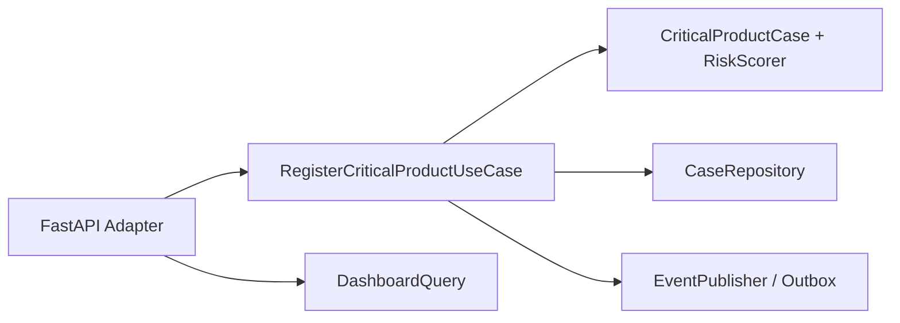

# Design Doc DD-UC-001 — Registro de producto crítico

## 1. Objetivo y contexto

Este feature implementa el caso central del proyecto: registrar un producto próximo a vencer con acción comercial, control de precio, cantidad, evidencia y priorización de riesgo. Responde al problema de reportes dispersos por WhatsApp, falta de trazabilidad, ausencia de control de precios e inexistencia de KPIs accionables.

## 2. Diseño

### Enfoque elegido

Se implementa como un **vertical slice** en monolito modular con FastAPI, separando dominio, aplicación, infraestructura y adaptadores.

### Componentes tocados

| Capa | Componente | Responsabilidad |
|---|---|---|
| Dominio | `CriticalProductCase` | Entidad principal del caso |
| Dominio | `PriceAudit` | Auditoría de precio actual/nuevo |
| Dominio | `RiskScorer` | Score BAJO/MEDIO/ALTO explicable |
| Dominio | `DomainEvent` | Eventos trazables |
| Aplicación | `RegisterCriticalProductUseCase` | Orquesta registro |
| Aplicación | `ValidateCaseBySupervisorUseCase` | Permite validación táctica |
| Aplicación | `DashboardQuery` | Calcula KPIs |
| Infraestructura | `InMemoryCaseRepository` | Repositorio para tests/demo |
| Infraestructura | `SQLiteCaseRepository` | Adaptador persistente local |
| Adaptador | FastAPI | Endpoints de demo |

## 3. Alternativas consideradas

| Alternativa | Pros | Contras | Elegida |
|---|---|---|---|
| Monolito modular FastAPI | Rápido, testeable, trazable | No representa toda la arquitectura cloud final | Sí |
| Microservicios | Más cercano a arquitectura enterprise futura | Sobredimensionado para una sola UC | No |
| Frontend completo | Más visual para demo | Reduce tiempo de tests y documentación | No |
| Solo mock/documentación | Fácil | No cumple demo funcional | No |

## 4. Impacto en specs vivas

| Artefacto vivo | Cambio | Delta vs DTI vFinal |
|---|---|---|
| `docs/product/FSD.md` | FSD-UC-001 implementado con criterios Gherkin | No |
| `docs/product/PRD.md` | Requisitos PRD-REQ-001 a PRD-REQ-005 | No |
| `docs/product/DTP.md` | Changelog, estado UC y deltas técnicos | Sí → ADR-0006 |
| `docs/PROMPT_MAPPING.md` | Trazabilidad requerimiento → prompt → código → tests | No |

## 5. Prompts usados

| Prompt | Tarea | Artefacto generado |
|---|---|---|
| PR-IMPL-001 | Implementar vertical slice FSD-UC-001 | `src/app_deteccion/**`, `tests/**` |

## 6. Plan de pruebas y evals

- Unit tests: dominio, `PriceAudit`, `RiskScorer`, eventos y guardrails.
- Application tests: use cases, dashboard, validación de supervisor y trazabilidad.
- API tests: endpoints principales y errores.
- Cobertura mínima: 90%.

## 7. Definition of Done

- [x] `fsd_uc` declarado y enlazado.
- [x] Diseño y alternativas documentados.
- [x] ADR creado.
- [x] Impacto en specs vivas registrado.
- [x] Prompt versionado en `docs/prompts/impl/`.
- [x] Tests definidos.
- [x] DTP actualizado.
- [x] Demo ejecutable.
