# Vista rápida — Diagramas Mermaid App Detección Prod
Este archivo permite visualizar los diagramas directamente en GitHub o en un visor Markdown con soporte Mermaid.

## 01_c4_context_profesional.mmd
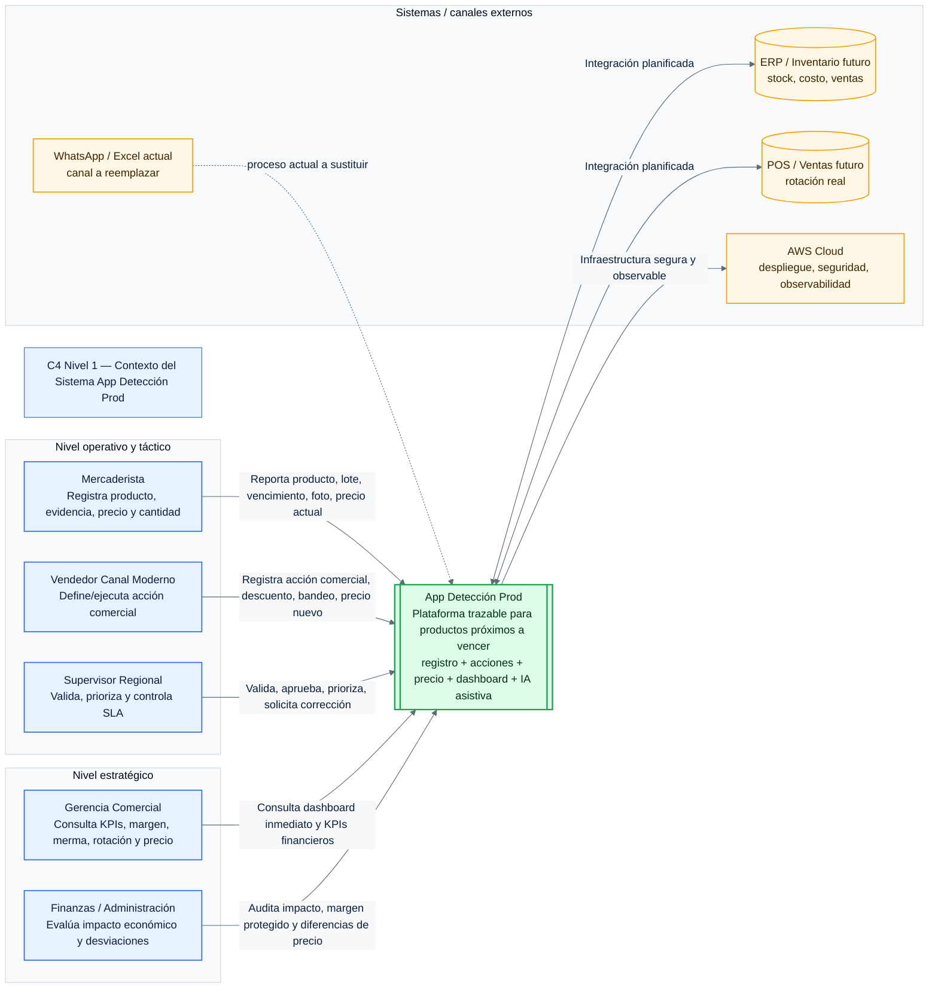

## 02_c4_container_profesional.mmd
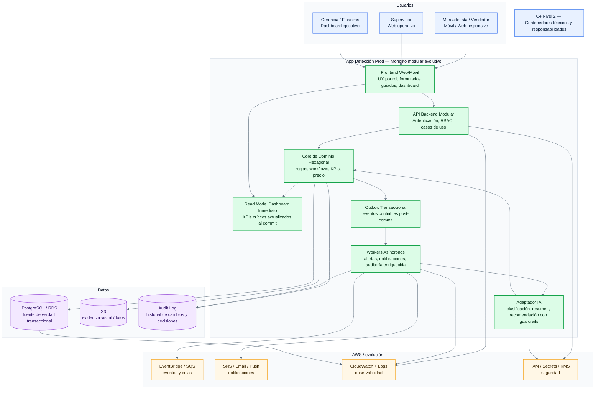

## 03_c4_component_core_profesional.mmd
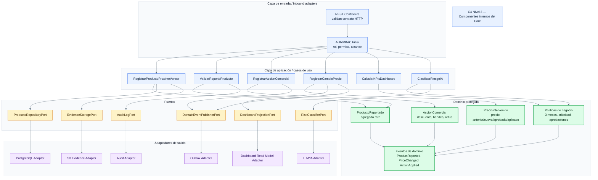

## 04_hexagonal_core_profesional.mmd
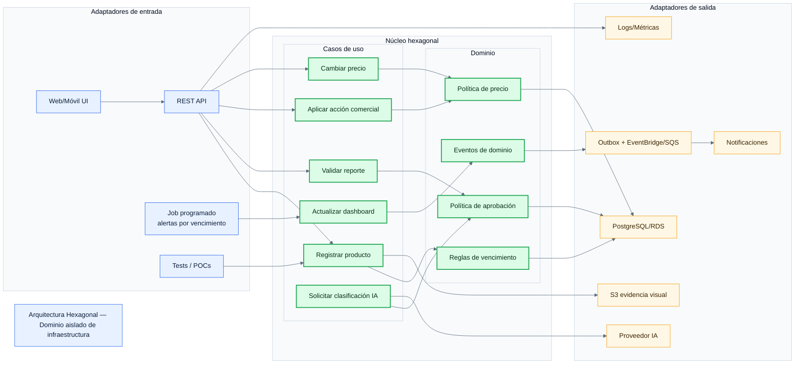

## 05_domain_model_profesional.mmd
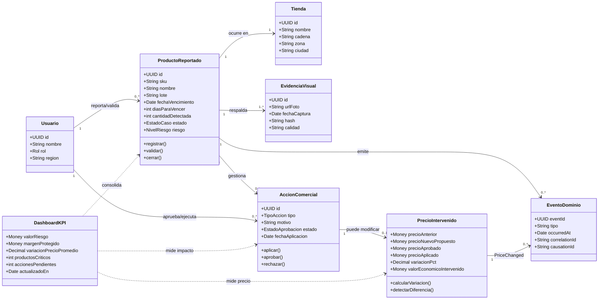

## 06_sequence_registro_producto_profesional.mmd
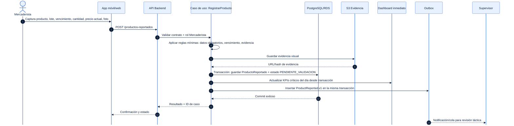

## 07_sequence_cambio_precio_profesional.mmd
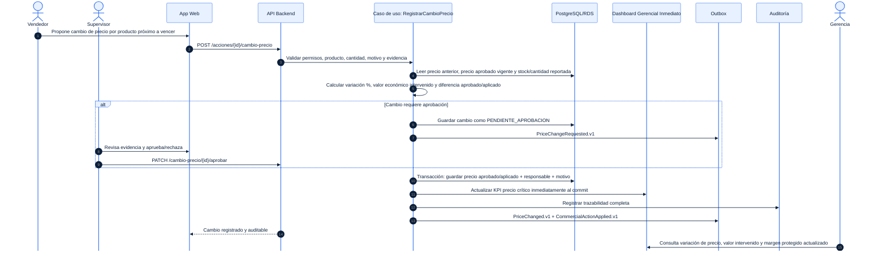

## 08_event_driven_outbox_dashboard_profesional.mmd
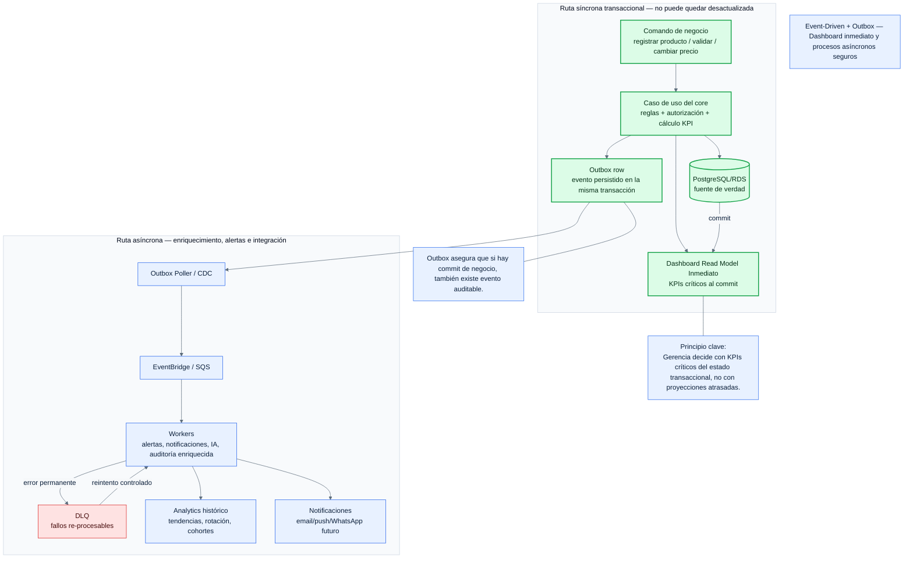

## 09_ai_guardrails_human_loop_profesional.mmd
```mermaid
%%{init: {"theme": "base", "themeVariables": {"fontFamily": "Inter, Arial, sans-serif", "primaryColor": "#E8F1FF", "primaryTextColor": "#0B1F3A", "primaryBorderColor": "#2F6FED", "lineColor": "#5B6B7A", "secondaryColor": "#F6F8FA", "tertiaryColor": "#FFF7E6", "clusterBkg": "#F8FAFC", "clusterBorder": "#CBD5E1"}, "flowchart": {"curve": "basis", "htmlLabels": true, "nodeSpacing": 45, "rankSpacing": 55}, "sequence": {"mirrorActors": false, "showSequenceNumbers": true}}}%%

flowchart LR
  title["IA con Guardrails — Asistencia, no autonomía comercial irreversible"]

  Input["Datos del caso\nproducto, vencimiento, precio, cantidad, foto, historial"] --> Pre["Preprocesamiento\nnormalización + validación + minimización de datos"]
  Pre --> GuardIn["Guardrails de entrada\nno secretos, no PII innecesaria, prompt seguro"]
  GuardIn --> AI["Modelo IA / LLM\nclasifica riesgo, resume evidencia, sugiere prioridad"]
  AI --> GuardOut["Guardrails de salida\nJSON schema, rangos permitidos, no acción irreversible"]
  GuardOut --> Explain["Explicación trazable\npor qué es riesgo alto/medio/bajo"]
  Explain --> Human["Human-in-the-loop\nSupervisor/Vendedor aprueba acción"]
  Human --> Core["Core transaccional\nregistra decisión humana"]
  Core --> Dash["Dashboard\nIA como señal, no fuente de verdad"]
  Core --> Audit["Auditoría\nprompt id, versión, usuario, decisión"]

  Bad["La IA NO puede:\n- cambiar precios automáticamente\n- retirar productos\n- aprobar descuentos\n- cerrar casos críticos"]
  GuardOut --- Bad

  classDef ai fill:#F3E8FF,stroke:#7E22CE,color:#2E1065;
  classDef control fill:#DCFCE7,stroke:#16A34A,stroke-width:2px,color:#052E16;
  classDef danger fill:#FEE2E2,stroke:#DC2626,color:#450A0A;
  class Input,Pre,GuardIn,AI,GuardOut,Explain ai;
  class Human,Core,Dash,Audit control;
  class Bad danger;
```

## 10_aws_deployment_profesional.mmd
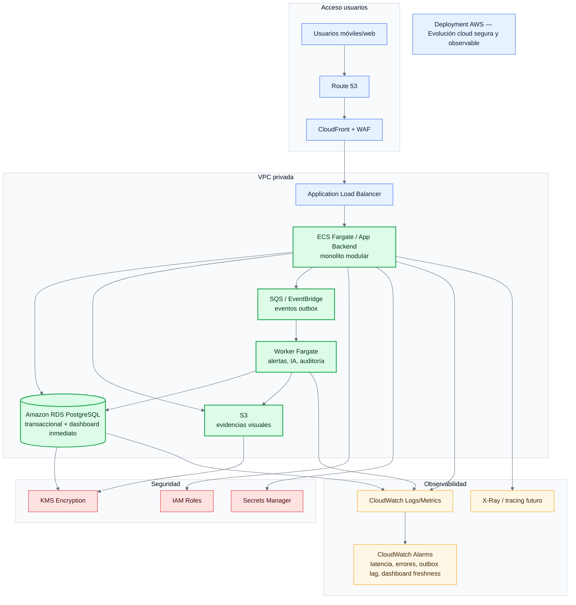

## 11_state_lifecycle_alerta_profesional.mmd
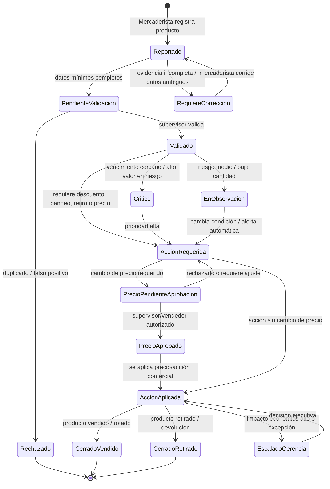

## 12_traceability_map_profesional.mmd
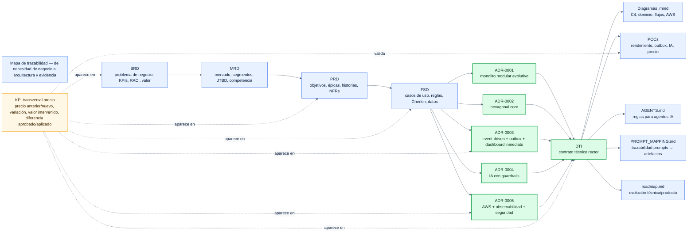

## 13_observability_security_profesional.mmd
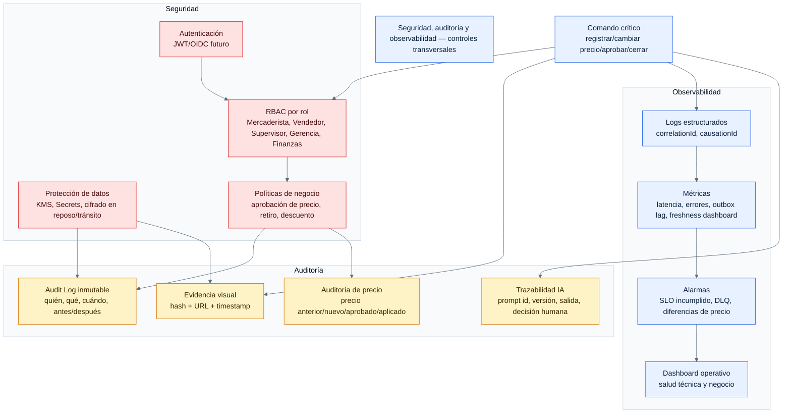

## 14_poc_validation_map_profesional.mmd
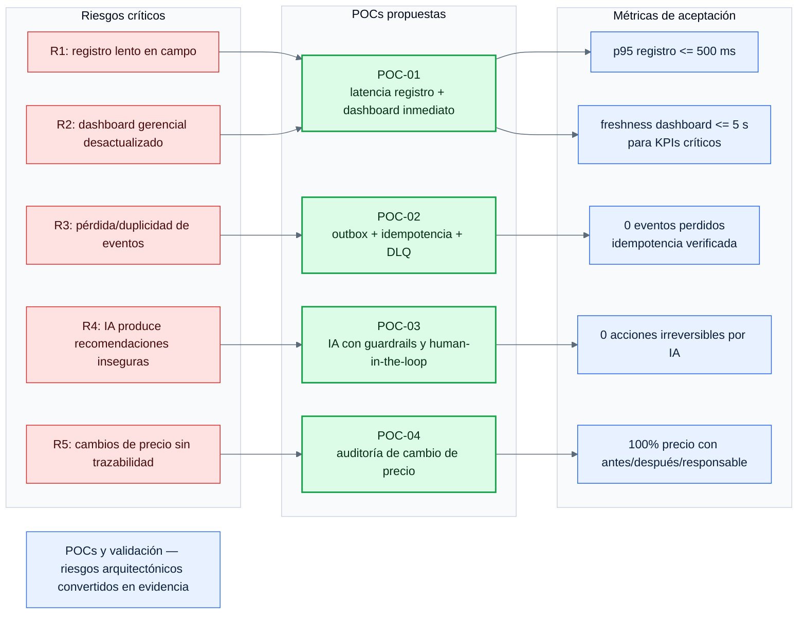
