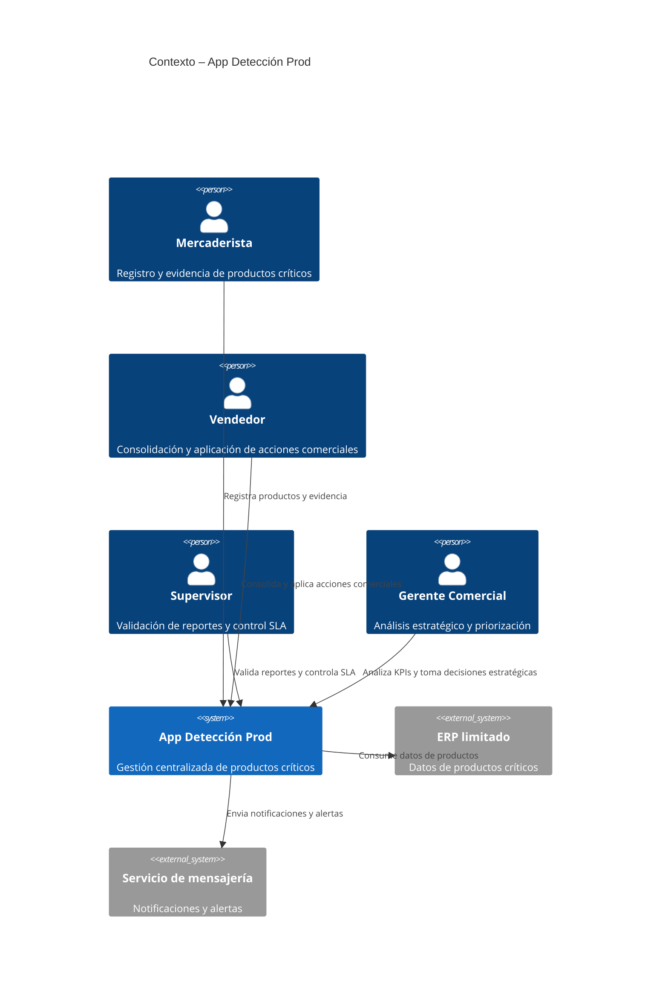
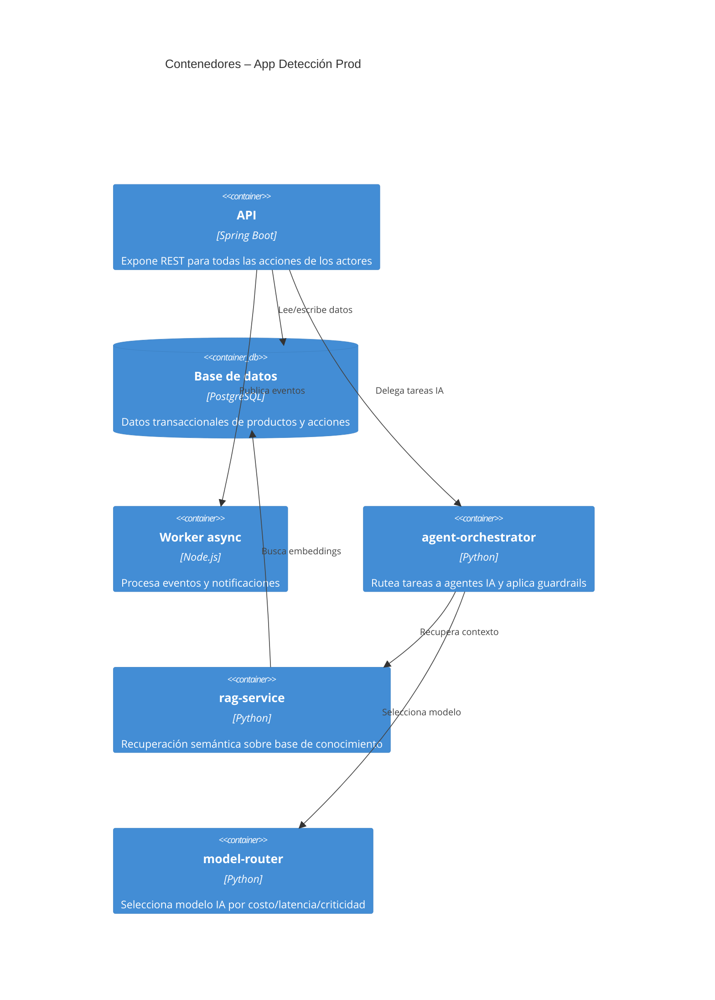
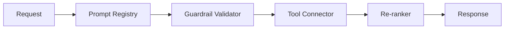
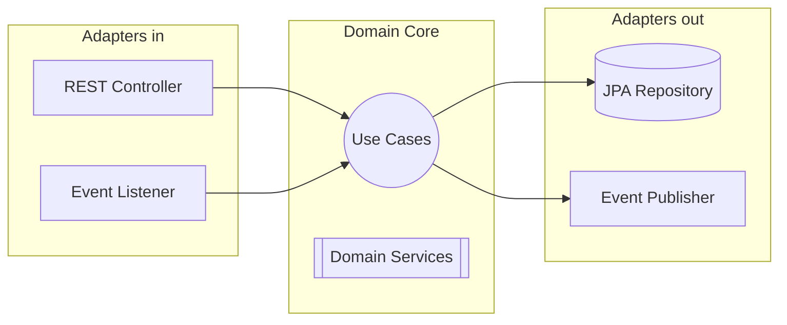
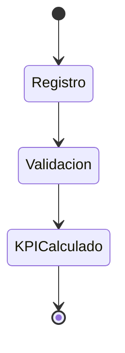

### DTI.md – Documento Técnico Inicial

# DTI – App Detección Prod

## 0. Metadatos

| Campo                      | Valor                                                                                              |
| -------------------------- | -------------------------------------------------------------------------------------------------- |
| Producto                   | App Detección Prod                                                                                 |
| Grupo                      | G07                                                                                                |
| Versión                    | v0.1                                                                                               |
| Fecha                      | 14/05/2026                                                                                         |
| Arquitecto responsable     | Gina Fabiana Villanueva Viscarra                                                                   |
| Stakeholders               | Mercaderistas, Vendedores, Supervisores, Gerentes Comerciales                                      |
| Estado                     | Borrador                                                                                           |
| Repositorio                | <url>                                                                                              |
| Enlace al BRD              | docs/brd/BRD.md                                                                                    |
| Enlace al MRD              | docs/mrd/MRD.md                                                                                    |
| Enlace al PRD              | docs/prd/PRD.md                                                                                    |
| Enlace al FSD              | docs/fsd/FSD.md                                                                                    |
| Enlace a AGENTS.md         | /docs/AGENTS.md                                                                                    |
| Enlace a PROMPT_MAPPING.md | docs/PROMPT_MAPPING.md                                                                             |
| ADRs vigentes              | docs/adr/0001-estilo-arquitectonico.md, docs/adr/0002-persistencia.md, docs/adr/0003-mensajeria.md |
| Skills aplicados           | docs/skills/c4.md, docs/skills/dti-author.md, docs/skills/poc-runner.md                            |
| Release objetivo           | release/1.0.0                                                                                      |

## 0.1 Rol de agentes IA en el SDLC

| Agente       | Fase SDLC   | Output                                   | Supervisor humano | Skill propio que orquesta | Qué se actualiza si el agente falla |
| ------------ | ----------- | ---------------------------------------- | ----------------- | ------------------------- | ----------------------------------- |
| c4-architect | Diseño      | Diagramas C4 niveles 1–3 en Mermaid      | Arquitecto        | docs/skills/c4.md         | ADR + DTI §3                        |
| dti-author   | Diseño/Docs | Secciones del DTI con frontmatter + tags | Arquitecto        | docs/skills/dti-author.md | DTI + AGENTS.md                     |
| poc-runner   | Validación  | Scaffold de POC + log pass/fail          | Líder técnico     | docs/skills/poc-runner.md | ADR + DTI §12 + AGENTS.md           |

## 1. Visión del producto

Centralizar y profesionalizar la gestión de productos críticos próximos a vencer, integrando a **mercaderista, vendedor, supervisor y gerente** para asegurar trazabilidad, reducción de pérdidas y decisiones estratégicas basadas en datos confiables en tiempo real.

## 2. Contexto del sistema

### 2.1 Diagrama C4 – Nivel 1 (Contexto)

### 2.2 Actores externos y dependencias

| Actor / Sistema        | Tipo    | Dirección      | Criticidad |
| ---------------------- | ------- | -------------- | ---------- |
| ERP limitado           | Sistema | Entrada/Salida | Alta       |
| Servicio de mensajería | Sistema | Entrada/Salida | Alta       |

## 3. Arquitectura de alto nivel

### 3.1 Estilo arquitectónico

* Adoptado: **Hexagonal / Clean Architecture** para aislar dominio de infraestructura y permitir extensibilidad y pruebas.
* Justificación: Permite agregar UC sin impactar core, facilita integración de agentes IA y centraliza trazabilidad.

### 3.2 Diagrama C4 – Nivel 2 (Contenedores)

### 3.3 Diagrama C4 – Nivel 3 (Componentes) contenedor crítico agéntico

| Componente           | Tipo                   | Versionado en      | Auditado en |
| -------------------- | ---------------------- | ------------------ | ----------- |
| Prompt registry      | Plantillas versionadas | prompts/*.md       | §22         |
| Guardrail validator  | Validador de salida    | tests/guardrails/  | §23         |
| Tool connector       | Conector externo       | Código + AGENTS.md | §22         |
| Re-ranker            | Reordena resultados    | Código + pesos     | §22         |
| Pipeline fine-tuning | Entrenamiento offline  | pipelines/*        | §22         |

## 4. Modelo de dominio

* Bounded contexts: Producto, Acción Comercial, Validación, KPI.
* Aggregates: Producto, AccionComercial, Validacion, KPI.
* Entidades: Mercaderista, Vendedor, Supervisor, Gerente.
* Value Objects: Cantidad, Precio, Fecha.
* DTOs: ProductoDTO, AccionDTO, KPIReportDTO.

## 5. Arquitectura hexagonal

### Puertos

| Puerto                 | Tipo   | Propósito                        |
| ---------------------- | ------ | -------------------------------- |
| RegisterProductUseCase | Input  | Registrar producto crítico       |
| ValidateActionUseCase  | Input  | Validar acciones comerciales     |
| KPIService             | Output | Generar indicadores estratégicos |

### Adaptadores

| Adaptador             | Implementa             | Tecnología      |
| --------------------- | ---------------------- | --------------- |
| ProductRestController | RegisterProductUseCase | Spring MVC      |
| JpaProductRepository  | Repository             | Spring Data JPA |
| WorkerEventListener   | Worker                 | Node.js         |

### Diagrama de puertos y adaptadores

## 6. Arquitectura distribuida y microservicios

* Servicio: product-service (CRUD productos)
* Servicio: action-service (gestión de acciones comerciales)
* Servicio: kpi-service (cálculo de indicadores)
* Patrón de resiliencia: Circuit breaker, Retry + backoff, Rate limiting

## 7. Arquitectura asíncrona / Event-driven

* Eventos: ProductCreated, ActionApplied, KPIUpdated
* Sagas: orquestación centralizada por Worker y API

## 8. Despliegue Cloud Native

* AWS: API Gateway, Lambda/ECS, RDS, Vector DB, S3, SNS/SQS, ElastiCache, Step Functions
* Entornos: dev, staging, producción multi-AZ
* Disaster Recovery: RPO 1h, RTO 2h, estrategia Warm Standby

## 9. Capa IA / Agentes

* agent-orchestrator: rutea tareas y aplica guardrails
* rag-service: recuperación semántica y embeddings
* model-router: selección de modelo por latencia/criticidad
* Contenedor Nivel 3: Prompt Registry, Guardrail Validator, Tool Connector, Re-ranker, Fine-tuning Pipeline

## 10. Prompt Mapping

* PR-UC-001: FSD-UC-001
* PR-UC-002: FSD-UC-002
* PR-UC-003: FSD-UC-003
* PR-UC-004: FSD-UC-004

## 11. NFRs

| ID      | Categoría      | Métrica          | Umbral      |
| ------- | -------------- | ---------------- | ----------- |
| NFR-001 | Rendimiento    | p95 latencia API | < 500 ms    |
| NFR-002 | Disponibilidad | Uptime           | ≥ 99.9 %    |
| NFR-003 | Seguridad      | Cifrado AES-256  | Obligatorio |

## 12. POCs críticas

### POC-01: Alertas predictivas

* Hipótesis: agent-orchestrator detecta productos críticos con 80% precisión
* Criterio SMART: p95 < 500 ms, cobertura ≥80%
* Alcance: UC 001-002

### POC-02: Visualización KPIs en tiempo real

* Hipótesis: KPIService muestra métricas con <2 seg de latencia
* Alcance: UC-004

## 13. Seguridad, observabilidad y DevOps

* AuthN/AuthZ: OAuth2, RBAC/ABAC
* Logging: JSON estructurado, correlationId
* CI/CD: pipelines con tests unitarios, integración, E2E y guardrails
* Canary y Shadow Mode para agentes IA

## 14. Antipatrones auditados

* Big Ball of Mud: no
* God Service: no
* Distributed Monolith: mitigado con event-driven
* Data Swamp: mitigado con catalogo de datos centralizado

## 15. Trade-offs

* Persistencia: PostgreSQL vs DynamoDB → PostgreSQL para transacciones ACID
* Arquitectura: Hexagonal vs Monolito → Hexagonal para testabilidad y extensibilidad

## 16. Riesgos técnicos

* Baja adopción, fallas de integración, errores IA
* Mitigación: capacitación, validaciones automáticas, alertas y logs

## 17. Roadmap técnico

* Ahora: DTI + POCs
* Próximo: Implementación core hexagonal
* +2 módulos: Integración, despliegue, observabilidad

## 18. Glosario y referencias

* Términos: PRODUCTO CRÍTICO, ACCION_COMERCIAL, KPI
* Referencias: Clean Architecture, C4 Model, AWS Well-Architected, Claude docs

## 19. ADRs registradas

* ADR-0001: Estilo arquitectónico hexagonal
* ADR-0002: Persistencia principal en PostgreSQL
* ADR-0003: Mensajería y eventos via SNS/SQS

## 20. Auditoría de decisiones IA

* Campos auditables: prompt_id, agente, modelo, fecha, acción tomada, nivel riesgo, retención
* Responsable: líder técnico
* Retención: low=30d, medium=1a, high=3a

## 21. Evaluación de agentes y prompts

* Tests: prompt injection, jailbreaking, PII leakage
* Herramientas: Langfuse, OpenTelemetry, CI bloqueante
