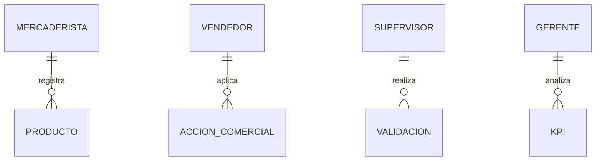

### FSD.md – Functional Specification Document

# FSD – App Detección Prod

## 0. Metadatos

| Campo                  | Valor                                      |
| ---------------------- | ------------------------------------------ |
| Producto               | App Detección Prod                         |
| Grupo                  | G07                                        |
| Versión                | v0.1                                       |
| Fecha                  | 14/05/2026                                 |
| Autores                | Gina Fabiana Villanueva Viscarra           |
| Revisores              | Docente + grupo par                        |
| Estado                 | Borrador                                   |
| Modo elegido           | LFSD ⚡                                     |
| Trazabilidad a PRD     | PRD v0.1                                   |
| Insumos M2             | Wireframes y mockups M2                    |
| Prompts utilizados     | PR-UC-001, PR-UC-002, PR-UC-003, PR-UC-004 |
| Fase Spec Kit cubierta | Specify ✅                                  |

## 1. Resumen ejecutivo

El FSD detalla los **casos de uso críticos** de la App Detección Prod, integrando a los cuatro actores principales: Mercaderista, Vendedor, Supervisor y Gerente Comercial. Proporciona flujos operativos, reglas de negocio, modelo de datos y trazabilidad con UI/UX, asegurando la ejecución de historias de usuario y cumplimiento de NFRs, permitiendo decisiones estratégicas basadas en información confiable y centralizada.

## 2. Alcance

### 2.1 Dentro del alcance

* Registro de productos críticos por Mercaderistas.
* Consolidación y aplicación de acciones comerciales por Vendedores.
* Validación de reportes y control de SLA por Supervisores.
* Visualización de KPIs estratégicos por Gerentes.
* Alertas operativas y métricas en tiempo real.

### 2.2 Fuera del alcance

* Inventario general completo.
* Facturación, ERP financiero y logística avanzada.

### 2.3 Supuestos y dependencias

* Smartphones y conectividad mínima para usuarios.
* Cooperación de las áreas internas para validación de datos.
* Integración inicial con ERP limitado a datos de productos críticos.

## 3. Actores y roles del sistema

| Actor             | Tipo   | Responsabilidad                            | Permisos                                       |
| ----------------- | ------ | ------------------------------------------ | ---------------------------------------------- |
| Mercaderista      | Humano | Registro y evidencia de productos críticos | CRUD productos, subir fotos                    |
| Vendedor          | Humano | Consolidación y ejecución de promociones   | Validación y actualización de acciones         |
| Supervisor        | Humano | Validación de reportes y control SLA       | Dashboard completo, aprobar/corregir registros |
| Gerente Comercial | Humano | Análisis estratégico y priorización        | KPIs, decisiones sobre rotación y alertas      |

## 4. Casos de uso críticos

### 4.1 FSD-UC-001 – Registro de producto crítico

* Actor principal: Mercaderista
* Precondiciones: usuario autenticado, conexión activa
* Flujo principal:

  1. Escanear o ingresar producto.
  2. Registrar cantidad y precio.
  3. Tomar evidencia fotográfica.
  4. Enviar registro a sistema.
* Postcondiciones: registro reflejado, supervisor notificado.
* Reglas de negocio: RB-01, RB-03
* Criterios de aceptación (Gherkin):

```gherkin
Dado el mercaderista autenticado
Cuando registra un producto próximo a vencer
Entonces el registro se refleja en el sistema y el supervisor recibe notificación
```

### 4.2 FSD-UC-002 – Consolidación de acciones comerciales

* Actor principal: Vendedor
* Flujo: recibir reportes de mercaderistas, aplicar descuentos/promociones, consolidar información.
* Postcondiciones: acciones visibles y trazables
* Reglas: RB-01, RB-04
* Gherkin:

```gherkin
Dado que el vendedor accede a reportes
Cuando aplica promoción a productos críticos
Entonces las acciones se reflejan en el dashboard y generan alerta al supervisor
```

### 4.3 FSD-UC-003 – Validación de reportes

* Actor principal: Supervisor
* Flujo: revisar registros, validar información, aprobar o corregir acciones.
* Postcondiciones: datos consistentes y alertas generadas.
* Reglas: RB-01, RB-02, RB-04
* Gherkin:

```gherkin
Dado que el supervisor accede al dashboard
Cuando valida registros de mercaderistas y vendedores
Entonces aprueba o corrige los datos y se notifican cambios al sistema
```

### 4.4 FSD-UC-004 – Visualización de KPIs estratégicos

* Actor principal: Gerente Comercial
* Flujo: acceder al dashboard, analizar indicadores, tomar decisiones estratégicas.
* Postcondiciones: decisiones reflejadas en alertas y priorización de productos.
* Reglas: RB-04
* Gherkin:

```gherkin
Dado que el gerente accede al dashboard
Cuando revisa KPIs estratégicos
Entonces recibe métricas consolidadas y alertas sobre productos críticos
```

## 5. Reglas de negocio

| ID    | Regla                                                     | Casos de uso afectados             |
| ----- | --------------------------------------------------------- | ---------------------------------- |
| RB-01 | Ningún producto crítico puede quedar sin acción comercial | FSD-UC-001, FSD-UC-002, FSD-UC-003 |
| RB-02 | Toda modificación de precio debe registrar responsable    | FSD-UC-003                         |
| RB-03 | Todo producto crítico debe tener evidencia fotográfica    | FSD-UC-001                         |
| RB-04 | Toda acción debe mantener historial                       | FSD-UC-002, FSD-UC-003, FSD-UC-004 |

## 6. Modelo de datos

### 6.1 Diagrama ER



### 6.2 Diccionario de datos

| Entidad          | Atributo  | Tipo     | Obligatorio |
| ---------------- | --------- | -------- | ----------- |
| PRODUCTO         | id        | UUID     | sí          |
| PRODUCTO         | nombre    | string   | sí          |
| ACCION_COMERCIAL | tipo      | string   | sí          |
| ACCION_COMERCIAL | fecha     | datetime | sí          |
| KPI              | indicador | string   | sí          |
| KPI              | valor     | numeric  | sí          |

## 7. Prompt como contrato

* FSD-UC-001: PR-UC-001
* FSD-UC-002: PR-UC-002
* FSD-UC-003: PR-UC-003
* FSD-UC-004: PR-UC-004

## 8. Integraciones externas

| Sistema                | Tipo    | Propósito                   | SLA    |
| ---------------------- | ------- | --------------------------- | ------ |
| ERP limitado           | Consumo | Datos de productos críticos | 99.9 % |
| Servicio de mensajería | Consumo | Notificaciones              | 99 %   |

## 9. Interfaces de usuario

* Referencia a wireframes M2
* Trazabilidad: Wireframe → Pantalla → UC crítico

## 10. Requerimientos no funcionales (NFR)

| ID      | Categoría      | Requisito        | Métrica  | Umbral      |
| ------- | -------------- | ---------------- | -------- | ----------- |
| NFR-001 | Rendimiento    | Latencia de API  | p95      | < 500 ms    |
| NFR-002 | Seguridad      | Cifrado de datos | AES-256  | Obligatorio |
| NFR-003 | Disponibilidad | Uptime           | ≥ 99.9 % | CloudWatch  |

## 11. Trazabilidad MRD → PRD → FSD

| MRD ID   | PRD ID      | FSD ID     | NFR     |
| -------- | ----------- | ---------- | ------- |
| MRD-N-01 | PRD-REQ-001 | FSD-UC-001 | NFR-001 |
| MRD-N-02 | PRD-REQ-002 | FSD-UC-002 | NFR-002 |
| MRD-N-03 | PRD-REQ-003 | FSD-UC-003 | NFR-003 |
| MRD-N-04 | PRD-REQ-004 | FSD-UC-004 | NFR-001 |

## 12. Plan de pruebas funcionales

* Unitarias: validación de registro y consolidación.
* Integración: flujo completo de mercaderista → vendedor → supervisor → gerente.
* E2E: test de alertas y KPIs estratégicos.
* Performance: k6 para NFR-001 (p95 < 500 ms).

## 13. Riesgos funcionales

| Riesgo                   | Probabilidad | Impacto | Mitigación                                     |
| ------------------------ | ------------ | ------- | ---------------------------------------------- |
| Datos incompletos        | Media        | Alto    | Validación automática y alertas                |
| Fallas de conexión       | Media        | Medio   | Retry, caching local                           |
| Error humano en registro | Alta         | Alto    | Feedback inmediato, confirmación de supervisor |

## 14. Glosario

| Término          | Definición                                                                 |
| ---------------- | -------------------------------------------------------------------------- |
| PRODUCTO CRÍTICO | Producto próximo a vencer que requiere seguimiento                         |
| ACCION_COMERCIAL | Descuento, bandeo o promoción aplicada a un producto                       |
| KPI              | Indicador clave de rendimiento que refleja el estado del producto o acción |

## 15. Registro de cambios

| Versión | Fecha      | Autor                            | Cambio                                                                       |
| ------- | ---------- | -------------------------------- | ---------------------------------------------------------------------------- |
| v0.1    | 14/05/2026 | Gina Fabiana Villanueva Viscarra | FSD inicial completo con 4 actores, UC críticos, reglas, NFRs y trazabilidad |
