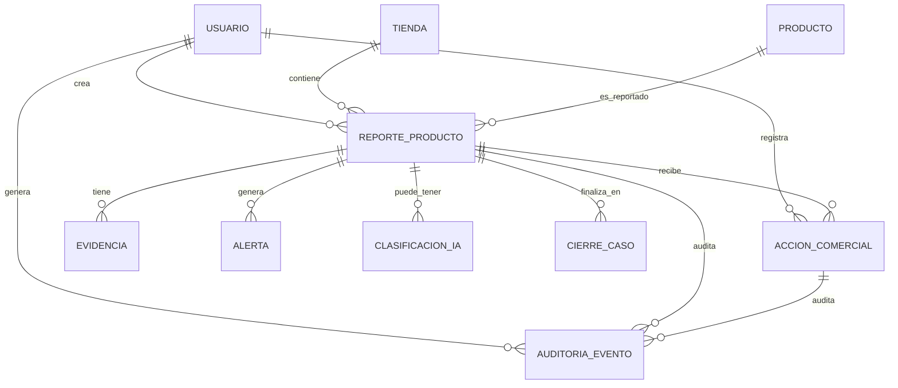
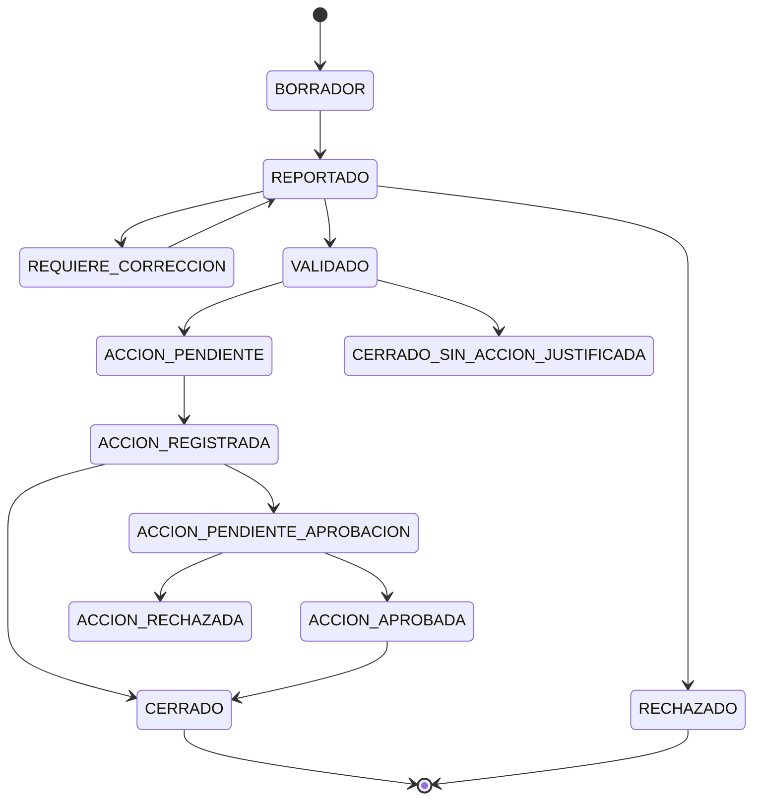

# Functional Specification Document (FSD) vFinal — App Detección Prod

> **Ubicación sugerida en el repositorio:** `docs/fsd/FSD_vFinal.md`  
> **Estado:** `APROBADO`  
> **Versión:** `vFinal-2.0.0`  
> **Release objetivo:** `release/2.0.0`  
> **Documentos padre aprobados:** `docs/brd/BRD_vFinal.md`, `docs/mrd/MRD_vFinal.md`, `docs/prd/PRD_vFinal.md`  
> **Cadena de trazabilidad:** `BRD → MRD → PRD → FSD → DTI → ADR/POC/PROMPT_MAPPING`  
> **Propósito:** especificar funcionalmente cómo debe comportarse App Detección Prod para que diseño, ingeniería, QA, arquitectura y agentes IA puedan implementar, probar y auditar el producto sin perder trazabilidad con negocio.

---

## 0. Metadatos

| Campo | Valor |
|---|---|
| Producto | **App Detección Prod** |
| Tipo de producto | Plataforma digital para detección, trazabilidad, gestión comercial e inteligencia operativa de productos próximos a vencer en canal retail |
| Organización objetivo | Empresas distribuidoras e importadoras que operan en supermercados, micromercados, cadenas de farmacias y tiendas especializadas |
| Grupo | Proyecto académico — Maestría en Desarrollo de Productos de Software con IA |
| Versión del documento | `vFinal-2.0.0` |
| Fecha | 26/05/2026 |
| Autora | Gina Fabiana Villanueva Viscarra |
| Estado | Aprobado |
| Modo elegido | **FSD clásico 🔧**, con secciones LFSD compatibles para mantenimiento vivo |
| BRD de referencia | `docs/brd/BRD_vFinal.md` — aprobado |
| MRD de referencia | `docs/mrd/MRD_vFinal.md` — aprobado |
| PRD de referencia | `docs/prd/PRD_vFinal.md` — aprobado |
| Insumos M2 UX/UI | Consigna M2, plan de investigación, entrevistas a gerente, supervisor y vendedor, hallazgos de investigación, perfiles y necesidades de usuario |
| Fase Spec Kit cubierta | Specify ✅ / Plan ✅ / Tasks ✅ / Implement ⬜ |
| Prompts utilizados | `PR-FSD-001`, `PR-FSD-002`, `PR-UC-001`, `PR-UC-002`, `PR-UC-003`, `PR-IA-001` — pendientes de registrar en `docs/PROMPT_MAPPING.md` |
| Documentos hijos esperados | `docs/DTI.md`, `docs/adr/*`, `pocs/*`, `docs/prompts/*`, `docs/diagrams/*.mmd`, `AGENTS.md` |

---

## 1. Resumen ejecutivo

App Detección Prod es una plataforma digital orientada a empresas distribuidoras e importadoras que operan en canal retail y necesitan transformar un proceso informal de control de productos próximos a vencer en un sistema estructurado, trazable, medible y útil para la toma de decisiones. El flujo actual se apoya en WhatsApp, Excel, fotografías no estandarizadas y validaciones manuales; esto provoca pérdida de trazabilidad, incertidumbre operativa, demoras en la toma de decisiones, errores en descuentos o retiros, y ausencia de indicadores de impacto financiero.

El FSD especifica funcionalmente el comportamiento esperado del sistema: registro móvil de productos próximos a vencer, validación táctica por supervisión, gestión de acciones comerciales por vendedores o responsables comerciales, control de precio actual y precio intervenido, seguimiento de cantidad intervenida, alertas por criticidad, dashboard gerencial e historial auditable. La solución distingue claramente roles: el mercaderista registra evidencia en campo; el supervisor valida, prioriza y controla; el vendedor gestiona acciones comerciales; gerencia permanece informada con KPIs ejecutivos; finanzas usa datos consolidados para estimar impacto económico.

Este documento convierte los requerimientos del PRD en casos de uso funcionales, reglas de negocio, modelo de datos, criterios de aceptación Gherkin, prompt-contratos y matriz de trazabilidad. También prepara la base para el DTI, ADRs, POCs y demo final, asegurando que la arquitectura responda a necesidades reales y no a decisiones técnicas aisladas.

---

## 2. Alcance

### 2.1 Dentro del alcance

| ID | Funcionalidad | Descripción funcional | Relación PRD |
|---|---|---|---|
| FSD-SCOPE-001 | Registro de producto próximo a vencer | Permite al mercaderista registrar producto, tienda, fecha de vencimiento, lote, cantidad, precio actual y evidencia fotográfica. | PRD-REQ-001, PRD-US-001 |
| FSD-SCOPE-002 | Validación táctica del reporte | Permite al supervisor revisar completitud, evidencia y consistencia del reporte. | PRD-REQ-002, PRD-US-004 |
| FSD-SCOPE-003 | Priorización de criticidad | Calcula nivel de riesgo según días a vencimiento, cantidad, valor económico, rotación y estado comercial. | PRD-REQ-003, PRD-US-006 |
| FSD-SCOPE-004 | Gestión de acción comercial | Permite registrar descuento, bandeo, promoción, retiro, devolución, cambio o seguimiento. | PRD-REQ-004, PRD-US-007 |
| FSD-SCOPE-005 | Control de precio y cantidad intervenida | Registra precio actual, precio intervenido, porcentaje de descuento y cantidad afectada. | PRD-REQ-005, PRD-US-008 |
| FSD-SCOPE-006 | Alertas operativas y tácticas | Notifica productos críticos por vencimiento, falta de validación, acción vencida o evidencia incompleta. | PRD-REQ-006, PRD-US-009 |
| FSD-SCOPE-007 | Dashboard ejecutivo | Visualiza KPIs de merma, productos críticos, acciones aplicadas, impacto financiero y tendencia por tienda/categoría. | PRD-REQ-007, PRD-US-012 |
| FSD-SCOPE-008 | Auditoría de historial | Registra cambios de estado, responsables, decisiones y evidencia asociada. | PRD-REQ-008, PRD-US-013 |
| FSD-SCOPE-009 | Asistencia IA controlada | Sugiere nivel de riesgo o acción recomendada bajo reglas del FSD, sin ejecutar decisiones irreversibles. | PRD-REQ-009, PRD-US-014 |
| FSD-SCOPE-010 | Reportes exportables | Permite exportar información filtrada para análisis operativo, financiero o gerencial. | PRD-REQ-010, PRD-US-015 |

### 2.2 Fuera del alcance

| ID | Fuera de alcance | Justificación |
|---|---|---|
| FSD-OOS-001 | Integración productiva con ERP real | Requiere contratos, credenciales, APIs y gobierno de datos de la empresa. Se deja como fase posterior. |
| FSD-OOS-002 | Facturación, contabilidad o liquidación financiera | El sistema mide impacto estimado, pero no reemplaza módulos contables. |
| FSD-OOS-003 | Optimización automática de precios con IA autónoma | La IA no debe decidir descuentos sin revisión humana por riesgo comercial y financiero. |
| FSD-OOS-004 | Reconocimiento visual automático de producto por imagen | Puede ser POC futura; en vFinal la foto es evidencia, no fuente única de identificación. |
| FSD-OOS-005 | App offline completa con sincronización conflict-free | Se contempla tolerancia limitada a conectividad intermitente, pero la sincronización avanzada queda para roadmap. |
| FSD-OOS-006 | Gestión de inventario total por tienda | Solo se gestiona el subconjunto de productos reportados como próximos a vencer o intervenidos. |

### 2.3 Supuestos y dependencias

| Tipo | Supuesto / dependencia | Impacto funcional |
|---|---|---|
| Operativo | Mercaderistas usan smartphone Android con cámara. | El flujo de registro debe ser móvil-first y de baja carga cognitiva. |
| Operativo | La conectividad en sala puede ser variable. | Se requiere guardado temporal o recuperación de formulario ante fallos. |
| Negocio | La empresa define umbrales de vencimiento por categoría. | La criticidad no es fija; debe parametrizarse. |
| Negocio | Gerencia necesita información consolidada, no gestión caso por caso. | El dashboard debe priorizar KPIs, comparativos y alertas agregadas. |
| Datos | Catálogo de productos puede existir en Excel/ERP. | Se contempla carga inicial/manual o integración posterior. |
| Seguridad | Cada acción debe quedar asociada a usuario y rol. | La auditoría es obligatoria en todos los cambios de estado. |
| IA | La IA funciona como apoyo, no como autoridad final. | Toda recomendación crítica requiere confirmación humana. |

### 2.4 Plan técnico funcional — Spec Kit fase Plan

| Bloque | Decisión funcional para ingeniería |
|---|---|
| Arquitectura prevista | Monolito modular con arquitectura hexagonal como base; preparado para evolución por bounded contexts. |
| Bounded contexts funcionales | Detección de Producto, Gestión Comercial, Supervisión, Analítica Ejecutiva, Notificaciones, Asistencia IA, Auditoría. |
| Interacciones principales | UI móvil para campo, UI web para supervisión/gerencia, API backend, almacenamiento de evidencias, motor de alertas, auditoría. |
| Persistencia funcional | Entidades transaccionales: ProductoReportado, Tienda, Usuario, AcciónComercial, Evidencia, Alerta, Auditoría, KPIResumen. |
| Eventos candidatos | `ProductoReportado`, `ReporteValidado`, `AccionComercialRegistrada`, `ProductoCriticoDetectado`, `KPIActualizado`, `AlertaEmitida`. |
| Criterio de implementación | Cada caso de uso crítico debe tener test funcional, criterio Gherkin y trazabilidad a PRD. |

### 2.5 Descomposición en tasks ejecutables

| Task ID | Descripción | Caso de uso | Dependencias | Prompt asociado | Estado |
|---|---|---|---|---|---|
| T-001 | Definir entidades funcionales y diccionario de datos base. | Todos | PRD aprobado | PR-FSD-001 | pendiente |
| T-002 | Implementar formulario móvil de registro de producto próximo a vencer. | FSD-UC-001 | T-001 | PR-UC-001 | pendiente |
| T-003 | Implementar validación de reporte por supervisor. | FSD-UC-002 | T-001, T-002 | PR-UC-002 | pendiente |
| T-004 | Implementar cálculo de criticidad funcional. | FSD-UC-003 | T-001, T-002 | PR-UC-003 | pendiente |
| T-005 | Implementar registro de acción comercial y control de precio/cantidad. | FSD-UC-004 | T-002, T-003 | PR-UC-004 | pendiente |
| T-006 | Implementar tablero operativo para supervisión. | FSD-UC-005 | T-003, T-004, T-005 | PR-UC-005 | pendiente |
| T-007 | Implementar dashboard ejecutivo de KPIs. | FSD-UC-006 | T-004, T-005 | PR-UC-006 | pendiente |
| T-008 | Implementar historial auditable de cambios. | FSD-UC-007 | T-001 | PR-AUDIT-001 | pendiente |
| T-009 | Implementar alertas por vencimiento y falta de acción. | FSD-UC-008 | T-004 | PR-ALERT-001 | pendiente |
| T-010 | Implementar prompt-contrato de clasificación de riesgo IA. | FSD-UC-009 | T-004, reglas BR | PR-IA-001 | pendiente |
| T-011 | Definir pruebas funcionales y Gherkin para casos críticos. | Todos | FSD completo | PR-QA-001 | pendiente |
| T-012 | Preparar datos semilla para demo. | Todos | T-001 | PR-DEMO-001 | pendiente |

---

## 3. Actores y roles del sistema

| Actor | Tipo | Responsabilidad principal | Permisos clave | No debe hacer |
|---|---|---|---|---|
| Mercaderista | Humano / usuario operativo | Registrar productos próximos a vencer en tienda con evidencia mínima. | Crear reportes, adjuntar fotos, registrar precio/cantidad, consultar estado de sus reportes. | Aprobar acciones comerciales de alto impacto o modificar KPIs. |
| Supervisor Regional | Humano / usuario táctico | Validar reportes, priorizar casos, corregir información incompleta y coordinar acciones. | Validar/rechazar reportes, solicitar corrección, asignar prioridad, consultar tablero operativo. | Alterar evidencia original sin trazabilidad. |
| Vendedor Canal Moderno | Humano / usuario comercial | Registrar y dar seguimiento a acciones comerciales. | Proponer/registrar descuentos, bandeos, promociones, retiros, cambios, seguimiento comercial. | Aprobar excepciones financieras fuera de política sin autorización. |
| Gerencia Comercial | Humano / usuario ejecutivo | Consumir información consolidada para toma de decisiones estratégicas. | Consultar dashboard, KPIs, tendencias, impacto financiero, exportes ejecutivos. | Registrar reportes diarios o validar cada caso operativo. |
| Finanzas / Administración | Humano / usuario analítico | Revisar impacto económico estimado, devoluciones, reposición y costos. | Consultar reportes financieros, ajustar parámetros de costo autorizados, exportar data. | Cambiar evidencia o aprobar acciones operativas sin rol comercial. |
| Administrador del Sistema | Humano / soporte | Configurar usuarios, roles, tiendas, categorías, umbrales y catálogos. | CRUD de parámetros maestros, gestión de roles, auditoría técnica. | Borrar auditoría funcional. |
| Motor de Alertas | Sistema interno | Generar alertas por vencimiento, criticidad, falta de validación o acción vencida. | Leer reglas y emitir notificaciones. | Modificar casos manualmente. |
| Agente IA de Riesgo | Agente IA interno controlado | Sugerir clasificación de riesgo y explicación trazable. | Leer datos permitidos del caso y devolver recomendación no vinculante. | Ejecutar descuentos, retiros o aprobaciones automáticamente. |
| Servicio de Notificaciones | Sistema interno/externo | Enviar recordatorios y alertas a usuarios responsables. | Enviar notificaciones por canal configurado. | Acceder a datos no necesarios para notificación. |

---

## 4. Casos de uso funcionales críticos

### 4.1 FSD-UC-001 — Registrar producto próximo a vencer en tienda

- **Trazabilidad:** `BR-001`, `BR-002`, `MRD-N-01`, `PRD-REQ-001`, `PRD-US-001`.
- **Actor principal:** Mercaderista.
- **Actores secundarios:** Supervisor Regional, Motor de Alertas.
- **Objetivo:** convertir un hallazgo de campo informal en un registro estructurado, trazable y accionable.
- **Contexto:** el mercaderista detecta en sala un producto con vencimiento cercano y debe registrarlo sin depender de WhatsApp ni fotos dispersas.

#### Precondiciones

1. El mercaderista está autenticado.
2. El mercaderista tiene una tienda/ruta asignada.
3. El producto existe en catálogo o puede registrarse como producto pendiente de catálogo.
4. El sistema tiene configurado un umbral de vencimiento por categoría o un umbral general.

#### Disparador

El mercaderista identifica un producto con fecha de vencimiento cercana, baja rotación o necesidad de acción comercial.

#### Flujo principal

1. El mercaderista ingresa a **Nuevo reporte de vencimiento**.
2. Selecciona o confirma la tienda visitada.
3. Busca el producto por nombre, código, SKU o categoría.
4. Ingresa fecha de vencimiento, lote si está disponible, cantidad detectada, precio actual y ubicación en sala.
5. Adjunta una o más fotos como evidencia.
6. Selecciona estado inicial: `Detectado en góndola`, `Detectado en bodega`, `Producto ya intervenido`, `Requiere revisión`.
7. El sistema valida campos obligatorios.
8. El sistema calcula días restantes al vencimiento.
9. El sistema asigna estado `REPORTADO`.
10. El sistema genera auditoría `ReporteCreado`.
11. El sistema emite evento funcional `ProductoReportado`.
12. El sistema muestra confirmación con ID del reporte.

#### Flujos alternativos

- **A1 — Producto no existe en catálogo:** el mercaderista registra nombre manual, marca, categoría y foto. El reporte queda marcado como `PENDIENTE_CATALOGO`.
- **A2 — Conectividad intermitente:** el sistema guarda borrador local o temporal. Al recuperar conexión, solicita confirmación antes de enviar.
- **A3 — Foto borrosa o insuficiente:** el sistema permite guardar, pero marca la evidencia como `REQUIERE_REVISION`.
- **A4 — Vencimiento fuera de umbral:** el sistema permite registrar, pero asigna criticidad baja y justificación `Registro preventivo`.

#### Flujos de excepción

- **E1 — Fecha de vencimiento inválida:** el sistema bloquea envío y solicita corrección.
- **E2 — Cantidad cero o negativa:** el sistema bloquea envío.
- **E3 — Usuario sin tienda asignada:** el sistema bloquea registro y solicita contacto con administrador.
- **E4 — Evidencia obligatoria ausente:** el sistema bloquea envío salvo que el rol supervisor habilite excepción posterior.

#### Postcondiciones

1. Existe un `ProductoReportado` con estado `REPORTADO`.
2. El reporte tiene trazabilidad de usuario, tienda, fecha, evidencia y datos comerciales iniciales.
3. El supervisor puede verlo en bandeja de validación.
4. El motor de alertas puede evaluar criticidad.

#### Reglas de negocio aplicables

| Regla | Descripción |
|---|---|
| BR-FSD-001 | Todo reporte debe tener tienda, producto, fecha de vencimiento, cantidad y responsable. |
| BR-FSD-002 | Todo cambio de estado debe generar auditoría. |
| BR-FSD-003 | La evidencia fotográfica es obligatoria salvo excepción autorizada. |
| BR-FSD-004 | La criticidad se calcula, pero puede ser ajustada por supervisor con motivo obligatorio. |

#### Datos de entrada

| Campo | Tipo | Obligatorio | Validación |
|---|---|---|---|
| tiendaId | UUID | sí | Debe existir y estar activa. |
| productoId | UUID/string | sí | Catálogo o registro provisional. |
| fechaVencimiento | date | sí | No puede ser menor a fecha actual sin marcar producto vencido. |
| lote | string | no | Máx. 60 caracteres. |
| cantidadDetectada | integer | sí | Mayor a 0. |
| precioActual | decimal | sí | Mayor o igual a 0. |
| ubicacionSala | string | no | Góndola, bodega, exhibición, caja u otro. |
| evidenciaFoto | file[] | sí | JPG/PNG, tamaño máximo parametrizable. |
| observacion | text | no | Máx. 500 caracteres. |

#### Datos de salida

```json
{
  "reporteId": "uuid",
  "estado": "REPORTADO",
  "diasParaVencer": 42,
  "criticidadInicial": "MEDIA",
  "requiereValidacionSupervisor": true,
  "mensaje": "Reporte registrado correctamente"
}
```

#### Criterios de aceptación

```gherkin
Escenario: Mercaderista registra producto próximo a vencer con datos completos
  Dado un mercaderista autenticado con tienda asignada
  Y un producto existente en catálogo
  Cuando registra fecha de vencimiento, cantidad, precio actual y evidencia fotográfica
  Entonces el sistema crea un reporte en estado REPORTADO
  Y calcula los días restantes al vencimiento
  Y registra auditoría del evento ReporteCreado
  Y muestra el identificador del reporte
```

```gherkin
Escenario: Mercaderista intenta registrar reporte sin evidencia
  Dado un mercaderista autenticado
  Cuando intenta enviar un reporte sin fotografía
  Entonces el sistema rechaza el envío
  Y muestra el mensaje "La evidencia fotográfica es obligatoria para crear el reporte"
```

```gherkin
Escenario: Producto no existe en catálogo
  Dado un mercaderista autenticado
  Cuando registra un producto no encontrado en catálogo
  Entonces el sistema permite crear un producto provisional
  Y marca el reporte como PENDIENTE_CATALOGO
  Y lo envía a validación del supervisor
```

---

### 4.2 FSD-UC-002 — Validar reporte de producto próximo a vencer

- **Trazabilidad:** `BR-003`, `MRD-N-02`, `PRD-REQ-002`, `PRD-US-004`.
- **Actor principal:** Supervisor Regional.
- **Actores secundarios:** Mercaderista, Vendedor Canal Moderno.
- **Objetivo:** asegurar que la información reportada sea completa, confiable y útil antes de activar decisiones comerciales.

#### Precondiciones

1. Existe un reporte en estado `REPORTADO`, `PENDIENTE_CATALOGO` o `REQUIERE_REVISION`.
2. El supervisor tiene permisos sobre la región, tienda o equipo correspondiente.
3. El reporte contiene al menos un mínimo de datos para revisión.

#### Disparador

El supervisor abre su bandeja de validación o recibe alerta de nuevo reporte crítico.

#### Flujo principal

1. El supervisor ingresa a la bandeja de reportes pendientes.
2. Filtra por tienda, criticidad, fecha de vencimiento, mercaderista o categoría.
3. Abre el detalle del reporte.
4. Revisa foto, producto, cantidad, precio, fecha de vencimiento y observación.
5. Valida consistencia de los datos.
6. Puede corregir campos permitidos con motivo obligatorio.
7. Aprueba el reporte.
8. El sistema cambia estado a `VALIDADO`.
9. El sistema registra auditoría `ReporteValidado`.
10. El sistema emite evento `ReporteValidado`.
11. El sistema habilita el reporte para acción comercial.

#### Flujos alternativos

- **A1 — Información incompleta:** el supervisor marca `REQUIERE_CORRECCION` y solicita al mercaderista completar datos.
- **A2 — Producto duplicado:** el supervisor fusiona o relaciona el reporte con otro caso activo.
- **A3 — Producto ya gestionado:** el supervisor marca `YA_INTERVENIDO` y vincula evidencia o acción existente.
- **A4 — Riesgo alto:** el supervisor valida y eleva prioridad para acción comercial inmediata.

#### Excepciones

- **E1 — Supervisor sin jurisdicción:** el sistema bloquea validación.
- **E2 — Reporte ya cerrado:** el sistema impide cambios y muestra historial.
- **E3 — Cambio sin motivo:** el sistema bloquea edición.

#### Postcondiciones

1. Reporte queda `VALIDADO`, `REQUIERE_CORRECCION`, `DUPLICADO`, `YA_INTERVENIDO` o `RECHAZADO`.
2. Toda decisión queda auditada.
3. Si queda validado, se habilita acción comercial.

#### Criterios de aceptación

```gherkin
Escenario: Supervisor valida reporte completo
  Dado un reporte en estado REPORTADO
  Y el supervisor tiene permisos sobre la tienda
  Cuando aprueba el reporte
  Entonces el sistema cambia el estado a VALIDADO
  Y registra usuario, fecha, hora y decisión en auditoría
  Y habilita el reporte para registrar acción comercial
```

```gherkin
Escenario: Supervisor solicita corrección por evidencia insuficiente
  Dado un reporte con fotografía borrosa
  Cuando el supervisor selecciona "Requiere corrección"
  Y registra el motivo "Foto no permite identificar producto"
  Entonces el sistema cambia el estado a REQUIERE_CORRECCION
  Y notifica al mercaderista responsable
```

---

### 4.3 FSD-UC-003 — Calcular y priorizar criticidad del producto reportado

- **Trazabilidad:** `BR-004`, `MRD-N-03`, `PRD-REQ-003`, `PRD-US-006`.
- **Actor principal:** Sistema / Motor de Criticidad.
- **Actores secundarios:** Supervisor, Vendedor, Gerencia.
- **Objetivo:** priorizar casos para reducir vencimiento, pérdida económica y tiempo de respuesta.

#### Regla de cálculo funcional

La criticidad inicial se calcula considerando:

| Factor | Peso funcional | Ejemplo |
|---|---:|---|
| Días para vencer | Alto | Menos días implica mayor riesgo. |
| Cantidad detectada | Medio | Mayor cantidad implica mayor exposición económica. |
| Precio unitario / valor estimado | Medio | Mayor valor implica mayor impacto financiero. |
| Categoría / rotación | Medio | Baja rotación aumenta riesgo. |
| Estado comercial | Alto | Sin acción aplicada aumenta prioridad. |
| Evidencia incompleta | Medio | Aumenta necesidad de revisión. |

#### Flujo principal

1. El sistema recibe evento `ProductoReportado` o `ReporteValidado`.
2. Obtiene fecha de vencimiento, cantidad, precio actual y categoría.
3. Calcula días restantes.
4. Evalúa reglas de criticidad parametrizadas.
5. Asigna criticidad: `BAJA`, `MEDIA`, `ALTA`, `CRITICA`.
6. Registra explicación funcional del cálculo.
7. Si criticidad es `ALTA` o `CRITICA`, genera alerta para supervisor y vendedor.
8. Actualiza indicadores agregados.

#### Criterios de aceptación

```gherkin
Escenario: Producto con vencimiento menor a 30 días y sin acción comercial
  Dado un reporte validado de un producto con vencimiento en 20 días
  Y no existe acción comercial registrada
  Cuando el motor de criticidad evalúa el caso
  Entonces asigna criticidad ALTA o CRITICA según la política configurada
  Y genera una alerta para supervisor y vendedor
  Y guarda la explicación del cálculo
```

```gherkin
Escenario: Supervisor ajusta criticidad con justificación
  Dado un reporte con criticidad MEDIA
  Cuando el supervisor cambia la criticidad a ALTA
  Y registra una justificación válida
  Entonces el sistema actualiza la criticidad
  Y registra auditoría del cambio
```

---

### 4.4 FSD-UC-004 — Registrar acción comercial aplicada

- **Trazabilidad:** `BR-005`, `MRD-N-04`, `PRD-REQ-004`, `PRD-US-007`, `PRD-US-008`.
- **Actor principal:** Vendedor Canal Moderno.
- **Actores secundarios:** Supervisor, Mercaderista, Gerencia.
- **Objetivo:** registrar formalmente qué acción se tomó sobre un producto para medir impacto y evitar decisiones repetidas, tardías o contradictorias.

#### Acciones comerciales soportadas

| Acción | Descripción | Requiere precio nuevo | Requiere aprobación |
|---|---|---:|---:|
| DESCUENTO | Reducción de precio para acelerar venta. | sí | según porcentaje |
| BANDEO | Agrupación/promoción con otro producto. | opcional | sí |
| PROMOCION | Activación comercial temporal. | opcional | según política |
| RETIRO | Retiro de sala por vencimiento o riesgo. | no | sí |
| DEVOLUCION_CAMBIO | Cambio/devolución a proveedor o almacén. | no | sí |
| SEGUIMIENTO | Sin acción inmediata; observar evolución. | no | no |

#### Flujo principal

1. El vendedor abre un reporte validado.
2. Selecciona **Registrar acción comercial**.
3. Elige tipo de acción.
4. Ingresa datos requeridos: precio nuevo, cantidad intervenida, fecha de inicio, fecha de fin, responsable y observación.
5. Adjunta evidencia si corresponde.
6. El sistema valida reglas de negocio.
7. Si la acción requiere aprobación, cambia estado a `ACCION_PENDIENTE_APROBACION`.
8. Si no requiere aprobación, cambia estado a `ACCION_REGISTRADA`.
9. El sistema registra auditoría.
10. El sistema actualiza KPIs y emite evento `AccionComercialRegistrada`.

#### Excepciones

- **E1 — Descuento mayor al umbral permitido:** requiere aprobación de supervisor o gerencia, según política.
- **E2 — Cantidad intervenida mayor a cantidad detectada:** el sistema solicita confirmación y motivo.
- **E3 — Acción duplicada activa:** el sistema advierte y exige confirmación.
- **E4 — Producto vencido:** solo permite retiro, devolución/cambio o cierre con pérdida.

#### Criterios de aceptación

```gherkin
Escenario: Vendedor registra descuento permitido
  Dado un reporte validado con cantidad detectada mayor a cero
  Y el descuento está dentro del umbral permitido
  Cuando el vendedor registra precio nuevo y cantidad intervenida
  Entonces el sistema guarda la acción comercial
  Y cambia el estado del caso a ACCION_REGISTRADA
  Y recalcula el impacto económico estimado
```

```gherkin
Escenario: Descuento requiere aprobación
  Dado un reporte validado
  Cuando el vendedor registra un descuento superior al umbral permitido
  Entonces el sistema cambia el estado a ACCION_PENDIENTE_APROBACION
  Y notifica al supervisor responsable
  Y no permite cerrar el caso hasta obtener aprobación o rechazo
```

---

### 4.5 FSD-UC-005 — Monitorear tablero operativo de supervisión

- **Trazabilidad:** `BR-006`, `MRD-N-05`, `PRD-REQ-006`, `PRD-US-009`, `PRD-US-010`.
- **Actor principal:** Supervisor Regional.
- **Objetivo:** entregar visibilidad táctica para reducir validaciones manuales y coordinar acciones oportunas.

#### Flujo principal

1. El supervisor ingresa al tablero operativo.
2. Visualiza contadores por estado: reportados, pendientes de validación, críticos, con acción, vencidos, cerrados.
3. Filtra por región, tienda, mercaderista, vendedor, categoría, criticidad o fecha.
4. Abre casos prioritarios.
5. Asigna o confirma responsable comercial.
6. Solicita corrección, valida, prioriza o deriva.
7. El sistema actualiza métricas operativas.

#### Indicadores funcionales del tablero

| Indicador | Descripción |
|---|---|
| Casos críticos abiertos | Productos con criticidad alta/crítica sin acción cerrada. |
| Tiempo promedio de validación | Desde reporte hasta validación. |
| Casos vencidos sin acción | Productos cuya fecha de vencimiento se alcanzó sin intervención. |
| Acciones pendientes de aprobación | Acciones comerciales que requieren decisión superior. |
| Productividad por ruta | Reportes válidos, corregidos y cerrados por mercaderista/ruta. |

#### Criterios de aceptación

```gherkin
Escenario: Supervisor visualiza casos críticos abiertos
  Dado que existen reportes validados con criticidad CRITICA
  Cuando el supervisor abre el tablero operativo
  Entonces el sistema muestra el total de casos críticos abiertos
  Y permite filtrarlos por tienda, categoría y responsable
```

---

### 4.6 FSD-UC-006 — Consultar dashboard gerencial de impacto financiero

- **Trazabilidad:** `BR-007`, `MRD-N-06`, `PRD-REQ-007`, `PRD-US-012`.
- **Actor principal:** Gerencia Comercial.
- **Actores secundarios:** Finanzas / Administración.
- **Objetivo:** brindar visibilidad ejecutiva consolidada sin convertir a gerencia en operador del flujo diario.

#### Flujo principal

1. Gerencia ingresa al dashboard ejecutivo.
2. Selecciona periodo, región, canal, tienda, categoría o marca.
3. Visualiza KPIs principales.
4. Explora tendencias y comparativos.
5. Revisa casos críticos agregados sin intervenir caso por caso.
6. Exporta reporte ejecutivo si lo requiere.

#### KPIs funcionales

| KPI | Definición | Fórmula funcional |
|---|---|---|
| Valor económico en riesgo | Monto estimado de productos próximos a vencer sin acción. | `cantidadDetectada × precioActual` |
| Valor intervenido | Monto sobre el que se aplicó acción comercial. | `cantidadIntervenida × precioActual` |
| Pérdida evitada estimada | Valor recuperado por acción aplicada vs. escenario sin acción. | cálculo parametrizado por política |
| Tasa de productos con acción | % de reportes validados con acción registrada. | `acciones / reportesValidados` |
| Tiempo de reacción | Tiempo desde reporte hasta acción comercial. | `fechaAccion - fechaReporte` |
| Merma registrada | Valor de productos vencidos, retirados o no recuperados. | según cierre de caso |

#### Criterios de aceptación

```gherkin
Escenario: Gerencia consulta impacto financiero mensual
  Dado que existen reportes y acciones comerciales registradas en el mes
  Cuando gerencia filtra por periodo mensual
  Entonces el sistema muestra valor económico en riesgo, valor intervenido y merma registrada
  Y permite comparar resultados por región, tienda y categoría
```

```gherkin
Escenario: Gerencia accede como rol informado
  Dado un usuario con rol GERENCIA_COMERCIAL
  Cuando abre un caso individual desde el dashboard
  Entonces el sistema le permite ver detalle e historial
  Pero no le permite modificar el flujo operativo salvo permiso explícito de aprobación estratégica
```

---

### 4.7 FSD-UC-007 — Auditar historial de cambios de un producto reportado

- **Trazabilidad:** `BR-008`, `MRD-N-07`, `PRD-REQ-008`, `PRD-US-013`.
- **Actor principal:** Supervisor, Gerencia, Administrador.
- **Objetivo:** reconstruir quién hizo qué, cuándo, por qué y con qué evidencia.

#### Flujo principal

1. El usuario autorizado abre el detalle de un reporte.
2. Selecciona pestaña **Historial**.
3. El sistema muestra línea de tiempo de eventos.
4. Cada evento muestra actor, rol, fecha, cambio, valor anterior, valor nuevo, motivo y evidencia asociada.
5. El usuario puede filtrar eventos por tipo.
6. El sistema permite exportar historial si el rol lo autoriza.

#### Eventos auditables mínimos

| Evento | Se registra cuando |
|---|---|
| ReporteCreado | Mercaderista crea un reporte. |
| ReporteCorregido | Se corrige un dato funcional. |
| ReporteValidado | Supervisor valida información. |
| CriticidadCalculada | Motor calcula o recalcula criticidad. |
| CriticidadAjustada | Supervisor ajusta manualmente. |
| AccionComercialRegistrada | Se registra acción comercial. |
| AccionAprobada | Se aprueba acción que requiere autorización. |
| CasoCerrado | Se cierra caso con resultado. |
| EvidenciaAgregada | Se adjunta nueva evidencia. |

#### Criterios de aceptación

```gherkin
Escenario: Usuario autorizado consulta historial completo
  Dado un reporte con múltiples cambios de estado
  Cuando el supervisor consulta el historial
  Entonces el sistema muestra cada evento con usuario, rol, fecha, acción y motivo
  Y no permite modificar registros históricos
```

---

### 4.8 FSD-UC-008 — Emitir alertas por vencimiento, criticidad o falta de acción

- **Trazabilidad:** `BR-009`, `MRD-N-08`, `PRD-REQ-006`, `PRD-US-009`.
- **Actor principal:** Motor de Alertas.
- **Actores secundarios:** Supervisor, Vendedor, Mercaderista.
- **Objetivo:** reducir reacción tardía y evitar productos sin acción comercial.

#### Tipos de alerta

| Alerta | Condición | Destinatario |
|---|---|---|
| ALERTA_VENCIMIENTO_CRITICO | Días a vencer menor o igual al umbral crítico. | Supervisor, Vendedor |
| ALERTA_SIN_VALIDACION | Reporte sin validar después de X horas. | Supervisor |
| ALERTA_ACCION_PENDIENTE | Acción requerida sin registro después de X horas/días. | Vendedor, Supervisor |
| ALERTA_APROBACION_PENDIENTE | Acción comercial espera aprobación. | Supervisor/Gerencia según umbral |
| ALERTA_EVIDENCIA_INCOMPLETA | Reporte requiere corrección. | Mercaderista |
| ALERTA_PRODUCTO_VENCIDO | Fecha de vencimiento alcanzada sin cierre. | Supervisor, Gerencia informada |

#### Criterios de aceptación

```gherkin
Escenario: Reporte crítico sin acción genera alerta
  Dado un reporte validado con criticidad CRITICA
  Y no existe acción comercial registrada dentro del plazo configurado
  Cuando el motor de alertas ejecuta la evaluación programada
  Entonces genera una alerta ACCION_PENDIENTE
  Y notifica al vendedor responsable y al supervisor
  Y registra auditoría de alerta emitida
```

---

### 4.9 FSD-UC-009 — Clasificar riesgo con asistencia IA y guardrails

- **Trazabilidad:** `BR-010`, `MRD-N-09`, `PRD-REQ-009`, `PRD-US-014`.
- **Actor principal:** Agente IA de Riesgo.
- **Actor responsable humano:** Supervisor Regional.
- **Objetivo:** apoyar la priorización con explicación trazable sin reemplazar la decisión humana.

#### Principios funcionales de IA

1. La IA solo recomienda; no ejecuta acciones comerciales.
2. Toda salida debe citar los datos usados: días a vencer, cantidad, precio, acción actual, categoría y estado.
3. La IA debe devolver nivel de riesgo, explicación, recomendación y nivel de confianza.
4. Si faltan datos críticos, debe responder `INSUFFICIENT_DATA`.
5. Si la recomendación implica descuento, retiro o cambio, debe marcar `requiresHumanApproval = true`.
6. La salida debe ser auditable y vinculada a `promptId` y versión.

#### Criterios de aceptación

```gherkin
Escenario: IA clasifica riesgo con datos suficientes
  Dado un reporte validado con fecha de vencimiento, cantidad, precio actual y categoría
  Cuando el agente IA evalúa el caso
  Entonces devuelve un nivel de riesgo entre BAJO, MEDIO, ALTO o CRITICO
  Y entrega una explicación basada únicamente en los datos del reporte
  Y marca que cualquier acción comercial requiere aprobación humana
```

```gherkin
Escenario: IA recibe datos insuficientes
  Dado un reporte sin fecha de vencimiento válida
  Cuando el agente IA intenta clasificar el riesgo
  Entonces devuelve el código INSUFFICIENT_DATA
  Y no inventa una recomendación comercial
```

---

### 4.10 FSD-UC-010 — Cerrar caso y medir resultado

- **Trazabilidad:** `BR-011`, `MRD-N-10`, `PRD-REQ-010`, `PRD-US-015`.
- **Actor principal:** Supervisor o Vendedor según política.
- **Objetivo:** cerrar el ciclo con resultado medible para alimentar KPIs y aprendizaje organizacional.

#### Estados de cierre

| Estado de cierre | Descripción |
|---|---|
| CERRADO_VENDIDO | Producto vendido luego de acción. |
| CERRADO_RETIRADO | Producto retirado de sala. |
| CERRADO_DEVUELTO_CAMBIADO | Producto devuelto o cambiado. |
| CERRADO_VENCIDO | Producto venció sin recuperación. |
| CERRADO_SIN_ACCION_JUSTIFICADA | No se ejecutó acción por decisión justificada. |
| CERRADO_DUPLICADO | Caso fusionado con otro reporte. |

#### Criterios de aceptación

```gherkin
Escenario: Cierre de caso con resultado vendido
  Dado un caso con acción comercial registrada
  Cuando el vendedor registra cantidad vendida y evidencia de resultado
  Entonces el sistema cambia el caso a CERRADO_VENDIDO
  Y actualiza KPIs de valor intervenido y pérdida evitada estimada
```

---

## 5. Reglas de negocio

| ID | Regla | Tipo | Origen | Casos de uso afectados |
|---|---|---|---|---|
| BR-FSD-001 | Todo producto próximo a vencer debe registrarse con tienda, producto, fecha de vencimiento, cantidad, precio actual y responsable. | Validación | BRD/PRD | UC-001 |
| BR-FSD-002 | Todo cambio de estado debe generar auditoría inmutable. | Auditoría | BRD/PRD | Todos |
| BR-FSD-003 | La evidencia fotográfica es obligatoria para crear un reporte, salvo excepción justificada. | Evidencia | UX/operación | UC-001, UC-002 |
| BR-FSD-004 | Los productos con menos de 90 días a vencimiento deben ser visibles para supervisión y gerencia en indicadores. | Política comercial | Entrevista gerencia | UC-003, UC-006 |
| BR-FSD-005 | Toda acción comercial debe vincularse a un reporte validado o a una excepción aprobada. | Control | PRD | UC-004 |
| BR-FSD-006 | Los descuentos superiores al umbral parametrizado requieren aprobación. | Política | Negocio | UC-004 |
| BR-FSD-007 | Gerencia es principalmente informada en el flujo operativo; solo aprueba excepciones estratégicas o políticas. | RACI | BRD aprobado | UC-004, UC-006 |
| BR-FSD-008 | Un caso no puede cerrarse sin resultado, responsable y motivo de cierre. | Control | PRD | UC-010 |
| BR-FSD-009 | La IA no puede ejecutar acciones comerciales ni modificar estados de negocio. | Guardrail IA | PRD/DTI | UC-009 |
| BR-FSD-010 | Todo cálculo de impacto financiero debe exponer fórmula o parámetro utilizado. | Transparencia | BRD/MRD | UC-006, UC-010 |
| BR-FSD-011 | Un reporte duplicado debe fusionarse o relacionarse; no debe eliminarse físicamente. | Trazabilidad | Auditoría | UC-002, UC-007 |
| BR-FSD-012 | Una alerta debe tener estado, destinatario, fecha de emisión y resultado. | Notificación | PRD | UC-008 |

---

## 6. Modelo de datos funcional

### 6.1 Diagrama ER funcional Mermaid



### 6.2 Entidades principales

#### 6.2.1 Usuario

| Atributo | Tipo | Obligatorio | Descripción |
|---|---|---:|---|
| id | UUID | sí | Identificador interno. |
| nombre | string | sí | Nombre del usuario. |
| rol | enum | sí | MERCADERISTA, SUPERVISOR, VENDEDOR, GERENCIA, FINANZAS, ADMIN. |
| region | string | no | Región asignada. |
| activo | boolean | sí | Estado del usuario. |

#### 6.2.2 Tienda

| Atributo | Tipo | Obligatorio | Descripción |
|---|---|---:|---|
| id | UUID | sí | Identificador de tienda. |
| nombre | string | sí | Nombre comercial. |
| canal | enum | sí | Supermercado, micromercado, farmacia, tienda especializada. |
| region | string | sí | Región operativa. |
| direccion | string | no | Ubicación referencial. |
| activa | boolean | sí | Estado de operación. |

#### 6.2.3 Producto

| Atributo | Tipo | Obligatorio | Descripción |
|---|---|---:|---|
| id | UUID/string | sí | Identificador interno o provisional. |
| sku | string | no | SKU si existe. |
| nombre | string | sí | Nombre del producto. |
| marca | string | no | Marca. |
| categoria | string | sí | Categoría comercial. |
| estadoCatalogo | enum | sí | ACTIVO, PROVISIONAL, INACTIVO. |

#### 6.2.4 ReporteProducto

| Atributo | Tipo | Obligatorio | Descripción |
|---|---|---:|---|
| id | UUID | sí | Identificador del reporte. |
| productoId | UUID/string | sí | Producto reportado. |
| tiendaId | UUID | sí | Tienda donde se detectó. |
| mercaderistaId | UUID | sí | Usuario que reportó. |
| fechaReporte | datetime | sí | Fecha/hora de registro. |
| fechaVencimiento | date | sí | Fecha de vencimiento del producto. |
| diasParaVencer | integer | sí | Calculado. |
| lote | string | no | Lote del producto. |
| cantidadDetectada | integer | sí | Cantidad reportada. |
| precioActual | decimal | sí | Precio observado. |
| ubicacionSala | string | no | Góndola, bodega, exhibición, etc. |
| criticidad | enum | sí | BAJA, MEDIA, ALTA, CRITICA. |
| estado | enum | sí | Estado del ciclo de vida. |
| observacion | text | no | Comentarios. |

#### 6.2.5 AccionComercial

| Atributo | Tipo | Obligatorio | Descripción |
|---|---|---:|---|
| id | UUID | sí | Identificador de acción. |
| reporteId | UUID | sí | Caso asociado. |
| tipoAccion | enum | sí | DESCUENTO, BANDEO, PROMOCION, RETIRO, DEVOLUCION_CAMBIO, SEGUIMIENTO. |
| precioNuevo | decimal | condicional | Obligatorio para descuento si aplica. |
| porcentajeDescuento | decimal | condicional | Calculado o ingresado. |
| cantidadIntervenida | integer | sí | Cantidad afectada por la acción. |
| fechaInicio | date | sí | Inicio de acción. |
| fechaFin | date | no | Fin de acción. |
| responsableId | UUID | sí | Usuario responsable. |
| estado | enum | sí | REGISTRADA, PENDIENTE_APROBACION, APROBADA, RECHAZADA, CERRADA. |
| requiereAprobacion | boolean | sí | Según reglas. |
| motivo | text | no | Justificación. |

#### 6.2.6 Evidencia

| Atributo | Tipo | Obligatorio | Descripción |
|---|---|---:|---|
| id | UUID | sí | Identificador. |
| reporteId | UUID | sí | Reporte asociado. |
| tipo | enum | sí | FOTO, DOCUMENTO, CAPTURA, OTRO. |
| url | string | sí | Ruta de archivo. |
| fechaCarga | datetime | sí | Fecha de carga. |
| cargadoPor | UUID | sí | Usuario que cargó. |
| estadoCalidad | enum | sí | ACEPTABLE, BORROSA, INCOMPLETA, REQUIERE_REVISION. |

#### 6.2.7 Alerta

| Atributo | Tipo | Obligatorio | Descripción |
|---|---|---:|---|
| id | UUID | sí | Identificador. |
| reporteId | UUID | sí | Caso asociado. |
| tipoAlerta | enum | sí | VENCIMIENTO_CRITICO, SIN_VALIDACION, ACCION_PENDIENTE, etc. |
| destinatarioId | UUID | sí | Usuario destinatario. |
| fechaEmision | datetime | sí | Fecha/hora. |
| estado | enum | sí | EMITIDA, LEIDA, ATENDIDA, VENCIDA. |
| mensaje | string | sí | Texto funcional. |

#### 6.2.8 AuditoriaEvento

| Atributo | Tipo | Obligatorio | Descripción |
|---|---|---:|---|
| id | UUID | sí | Identificador. |
| entidadTipo | string | sí | ReporteProducto, AccionComercial, Alerta, etc. |
| entidadId | UUID | sí | ID de entidad. |
| usuarioId | UUID/system | sí | Usuario o sistema. |
| evento | string | sí | Nombre del evento. |
| fecha | datetime | sí | Timestamp. |
| valorAnterior | json | no | Datos previos si aplica. |
| valorNuevo | json | no | Datos nuevos si aplica. |
| motivo | text | no | Motivo funcional. |
| correlationId | string | sí | Traza funcional/técnica. |

#### 6.2.9 ClasificacionIA

| Atributo | Tipo | Obligatorio | Descripción |
|---|---|---:|---|
| id | UUID | sí | Identificador. |
| reporteId | UUID | sí | Reporte evaluado. |
| promptId | string | sí | Prompt usado. |
| promptVersion | string | sí | Versión. |
| modelo | string | sí | Modelo utilizado. |
| riesgoSugerido | enum | sí | BAJO, MEDIO, ALTO, CRITICO, INSUFFICIENT_DATA. |
| explicacion | text | sí | Explicación basada en datos. |
| confianza | decimal | sí | 0 a 1. |
| requiereAprobacionHumana | boolean | sí | Siempre true para acciones comerciales. |
| fecha | datetime | sí | Fecha de inferencia. |

### 6.3 Estados del ciclo de vida del reporte



---

## 7. Prompt como contrato funcional

### 7.1 PR-UC-001 — Generar validación funcional de reporte de producto

```markdown
# Role
Eres un agente funcional de validación de reportes de productos próximos a vencer para canal retail.

# Task
Validar si un reporte de producto próximo a vencer contiene los datos mínimos exigidos por el FSD y devolver una decisión estructurada.

# Context
- Caso de uso origen: FSD-UC-001.
- Reglas aplicables: BR-FSD-001, BR-FSD-002, BR-FSD-003.
- Entrada: JSON con tiendaId, productoId/productoManual, fechaVencimiento, cantidadDetectada, precioActual, evidenciaFoto, usuarioId.
- Restricciones: no inventar datos; no aprobar reportes sin fecha de vencimiento; no omitir evidencia salvo excepción declarada.

# Reasoning
1. Verifica campos obligatorios.
2. Calcula si la fecha de vencimiento es válida.
3. Verifica si cantidad y precio son coherentes.
4. Evalúa existencia de evidencia.
5. Devuelve estado funcional y errores si existen.
No expongas razonamiento interno; entrega solo el output.

# Stop condition
Detente cuando todos los campos hayan sido evaluados o cuando falte un campo crítico que impida continuar.

# Output
Formato JSON:
{
  "status": "VALID" | "INVALID" | "REQUIRES_REVIEW",
  "errors": [],
  "warnings": [],
  "nextState": "REPORTADO" | "REQUIERE_CORRECCION",
  "traceability": ["FSD-UC-001", "BR-FSD-001"]
}

# Invariants
- No debe aprobar reporte sin fecha de vencimiento.
- No debe aprobar cantidad <= 0.
- Debe citar IDs FSD/BR usados.

# Failure modes
- E_MISSING_REQUIRED_FIELD
- E_INVALID_EXPIRATION_DATE
- E_MISSING_EVIDENCE
```

### 7.2 PR-UC-004 — Recomendar control de acción comercial

```markdown
# Role
Eres un agente de revisión funcional de acciones comerciales para productos próximos a vencer.

# Task
Determinar si una acción comercial propuesta cumple las reglas funcionales antes de registrarse.

# Context
- Caso origen: FSD-UC-004.
- Reglas: BR-FSD-005, BR-FSD-006, BR-FSD-010.
- Entrada: reporte, tipoAccion, precioActual, precioNuevo, cantidadIntervenida, umbralDescuento, rolUsuario.
- Restricción: no autorizar acciones; solo indicar si requieren aprobación humana.

# Reasoning
1. Verifica que el reporte esté validado.
2. Evalúa si la acción requiere precio nuevo.
3. Calcula porcentaje de descuento si aplica.
4. Compara contra umbral.
5. Devuelve si requiere aprobación.

# Stop condition
Detente cuando se determine si la acción es registrable, requiere aprobación o debe rechazarse.

# Output
JSON:
{
  "decision": "REGISTRABLE" | "REQUIRES_APPROVAL" | "REJECTED",
  "approvalRoleRequired": "SUPERVISOR" | "GERENCIA" | null,
  "reason": "string",
  "traceability": ["FSD-UC-004", "BR-FSD-006"]
}

# Invariants
- No puede aprobar descuentos irreversibles.
- No puede registrar acción si el reporte no está VALIDADO.
- Debe marcar aprobación humana cuando corresponda.

# Failure modes
- E_REPORT_NOT_VALIDATED
- E_DISCOUNT_EXCEEDS_THRESHOLD
- E_INVALID_QUANTITY
```

### 7.3 PR-IA-001 — Clasificación de riesgo con guardrails

```markdown
# Role
Eres un agente IA de clasificación de riesgo para productos próximos a vencer. Tu rol es asistivo, no decisor.

# Task
Clasificar el riesgo de un reporte validado como BAJO, MEDIO, ALTO o CRITICO, explicando la razón y marcando siempre si requiere aprobación humana para acciones comerciales.

# Context
- Caso origen: FSD-UC-009.
- Reglas: BR-FSD-004, BR-FSD-009, BR-FSD-010.
- Entrada: fechaVencimiento, diasParaVencer, cantidadDetectada, precioActual, categoria, estadoAccion, historial.
- Restricciones: no inventar datos; no ejecutar descuentos; no cerrar casos; no modificar estados.

# Reasoning
1. Verifica suficiencia de datos.
2. Evalúa días a vencimiento.
3. Evalúa exposición económica.
4. Evalúa si existe acción comercial.
5. Devuelve riesgo, explicación y confianza.

# Stop condition
Detente si faltan datos críticos o si ya determinaste el riesgo con explicación trazable.

# Output
JSON:
{
  "riskLevel": "BAJO" | "MEDIO" | "ALTO" | "CRITICO" | "INSUFFICIENT_DATA",
  "confidence": 0.0,
  "explanation": "string",
  "recommendedNextStep": "string",
  "requiresHumanApproval": true,
  "usedFields": [],
  "traceability": ["FSD-UC-009", "BR-FSD-009"]
}

# Invariants
- requiresHumanApproval debe ser true si hay recomendación comercial.
- Si falta fechaVencimiento o cantidadDetectada, devolver INSUFFICIENT_DATA.
- No debe inventar precio, rotación ni categoría.

# Failure modes
- E_INSUFFICIENT_DATA
- E_POLICY_VIOLATION
- E_UNSUPPORTED_ACTION
```

---

## 8. Integraciones externas

| Sistema | Tipo | Protocolo | Operaciones | SLA esperado | Autenticación | Estado vFinal |
|---|---|---|---|---|---|---|
| Catálogo de productos | Externo opcional | CSV/API REST | consulta/carga productos | Por definir | API key / carga manual | Simulado/manual |
| ERP / Inventario | Externo futuro | REST/ETL | consulta stock, costos | Por definir | OAuth2/credencial empresa | Fuera de alcance productivo |
| Servicio de almacenamiento de evidencias | Infraestructura | HTTPS/S3 API | cargar/leer fotos | 99.9 % | IAM/firmas temporales | Diseñar en DTI |
| Servicio de notificaciones | Interno/externo | Email/push/WhatsApp Business futuro | emitir alertas | 99 % | Token/API key | Inicialmente interno |
| Motor IA | Interno/externo | API | clasificación de riesgo | p95 < 3 s para respuesta asistiva | credencial segura | POC y guardrails |

---

## 9. Interfaces de usuario — referencia funcional

### 9.1 Mapeo pantalla → caso de uso

| Pantalla / vista | Rol principal | Caso de uso cubierto | Prioridad |
|---|---|---|---|
| Login / acceso | Todos | Autenticación | Must |
| Inicio mercaderista | Mercaderista | UC-001 | Must |
| Nuevo reporte | Mercaderista | UC-001 | Must |
| Detalle de reporte | Mercaderista/Supervisor/Vendedor | UC-001, UC-002, UC-004, UC-007 | Must |
| Bandeja de validación | Supervisor | UC-002, UC-005 | Must |
| Tablero operativo | Supervisor | UC-005, UC-008 | Must |
| Registrar acción comercial | Vendedor | UC-004 | Must |
| Aprobaciones pendientes | Supervisor/Gerencia | UC-004 | Should |
| Dashboard ejecutivo | Gerencia | UC-006 | Must |
| Historial auditable | Supervisor/Gerencia/Admin | UC-007 | Must |
| Panel de alertas | Supervisor/Vendedor/Mercaderista | UC-008 | Must |
| Asistencia IA | Supervisor/Vendedor | UC-009 | Could/Should según POC |
| Cierre de caso | Vendedor/Supervisor | UC-010 | Must |

### 9.2 Trazabilidad con M2 UX/UI

| Hallazgo M2 / investigación | Traducción funcional en FSD | Caso de uso |
|---|---|---|
| Reportes por WhatsApp y fotos dispersas | Registro estructurado con evidencia, campos obligatorios y auditoría. | UC-001 |
| Supervisor pierde tiempo validando datos | Bandeja de validación y tablero operativo con estados y filtros. | UC-002, UC-005 |
| Vendedor decide con incertidumbre | Detalle de estado, historial y acción comercial vinculada al reporte. | UC-004, UC-007 |
| Gerencia necesita KPIs e impacto financiero | Dashboard ejecutivo e indicadores consolidados. | UC-006 |
| Falta de medición de acciones correctivas | Cierre con resultado y cálculo de impacto. | UC-010 |
| Necesidad de alertas tempranas | Motor de alertas por vencimiento, validación y acción pendiente. | UC-008 |

---

## 10. Requerimientos no funcionales funcionalizados

| ID | Categoría | Requisito | Métrica | Umbral | Cómo se verifica |
|---|---|---|---|---|---|
| NFR-001 | Rendimiento | Registro de reporte debe responder rápido. | p95 latencia | ≤ 500 ms en backend local/staging | Prueba k6 / integración |
| NFR-002 | Usabilidad | Mercaderista debe registrar caso sin carga cognitiva excesiva. | tiempo de tarea | ≤ 3 min para reporte completo | Test de usabilidad |
| NFR-003 | Disponibilidad | Sistema disponible en horario operativo. | uptime | ≥ 99.5 % mensual inicial | Monitoreo |
| NFR-004 | Seguridad | Acceso por rol y mínimo privilegio. | % endpoints protegidos | 100 % | Tests auth/RBAC |
| NFR-005 | Auditoría | Cambios de estado deben ser auditables. | % cambios con auditoría | 100 % | Test funcional |
| NFR-006 | Observabilidad | Trazabilidad end-to-end por caso. | correlationId | 100 % eventos críticos | Logs/trazas |
| NFR-007 | Integridad | No se deben perder eventos funcionales críticos. | tasa pérdida eventos | 0 en pruebas controladas | POC outbox/eventos |
| NFR-008 | IA segura | IA no debe ejecutar decisiones comerciales. | policy pass rate | 100 % en prompt tests | Tests adversariales |
| NFR-009 | Privacidad | No exponer información sensible innecesaria. | revisión logs | 0 PII innecesaria | Auditoría |
| NFR-010 | Exportabilidad | Reportes gerenciales exportables. | tiempo exportación | ≤ 10 s para filtros razonables | Test funcional |

---

## 11. Trazabilidad MRD → PRD → FSD → NFR → Prueba

| MRD | PRD | FSD | NFR | Prueba de aceptación |
|---|---|---|---|---|
| MRD-N-01 Centralización de registro | PRD-REQ-001 | FSD-UC-001 | NFR-001, NFR-002 | TC-UC001-REGISTRO-COMPLETO |
| MRD-N-02 Visibilidad para supervisión | PRD-REQ-002 | FSD-UC-002, UC-005 | NFR-005, NFR-006 | TC-UC002-VALIDACION |
| MRD-N-03 Priorización por riesgo | PRD-REQ-003 | FSD-UC-003 | NFR-001 | TC-UC003-CRITICIDAD |
| MRD-N-04 Acción comercial medible | PRD-REQ-004 | FSD-UC-004 | NFR-005 | TC-UC004-ACCION-COMERCIAL |
| MRD-N-05 Control de precios y cantidades | PRD-REQ-005 | FSD-UC-004, UC-010 | NFR-005 | TC-UC004-PRECIO-CANTIDAD |
| MRD-N-06 Alertas tempranas | PRD-REQ-006 | FSD-UC-008 | NFR-006, NFR-007 | TC-UC008-ALERTA |
| MRD-N-07 KPIs ejecutivos | PRD-REQ-007 | FSD-UC-006 | NFR-010 | TC-UC006-DASHBOARD |
| MRD-N-08 Auditoría | PRD-REQ-008 | FSD-UC-007 | NFR-005, NFR-006 | TC-UC007-AUDITORIA |
| MRD-N-09 IA asistiva | PRD-REQ-009 | FSD-UC-009 | NFR-008 | TC-UC009-IA-GUARDRAILS |
| MRD-N-10 Medición de resultados | PRD-REQ-010 | FSD-UC-010 | NFR-010 | TC-UC010-CIERRE |

---

## 12. Plan de pruebas funcionales

### 12.1 Estrategia

| Nivel | Objetivo | Herramienta sugerida | Cobertura mínima |
|---|---|---|---|
| Unitarias de dominio | Validar reglas: criticidad, descuentos, estados, auditoría. | JUnit/pytest | 80 % dominio |
| Integración | Validar persistencia, repositorios, eventos y auditoría. | Testcontainers | Casos críticos |
| API / contrato | Validar endpoints de UC críticos. | Postman/Newman/REST Assured | UC-001 a UC-010 |
| E2E | Validar flujo completo: reporte → validación → acción → cierre → KPI. | Playwright/Cypress | Flujo principal |
| Performance | Validar latencia de registro y dashboard. | k6 | NFR-001 |
| Prompt tests | Validar IA y prompt-contratos. | JSON schema + casos adversariales | NFR-008 |

### 12.2 Casos de prueba mínimos

| Test ID | Caso | Tipo | Criterio |
|---|---|---|---|
| TC-UC001-REGISTRO-COMPLETO | Registro de producto con datos completos. | Funcional/API | Crea reporte REPORTADO. |
| TC-UC001-SIN-EVIDENCIA | Registro sin foto. | Funcional | Rechaza envío. |
| TC-UC002-VALIDACION | Supervisor valida reporte. | Funcional | Cambia a VALIDADO. |
| TC-UC003-CRITICIDAD | Producto crítico sin acción. | Dominio | Criticidad ALTA/CRITICA. |
| TC-UC004-DESCUENTO | Registro de descuento permitido. | Funcional | Acción registrada. |
| TC-UC004-APROBACION | Descuento superior a umbral. | Funcional | Requiere aprobación. |
| TC-UC006-DASHBOARD | Gerencia consulta KPIs. | E2E | Muestra métricas agregadas. |
| TC-UC007-AUDITORIA | Historial de cambios. | Funcional | Eventos inmutables visibles. |
| TC-UC008-ALERTA | Caso crítico sin acción. | Integración | Alerta emitida. |
| TC-UC009-IA-GUARDRAILS | IA con datos insuficientes. | Prompt test | Devuelve INSUFFICIENT_DATA. |
| TC-UC010-CIERRE | Cierre con producto vendido. | E2E | Actualiza KPIs. |

### 12.3 Datos de prueba recomendados

| Dato | Ejemplo |
|---|---|
| Tienda | Supermercado Norte — Región Cochabamba |
| Producto | Yogurt Bebible 1L — Categoría Lácteos |
| Fecha de vencimiento | 2026-06-20 |
| Cantidad | 24 unidades |
| Precio actual | 12.50 BOB |
| Precio nuevo | 10.00 BOB |
| Acción | DESCUENTO |
| Resultado | 18 unidades vendidas, 6 retiradas |

---

## 13. Riesgos funcionales

| Riesgo | Prob. | Impacto | Mitigación | Responsable |
|---|---|---|---|---|
| Mercaderista no completa campos obligatorios por presión de tiempo. | Alta | Alto | Formularios cortos, autocompletado, borradores, validaciones simples. | Producto/UX |
| Evidencia fotográfica no permite validar producto. | Alta | Medio | Guía visual, calidad mínima, solicitud de corrección. | UX/Supervisión |
| Supervisor mantiene validaciones manuales fuera del sistema. | Media | Alto | Bandeja operativa clara, alertas y trazabilidad obligatoria. | Operaciones |
| Vendedor registra acciones tarde o incompletas. | Media | Alto | Alertas de acción pendiente, campos obligatorios y vencimiento de tareas. | Comercial |
| Gerencia interpreta KPIs como valores financieros contables exactos. | Media | Alto | Etiquetar como estimados, exponer fórmulas y supuestos. | Producto/Finanzas |
| IA recomienda acciones no permitidas. | Media | Alto | Guardrails, prompt tests, human-in-the-loop y bloqueo de ejecución automática. | Arquitectura/IA |
| Usuarios perciben el sistema como control punitivo. | Media | Medio | Enfoque en reducción de fricción, transparencia y mejora operativa. | Change management |
| Datos maestros incompletos. | Alta | Medio | Producto provisional y flujo de validación de catálogo. | Administración |

---

## 14. Glosario

| Término | Definición |
|---|---|
| Producto próximo a vencer | Producto cuya fecha de vencimiento se encuentra dentro del umbral definido por la empresa. |
| Merma | Pérdida económica asociada a productos vencidos, retirados, no vendidos o devueltos. |
| Bandeo | Acción comercial que agrupa productos para promover rotación. |
| Acción comercial | Intervención como descuento, promoción, bandeo, retiro, cambio o seguimiento. |
| Criticidad | Nivel de prioridad de atención de un caso. |
| Evidencia | Foto, documento o registro que respalda el hallazgo o acción. |
| Reporte validado | Reporte revisado y aprobado por supervisor para acción comercial. |
| Valor económico en riesgo | Estimación monetaria de productos próximos a vencer sin acción. |
| Human-in-the-loop | Revisión o aprobación humana obligatoria antes de una decisión crítica. |
| Prompt-contrato | Prompt versionado que actúa como contrato funcional de entrada, reglas y salida esperada. |

---

## 15. Registro de cambios

| Versión | Fecha | Autor | Cambio |
|---|---|---|---|
| vFinal-2.0.0 | 26/05/2026 | Gina Fabiana Villanueva Viscarra | Versión inicial para revisión, construida sobre BRD, MRD y PRD aprobados. |

---

## 16. Checklist de entrega FSD clásico

- [x] §0 Metadatos completos.
- [x] §1 Resumen ejecutivo.
- [x] §2 Alcance, supuestos, plan técnico y tasks.
- [x] §3 Actores y roles.
- [x] ≥ 3 casos de uso críticos; se documentan 10.
- [x] Flujos principales, alternativos y excepciones.
- [x] Reglas de negocio.
- [x] Modelo de datos funcional con Mermaid.
- [x] Prompt-contratos críticos.
- [x] Integraciones externas.
- [x] Interfaces de usuario y trazabilidad M2.
- [x] NFRs medibles.
- [x] Matriz MRD → PRD → FSD → NFR → Prueba.
- [x] Plan de pruebas funcionales.
- [x] Riesgos funcionales.
- [x] Glosario.
- [x] Registro de cambios.

---

## 17. Nota de coherencia para DTI

Este FSD deja preparadas las decisiones técnicas que deben desarrollarse en el DTI:

| Tema DTI | Fuente en FSD |
|---|---|
| C4 Context | Actores §3 e interfaces §9. |
| C4 Container | Bounded contexts §2.4 y modelo funcional §6. |
| Arquitectura Hexagonal | Casos de uso §4 como puertos de entrada y reglas §5 como dominio. |
| Event-driven | Eventos funcionales en UC-001, UC-002, UC-004, UC-008 y auditoría §7. |
| AWS | Evidencias, notificaciones, almacenamiento, auditoría y dashboard. |
| Capa IA | FSD-UC-009 y prompt PR-IA-001. |
| POCs | NFR-001 rendimiento y NFR-008 IA segura. |
| ADRs | Monolito modular/hexagonal, event-driven/outbox, IA guardrails, cloud AWS. |
---

## Actualización transversal v1.1 — Control de cambios de precio y KPI de precio intervenido

> **Motivo de la actualización:** durante la revisión del paquete aprobado se identificó que el cambio de precio estaba mencionado como dato operativo, pero no suficientemente elevado a indicador estratégico, regla de trazabilidad, evento auditable y métrica de decisión gerencial. Esta actualización corrige ese vacío y alinea BRD → MRD → PRD → FSD → ADR → DTI.

### 1. Principio de negocio actualizado

En App Detección Prod, todo producto próximo a vencer que reciba una acción comercial debe conservar una trazabilidad completa de precio:

- **precio base / precio actual en sala** antes de la intervención;
- **precio sugerido**, cuando exista recomendación previa;
- **precio aprobado**, cuando supervisor, vendedor o política comercial autorice la acción;
- **precio aplicado en sala**, cuando la acción se ejecuta físicamente;
- **motivo del cambio**: descuento, bandeo, promoción, liquidación, retiro, corrección de sala u otra política comercial;
- **responsable y fecha/hora** de cada cambio;
- **cantidad intervenida** asociada a ese precio;
- **impacto financiero estimado y real**.

Sin esta trazabilidad, el sistema podría registrar que “se hizo una acción comercial”, pero no podría demostrar si la acción protegió margen, redujo merma o solo trasladó pérdida por descuento excesivo.

### 2. KPIs nuevos o reforzados

| ID | KPI | Definición | Fórmula / cálculo | Fuente | Consumidor | Frecuencia / frescura |
|---|---|---|---|---|---|---|
| KPI-PRECIO-01 | **Cobertura de precio intervenido** | Porcentaje de acciones comerciales que registran precio anterior y precio nuevo. | acciones con `oldPrice` + `newPrice` / total de acciones comerciales | Acción comercial / auditoría | Supervisor, Gerencia, Finanzas | Inmediata al registrar acción |
| KPI-PRECIO-02 | **Variación promedio de precio por intervención** | Mide el descuento o cambio promedio aplicado sobre productos próximos a vencer. | promedio((precio anterior - precio nuevo) / precio anterior) × 100 | Acción comercial | Gerencia, Finanzas | Dashboard diario y consulta inmediata |
| KPI-PRECIO-03 | **Valor económico intervenido por cambio de precio** | Monto económico afectado por descuentos, bandeos o promociones. | (precio anterior - precio nuevo) × cantidad intervenida | Acción comercial + cantidad | Gerencia, Finanzas | Inmediata para dashboard crítico |
| KPI-PRECIO-04 | **Acciones con cambio de precio sin aprobación** | Detecta riesgo de control interno. | acciones con `newPrice` distinto de `oldPrice` y sin aprobador / total acciones con cambio | Auditoría / workflow | Supervisor, Gerencia | Inmediata y con alerta |
| KPI-PRECIO-05 | **Diferencia entre precio aprobado y precio aplicado** | Controla desviaciones entre decisión comercial y ejecución en sala. | abs(precio aplicado - precio aprobado) | Validación / evidencia de sala | Supervisor, Vendedor, Auditoría | Inmediata cuando se valida ejecución |
| KPI-PRECIO-06 | **Margen protegido estimado** | Estima valor recuperado frente al escenario de vencimiento o devolución. | ingreso por venta intervenida - pérdida esperada por vencimiento/devolución | Dashboard financiero | Gerencia, Finanzas | Diario / cierre de caso |

### 3. Regla transversal de trazabilidad

**RB-PRECIO-001:** Ninguna acción comercial que implique descuento, bandeo, promoción, liquidación o modificación de precio puede cerrarse sin registrar precio anterior, precio nuevo, cantidad intervenida, responsable, fecha/hora, motivo y evidencia de ejecución cuando aplique.

**RB-PRECIO-002:** Todo cambio de precio debe generar una entrada de auditoría y, si el cambio supera el umbral definido por política comercial, debe requerir aprobación humana explícita.

**RB-PRECIO-003:** El dashboard gerencial debe mostrar KPIs críticos de cambio de precio desde estado confirmado/transaccional o desde una proyección operacional con frescura controlada. No debe basarse únicamente en procesos batch manuales.

### 4. Trazabilidad actualizada

| Capa | Elemento actualizado | Trazabilidad |
|---|---|---|
| BRD | Objetivos, KPIs y reglas de negocio | Control de precio como indicador de rentabilidad y no solo como campo operativo |
| MRD | Necesidad de mercado y propuesta de valor | Diferenciación frente a WhatsApp/Excel: medición formal del impacto de precio |
| PRD | Requerimientos y user stories | Registro, aprobación, consulta y auditoría de cambios de precio |
| FSD | Casos de uso, reglas, datos y Gherkin | `FSD-UC-003`, `FSD-UC-004`, `FSD-UC-005`, `FSD-UC-010` |
| ADR-0001 | Estilo arquitectónico | El precio intervenido es parte del dominio core, no un reporte periférico |
| ADR-0002 | Arquitectura hexagonal | Los cambios de precio deben vivir en casos de uso y puertos del dominio |
| ADR-0003 | Event-driven + dashboard | `PriceChanged.v1` y KPIs críticos de precio se actualizan con consistencia operacional inmediata |
| ADR-0004 | IA con guardrails | La IA puede sugerir o explicar, pero no cambiar precios automáticamente |
| ADR-0005 | AWS / observabilidad | Métricas de precio deben observarse, auditarse y protegerse como dato comercial sensible |

### 5. Impacto en defensa

Esta actualización permite defender que App Detección Prod no solo detecta productos próximos a vencer, sino que mide si la intervención comercial fue económicamente correcta. El precio deja de ser un campo de formulario y se convierte en variable de gobierno comercial, trazabilidad, auditoría, rentabilidad y decisión gerencial.


### 6. Especificación funcional agregada

#### FSD-UC-PRECIO-001 — Registrar y auditar cambio de precio comercial

- **Trazabilidad:** PRD-REQ-PRECIO-001, PRD-REQ-PRECIO-002, BR-002, RB-PRECIO-001.
- **Actor principal:** Vendedor Canal Moderno o Supervisor Regional.
- **Precondiciones:** existe un producto próximo a vencer validado; la acción comercial requiere cambio de precio.
- **Flujo principal:**
  1. El actor selecciona el producto/caso validado.
  2. El sistema muestra precio actual registrado y cantidad disponible/intervenida.
  3. El actor ingresa nuevo precio, motivo y cantidad intervenida.
  4. El sistema calcula variación porcentual y valor económico intervenido.
  5. Si supera umbral de política, el sistema solicita aprobación.
  6. El sistema registra auditoría y actualiza dashboard crítico.
  7. El sistema emite evento `PriceChanged.v1` para auditoría, alertas y analítica.

- **Criterios Gherkin:**

```gherkin
Escenario: Registrar cambio de precio válido
  Dado que existe un producto próximo a vencer validado
  Y el precio actual es 100.00 BOB
  Y la cantidad intervenida es 12 unidades
  Cuando el vendedor registra un nuevo precio de 85.00 BOB con motivo "descuento preventivo"
  Entonces el sistema registra precio anterior 100.00 BOB y precio nuevo 85.00 BOB
  Y calcula variación de precio de 15%
  Y calcula valor económico intervenido de 180.00 BOB
  Y actualiza el dashboard gerencial crítico
  Y genera auditoría con usuario, fecha, motivo y cantidad
```

```gherkin
Escenario: Cambio de precio fuera de umbral requiere aprobación
  Dado que la política comercial permite descuentos hasta 20% sin aprobación adicional
  Cuando un usuario intenta aplicar un descuento de 35%
  Entonces el sistema bloquea el cierre automático de la acción
  Y solicita aprobación del rol autorizado
  Y registra el intento en auditoría
```

#### Diccionario funcional mínimo agregado

| Entidad | Atributo | Tipo | Obligatorio | Validación |
|---|---|---|---|---|
| AccionComercial | `precioAnterior` | decimal(10,2) | sí si hay cambio | > 0 |
| AccionComercial | `precioNuevo` | decimal(10,2) | sí si hay cambio | >= 0 y según política |
| AccionComercial | `precioAprobado` | decimal(10,2) | condicional | requerido si supera umbral |
| AccionComercial | `precioAplicado` | decimal(10,2) | condicional | contrastado con evidencia |
| AccionComercial | `motivoCambioPrecio` | enum | sí | descuento, bandeo, promoción, liquidación, corrección |
| AccionComercial | `valorEconomicoIntervenido` | decimal(12,2) | calculado | (`precioAnterior` - `precioNuevo`) × cantidad |
