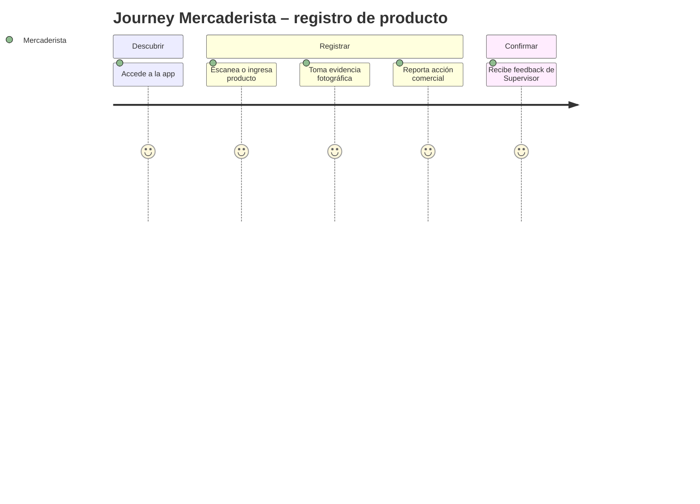
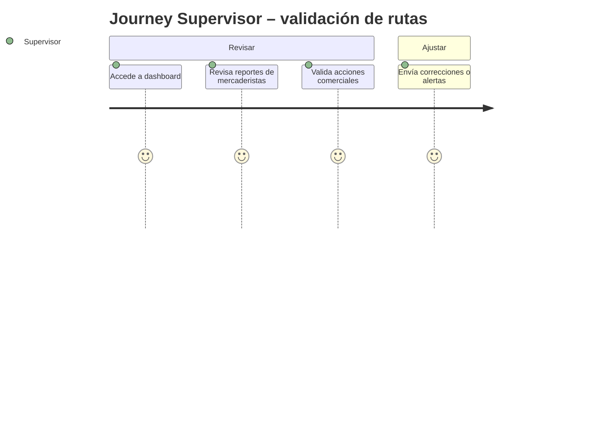

### PRD.md – Product Requirements Document

# PRD – App Detección Prod

## 0. Metadatos

| Campo                   | Valor                            |
| ----------------------- | -------------------------------- |
| Producto                | App Detección Prod               |
| Grupo                   | G07                              |
| Versión                 | v0.1                             |
| Fecha                   | 14/05/2026                       |
| Product Manager / Autor | Gina Fabiana Villanueva Viscarra |
| Revisores               | Docente + Tech Lead + QA         |
| Estado                  | Borrador                         |
| BRD de referencia       | BRD v0.1                         |
| MRD de referencia       | MRD v0.2                         |
| Insumos M2              | Wireframes y mockups M2          |
| Fase Spec Kit           | Specify ✅                        |
| Prompts utilizados      | PR-UC-001, PR-UC-002, PR-UC-003  |

## 1. Resumen del producto

App Detección Prod permite a **mercaderistas, vendedores, supervisores y gerentes** registrar, validar y analizar productos próximos a vencer, centralizando la información operativa y comercial para mejorar trazabilidad, reducir pérdidas y apoyar decisiones estratégicas basadas en datos.

## 2. Objetivos del producto

| ID    | Objetivo                                        | BRD vinculado | Métrica               | Meta  |
| ----- | ----------------------------------------------- | ------------- | --------------------- | ----- |
| OP-01 | Registrar productos críticos en la plataforma   | BR-001        | % registros digitales | 90 %  |
| OP-02 | Aplicar acciones comerciales de manera trazable | BR-003        | Acciones registradas  | 100 % |
| OP-03 | Controlar cambios de precio                     | BR-004        | Registro completo     | 100 % |
| OP-04 | Visualizar información en tiempo real           | BR-005        | Dashboard actualizado | 100 % |
| OP-05 | Generar alertas operativas                      | BR-006        | Alertas activas       | 95 %  |
| OP-06 | Generar indicadores estratégicos                | BR-007        | KPIs visibles         | 100 % |

## 3. Alcance (Scope)

### 3.1 Dentro del alcance (release v1.0)

* Registro de productos críticos
* Registro de acciones comerciales y promociones
* Control de cambios de precio
* Dashboard con KPIs y alertas
* Flujos de usuario para Mercaderista, Vendedor, Supervisor y Gerente

### 3.2 Fuera del alcance (backlog)

* Inventario completo
* ERP financiero y logística avanzada
* Facturación

### 3.3 Roadmap de versiones (Delivery track)

| Versión | Contenido                                         | Fecha objetivo |
| ------- | ------------------------------------------------- | -------------- |
| v1.0    | MVP: registro, validación, dashboard y alertas    | 30/06/2026     |
| v1.1    | Funcionalidades adicionales de reporte y análisis | 30/07/2026     |
| v2.0    | Integración con pagos QR y optimización de IA     | 30/08/2026     |

### 3.4 Roadmap de validación (Discovery track)

| Sprint | Hipótesis                                         | Método                 | Criterio de éxito              | Estado  |
| ------ | ------------------------------------------------- | ---------------------- | ------------------------------ | ------- |
| S1     | Mercaderistas adoptan la app en menos de 1 semana | Observación y encuesta | ≥ 70 % adopción                | abierta |
| S2     | Alertas predictivas reducen errores operativos    | POC + prueba de campo  | ≥ 80 % precisión               | abierta |
| S3     | Supervisores usan dashboard para validar rutas    | Feedback directo       | ≥ 90 % cobertura de validación | abierta |

## 4. Personas y user journeys

### 4.1 Personas (resumen)

* Mercaderista: registro de productos y evidencia
* Vendedor: consolidación y aplicación de acciones
* Supervisor: validación de reportes y control SLA
* Gerente: análisis estratégico y priorización

### 4.2 User journeys principales (mínimo 2)





## 5. User stories y criterios de aceptación

### Épica E1 – Gestión de productos críticos

| ID         | Historia                                                                                                              | Prioridad | Valor | Esfuerzo | Criterios Gherkin |
| ---------- | --------------------------------------------------------------------------------------------------------------------- | --------- | ----- | -------- | ----------------- |
| PRD-US-001 | Como mercaderista, quiero registrar productos próximos a vencer, para que supervisores y gerentes tengan visibilidad  | Must      | 10    | 5        | FSD-UC-001        |
| PRD-US-002 | Como vendedor, quiero consolidar información de mercaderistas, para aplicar promociones correctas                     | Must      | 8     | 4        | FSD-UC-002        |
| PRD-US-003 | Como supervisor, quiero validar reportes de mercaderistas y vendedores, para controlar SLA y precisión                | Must      | 9     | 5        | FSD-UC-003        |
| PRD-US-004 | Como gerente, quiero analizar indicadores estratégicos, para tomar decisiones de priorización y reducción de pérdidas | Must      | 10    | 5        | FSD-UC-004        |

### 5.1 Criterios Gherkin – PRD-US-001

```gherkin
Escenario: Mercaderista registra producto crítico
  Dado el mercaderista autenticado
  Cuando registra un producto próximo a vencer con foto y cantidad
  Entonces el registro se refleja en la base y el supervisor recibe notificación
```

## 6. Priorización

| Método | Ranking                              |
| ------ | ------------------------------------ |
| MoSCoW | Must > Should > Could > Won't        |
| RICE   | Reach × Impact × Confidence ÷ Effort |

## 7. Requerimientos funcionales

| ID          | Requisito                             | Historia(s) | Prioridad |
| ----------- | ------------------------------------- | ----------- | --------- |
| PRD-REQ-001 | Registro de productos críticos        | PRD-US-001  | Must      |
| PRD-REQ-002 | Consolidación de acciones comerciales | PRD-US-002  | Must      |
| PRD-REQ-003 | Validación de reportes                | PRD-US-003  | Must      |
| PRD-REQ-004 | Visualización de KPIs estratégicos    | PRD-US-004  | Must      |

## 8. Requerimientos no funcionales

| ID          | Categoría      | Requisito        | Métrica          | Umbral      |
| ----------- | -------------- | ---------------- | ---------------- | ----------- |
| PRD-NFR-001 | Rendimiento    | Latencia de API  | p95              | < 500 ms    |
| PRD-NFR-002 | Seguridad      | Cifrado de datos | AES-256          | Obligatorio |
| PRD-NFR-003 | Disponibilidad | Uptime           | Mensual ≥ 99.9 % | CloudWatch  |

## 9. Dependencias e integraciones

| Sistema                | Tipo    | Propósito          | Riesgo |
| ---------------------- | ------- | ------------------ | ------ |
| Sistema interno ERP    | Consumo | Datos de productos | Media  |
| Servicio de mensajería | Consumo | Notificaciones     | Alta   |

## 10. Supuestos y restricciones

* Supuestos: usuarios con smartphones, adopción de app.
* Restricciones: conectividad variable, dependencia de aprobaciones internas.

## 11. Experiencia de usuario

* Referencia a wireframes y mockups M2.
* Diseño por rol: mercaderista, vendedor, supervisor, gerente.

### 11.1 Trazabilidad con M2

| Wireframe                   | Pantalla PRD         | Estado |
| --------------------------- | -------------------- | ------ |
| Wireframe_registro_producto | Registro producto    | ✅      |
| Wireframe_dashboard         | Dashboard supervisor | ✅      |

## 12. Métricas de éxito

* North Star: % productos críticos gestionados correctamente
* KPIs secundarios: reducción de devoluciones, tiempo de validación, trazabilidad completa

## 13. Riesgos del producto

| Riesgo                          | Probabilidad | Impacto | Mitigación                     |
| ------------------------------- | ------------ | ------- | ------------------------------ |
| Baja adopción por mercaderistas | Media        | Alto    | Capacitación, UI simplificada  |
| Errores en consolidación        | Media        | Alto    | Validación automática, alertas |

## 14. Trazabilidad

| PRD ID      | BRD    | MRD      | FSD        |
| ----------- | ------ | -------- | ---------- |
| PRD-REQ-001 | BR-001 | MRD-N-01 | FSD-UC-001 |
| PRD-REQ-002 | BR-003 | MRD-N-02 | FSD-UC-002 |
| PRD-REQ-003 | BR-002 | MRD-N-03 | FSD-UC-003 |
| PRD-REQ-004 | BR-007 | MRD-N-04 | FSD-UC-004 |

## 15. Anexos

* Transcripción de entrevistas
* Wireframes / mockups
* Análisis de riesgos

## 16. Registro de cambios

| Versión | Fecha      | Autor                            | Cambio                                                                                   |
| ------- | ---------- | -------------------------------- | ---------------------------------------------------------------------------------------- |
| v0.1    | 14/05/2026 | Gina Fabiana Villanueva Viscarra | Versión inicial con 4 actores actualizados (mercaderista, vendedor, supervisor, gerente) |
