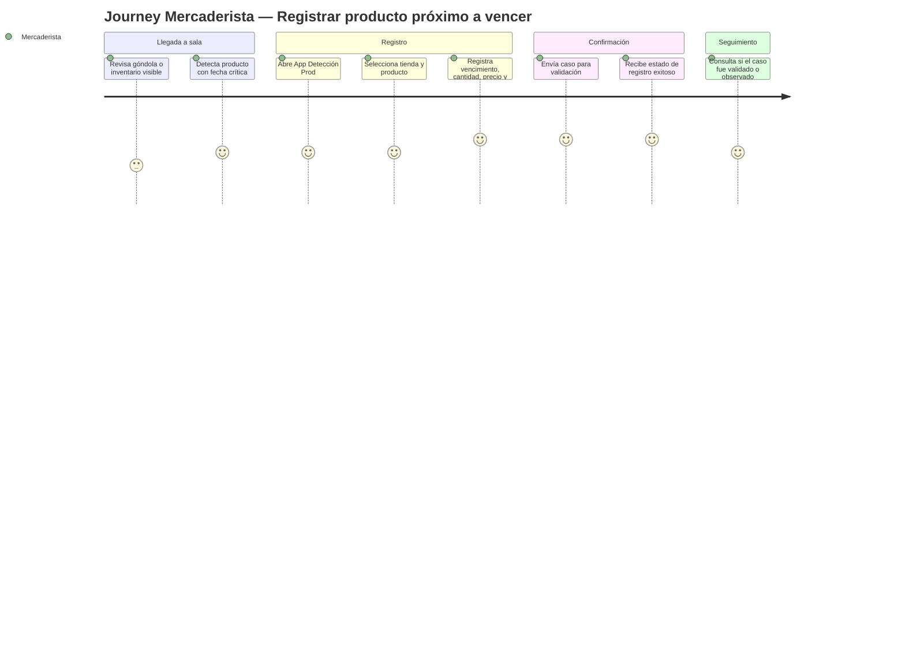
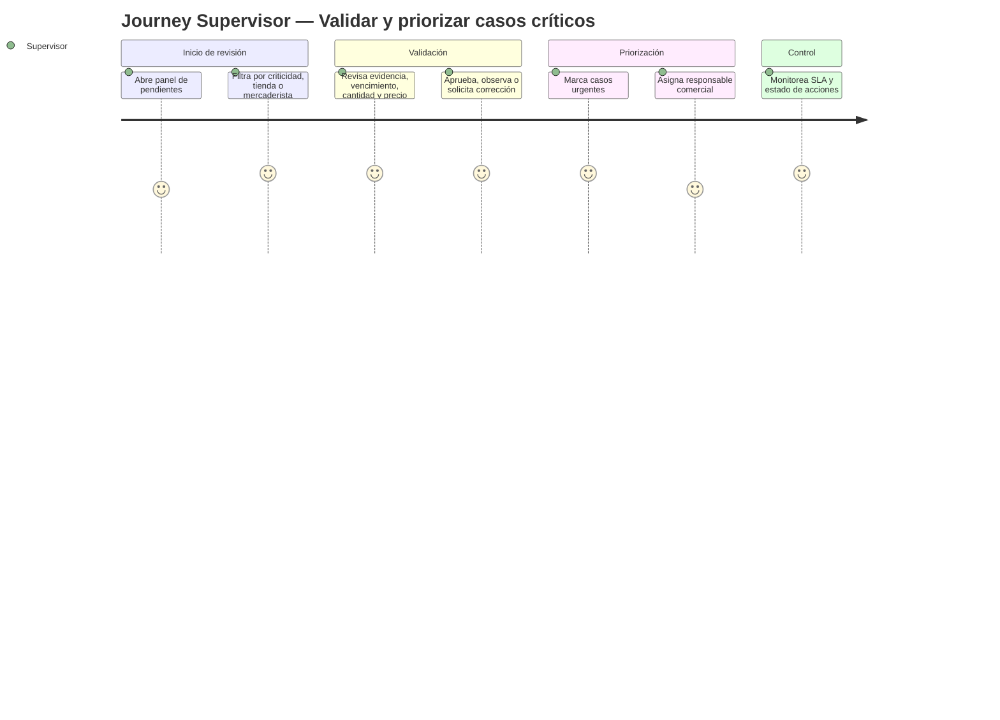
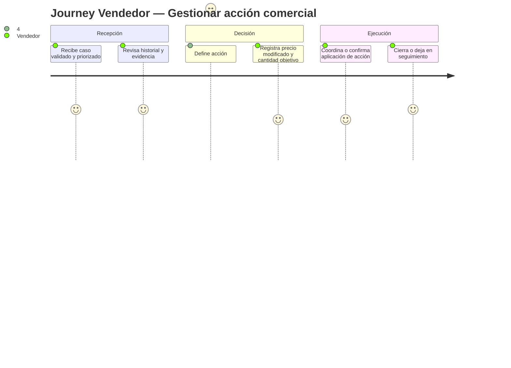
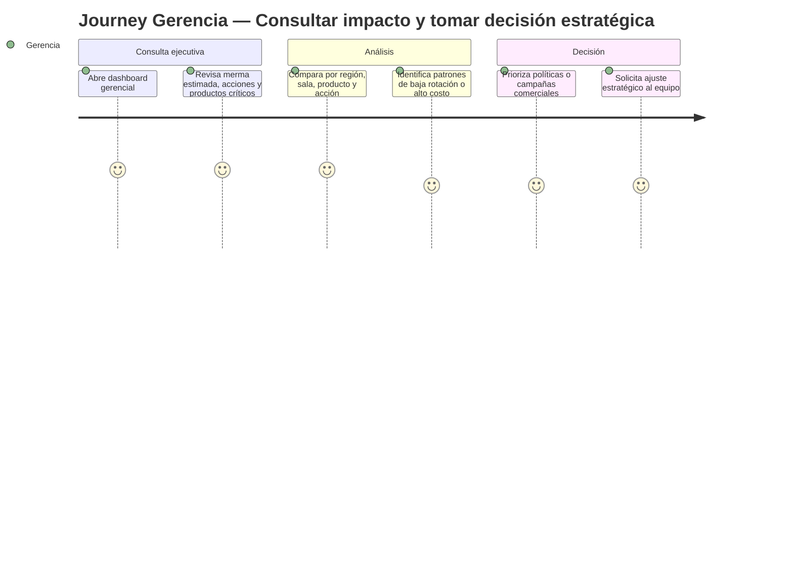

# Product Requirements Document (PRD) vFinal — App Detección Prod

> **Ubicación sugerida en el repositorio:** `docs/prd/PRD_vFinal.md`  
> **Estado:** `APROBADO`  
> **Versión:** `vFinal-2.0.0`  
> **Release objetivo:** `release/2.0.0`  
> **Documentos padre aprobados:** `docs/brd/BRD_vFinal.md` y `docs/mrd/MRD_vFinal.md`  
> **Cadena de trazabilidad:** `BRD → MRD → PRD → FSD → DTI → ADR/POC/PROMPT_MAPPING`  
> **Propósito:** especificar qué debe hacer App Detección Prod para resolver las necesidades de negocio y mercado validadas, sin entrar aún al diseño técnico detallado.

---

## 0. Metadatos

| Campo | Valor |
|---|---|
| Producto | **App Detección Prod** |
| Tipo de producto | Plataforma digital de detección, trazabilidad, gestión comercial e inteligencia operativa para productos próximos a vencer en canal retail |
| Organización objetivo | Empresas distribuidoras e importadoras con operación en supermercados, micromercados, farmacias y tiendas especializadas |
| Grupo | Proyecto académico — Maestría en Desarrollo de Productos de Software con IA |
| Versión | `vFinal-2.0.0` |
| Fecha | 26/05/2026 |
| Autora | Gina Fabiana Villanueva Viscarra |
| Estado | Aprobado |
| BRD de referencia | `docs/brd/BRD_vFinal.md` — aprobado |
| MRD de referencia | `docs/mrd/MRD_vFinal.md` — aprobado |
| Insumos M2 UX/UI | Consigna M2, plan de investigación, entrevistas a gerente, supervisor y vendedor, hipótesis, perfiles y hallazgos de investigación |
| Fase Spec Kit cubierta | Specify ✅ / Plan parcial ⬜ / Tasks parcial ⬜ / Implement ⬜ |
| Prompts utilizados | `PR-PRD-001` pendiente de registrar en `docs/PROMPT_MAPPING.md` |
| Documentos hijos esperados | `docs/fsd/FSD_vFinal.md`, `docs/DTI.md`, `docs/adr/*`, `pocs/*`, `docs/prompts/*` |

---

## 0.1 Constitution del producto

Estos principios son invariantes de producto. Toda historia, caso de uso, pantalla, prompt, POC o decisión arquitectónica posterior debe respetarlos.

1. **Trazabilidad antes que velocidad aparente.** Ningún producto próximo a vencer puede avanzar de estado sin registrar quién actuó, cuándo, sobre qué producto, en qué tienda, con qué evidencia y bajo qué acción comercial.
2. **Campo simple, gerencia informada.** La experiencia del mercaderista debe minimizar carga cognitiva; la experiencia de gerencia debe maximizar visibilidad consolidada y lectura ejecutiva.
3. **Decisiones comerciales auditables.** Descuentos, bandeos, retiros, promociones, cambios y modificaciones de precio deben quedar vinculados a un caso, un responsable y un resultado medible.
4. **IA asistiva, no autónoma en decisiones críticas.** La IA puede clasificar riesgo, priorizar alertas y sugerir acciones, pero no puede aprobar descuentos, retiros, cambios ni decisiones financieras sin intervención humana.
5. **Métricas desde el diseño.** Cada flujo crítico debe producir datos para medir tiempo de validación, merma evitada, productos intervenidos, acciones aplicadas e impacto financiero.
6. **Fuente única de verdad.** El sistema debe reemplazar la dispersión de WhatsApp/Excel como repositorio operativo, no convertirse en otro canal paralelo sin gobierno.
7. **Operación con conectividad variable.** Los flujos de campo deben tolerar pérdida temporal de conexión y permitir recuperación controlada sin duplicar registros ni perder evidencia.

---

## 1. Resumen del producto

**App Detección Prod** es una plataforma digital diseñada para transformar la gestión de productos próximos a vencer en empresas distribuidoras e importadoras del canal retail. El producto centraliza el registro de productos detectados en sala, evidencia visual, fecha de vencimiento, cantidad, precio actual, precio modificado, acción comercial aplicada, responsable y estado de seguimiento.

El problema que resuelve no es únicamente operativo; es una brecha de negocio entre el trabajo de campo y la toma de decisiones comerciales. Hoy la información se distribuye por WhatsApp, Excel y comunicación verbal, generando incertidumbre, validación manual, pérdida de trazabilidad, demoras y decisiones comerciales sin medición de impacto.

El producto está orientado a cuatro perfiles principales: mercaderistas que registran productos en campo, vendedores que gestionan acciones comerciales, supervisores que validan y priorizan casos, y gerencia comercial que necesita información consolidada para medir rentabilidad, rotación, merma e impacto financiero.

El valor diferencial de App Detección Prod es integrar en un solo flujo la detección operativa, la gestión comercial, el control de precios/cantidades, la visibilidad ejecutiva y la auditoría de decisiones. La solución busca reducir merma, disminuir tiempos de validación, mejorar coordinación entre roles y convertir datos de campo en inteligencia comercial accionable.

---

## 2. Objetivos del producto

| ID | Objetivo del producto | BRD vinculado | MRD vinculado | Métrica | Meta vFinal / MVP |
|---|---|---|---|---|---|
| OP-01 | Centralizar el registro de productos próximos a vencer con evidencia estructurada | BO-01, BR-001 | MRD-N-01 | % de productos críticos registrados en sistema | ≥ 80 % de casos críticos registrados en sistema |
| OP-02 | Reducir el tiempo de validación del supervisor | BO-02, BR-002 | MRD-N-02 | Tiempo medio de validación | -30 % respecto a línea base manual |
| OP-03 | Asegurar trazabilidad de acciones comerciales aplicadas | BO-03, BR-003 | MRD-N-03 | % de acciones con responsable, fecha, precio y cantidad | ≥ 90 % de acciones completas |
| OP-04 | Entregar visibilidad ejecutiva a gerencia sin intervención manual | BO-04, BR-004 | MRD-N-04 | Tiempo de generación de reporte ejecutivo | ≤ 5 minutos para dashboard actualizado |
| OP-05 | Generar alertas tempranas por vencimiento, criticidad y estado pendiente | BO-05, BR-005 | MRD-N-05 | % de alertas críticas notificadas antes del umbral | ≥ 85 % |
| OP-06 | Medir impacto financiero inicial por producto, sala y acción | BO-06, BR-006 | MRD-N-06 | % de acciones con impacto estimado registrado | ≥ 70 % en MVP |
| OP-07 | Incorporar IA asistiva con guardrails para clasificación de riesgo | BO-07, BR-007 | MRD-N-07 | % de clasificaciones con explicación y trazabilidad | ≥ 90 % de outputs válidos |
| OP-08 | Reducir dependencia operativa de WhatsApp y Excel | BO-08, BR-008 | MRD-N-08 | % de casos gestionados fuera de canales informales | ≥ 75 % de casos críticos |

---

## 3. Alcance

### 3.1 Dentro del alcance — release v2.0.0 académico

1. Registro estructurado de productos próximos a vencer.
2. Captura de evidencia visual asociada al producto y sala.
3. Registro de fecha de vencimiento, lote opcional, cantidad, precio actual y tienda.
4. Clasificación inicial de criticidad por días al vencimiento, cantidad e impacto estimado.
5. Flujo de validación del supervisor.
6. Registro de acción comercial: descuento, bandeo, promoción, retiro, cambio, reposición o seguimiento.
7. Registro de precio modificado y cantidad intervenida.
8. Estados del caso: registrado, pendiente de validación, validado, observado, en acción, ejecutado, cerrado, vencido/no recuperado.
9. Dashboard táctico para supervisor.
10. Dashboard ejecutivo para gerencia comercial.
11. Alertas por productos críticos, pendientes y próximos a vencer.
12. Historial de decisiones y auditoría por caso.
13. Matriz de trazabilidad hacia FSD y DTI.
14. Prompt-contratos para casos críticos con IA asistiva.
15. Requerimientos no funcionales medibles.
16. Preparación para POCs de rendimiento e IA.

### 3.2 Fuera del alcance — backlog posterior

| Elemento fuera de alcance | Justificación |
|---|---|
| Integración directa con ERP real de inventario | Requiere acceso a sistemas externos y contratos técnicos no disponibles en el módulo |
| Automatización completa de aprobación financiera | Implica políticas internas y controles formales todavía no validados |
| Motor avanzado de predicción de demanda | Requiere datos históricos robustos y modelado estadístico posterior |
| Aplicación offline completa con sincronización bidireccional compleja | Se declara como requisito futuro; el MVP debe soportar recuperación básica controlada |
| Integración con facturación, contabilidad o notas de crédito | Pertenece a fases posteriores por riesgo financiero y normativo |
| Recomendación automática de porcentaje exacto de descuento | Riesgo alto; la IA solo sugiere prioridad o tipo de acción bajo revisión humana |
| Portal externo para clientes retail | El primer release prioriza uso interno de la distribuidora/importadora |
| Optimización logística de retiros | Puede derivarse del producto, pero no es core del MVP |

### 3.3 Roadmap de versiones

| Versión | Contenido | Fecha objetivo académica / lógica |
|---|---|---|
| v0.1 Discovery | BRD, MRD, insights, entrevistas, hipótesis, perfiles y problema | Completado en M2/M4 |
| v1.0 Especificación | PRD, FSD, DTI inicial, ADRs base y diagramas C4 | Avance intermedio |
| v2.0 Final académico | Documentación final trazable, POCs, prompts, AGENTS, diagramas y defensa | `release/2.0.0` |
| v2.1 MVP funcional | Implementación mínima del registro, validación y dashboard básico | Siguiente iteración |
| v3.0 Producto piloto | Integraciones, métricas reales, IA controlada y despliegue cloud | Piloto empresarial |

### 3.4 Roadmap de validación — Discovery track

| Sprint / Semana | Hipótesis a validar | Método | Criterio de éxito | Estado |
|---|---|---|---|---|
| S1 | Los mercaderistas pueden registrar un producto crítico en menos de 2 minutos | Test de prototipo + observación | ≥ 80 % completa la tarea sin ayuda | Pendiente |
| S2 | El supervisor reduce tiempo de validación usando vista centralizada | Simulación con casos históricos | -30 % tiempo vs. WhatsApp/Excel | Pendiente |
| S3 | Gerencia entiende los KPIs sin explicación operativa detallada | Prueba de dashboard con gerente | ≥ 4/5 claridad percibida | Pendiente |
| S4 | Vendedor puede decidir acción comercial con datos suficientes | Test de flujo con vendedor | ≥ 80 % decisiones con confianza reportada | Pendiente |
| S5 | La IA clasifica riesgo sin tomar decisiones comerciales irreversibles | POC IA + evaluación humana | ≥ 85 % consistencia y 0 acciones no autorizadas | Pendiente |

---

## 4. Personas y user journeys

### 4.1 Personas principales

| Persona | Rol | Necesidad principal | Dolor actual | Éxito esperado |
|---|---|---|---|---|
| Mercaderista de ruta | Usuario operativo primario | Registrar productos próximos a vencer de forma rápida y clara | Reporta por WhatsApp, fotos dispersas, sin estructura ni feedback | Reportar en pocos pasos y saber que el caso queda trazado |
| Vendedor canal moderno | Usuario comercial ejecutor | Decidir o gestionar acciones comerciales con información confiable | Decide con incertidumbre, revisa múltiples chats, pierde oportunidades | Ver estado, historial y acción pendiente por producto |
| Supervisor regional | Usuario táctico validador | Validar, priorizar y controlar ejecución del equipo | Pierde horas verificando datos y siente pérdida de control | Validar rápido, ver prioridades y reducir errores |
| Gerente comercial | Usuario ejecutivo informado | Ver KPIs, impacto financiero, rotación y merma | No cuenta con datos centralizados ni impacto real de acciones | Dashboard ejecutivo confiable para decidir y priorizar |
| Administración / Finanzas | Usuario de control | Medir impacto, costos, devolución y ahorro | Datos no trazables para evaluar rentabilidad | Reportes auditables por acción y producto |

### 4.2 Journey principal — mercaderista registra producto próximo a vencer



### 4.3 Journey principal — supervisor valida y prioriza



### 4.4 Journey principal — vendedor gestiona acción comercial



### 4.5 Journey principal — gerencia consulta desempeño



---

## 5. User stories y criterios de aceptación

> Formato: Como `<rol>`, quiero `<acción>` para `<beneficio>`.  
> Priorización inicial: Must / Should / Could / Won't.  
> Todas las historias Must deben alimentar el FSD vFinal.

### 5.1 Épica E1 — Registro operativo de productos próximos a vencer

| ID | Historia | Prioridad | Valor | Esfuerzo | Criterio resumido |
|---|---|---|---:|---:|---|
| PRD-US-001 | Como mercaderista, quiero registrar un producto próximo a vencer con foto, tienda, cantidad, precio y fecha para que el caso quede trazado. | Must | 10 | 5 | Registro completo queda en estado pendiente de validación |
| PRD-US-002 | Como mercaderista, quiero buscar o seleccionar el producto de forma rápida para no perder tiempo en sala. | Must | 8 | 3 | Producto seleccionable por nombre, categoría o código |
| PRD-US-003 | Como mercaderista, quiero adjuntar evidencia visual obligatoria para respaldar el reporte. | Must | 9 | 3 | No se envía caso crítico sin evidencia mínima |
| PRD-US-004 | Como mercaderista, quiero guardar un borrador temporal si tengo conectividad inestable para no perder el reporte. | Should | 7 | 5 | Borrador recuperable y marcado como pendiente de sincronización |
| PRD-US-005 | Como mercaderista, quiero saber si mi reporte fue validado, observado o cerrado para recibir retroalimentación. | Should | 7 | 3 | Historial visible por caso reportado |

#### 5.1.1 Criterio PRD-US-001

```gherkin
Escenario: Registro completo de producto próximo a vencer
  Dado que el mercaderista está autenticado
  Y seleccionó una tienda válida
  Cuando registra producto, fecha de vencimiento, cantidad, precio actual y evidencia visual
  Entonces el sistema crea un caso en estado PENDIENTE_VALIDACION
  Y registra fecha, hora, usuario y tienda
  Y deja el caso disponible para revisión del supervisor
```

### 5.2 Épica E2 — Validación y priorización supervisora

| ID | Historia | Prioridad | Valor | Esfuerzo | Criterio resumido |
|---|---|---|---:|---:|---|
| PRD-US-006 | Como supervisor, quiero ver casos pendientes por criticidad para priorizar los productos de mayor riesgo. | Must | 10 | 5 | Lista ordenada por urgencia, días al vencimiento y cantidad |
| PRD-US-007 | Como supervisor, quiero validar, observar o rechazar un reporte para asegurar calidad de datos. | Must | 10 | 5 | Cada decisión queda auditada con motivo |
| PRD-US-008 | Como supervisor, quiero solicitar corrección al mercaderista cuando falte información para evitar decisiones erróneas. | Must | 8 | 3 | Caso vuelve a estado OBSERVADO con comentario obligatorio |
| PRD-US-009 | Como supervisor, quiero asignar un responsable comercial a un caso validado para acelerar la acción. | Should | 8 | 3 | Caso queda asignado a vendedor o equipo comercial |
| PRD-US-010 | Como supervisor, quiero ver SLA de casos pendientes para evitar que productos críticos queden sin acción. | Should | 8 | 5 | Alertas por vencimiento de SLA |

#### 5.2.1 Criterio PRD-US-007

```gherkin
Escenario: Supervisor valida un reporte con datos suficientes
  Dado que existe un caso en estado PENDIENTE_VALIDACION
  Y el caso contiene evidencia, vencimiento, cantidad, precio y tienda
  Cuando el supervisor selecciona VALIDAR
  Entonces el sistema cambia el estado a VALIDADO
  Y registra usuario, fecha, hora y decisión
  Y habilita el caso para gestión comercial
```

### 5.3 Épica E3 — Gestión de acción comercial

| ID | Historia | Prioridad | Valor | Esfuerzo | Criterio resumido |
|---|---|---|---:|---:|---|
| PRD-US-011 | Como vendedor, quiero ver productos validados pendientes de acción para decidir qué hacer primero. | Must | 10 | 5 | Vista por prioridad, tienda, producto y fecha |
| PRD-US-012 | Como vendedor, quiero registrar la acción comercial aplicada para dejar evidencia de la decisión. | Must | 10 | 5 | Acción, responsable, cantidad y estado obligatorios |
| PRD-US-013 | Como vendedor, quiero registrar precio actual y precio modificado para medir impacto de descuento. | Must | 9 | 3 | Precio modificado validado contra reglas de negocio |
| PRD-US-014 | Como vendedor, quiero consultar historial del producto para no duplicar acciones. | Should | 8 | 3 | Historial por producto, tienda y periodo |
| PRD-US-015 | Como vendedor, quiero cerrar un caso cuando la acción fue ejecutada para liberar seguimiento operativo. | Must | 9 | 3 | Cierre exige resultado y evidencia mínima |

#### 5.3.1 Criterio PRD-US-012

```gherkin
Escenario: Registro de acción comercial aplicada
  Dado que existe un caso VALIDADO
  Cuando el vendedor registra una acción comercial permitida
  Y especifica cantidad intervenida, precio modificado si aplica y comentario
  Entonces el sistema cambia el caso a EN_ACCION o EJECUTADO según corresponda
  Y registra la acción en el historial auditable del caso
```

### 5.4 Épica E4 — Dashboard táctico y ejecutivo

| ID | Historia | Prioridad | Valor | Esfuerzo | Criterio resumido |
|---|---|---|---:|---:|---|
| PRD-US-016 | Como supervisor, quiero un dashboard táctico por tienda, mercaderista y criticidad para controlar operación. | Must | 9 | 5 | Panel muestra pendientes, validados, observados y ejecutados |
| PRD-US-017 | Como gerencia comercial, quiero ver KPIs de merma, rotación, acciones e impacto financiero para tomar decisiones. | Must | 10 | 8 | Dashboard ejecutivo con filtros y métricas consolidadas |
| PRD-US-018 | Como gerencia comercial, quiero comparar productos, salas o regiones para priorizar acciones estratégicas. | Should | 8 | 5 | Comparativos por periodo, región, sala y categoría |
| PRD-US-019 | Como finanzas, quiero exportar reportes auditables para analizar costos y ahorros. | Should | 7 | 5 | Exportación con filtros y metadatos |
| PRD-US-020 | Como gerencia, quiero recibir alertas resumidas de productos críticos para no depender de reportes manuales. | Could | 7 | 5 | Resumen semanal o diario configurable |

#### 5.4.1 Criterio PRD-US-017

```gherkin
Escenario: Gerencia consulta dashboard ejecutivo
  Dado que existen casos registrados, acciones comerciales y cierres
  Cuando gerencia accede al dashboard ejecutivo
  Entonces visualiza productos críticos, acciones aplicadas, merma estimada e impacto financiero
  Y puede filtrar por región, tienda, categoría, producto y periodo
```

### 5.5 Épica E5 — Alertas, priorización e IA asistiva

| ID | Historia | Prioridad | Valor | Esfuerzo | Criterio resumido |
|---|---|---|---:|---:|---|
| PRD-US-021 | Como supervisor, quiero recibir alertas de productos con vencimiento crítico para actuar antes de la pérdida. | Must | 10 | 5 | Alerta según umbral configurable |
| PRD-US-022 | Como vendedor, quiero ver prioridad sugerida para ordenar mi trabajo comercial. | Should | 8 | 5 | Prioridad explicable por días, cantidad e impacto |
| PRD-US-023 | Como usuario autorizado, quiero que la IA clasifique riesgo sin aprobar acciones para apoyar decisiones humanas. | Should | 8 | 8 | IA produce clasificación y explicación sin ejecutar cambios |
| PRD-US-024 | Como auditor, quiero revisar outputs de IA y acciones tomadas para controlar riesgos de recomendación. | Could | 7 | 5 | Log de prompt, versión, output, usuario y decisión humana |
| PRD-US-025 | Como administrador, quiero configurar umbrales de criticidad por categoría para adaptar reglas de negocio. | Should | 8 | 5 | Umbrales auditables y versionados |

#### 5.5.1 Criterio PRD-US-023

```gherkin
Escenario: IA clasifica riesgo sin ejecutar decisión comercial
  Dado que existe un caso validado con vencimiento, cantidad, precio e historial
  Cuando el usuario solicita clasificación asistida
  Entonces el sistema muestra riesgo BAJO, MEDIO o ALTO con explicación
  Y no modifica estado, precio ni acción comercial sin confirmación humana
```

---

## 6. Priorización

### 6.1 MoSCoW

| Prioridad | Historias | Justificación |
|---|---|---|
| Must | PRD-US-001, 002, 003, 006, 007, 008, 011, 012, 013, 015, 016, 017, 021 | Constituyen el flujo mínimo trazable: registrar, validar, accionar, consultar y alertar |
| Should | PRD-US-004, 005, 009, 010, 014, 018, 019, 022, 023, 025 | Mejoran eficiencia, análisis e inteligencia del producto |
| Could | PRD-US-020, 024 | Valiosos para madurez operativa y auditoría avanzada |
| Won't | Integración ERP completa, predicción avanzada, portal externo retail | Fuera del alcance académico de v2.0.0 |

### 6.2 RICE de las 10 historias top

| ID | Reach | Impact | Confidence | Effort | RICE | Ranking |
|---|---:|---:|---:|---:|---:|---:|
| PRD-US-001 | 100 | 3.0 | 90 % | 5 | 54.0 | 1 |
| PRD-US-007 | 80 | 3.0 | 90 % | 5 | 43.2 | 2 |
| PRD-US-012 | 80 | 3.0 | 85 % | 5 | 40.8 | 3 |
| PRD-US-017 | 30 | 3.0 | 90 % | 8 | 10.1 | 4 |
| PRD-US-021 | 80 | 2.0 | 80 % | 5 | 25.6 | 5 |
| PRD-US-006 | 50 | 2.0 | 85 % | 5 | 17.0 | 6 |
| PRD-US-013 | 60 | 2.0 | 80 % | 3 | 32.0 | 7 |
| PRD-US-016 | 40 | 2.0 | 85 % | 5 | 13.6 | 8 |
| PRD-US-023 | 40 | 1.5 | 70 % | 8 | 5.3 | 9 |
| PRD-US-004 | 60 | 1.5 | 70 % | 5 | 12.6 | 10 |

> Nota: el ranking real deberá recalcularse con volumen de usuarios, frecuencia de visitas y datos reales de operación. Para el release académico, se prioriza el flujo completo por coherencia de trazabilidad.

---

## 7. Requerimientos funcionales de alto nivel

| ID | Requisito funcional | Historias relacionadas | Prioridad | Salida esperada al FSD |
|---|---|---|---|---|
| PRD-REQ-001 | El sistema debe permitir registrar productos próximos a vencer con tienda, producto, vencimiento, cantidad, precio y evidencia. | PRD-US-001, 002, 003 | Must | FSD-UC-001 |
| PRD-REQ-002 | El sistema debe permitir guardar y recuperar borradores por conectividad variable. | PRD-US-004 | Should | FSD-UC-001 flujo alterno |
| PRD-REQ-003 | El sistema debe permitir al supervisor validar, observar o rechazar reportes. | PRD-US-006, 007, 008 | Must | FSD-UC-002 |
| PRD-REQ-004 | El sistema debe calcular o asignar criticidad inicial según reglas configurables. | PRD-US-006, 021, 025 | Must | FSD-UC-006 |
| PRD-REQ-005 | El sistema debe permitir asignar responsable comercial a casos validados. | PRD-US-009, 011 | Should | FSD-UC-002 / FSD-UC-003 |
| PRD-REQ-006 | El sistema debe permitir registrar acción comercial aplicada. | PRD-US-012, 015 | Must | FSD-UC-003 |
| PRD-REQ-007 | El sistema debe registrar precio actual, precio modificado y cantidad intervenida. | PRD-US-013 | Must | FSD-UC-003 |
| PRD-REQ-008 | El sistema debe mantener historial auditable de estados, acciones y responsables. | PRD-US-014, 015, 024 | Must | FSD-UC-008 |
| PRD-REQ-009 | El sistema debe proveer dashboard táctico para supervisores. | PRD-US-016 | Must | FSD-UC-005 |
| PRD-REQ-010 | El sistema debe proveer dashboard ejecutivo para gerencia comercial. | PRD-US-017, 018, 020 | Must | FSD-UC-005 |
| PRD-REQ-011 | El sistema debe emitir alertas por vencimiento, criticidad o SLA. | PRD-US-010, 021 | Must | FSD-UC-006 |
| PRD-REQ-012 | El sistema debe permitir clasificación de riesgo asistida por IA sin ejecutar acciones automáticas. | PRD-US-022, 023, 024 | Should | FSD-UC-007 |
| PRD-REQ-013 | El sistema debe permitir reportes exportables para análisis de finanzas. | PRD-US-019 | Should | FSD-UC-005 |
| PRD-REQ-014 | El sistema debe permitir configuración de reglas de criticidad por categoría o política comercial. | PRD-US-025 | Should | FSD-UC-006 |
| PRD-REQ-015 | El sistema debe registrar auditoría de prompts, versiones y outputs IA cuando se use la capa asistiva. | PRD-US-023, 024 | Should | FSD-UC-007 / DTI §22 |

---

## 8. Requerimientos no funcionales de alto nivel

| ID | Categoría | Requerimiento | Métrica | Umbral objetivo | Se detalla en |
|---|---|---|---|---|---|
| PRD-NFR-001 | Rendimiento | Registro de producto debe responder rápidamente en condiciones normales | Latencia p95 | ≤ 500 ms sin carga extrema | FSD §10 / POC-01 |
| PRD-NFR-002 | Disponibilidad | El sistema debe estar disponible durante jornada comercial | Uptime mensual | ≥ 99.5 % MVP / ≥ 99.9 % futuro | DTI §8 / §15 |
| PRD-NFR-003 | Usabilidad | Registro de producto crítico debe completarse con baja carga cognitiva | Tiempo de tarea | ≤ 2 minutos en prueba de usuario | FSD §9 / UX |
| PRD-NFR-004 | Seguridad | Acceso por roles y permisos mínimos | % endpoints protegidos | 100 % de flujos críticos | DTI §13 |
| PRD-NFR-005 | Auditoría | Toda acción crítica debe dejar trazabilidad | % acciones auditadas | 100 % | FSD §10 / DTI §22 |
| PRD-NFR-006 | Observabilidad | Cada caso crítico debe tener identificador de correlación | % transacciones con traceId | 100 % | DTI §14 |
| PRD-NFR-007 | Integridad | No deben existir casos cerrados sin acción o motivo | % cierres válidos | 100 % | FSD reglas de negocio |
| PRD-NFR-008 | Escalabilidad | Debe soportar crecimiento por rutas, tiendas y productos | Throughput inicial | Por validar en POC | POC-01 |
| PRD-NFR-009 | IA segura | La IA no debe ejecutar decisiones comerciales irreversibles | Violaciones de guardrail | 0 en pruebas | POC-02 / DTI §9 |
| PRD-NFR-010 | Privacidad | Evidencias visuales y datos sensibles deben tener control de acceso | % recursos con control RBAC | 100 % | DTI §13 |
| PRD-NFR-011 | Mantenibilidad | Reglas de criticidad deben evolucionar sin romper todo el sistema | Tiempo de cambio | Regla ajustable sin redeploy mayor futuro | DTI / ADR |
| PRD-NFR-012 | Resiliencia | La pérdida temporal de conectividad no debe destruir el registro en curso | % borradores recuperados | ≥ 95 % en pruebas | FSD flujo alterno |

---

## 9. Dependencias e integraciones

| Sistema / Área | Tipo | Propósito | Riesgo | Estrategia inicial |
|---|---|---|---|---|
| Catálogo de productos | Integración futura / carga inicial | Identificar productos, categorías, marcas y códigos | Medio | Carga manual controlada o CSV inicial |
| Catálogo de tiendas / salas | Integración futura / carga inicial | Asociar reportes a punto de venta | Medio | Maestro inicial administrado |
| ERP / inventario | Integración futura | Validar stock, reposición, costo y devolución | Alto | Fuera de alcance MVP; diseñar seam en DTI |
| Sistema de precios | Integración futura | Validar precio base y precio modificado | Alto | Registro manual controlado en MVP |
| BI corporativo | Integración futura | Explotación gerencial avanzada | Medio | Exportación o API futura |
| WhatsApp actual | Canal existente | Fuente informal de transición | Medio | No integrar al inicio; plan de adopción para reemplazo gradual |
| Equipo de finanzas | Dependencia organizacional | Definir costos, margen, devolución, reposición | Alto | Taller de reglas de negocio |
| Equipo comercial | Dependencia organizacional | Definir acciones permitidas y aprobación | Alto | RACI + políticas configurables |
| Equipo TI | Dependencia técnica | Seguridad, usuarios, despliegue, soporte | Medio | AGENTS + DTI + ADRs |

---

## 10. Supuestos y restricciones

### 10.1 Supuestos

1. La empresa objetivo cuenta con mercaderistas que visitan puntos de venta de forma recurrente.
2. Los productos gestionados tienen fecha de vencimiento o ciclo de rotación sensible.
3. Los usuarios de campo usan smartphone, principalmente Android.
4. La conectividad en sala puede ser variable.
5. El negocio acepta pasar de reportes informales a una fuente única de verdad.
6. Gerencia necesita información consolidada, no participar en cada validación operativa.
7. Supervisores y vendedores pueden asumir roles diferenciados en validación y acción comercial.
8. El MVP puede iniciar sin integración ERP directa si conserva trazabilidad suficiente.
9. La IA será asistiva y estará sometida a revisión humana.
10. Las métricas financieras iniciales pueden comenzar como estimaciones y refinarse con datos reales.

### 10.2 Restricciones

| Restricción | Impacto |
|---|---|
| Proyecto académico con tiempo limitado | Priorizar documentación trazable y POCs críticas sobre producto completo |
| Datos reales limitados | Usar supuestos explícitos, métricas por validar y datasets sintéticos |
| Riesgo de adopción | Diseñar flujos simples para campo y valor visible para supervisión/gerencia |
| Falta de integración inicial con ERP | No prometer automatización total de inventario o costos |
| Decisiones comerciales sensibles | Requieren control humano y auditoría |
| Evidencia visual puede contener información sensible | Requiere seguridad, acceso por roles y política de retención |
| Uso de IA | Requiere guardrails, logs y límites de autonomía |

---

## 11. Experiencia de usuario

### 11.1 Principios UX derivados de M2

1. **Menos pasos en campo.** El mercaderista debe registrar lo esencial sin llenar formularios excesivos.
2. **Jerarquía por criticidad.** Supervisores y vendedores deben ver primero lo urgente.
3. **Una pantalla, una decisión.** Evitar pantallas con demasiada información mezclada.
4. **Estados visibles.** Todo caso debe mostrar claramente dónde está: pendiente, validado, observado, en acción o cerrado.
5. **Feedback inmediato.** El usuario debe saber si su acción se registró correctamente.
6. **Gerencia visual, no operativa.** Dashboard ejecutivo con KPIs, tendencias y filtros; no formularios operativos.
7. **Evidencia visual útil.** Las fotos deben estar vinculadas al caso y no quedar perdidas como en WhatsApp.
8. **Diseño mobile-first para campo.** Registro optimizado para smartphone.
9. **Diseño desktop/tablet para supervisión y gerencia.** Dashboards y validaciones con filtros.
10. **Accesibilidad básica.** Contraste, etiquetas claras, mensajes comprensibles y prevención de errores.

### 11.2 Pantallas principales esperadas

| Pantalla | Usuario principal | Casos cubiertos | Prioridad |
|---|---|---|---|
| Login / acceso | Todos | Autenticación y rol | Must |
| Inicio mercaderista | Mercaderista | Ver tareas y registrar producto | Must |
| Registro producto | Mercaderista | PRD-US-001, 002, 003 | Must |
| Mis reportes | Mercaderista | PRD-US-005 | Should |
| Bandeja supervisor | Supervisor | PRD-US-006, 007, 008 | Must |
| Detalle de caso | Supervisor / vendedor | Validación, historial, evidencia | Must |
| Bandeja comercial | Vendedor | PRD-US-011, 012, 013 | Must |
| Registro acción comercial | Vendedor | PRD-US-012, 013, 015 | Must |
| Dashboard táctico | Supervisor | PRD-US-016 | Must |
| Dashboard ejecutivo | Gerencia | PRD-US-017, 018 | Must |
| Configuración de reglas | Admin / supervisor autorizado | PRD-US-025 | Should |
| Auditoría IA | Auditor / TI / responsable | PRD-US-024 | Could |

### 11.3 Trazabilidad con M2 UX/UI

| Hallazgo M2 | Traducción en PRD | Historia / requisito |
|---|---|---|
| Reportes por WhatsApp son dispersos | Fuente única de registro estructurado | PRD-US-001 / PRD-REQ-001 |
| Fotos no siempre identifican producto o acción | Evidencia visual vinculada a caso, producto y tienda | PRD-US-003 |
| Supervisor pierde tiempo validando | Bandeja de validación con criticidad y datos completos | PRD-US-006, 007 |
| Vendedor decide con incertidumbre | Historial, estado y acción pendiente visibles | PRD-US-011, 014 |
| Gerencia carece de impacto financiero | Dashboard ejecutivo y KPIs | PRD-US-017, 018 |
| No se mide acción comercial | Registro de descuento/bandeo/retiro/precio/cantidad | PRD-US-012, 013 |
| Falta de alertas tempranas | Alertas por vencimiento y SLA | PRD-US-021 |
| Necesidad de arquitectura de información | Pantallas por rol y estados del caso | UX §11.2 |

---

## 12. Métricas de éxito del producto

### 12.1 North Star Metric

> **% de productos próximos a vencer críticos gestionados con acción trazable antes del umbral de vencimiento definido.**

Fórmula inicial:

```text
North Star = casos críticos con acción trazable antes del umbral / total de casos críticos registrados
```

Meta inicial v2.0 académico / MVP:

```text
≥ 80 % de casos críticos con acción trazable antes del umbral configurado
```

### 12.2 KPIs secundarios

| KPI | Definición | Línea base | Meta inicial | Fuente |
|---|---|---|---|---|
| KPI-01 Tiempo de registro | Tiempo desde apertura del formulario hasta envío | Por medir | ≤ 2 min | App / test UX |
| KPI-02 Tiempo de validación | Tiempo desde registro hasta decisión del supervisor | Manual: hasta horas/días | -30 % | App / auditoría |
| KPI-03 % reportes completos | Casos con foto, tienda, producto, vencimiento, cantidad y precio | Por medir | ≥ 90 % | App |
| KPI-04 % acciones trazables | Acciones con tipo, responsable, fecha, cantidad y precio | Por medir | ≥ 90 % | App |
| KPI-05 Productos vencidos sin acción | Casos críticos que llegan a vencimiento sin acción | Por medir | -25 % | App / inventario |
| KPI-06 Merma estimada evitada | Valor estimado de productos intervenidos antes de pérdida | Por medir | Línea base inicial | Finanzas |
| KPI-07 Adopción operativa | Usuarios activos / usuarios objetivo | Por medir | ≥ 75 % pilotos | App |
| KPI-08 Uso de WhatsApp para casos críticos | Casos críticos gestionados fuera de la app | Alto actual | -60 % | Encuesta / auditoría |
| KPI-09 Calidad de IA | Outputs válidos y trazables sobre total de solicitudes IA | N/A | ≥ 90 % | Logs IA |
| KPI-10 Violaciones de guardrails IA | Recomendaciones o acciones no permitidas | N/A | 0 | POC-02 |

---

## 13. Riesgos del producto

| Riesgo | Probabilidad | Impacto | Mitigación | Dueño |
|---|---|---|---|---|
| Baja adopción de mercaderistas por carga adicional | Media | Alto | Flujo mobile-first, pocos campos obligatorios, capacitación y feedback | Producto / UX |
| Supervisores siguen usando WhatsApp como canal paralelo | Alta | Alto | Gobierno de proceso, reportes oficiales solo desde app, adopción gradual | Operaciones |
| Datos financieros insuficientes para calcular impacto real | Media | Alto | Empezar con impacto estimado y evolucionar con Finanzas | Finanzas / Producto |
| Gerencia espera automatización total desde el MVP | Media | Medio | Alinear alcance, roadmap y dashboards iniciales | Product Owner |
| IA genera recomendaciones fuera de política | Media | Alto | Guardrails, human-in-the-loop, logs y POC de seguridad | Arquitectura / IA |
| Integración ERP se vuelve requisito bloqueante | Media | Alto | Diseñar MVP desacoplado con carga inicial y seam futuro | Arquitectura |
| Datos de productos mal registrados | Alta | Medio | Validaciones, catálogos, observaciones y reglas de completitud | Supervisor |
| Evidencias visuales exponen información sensible | Media | Alto | RBAC, almacenamiento seguro y política de retención | TI / Seguridad |
| Reglas de criticidad difieren por categoría | Alta | Medio | Configuración de umbrales por categoría | Producto / Comercial |
| Demasiadas funcionalidades en primer release | Media | Alto | Priorización MoSCoW y foco en flujo crítico | Product Owner |

---

## 14. Trazabilidad BRD → MRD → PRD

| BRD ID | MRD ID | PRD ID | Descripción |
|---|---|---|---|
| BR-001 | MRD-N-01 | PRD-REQ-001 | Centralizar registro de productos próximos a vencer |
| BR-002 | MRD-N-02 | PRD-REQ-003 | Reducir validación manual y mejorar calidad de datos |
| BR-003 | MRD-N-03 | PRD-REQ-006 | Registrar acción comercial aplicada |
| BR-004 | MRD-N-04 | PRD-REQ-010 | Visibilidad ejecutiva para gerencia |
| BR-005 | MRD-N-05 | PRD-REQ-011 | Alertas tempranas por vencimiento y criticidad |
| BR-006 | MRD-N-06 | PRD-REQ-007 / PRD-REQ-013 | Medición de impacto financiero |
| BR-007 | MRD-N-07 | PRD-REQ-012 / PRD-REQ-015 | IA asistiva con auditoría y guardrails |
| BR-008 | MRD-N-08 | PRD-REQ-008 | Trazabilidad y reducción de canales informales |

---

## 15. Mapeo PRD → FSD esperado

| PRD | Caso de uso FSD esperado | Prioridad | Observación |
|---|---|---|---|
| PRD-REQ-001 | FSD-UC-001 Registrar producto próximo a vencer | Must | Caso core del MVP |
| PRD-REQ-002 | FSD-UC-001 flujo alterno de borrador/sincronización | Should | Para conectividad variable |
| PRD-REQ-003 | FSD-UC-002 Validar reporte | Must | Supervisor como validador táctico |
| PRD-REQ-004 | FSD-UC-006 Generar alerta y criticidad | Must | Puede apoyarse en reglas configurables |
| PRD-REQ-005 | FSD-UC-002 / FSD-UC-003 Asignar responsable | Should | Une validación y acción comercial |
| PRD-REQ-006 | FSD-UC-003 Registrar acción comercial | Must | Descuento, bandeo, retiro, promoción, cambio |
| PRD-REQ-007 | FSD-UC-003 Registrar precio y cantidad intervenida | Must | Fuente para impacto financiero |
| PRD-REQ-008 | FSD-UC-008 Auditar historial de caso | Must | Debe cruzar todos los UCs |
| PRD-REQ-009 | FSD-UC-005 Consultar dashboard táctico | Must | Supervisor |
| PRD-REQ-010 | FSD-UC-005 Consultar dashboard ejecutivo | Must | Gerencia como informed |
| PRD-REQ-011 | FSD-UC-006 Alertas automáticas | Must | SLA y vencimiento |
| PRD-REQ-012 | FSD-UC-007 Clasificar riesgo con IA | Should | IA sin decisión automática |
| PRD-REQ-013 | FSD-UC-005 Exportar reporte financiero | Should | Finanzas/Admin |
| PRD-REQ-014 | FSD-UC-006 Configurar reglas de criticidad | Should | Admin/Supervisor autorizado |
| PRD-REQ-015 | FSD-UC-007 / DTI §22 Auditoría de IA | Should | Prompt Mapping y logs |

---

## 16. Criterios de aceptación de release PRD

El PRD vFinal será considerado completo cuando cumpla estos criterios:

- [x] Define objetivos del producto enlazados al BRD y MRD.
- [x] Declara alcance dentro y fuera del release.
- [x] Contiene mínimo 15 historias de usuario priorizadas; incluye 25 historias.
- [x] Incluye criterios Gherkin para historias críticas.
- [x] Define requerimientos funcionales de alto nivel.
- [x] Define requerimientos no funcionales medibles.
- [x] Incluye dependencias, supuestos y restricciones.
- [x] Aterriza hallazgos UX de M2 en pantallas y flujos.
- [x] Define métricas de éxito y North Star.
- [x] Define riesgos de producto y mitigaciones.
- [x] Incluye trazabilidad BRD → MRD → PRD.
- [x] Deja preparada la matriz PRD → FSD para el siguiente entregable.

---

## 17. Decisiones de producto que requieren ADR posterior

Aunque el PRD no decide arquitectura, sí anticipa decisiones que deberán formalizarse como ADR en el DTI.

| Decisión candidata | Motivo | ADR esperado |
|---|---|---|
| Monolito modular con arquitectura hexagonal para MVP | Evitar microservicios prematuros y proteger dominio | ADR-0001 |
| Separar bounded contexts del dominio retail | Trazabilidad y evolución futura | ADR-0002 |
| Event-driven para alertas, auditoría y notificaciones | Flujos asíncronos y desacoplamiento | ADR-0003 |
| IA asistiva con guardrails y human-in-the-loop | Decisiones comerciales sensibles | ADR-0004 |
| Despliegue cloud AWS con servicios administrados | Evaluación final exige mapeo cloud justificado | ADR-0005 |

---

## 18. Anexo A — Glosario funcional

| Término | Definición |
|---|---|
| Producto próximo a vencer | Producto cuya fecha de expiración entra dentro de un umbral de criticidad definido por la empresa |
| Caso | Registro trazable de un producto detectado, su evidencia, estado y acciones asociadas |
| Acción comercial | Decisión aplicada para reducir pérdida o acelerar rotación: descuento, bandeo, promoción, retiro, cambio, reposición o seguimiento |
| Bandeo | Acción de agrupar o combinar productos para estimular venta o rotación |
| Merma | Pérdida económica asociada a productos vencidos, no vendidos, devueltos o descartados |
| Precio actual | Precio observado o registrado antes de la acción comercial |
| Precio modificado | Precio resultante de descuento, promoción u otra acción |
| Cantidad intervenida | Número de unidades sobre las que se aplica una acción comercial |
| Criticidad | Nivel de riesgo del caso según vencimiento, cantidad, valor, rotación o política comercial |
| SLA operativo | Tiempo máximo esperado para validar o accionar un caso |
| Guardrail IA | Restricción que impide que la IA produzca o ejecute salidas riesgosas o no autorizadas |
| Human-in-the-loop | Revisión o confirmación humana obligatoria antes de ejecutar decisiones críticas |

---

## 19. Anexo B — Backlog futuro

| ID | Funcionalidad futura | Valor | Dependencia |
|---|---|---|---|
| BL-001 | Integración con ERP para stock y costos reales | Alto | Acceso API ERP |
| BL-002 | Predicción de riesgo de vencimiento por demanda histórica | Alto | Datos históricos |
| BL-003 | App offline robusta con sincronización avanzada | Alto | Diseño técnico adicional |
| BL-004 | Portal para clientes retail | Medio | Acuerdos externos |
| BL-005 | Recomendación de descuento óptimo | Alto | Política comercial + datos históricos |
| BL-006 | Integración con BI corporativo | Medio | Arquitectura de datos |
| BL-007 | Optimización de ruta de retiro o reposición | Medio | Datos logísticos |
| BL-008 | Firma o aprobación digital de acciones críticas | Medio | Gobierno interno |
| BL-009 | Notificaciones por WhatsApp Business como canal complementario | Medio | Evaluación de costo y compliance |
| BL-010 | Módulo de aprendizaje de efectividad por acción comercial | Alto | Histórico suficiente |

---

## 20. Registro de cambios

| Versión | Fecha | Autor | Cambio |
|---|---|---|---|
| v0.1 | 26/05/2026 | Gina Fabiana Villanueva Viscarra + asistencia IA | Primera versión PRD vFinal para revisión |

---

## 21. Nota de coherencia para defensa final

Este PRD debe defenderse como el puente entre el negocio y la arquitectura. Su función no es describir tecnología, sino traducir el BRD y MRD aprobados en capacidades de producto verificables. El FSD tomará estas historias y requerimientos para detallar casos de uso, reglas, datos, flujos alternos, prompt-contratos y criterios de aceptación. El DTI tomará el FSD para justificar arquitectura hexagonal, event-driven, IA, POCs, AWS y ADRs.

La narrativa central para defensa es:

> **El producto resuelve la desconexión entre campo y gerencia. El mercaderista captura evidencia, el supervisor valida, el vendedor ejecuta acción comercial y gerencia observa impacto. Todo queda trazado, medido y preparado para evolucionar técnicamente sin romper el dominio.**
---

## Actualización transversal v1.1 — Control de cambios de precio y KPI de precio intervenido

> **Motivo de la actualización:** durante la revisión del paquete aprobado se identificó que el cambio de precio estaba mencionado como dato operativo, pero no suficientemente elevado a indicador estratégico, regla de trazabilidad, evento auditable y métrica de decisión gerencial. Esta actualización corrige ese vacío y alinea BRD → MRD → PRD → FSD → ADR → DTI.

### 1. Principio de negocio actualizado

En App Detección Prod, todo producto próximo a vencer que reciba una acción comercial debe conservar una trazabilidad completa de precio:

- **precio base / precio actual en sala** antes de la intervención;
- **precio sugerido**, cuando exista recomendación previa;
- **precio aprobado**, cuando supervisor, vendedor o política comercial autorice la acción;
- **precio aplicado en sala**, cuando la acción se ejecuta físicamente;
- **motivo del cambio**: descuento, bandeo, promoción, liquidación, retiro, corrección de sala u otra política comercial;
- **responsable y fecha/hora** de cada cambio;
- **cantidad intervenida** asociada a ese precio;
- **impacto financiero estimado y real**.

Sin esta trazabilidad, el sistema podría registrar que “se hizo una acción comercial”, pero no podría demostrar si la acción protegió margen, redujo merma o solo trasladó pérdida por descuento excesivo.

### 2. KPIs nuevos o reforzados

| ID | KPI | Definición | Fórmula / cálculo | Fuente | Consumidor | Frecuencia / frescura |
|---|---|---|---|---|---|---|
| KPI-PRECIO-01 | **Cobertura de precio intervenido** | Porcentaje de acciones comerciales que registran precio anterior y precio nuevo. | acciones con `oldPrice` + `newPrice` / total de acciones comerciales | Acción comercial / auditoría | Supervisor, Gerencia, Finanzas | Inmediata al registrar acción |
| KPI-PRECIO-02 | **Variación promedio de precio por intervención** | Mide el descuento o cambio promedio aplicado sobre productos próximos a vencer. | promedio((precio anterior - precio nuevo) / precio anterior) × 100 | Acción comercial | Gerencia, Finanzas | Dashboard diario y consulta inmediata |
| KPI-PRECIO-03 | **Valor económico intervenido por cambio de precio** | Monto económico afectado por descuentos, bandeos o promociones. | (precio anterior - precio nuevo) × cantidad intervenida | Acción comercial + cantidad | Gerencia, Finanzas | Inmediata para dashboard crítico |
| KPI-PRECIO-04 | **Acciones con cambio de precio sin aprobación** | Detecta riesgo de control interno. | acciones con `newPrice` distinto de `oldPrice` y sin aprobador / total acciones con cambio | Auditoría / workflow | Supervisor, Gerencia | Inmediata y con alerta |
| KPI-PRECIO-05 | **Diferencia entre precio aprobado y precio aplicado** | Controla desviaciones entre decisión comercial y ejecución en sala. | abs(precio aplicado - precio aprobado) | Validación / evidencia de sala | Supervisor, Vendedor, Auditoría | Inmediata cuando se valida ejecución |
| KPI-PRECIO-06 | **Margen protegido estimado** | Estima valor recuperado frente al escenario de vencimiento o devolución. | ingreso por venta intervenida - pérdida esperada por vencimiento/devolución | Dashboard financiero | Gerencia, Finanzas | Diario / cierre de caso |

### 3. Regla transversal de trazabilidad

**RB-PRECIO-001:** Ninguna acción comercial que implique descuento, bandeo, promoción, liquidación o modificación de precio puede cerrarse sin registrar precio anterior, precio nuevo, cantidad intervenida, responsable, fecha/hora, motivo y evidencia de ejecución cuando aplique.

**RB-PRECIO-002:** Todo cambio de precio debe generar una entrada de auditoría y, si el cambio supera el umbral definido por política comercial, debe requerir aprobación humana explícita.

**RB-PRECIO-003:** El dashboard gerencial debe mostrar KPIs críticos de cambio de precio desde estado confirmado/transaccional o desde una proyección operacional con frescura controlada. No debe basarse únicamente en procesos batch manuales.

### 4. Trazabilidad actualizada

| Capa | Elemento actualizado | Trazabilidad |
|---|---|---|
| BRD | Objetivos, KPIs y reglas de negocio | Control de precio como indicador de rentabilidad y no solo como campo operativo |
| MRD | Necesidad de mercado y propuesta de valor | Diferenciación frente a WhatsApp/Excel: medición formal del impacto de precio |
| PRD | Requerimientos y user stories | Registro, aprobación, consulta y auditoría de cambios de precio |
| FSD | Casos de uso, reglas, datos y Gherkin | `FSD-UC-003`, `FSD-UC-004`, `FSD-UC-005`, `FSD-UC-010` |
| ADR-0001 | Estilo arquitectónico | El precio intervenido es parte del dominio core, no un reporte periférico |
| ADR-0002 | Arquitectura hexagonal | Los cambios de precio deben vivir en casos de uso y puertos del dominio |
| ADR-0003 | Event-driven + dashboard | `PriceChanged.v1` y KPIs críticos de precio se actualizan con consistencia operacional inmediata |
| ADR-0004 | IA con guardrails | La IA puede sugerir o explicar, pero no cambiar precios automáticamente |
| ADR-0005 | AWS / observabilidad | Métricas de precio deben observarse, auditarse y protegerse como dato comercial sensible |

### 5. Impacto en defensa

Esta actualización permite defender que App Detección Prod no solo detecta productos próximos a vencer, sino que mide si la intervención comercial fue económicamente correcta. El precio deja de ser un campo de formulario y se convierte en variable de gobierno comercial, trazabilidad, auditoría, rentabilidad y decisión gerencial.


### 6. Requerimientos de producto derivados

| ID | Requerimiento de producto actualizado | Prioridad | Relación con KPI |
|---|---|---|---|
| PRD-REQ-PRECIO-001 | El producto debe permitir registrar precio anterior, precio sugerido, precio aprobado y precio aplicado. | Must | KPI-PRECIO-01, KPI-PRECIO-05 |
| PRD-REQ-PRECIO-002 | El producto debe calcular automáticamente variación porcentual y valor económico intervenido. | Must | KPI-PRECIO-02, KPI-PRECIO-03 |
| PRD-REQ-PRECIO-003 | El producto debe alertar acciones con cambio de precio sin aprobación o fuera de umbral. | Must | KPI-PRECIO-04 |
| PRD-REQ-PRECIO-004 | El dashboard gerencial debe mostrar impacto por cambio de precio por producto, sala, región, vendedor y periodo. | Must | KPI-PRECIO-03, KPI-PRECIO-06 |
| PRD-REQ-PRECIO-005 | La IA puede explicar anomalías de precio, pero no modificar precios sin aprobación humana. | Must | ADR-0004 |

### 7. Historias de usuario agregadas

| ID | Historia | Prioridad | Criterio de aceptación resumido |
|---|---|---|---|
| PRD-US-PRECIO-001 | Como vendedor, quiero registrar el precio anterior y nuevo precio de una acción comercial para medir el impacto económico de mi decisión. | Must | Toda acción con descuento exige ambos precios y cantidad. |
| PRD-US-PRECIO-002 | Como supervisor, quiero ver desviaciones entre precio aprobado y aplicado para controlar ejecución en sala. | Must | El sistema muestra alerta si existe diferencia. |
| PRD-US-PRECIO-003 | Como gerente, quiero visualizar valor intervenido por cambios de precio para tomar decisiones de rentabilidad. | Must | Dashboard muestra valor por producto, sala y periodo. |
