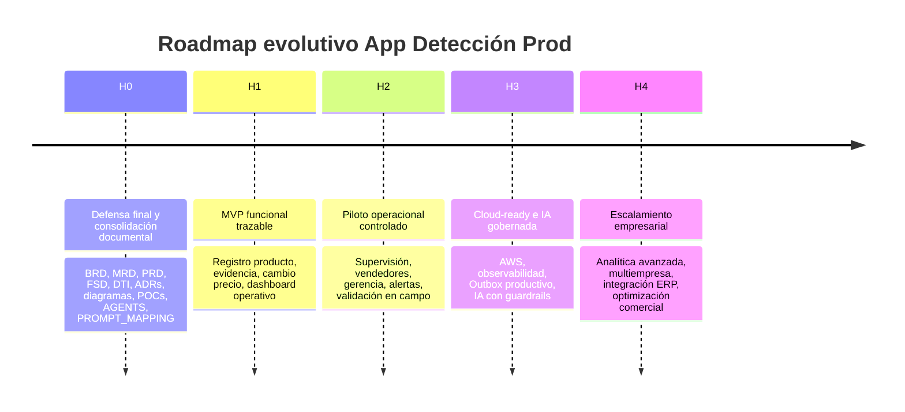
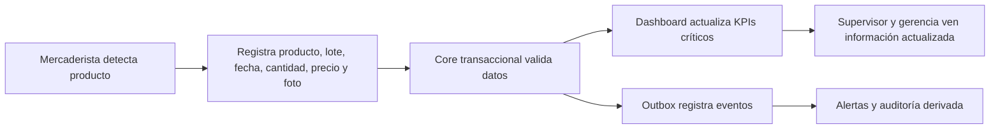
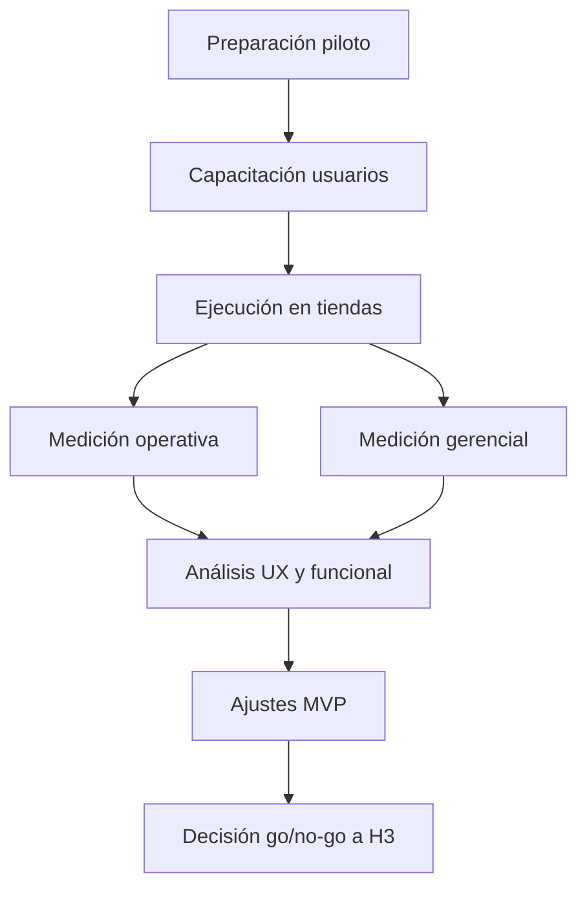
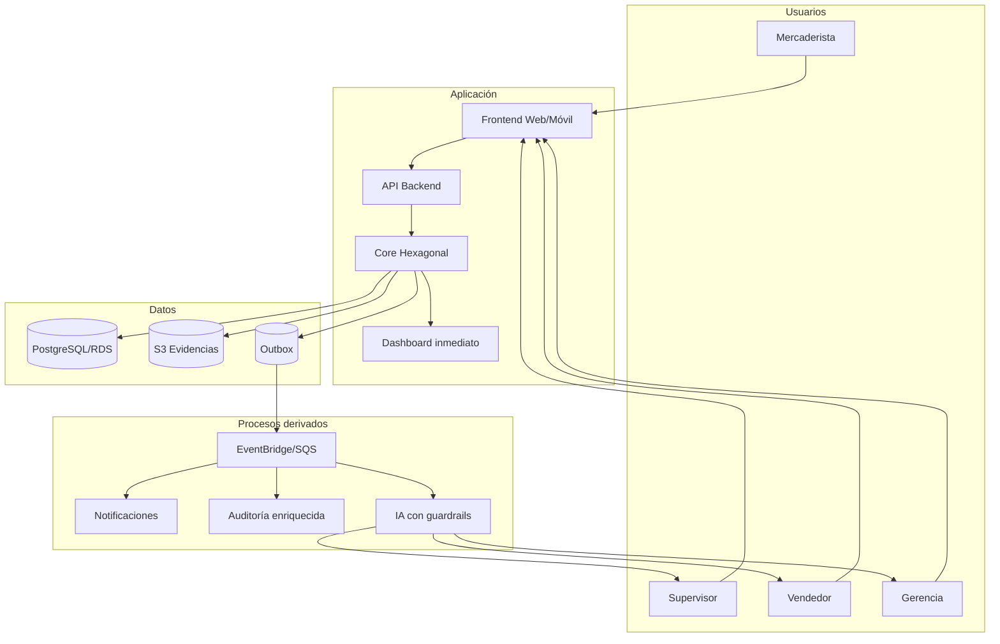
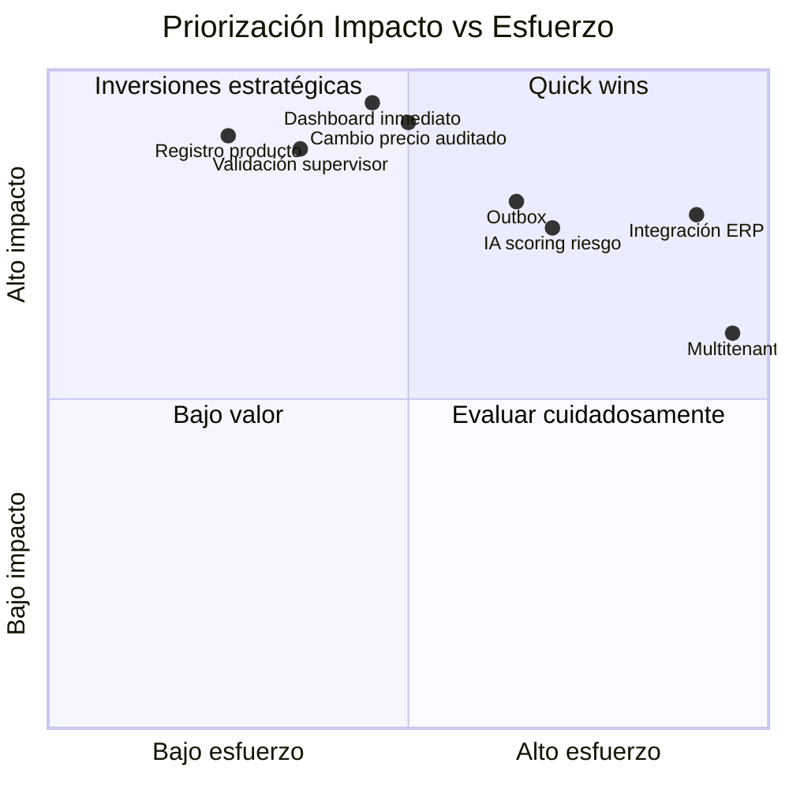
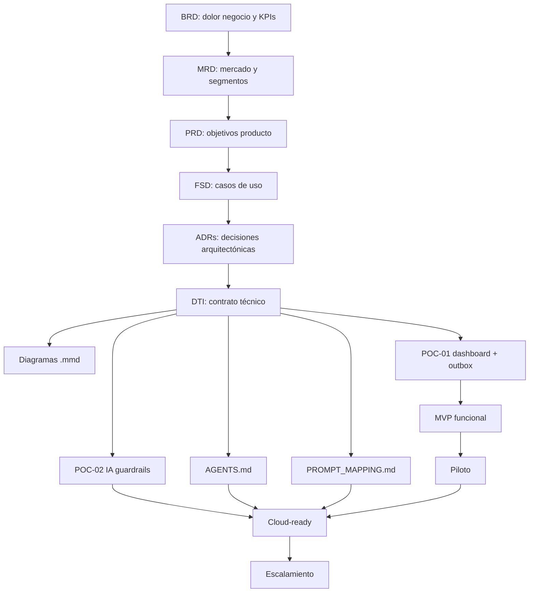

# Roadmap vFinal — App Detección Prod  
## Versión v2.0 — Nivel Doctorado / Defensa Final

| Campo | Valor |
|---|---|
| Producto | App Detección Prod |
| Autora | Gina Fabiana Villanueva Viscarra |
| Programa | Maestría en Desarrollo de Productos de Software con IA |
| Tipo de documento | Roadmap estratégico, funcional, arquitectónico y evolutivo |
| Estado | Para revisión |
| Rama esperada | `release/2.0.0` |
| Ruta sugerida | `docs/roadmap.md` |
| Documentos base | BRD v1.1, MRD v1.1, PRD v1.1, FSD v1.1, DTI v1.3, ADR-0001..0005, POC-01, POC-02, AGENTS.md, PROMPT_MAPPING.md |
| Última actualización | 2026-05-27 |

---

## 0. Propósito del roadmap

Este roadmap define la evolución planificada de **App Detección Prod** desde una solución documentada y validada mediante POCs hacia una plataforma operativa, trazable, medible, auditable y preparada para evolución cloud e IA gobernada.

No es una lista de tareas. Es un instrumento de dirección que conecta:

- evidencia de investigación de usuario;
- objetivos de negocio;
- requerimientos de producto;
- especificación funcional;
- decisiones arquitectónicas;
- POCs;
- riesgos;
- KPIs;
- entregables de defensa;
- releases incrementales;
- evolución futura del producto.

La intención es demostrar que el proyecto no termina en documentación, sino que tiene una ruta clara para transformarse en un producto funcional con impacto real en empresas distribuidoras e importadoras que operan en canal retail.

---

## 1. Diagnóstico contextual profundo

### 1.1 Situación actual del negocio

El proceso actual de detección y gestión de productos próximos a vencer se encuentra fragmentado. La operación depende de WhatsApp, Excel, fotografías no estandarizadas y comunicación verbal. Esta forma de trabajo genera pérdida de trazabilidad, ausencia de métricas, falta de visibilidad para niveles estratégicos, demora en decisiones, desalineación entre áreas comerciales y operativas, incremento de merma e imposibilidad de medir acciones correctivas.

La investigación levantada evidencia que el problema no es solo tecnológico. Es un problema sistémico de gestión de información, coordinación organizacional, arquitectura de procesos y madurez digital.

### 1.2 Brecha operacional

El mercaderista detecta el problema en sala, pero no cuenta con un sistema estructurado para registrar producto, lote, vencimiento, cantidad, precio actual, evidencia y estado de acción comercial. Esto genera reportes incompletos o dispersos.

El supervisor recibe información heterogénea, debe validar manualmente fotos, precios, cantidades, descuentos y estado del producto. Esta validación puede pasar de una tarea estimada de minutos a horas o incluso días cuando la información llega incompleta.

El vendedor necesita actuar comercialmente, pero toma decisiones con incertidumbre: no siempre sabe si el producto ya fue vendido, retirado, bandeado, descontado o si el cambio de precio fue aprobado.

Gerencia necesita decidir con información consolidada, actualizada y confiable, pero actualmente recibe reportes tardíos o parciales. Esto impide medir impacto financiero, rotación, costos de devolución, reposición, distribución y margen protegido.

### 1.3 Brecha estratégica

El negocio necesita pasar de un modelo reactivo a uno proactivo. La diferencia no está únicamente en digitalizar el reporte, sino en rediseñar el sistema de decisión:

| Situación actual | Situación objetivo |
|---|---|
| Reportes dispersos por WhatsApp | Registro estructurado en plataforma |
| Fotos sin estándar | Evidencia asociada al caso |
| Acciones comerciales no trazadas | Historial auditado de acción |
| Cambios de precio sin control formal | Cambio de precio con aprobación y auditoría |
| Gerencia informada tarde | Dashboard inmediato para KPIs críticos |
| Decisiones basadas en percepción | Decisiones basadas en datos |
| Merma difícil de cuantificar | Merma y valor intervenido medibles |
| IA inexistente o informal | IA asistiva con guardrails y human-in-the-loop |

### 1.4 Brecha técnica

Sin una arquitectura clara, el sistema podría terminar como un CRUD acoplado, difícil de mantener y poco auditable. Por eso los ADRs aprobados establecen:

- monolito modular evolutivo;
- arquitectura hexagonal;
- event-driven + Outbox;
- dashboard crítico con actualización inmediata;
- IA con guardrails;
- despliegue cloud-ready en AWS;
- observabilidad y seguridad desde el diseño.

Este roadmap respeta esas decisiones y las convierte en una secuencia evolutiva.

---

## 2. Principios rectores del roadmap

### 2.1 Principio de valor incremental

Cada release debe entregar valor verificable para al menos un rol del negocio. No se prioriza construir “todo” desde el inicio, sino validar flujos críticos que reduzcan incertidumbre, merma y trabajo manual.

### 2.2 Principio de trazabilidad extremo a extremo

Todo incremento debe poder trazarse desde:

```text
Dolor de usuario → Requerimiento → Caso de uso → Decisión arquitectónica → Implementación → Evidencia → KPI
```

### 2.3 Principio de dashboard inmediato

Los KPIs críticos de gerencia no deben depender exclusivamente de procesos asíncronos. El dashboard operacional debe actualizarse con los datos fuente transaccionales para evitar decisiones con información atrasada.

### 2.4 Principio de IA asistiva, no autónoma

La IA puede clasificar, priorizar, resumir y explicar. No puede cambiar precios, aprobar descuentos, retirar productos, cerrar casos ni modificar el dashboard fuente sin aprobación humana.

### 2.5 Principio de precio como dato financiero crítico

El cambio de precio no es un campo secundario. Es una decisión con impacto en margen, rentabilidad, descuentos, promociones, reputación y auditoría. Por tanto, debe incluir:

- precio anterior;
- precio nuevo;
- porcentaje de variación;
- cantidad afectada;
- valor económico intervenido;
- responsable;
- motivo;
- aprobación;
- evidencia;
- evento `PriceChanged.v1`.

---

## 3. Roadmap por horizontes



---

## 4. H0 — Consolidación documental y defensa final

### Objetivo

Cerrar el paquete de defensa final con coherencia documental, trazabilidad, decisiones arquitectónicas, diagramas, POCs y evidencia.

### Alcance

| Artefacto | Estado esperado | Propósito |
|---|---|---|
| BRD v1.1 | Aprobado | Justificación de negocio |
| MRD v1.1 | Aprobado | Mercado, usuarios, oportunidad |
| PRD v1.1 | Aprobado | Requerimientos de producto |
| FSD v1.1 | Aprobado | Casos de uso y reglas funcionales |
| ADR-0001..0005 | Aprobados | Decisiones arquitectónicas |
| DTI v1.3 | Aprobado | Contrato técnico rector |
| Diagramas `.mmd` | Aprobados | Visualización técnica y trazabilidad |
| POC-01 | Aprobada | Registro + dashboard inmediato + Outbox |
| POC-02 | Aprobada | IA con scoring + guardrails |
| AGENTS.md | Aprobado | Gobierno de agentes IA |
| PROMPT_MAPPING.md | Aprobado | Prompts trazables y auditables |
| Roadmap | En revisión | Evolución estratégica |

### Criterio de éxito

- Todo artefacto está en la ruta esperada.
- Todo documento cita o referencia los documentos relacionados.
- No hay contradicciones entre FSD, DTI y ADRs.
- Los diagramas representan lo decidido, no ideas sueltas.
- Las POCs validan riesgos reales del DTI.
- El roadmap explica la evolución posterior.

---

## 5. H1 — MVP funcional trazable

### Objetivo

Construir el primer producto funcional mínimo que permita registrar productos próximos a vencer, evidencia, cantidad, precio, acción comercial y estado del caso, manteniendo trazabilidad completa.

### Usuarios prioritarios

1. Mercaderista.
2. Supervisor.
3. Vendedor.
4. Gerencia.

### Funcionalidades

| ID | Funcionalidad | Rol principal | Trazabilidad |
|---|---|---|---|
| H1-F01 | Login y roles básicos | Todos | FSD, AGENTS |
| H1-F02 | Registro de producto próximo a vencer | Mercaderista | FSD-UC-001, POC-01 |
| H1-F03 | Carga de evidencia visual | Mercaderista | PRD, FSD |
| H1-F04 | Registro de lote y vencimiento | Mercaderista | FSD |
| H1-F05 | Registro de cantidad afectada | Mercaderista | BRD, PRD, FSD |
| H1-F06 | Registro de precio actual | Mercaderista / Vendedor | FSD, ADR-0003 |
| H1-F07 | Solicitud de cambio de precio | Vendedor | FSD-UC precio, POC-01 |
| H1-F08 | Validación de caso | Supervisor | FSD-UC-002 |
| H1-F09 | Dashboard operacional inmediato | Gerencia / Supervisor | ADR-0003, DTI |
| H1-F10 | Auditoría básica | Sistema | ADR-0003, ADR-0005 |

### Flujo H1



### KPIs H1

| KPI | Fórmula | Meta inicial |
|---|---|---|
| % registros completos | registros con campos obligatorios / total registros | ≥ 90 % |
| Tiempo de registro | tiempo desde inicio hasta envío | ≤ 3 min |
| % casos con evidencia válida | casos con foto válida / total casos | ≥ 85 % |
| % casos con precio registrado | casos con precio / total casos | ≥ 95 % |
| % cambios de precio auditados | cambios con auditoría / total cambios | 100 % |
| Latencia dashboard crítico | tiempo escritura → dashboard | ≤ 2 s |
| Errores de validación | registros rechazados / total | ≤ 5 % |

### Riesgos H1

| Riesgo | Impacto | Mitigación |
|---|---|---|
| Baja adopción por carga operativa | Alto | UX simple, formularios cortos, valores sugeridos |
| Conectividad variable en campo | Alto | Diseño offline-first futuro, guardado temporal |
| Fotos de baja calidad | Medio | Guía visual y validación mínima |
| Datos incompletos | Alto | Campos obligatorios y validaciones |
| Precios incorrectos | Alto | Aprobación y auditoría de cambio de precio |

---

## 6. H2 — Piloto operacional controlado

### Objetivo

Validar el producto con usuarios reales en un entorno controlado, midiendo adopción, reducción de tiempo, calidad de datos y utilidad para decisiones.

### Alcance del piloto

| Variable | Definición |
|---|---|
| Duración | 4 a 6 semanas |
| Tiendas piloto | 3 a 5 salas |
| Usuarios | 3 mercaderistas, 1 supervisor, 1 vendedor, 1 gerente |
| Canal | Retail moderno |
| Productos | Categorías con vencimiento sensible |
| Métricas | Completitud, tiempo, precisión, reducción de reprocesos |

### Actividades

1. Configurar roles y usuarios.
2. Capacitar flujo de registro.
3. Ejecutar piloto en tiendas seleccionadas.
4. Medir tiempo de registro.
5. Medir tiempo de validación.
6. Revisar calidad de evidencia.
7. Medir uso de dashboard.
8. Levantar feedback de usuarios.
9. Priorizar ajustes.
10. Decidir paso a cloud-ready.

### Diagrama de piloto



### KPIs H2

| KPI | Meta |
|---|---|
| Reducción de tiempo de validación supervisor | ≥ 40 % |
| Disminución de reportes incompletos | ≥ 50 % |
| Casos con acción comercial registrada | ≥ 80 % |
| Uso semanal del dashboard por gerencia | ≥ 2 sesiones/semana |
| Cambios de precio con aprobación | 100 % |
| Satisfacción usuario operativo | ≥ 4/5 |
| Casos críticos atendidos dentro de SLA | ≥ 85 % |

### Conclusión esperada H2

El piloto debe demostrar si la solución reduce fricción operativa, mejora calidad de datos, acelera decisiones y entrega a gerencia información accionable.

---

## 7. H3 — Producto cloud-ready con IA gobernada

### Objetivo

Preparar la solución para operación productiva, con despliegue cloud, observabilidad, seguridad, Outbox robusto e IA gobernada.

### Capacidades

| Capacidad | Descripción | Relación aprobada |
|---|---|---|
| AWS RDS/PostgreSQL | Persistencia transaccional | ADR-0005 |
| S3 | Evidencia visual | ADR-0005 |
| EventBridge/SQS | Eventos derivados | ADR-0003 |
| CloudWatch | Observabilidad | ADR-0005 |
| Cognito/IAM | Seguridad y roles | ADR-0005 |
| Guardrails IA | IA asistiva | ADR-0004 |
| Scoring riesgo | BAJO/MEDIO/ALTO | POC-02 |
| Prompt contracts | Prompts auditables | PROMPT_MAPPING |

### Arquitectura H3



### KPIs H3

| KPI | Meta |
|---|---|
| Disponibilidad del sistema | ≥ 99.5 % |
| p95 API registro | ≤ 500 ms en ambiente controlado |
| p95 dashboard crítico | ≤ 2 s |
| Eventos Outbox publicados | ≥ 99.9 % |
| Prompt schema pass rate | ≥ 95 % |
| Prompt injection bloqueado | 100 % |
| Cambios de precio automáticos por IA | 0 |
| Hallucination rate en outputs IA | < 5 % |

### Riesgos H3

| Riesgo | Mitigación |
|---|---|
| Costo cloud mayor al esperado | Servicios administrados graduales |
| Complejidad operacional | Observabilidad desde inicio |
| Falla en eventos | Outbox + DLQ |
| Exceso de confianza en IA | Human-in-the-loop |
| Datos sensibles en logs | Sanitización y políticas AGENTS |

---

## 8. H4 — Escalamiento empresarial y analítica avanzada

### Objetivo

Escalar el producto hacia escenarios multiempresa, integración con ERP, analítica avanzada y optimización comercial.

### Capacidades futuras

1. Integración con ERP o sistema de inventario.
2. Catálogo maestro de productos.
3. Reglas por cliente/cadena.
4. Predicción de riesgo de vencimiento.
5. Optimización de descuentos.
6. Simulación de margen.
7. Recomendaciones por rotación histórica.
8. Detección de anomalías en cambio de precio.
9. Multiempresa / multitenant.
10. Integración con BI corporativo.

### Diagrama de evolución analítica


### KPIs H4

| KPI | Meta |
|---|---|
| Reducción de merma por vencimiento | ≥ 15–25 % |
| Reducción de tiempo administrativo | ≥ 50 % |
| Precisión recomendación IA | ≥ 90 % |
| Variación margen protegida | Medible por categoría |
| ROI del sistema | Positivo en periodo piloto extendido |
| Integraciones ERP exitosas | ≥ 1 |
| Uso dashboard gerencial | Semanal sostenido |

---

## 9. Backlog priorizado

### 9.1 Matriz impacto vs esfuerzo



### 9.2 Backlog estratégico

| Prioridad | Épica | Motivo |
|---|---|---|
| P0 | Registro producto próximo a vencer | Flujo núcleo |
| P0 | Cambio de precio auditado | Impacto financiero directo |
| P0 | Dashboard gerencial inmediato | Decisión estratégica |
| P0 | Validación supervisor | Control táctico |
| P1 | Outbox productivo | Trazabilidad y evolución |
| P1 | Alertas automáticas | Proactividad |
| P1 | IA scoring riesgo | Priorización asistida |
| P1 | Evidencia visual robusta | Confianza operacional |
| P2 | Integración ERP | Escalamiento |
| P2 | Analítica avanzada | Optimización futura |
| P3 | Multitenancy | Expansión comercial |

---

## 10. Mapa de trazabilidad del roadmap



---

## 11. Dependencias críticas

| Dependencia | Impacto | Horizonte |
|---|---|---|
| FSD estable | Evita cambios contradictorios | H0-H1 |
| ADRs aprobados | Evita rediseños técnicos | H0-H1 |
| Dashboard inmediato | Decisiones gerenciales | H1 |
| Cambio de precio auditado | Control financiero | H1 |
| Evidencia visual | Confianza de validación | H1-H2 |
| Roles y permisos | Seguridad | H1-H3 |
| Outbox | Eventos confiables | H1-H3 |
| IA con guardrails | Priorización segura | H3 |
| Observabilidad | Operación productiva | H3 |
| Feedback piloto | Ajuste real | H2 |

---

## 12. Riesgos globales del roadmap

| Riesgo | Probabilidad | Impacto | Mitigación |
|---|---|---|---|
| Producto se vuelva solo CRUD | Media | Alto | Mantener DTI, ADRs y bounded contexts |
| Dashboard desactualizado | Media | Alto | Política de consistencia inmediata |
| Cambio de precio sin control | Media | Alto | Auditoría, RBAC, aprobación |
| IA tome decisiones indebidas | Baja-Media | Alto | Guardrails + human-in-the-loop |
| Baja adopción de mercaderistas | Media | Alto | UX simple, piloto, capacitación |
| Falta de datos históricos | Alta inicial | Medio | Empezar con reglas y POC |
| Sobrecosto cloud | Media | Medio | Escalamiento gradual |
| Mala calidad de evidencia | Media | Medio | Estándares visuales y validaciones |
| Falta de ownership | Media | Alto | AGENTS.md + responsables por módulo |
| Documentación se desactualice | Alta | Alto | Definition of Done documental |

---

## 13. Conclusiones estratégicas

### 13.1 Conclusión de negocio

App Detección Prod responde a un problema de alto impacto: productos próximos a vencer generan pérdidas no solo por vencimiento, sino por decisiones tardías, mala coordinación, devoluciones, costos operativos, descuentos mal aplicados y falta de medición.

### 13.2 Conclusión de producto

El producto debe iniciar por el flujo más valioso: registrar producto, precio, cantidad, vencimiento, evidencia, acción comercial y estado. Sin ese dato estructurado, no existe dashboard confiable ni IA útil.

### 13.3 Conclusión técnica

El monolito modular con arquitectura hexagonal es adecuado para el momento actual: evita sobreingeniería, protege el dominio y deja caminos de evolución hacia event-driven, cloud e IA gobernada.

### 13.4 Conclusión de IA

La IA debe incorporarse como capa asistiva. Su valor está en priorizar, explicar y clasificar riesgo, no en reemplazar decisiones humanas que afectan precio, margen o retiro de producto.

### 13.5 Conclusión de roadmap

El camino correcto es incremental:

1. Consolidar defensa.
2. Construir MVP trazable.
3. Ejecutar piloto.
4. Evolucionar a cloud-ready.
5. Escalar con analítica avanzada.

---

## 14. Guion de defensa del roadmap

> Este roadmap traduce la documentación aprobada en una ruta de producto. No propone construir todo de una vez, sino evolucionar desde una base documental y arquitectónica sólida hacia un MVP, luego a un piloto controlado, después a una arquitectura cloud-ready con IA gobernada y finalmente a escalamiento empresarial. La prioridad inicial es capturar datos confiables: producto, vencimiento, cantidad, precio, acción comercial y evidencia. Sin esos datos, gerencia no puede decidir, supervisión no puede validar y ventas trabaja con incertidumbre. Por eso el roadmap prioriza dashboard inmediato, cambio de precio auditado, trazabilidad, Outbox e IA con human-in-the-loop.

---

## 15. Checklist de validez

- [x] Conectado con BRD.
- [x] Conectado con MRD.
- [x] Conectado con PRD.
- [x] Conectado con FSD.
- [x] Conectado con ADR-0001..0005.
- [x] Conectado con DTI.
- [x] Conectado con POC-01.
- [x] Conectado con POC-02.
- [x] Incluye KPIs de negocio.
- [x] Incluye KPIs técnicos.
- [x] Incluye cambio de precio.
- [x] Incluye dashboard inmediato.
- [x] Incluye IA gobernada.
- [x] Incluye diagramas Mermaid.
- [x] Incluye riesgos.
- [x] Incluye conclusiones.
- [x] Incluye defensa oral.
