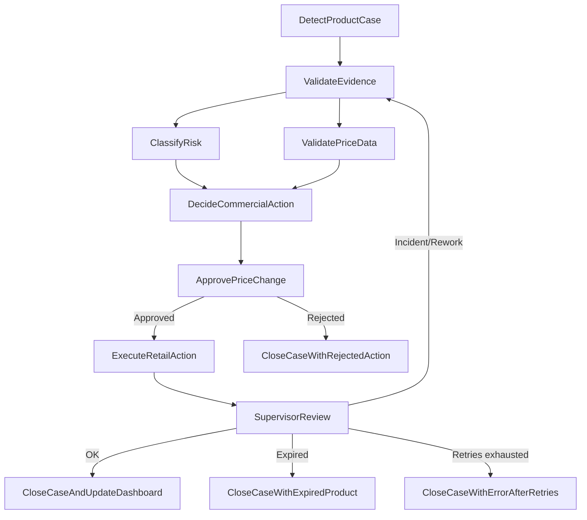
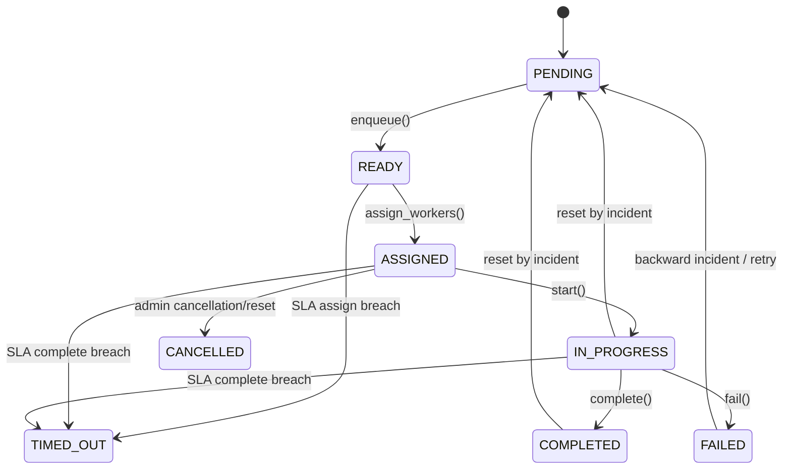
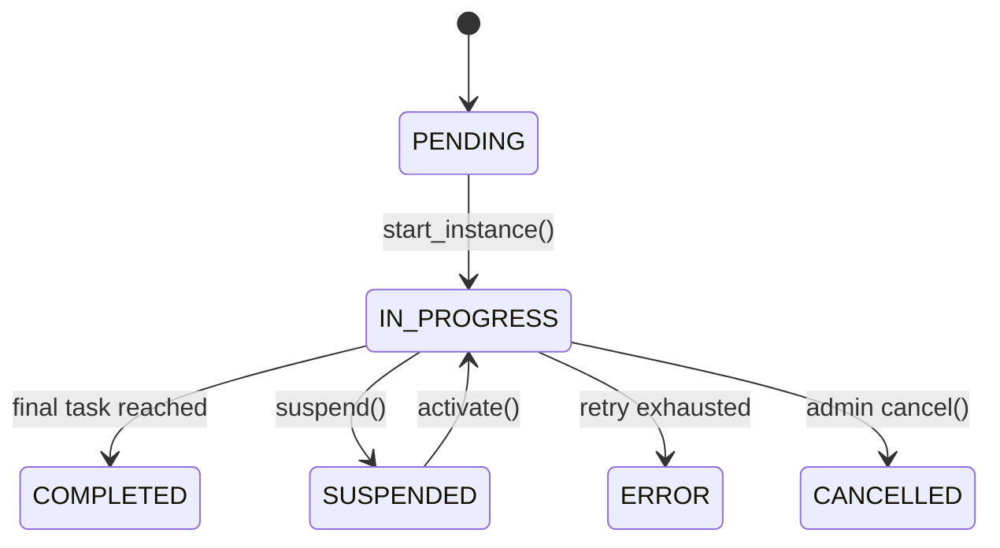
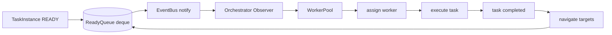
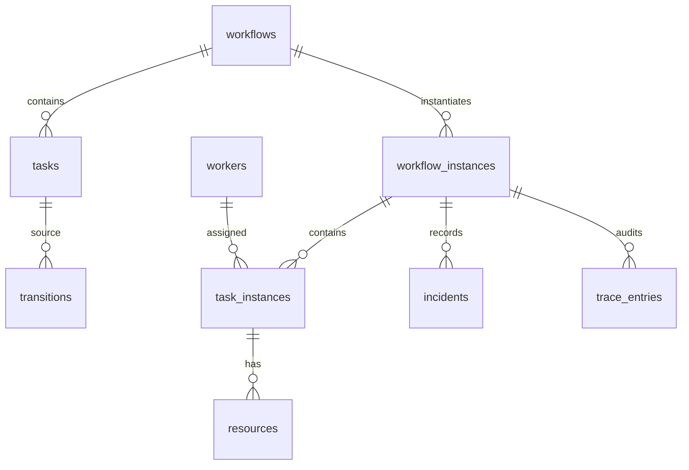

# FSD — App Detección Prod Workflow Engine BPMN 2.0

**Entregable:** 2  
**Tipo:** Functional Specification Document ligero  
**Estado:** APROBADO / ENTREGA FINAL  
**Fecha:** 2026-07-06  
**Proyecto:** App Detección Prod — Motor de Workflow tipo BPMN 2.0  
**Curso:** Fundamentos de Programación y Frameworks Modernos para IA  
**Audiencia:** Docente, equipo académico, evaluadores técnicos  
**Idioma documentación:** Español  
**Idioma del modelo de dominio:** Inglés  
**Baseline aprobada:** `00_PLAN_EJECUCION_APROBADO.md` + `docs/PRD.md` aprobado  

---

## 1. Propósito del documento

Este FSD describe **cómo funcionará** el motor de workflow tipo BPMN 2.0 aplicado a **App Detección Prod**. Mientras el PRD aprobado define qué se construye y por qué, este documento baja la solución a especificación funcional, modelo de dominio, estados, compuertas, reglas de negocio, orquestación, persistencia, pruebas y trazabilidad.

El documento está dirigido al docente y a los evaluadores como evidencia de diseño funcional previo a la implementación. Por esa razón combina lenguaje académico, justificación técnica y aplicación directa al proceso real de gestión de productos próximos a vencer.

---

## 2. Alcance funcional del FSD

El motor debe permitir definir y ejecutar workflows como **grafos dirigidos**, donde:

- los nodos son tareas (`Task`);
- las aristas son transiciones (`Transition`);
- las compuertas se modelan como `LogicGate` embebida en la tarea destino;
- cada plantilla (`Workflow`, `Task`) se separa de su ejecución (`WorkflowInstance`, `TaskInstance`);
- cada ejecución genera trazabilidad completa (`TraceEntry`);
- el flujo soporta linealidad, paralelismo, joins, ciclos, incidentes, reintentos, SLAs, multi-asignación y ejecución concurrente.

En App Detección Prod, el workflow principal representa el ciclo operativo y comercial de un producto próximo a vencer: detección, validación, clasificación de riesgo, decisión comercial, aprobación de precio, ejecución en sala, revisión y cierre.

---

## 3. Principios funcionales de diseño

| Principio | Aplicación en el motor | Razón académica / funcional |
|---|---|---|
| Separación definición-runtime | `Workflow`/`Task` vs. `WorkflowInstance`/`TaskInstance` | Permite versionar procesos y ejecutar múltiples instancias sin modificar la plantilla. |
| Grafo dirigido | `Task.targets`, `Task.incoming`, `DependencyMatrix` | Formaliza el proceso como teoría de grafos. |
| Join embebido | `LogicGate` en la tarea destino | Cumple la decisión del curso y simplifica la representación. |
| Trazabilidad append-only | `execution_path` e `incidents` | Permite auditoría completa, incluso con ciclos. |
| Recursos propagables | `ResourceSpec` y `ResourceInstance` | Modela evidencia, precios, cantidades, acciones y archivos. |
| Orquestación reactiva | Cola + Observer | Emula SQS / Job Executor sin cron. |
| Persistencia ligera | SQLite | Balancea demostrabilidad, durabilidad y facilidad de revisión. |
| IA gobernada / mock | `GateType.SCRIPT`, `REST`, `LAMBDA` simulados | Demuestra integración conceptual sin depender de infraestructura externa. |

---

## 4. Workflow principal aplicado a App Detección Prod

### 4.1 Flujo nominal

```text
DetectProductCase
  -> ValidateEvidence
  -> ClassifyRisk
  -> DecideCommercialAction
  -> ApprovePriceChange
  -> ExecuteRetailAction
  -> SupervisorReview
  -> CloseCaseAndUpdateDashboard
```

### 4.2 Descripción de tareas

| Código | `Task.name` | Tipo | Worker requerido | Propósito |
|---|---|---|---|---|
| T01 | `DetectProductCase` | `HUMAN` / `START` | `FIELD_MERCHANDISER` | Registrar producto próximo a vencer, evidencia, cantidad, precio actual y tienda. |
| T02 | `ValidateEvidence` | `HUMAN` | `SUPERVISOR` | Validar foto, fecha de vencimiento, cantidad, SKU, tienda y consistencia del reporte. |
| T03 | `ClassifyRisk` | `DECISION` / `SERVICE` | `SYSTEM` | Clasificar riesgo operativo/financiero mediante lógica local o mock IA. |
| T04 | `ValidatePriceData` | `SERVICE` | `SYSTEM` | Validar que precio actual, precio nuevo y cantidad permitan calcular impacto financiero. |
| T05 | `DecideCommercialAction` | `HUMAN` | `SALES_REP` | Elegir descuento, bandeo, promoción, retiro, cambio o seguimiento. |
| T06 | `ApprovePriceChange` | `HUMAN` | `SUPERVISOR` / `ADMIN` | Aprobar o rechazar modificación de precio cuando exista impacto comercial. |
| T07 | `ExecuteRetailAction` | `HUMAN` | `FIELD_MERCHANDISER` / `SALES_REP` | Ejecutar acción en sala y adjuntar evidencia de ejecución. |
| T08 | `SupervisorReview` | `HUMAN` | `SUPERVISOR` | Revisar consistencia final, detectar errores y decidir cierre o rework. |
| T09 | `CloseCaseAndUpdateDashboard` | `SERVICE` / `END` | `SYSTEM` | Cerrar caso, consolidar recursos, registrar métricas y actualizar dashboard. |
| T10 | `CloseCaseWithRejectedAction` | `END` | `SYSTEM` | Cierre alternativo cuando la acción comercial se rechaza. |
| T11 | `CloseCaseWithExpiredProduct` | `END` | `SYSTEM` | Cierre alternativo cuando el producto expira o se retira sin recuperación. |
| T12 | `CloseCaseWithErrorAfterRetries` | `END` | `SYSTEM` | Cierre terminal cuando se agotan reintentos por incidente. |

### 4.3 Grafo lógico del workflow



---

## 5. Escenarios obligatorios cubiertos

| Escenario exigido | Implementación funcional propuesta | Evidencia esperada en tests |
|---|---|---|
| Flujo lineal | `DetectProductCase -> ValidateEvidence -> ClassifyRisk` | `test_linear_flow.py` |
| Split paralelo | `ValidateEvidence -> {ClassifyRisk, ValidatePriceData}` | `test_parallel_and_join.py` |
| Join AND | `DecideCommercialAction` inicia cuando `ClassifyRisk` y `ValidatePriceData` completan | `test_parallel_and_join.py` |
| Join OR | `SupervisorReview` puede cerrar con evidencia final o validación administrativa | `test_or_join.py` |
| Condicional | `ApprovePriceChange` deriva a ejecución o rechazo | `test_conditional_paths.py` |
| Ciclo/rework | `SupervisorReview -> ValidateEvidence` por incidente | `test_rework_incident.py` |
| Múltiples finales | Cierre exitoso, rechazo, expirado o error | `test_multiple_end_states.py` |
| Incidente con reset | Reset downstream o específico con `was_reset=true` | `test_rework_incident.py` |
| Reintentos con fin en error | `max_retries` en transición backward | `test_retry_exhausted.py` |
| SLA/timeout | `max_time_to_assign`, `max_time_to_complete` | `test_sla_timeout.py` |
| Multi-asignación | `CompletionPolicy.ALL`, `ANY`, `QUORUM` | `test_multi_assignment.py` |
| Concurrencia | `Executor` + `Future` sobre tareas paralelas | `test_concurrent_execution.py` |

---

## 6. Modelo de dominio — Definición del proceso

> Nota: los nombres de clases, atributos y estados se mantienen en inglés para cumplir la consigna; la explicación se mantiene en español.

### 6.1 Enumeraciones

```python
from enum import Enum

class WorkflowStatus(Enum):
    PENDING = "PENDING"
    IN_PROGRESS = "IN_PROGRESS"
    SUSPENDED = "SUSPENDED"
    COMPLETED = "COMPLETED"
    CANCELLED = "CANCELLED"
    ERROR = "ERROR"

class TaskStatus(Enum):
    PENDING = "PENDING"
    READY = "READY"
    ASSIGNED = "ASSIGNED"
    IN_PROGRESS = "IN_PROGRESS"
    COMPLETED = "COMPLETED"
    FAILED = "FAILED"
    TIMED_OUT = "TIMED_OUT"
    CANCELLED = "CANCELLED"

class GateType(Enum):
    AND = "AND"
    OR = "OR"
    XOR = "XOR"
    COMPLEX = "COMPLEX"
    SCRIPT = "SCRIPT"
    REST = "REST"
    LAMBDA = "LAMBDA"

class ResourceType(Enum):
    FILE = "FILE"
    TEXT = "TEXT"
    URL = "URL"
    NUMBER = "NUMBER"
    MONEY = "MONEY"
    DATE = "DATE"
    OTHER = "OTHER"

class TaskType(Enum):
    HUMAN = "HUMAN"
    SERVICE = "SERVICE"
    SCRIPT = "SCRIPT"
    DECISION = "DECISION"
    START = "START"
    END = "END"

class Role(Enum):
    WORKER = "WORKER"
    ADMIN = "ADMIN"
    SYSTEM = "SYSTEM"

class WorkerType(Enum):
    FIELD_MERCHANDISER = "FIELD_MERCHANDISER"
    SUPERVISOR = "SUPERVISOR"
    SALES_REP = "SALES_REP"
    MANAGER = "MANAGER"
    SYSTEM = "SYSTEM"

class TransitionType(Enum):
    FORWARD = "FORWARD"
    BACKWARD = "BACKWARD"

class IncidentType(Enum):
    QUALITY = "QUALITY"
    VALIDATION = "VALIDATION"
    MISSING_RESOURCE = "MISSING_RESOURCE"
    BUSINESS_RULE = "BUSINESS_RULE"
    PRICE_ERROR = "PRICE_ERROR"
    EVIDENCE_ERROR = "EVIDENCE_ERROR"
    OTHER = "OTHER"

class ResetScope(Enum):
    ALL_DOWNSTREAM = "ALL_DOWNSTREAM"
    SPECIFIC = "SPECIFIC"

class CompletionPolicy(Enum):
    ALL = "ALL"
    ANY = "ANY"
    QUORUM = "QUORUM"
```

### 6.2 Clases de definición

```python
from dataclasses import dataclass, field
from datetime import timedelta
from typing import Optional

@dataclass
class ResourceSpec:
    key: str
    value: str
    type: ResourceType
    mandatory: bool = False
    propagate: bool = False

@dataclass
class LogicGate:
    type: GateType
    depends_on: list["Task"] = field(default_factory=list)
    expression: Optional[str] = None
    endpoint: Optional[str] = None

    def can_start(self, target: "TaskInstance", ctx: "WorkflowInstance") -> bool:
        """Evalúa si una TaskInstance puede iniciar según estados y variables del workflow."""
        raise NotImplementedError

@dataclass
class Transition:
    source: "Task"
    target: "Task"
    type: TransitionType = TransitionType.FORWARD
    max_retries: Optional[int] = None
    exhausted_status: WorkflowStatus = WorkflowStatus.ERROR
    error_code: Optional[str] = None

@dataclass
class Task:
    id: str
    name: str
    targets: list["Task"] = field(default_factory=list)
    incoming: list["Task"] = field(default_factory=list)
    backward_transitions: list[Transition] = field(default_factory=list)
    logic_gate: Optional[LogicGate] = None
    required_resources: list[ResourceSpec] = field(default_factory=list)
    produced_resources: list[ResourceSpec] = field(default_factory=list)
    required_worker_type: Optional[WorkerType] = None
    task_type: TaskType = TaskType.HUMAN
    is_final: bool = False
    completion_policy: CompletionPolicy = CompletionPolicy.ALL
    quorum: Optional[int] = None
    max_time_to_assign: Optional[timedelta] = None
    max_time_to_complete: Optional[timedelta] = None

@dataclass
class Workflow:
    id: str
    name: str
    version: int
    start_task: Task
    final_tasks: list[Task] = field(default_factory=list)
    tasks: list[Task] = field(default_factory=list)
    status: WorkflowStatus = WorkflowStatus.PENDING
```

---

## 7. Modelo de ejecución — Runtime

### 7.1 Clases runtime

```python
from dataclasses import dataclass, field
from datetime import datetime
from typing import Optional

@dataclass
class Worker:
    id: str
    name: str
    worker_type: WorkerType
    capacity: int = 1
    role: Role = Role.WORKER

@dataclass
class ResourceInstance:
    key: str
    value: str
    type: ResourceType
    source_task_id: Optional[str] = None
    mandatory: bool = False
    propagate: bool = False

@dataclass
class TraceEntry:
    task_id: str
    task_name: str
    status: TaskStatus | WorkflowStatus | str
    timestamp: datetime
    worker_id: Optional[str] = None
    iteration: int = 1
    incident_id: Optional[str] = None
    was_reset: bool = False
    note: Optional[str] = None

@dataclass
class Incident:
    id: str
    from_task: Task
    to_task: Task
    type: IncidentType
    reason: str
    raised_by: Worker
    timestamp: datetime
    iteration: int
    reset_scope: ResetScope = ResetScope.ALL_DOWNSTREAM
    reset_targets: list[Task] = field(default_factory=list)

@dataclass
class TaskInstance:
    id: str
    definition: Task
    status: TaskStatus = TaskStatus.PENDING
    assigned_workers: list[Worker] = field(default_factory=list)
    per_worker_status: dict[str, TaskStatus] = field(default_factory=dict)
    resources: list[ResourceInstance] = field(default_factory=list)
    started_at: Optional[datetime] = None
    completed_at: Optional[datetime] = None
    assign_deadline: Optional[datetime] = None
    complete_deadline: Optional[datetime] = None
    retry_count: dict[str, int] = field(default_factory=dict)
    retries_exhausted: bool = False
    was_reset: bool = False
    reset_count: int = 0
    reset_incident_ref: Optional[str] = None

@dataclass
class WorkflowInstance:
    id: str
    definition: Workflow
    current_tasks: list[TaskInstance] = field(default_factory=list)
    task_instances: dict[str, TaskInstance] = field(default_factory=dict)
    status: WorkflowStatus = WorkflowStatus.PENDING
    execution_path: list[TraceEntry] = field(default_factory=list)
    incidents: list[Incident] = field(default_factory=list)
    variables: dict[str, str] = field(default_factory=dict)
    iteration: int = 1
```

### 7.2 Separación definition/runtime

| Plantilla | Instancia | Motivo |
|---|---|---|
| `Workflow` | `WorkflowInstance` | Una definición puede generar múltiples ejecuciones. |
| `Task` | `TaskInstance` | Una tarea del modelo puede ejecutarse muchas veces por instancia/ciclo. |
| `ResourceSpec` | `ResourceInstance` | El recurso esperado se diferencia del valor real capturado. |
| `Transition` | Registro en `TraceEntry` | La arista declarada se evidencia cuando ocurre el recorrido. |

---

## 8. Máquina de estados

### 8.1 Estado de una tarea



### 8.2 Estado del workflow



### 8.3 Reglas de transición de estado

| Regla | Descripción |
|---|---|
| R-STATE-01 | Una tarea solo puede pasar a `READY` si su `LogicGate` permite iniciar o si no tiene compuerta. |
| R-STATE-02 | Una tarea no puede pasar a `ASSIGNED` sin worker compatible con `required_worker_type`. |
| R-STATE-03 | Una tarea no puede pasar a `COMPLETED` si faltan recursos obligatorios. |
| R-STATE-04 | Si una tarea completada se resetea por incidente, vuelve a `PENDING` con `was_reset=True`. |
| R-STATE-05 | Si se agotan reintentos de una transición `BACKWARD`, el workflow pasa a `ERROR`. |
| R-STATE-06 | Si se alcanza una tarea final y no hay tareas paralelas pendientes, el workflow pasa a `COMPLETED`. |

---

## 9. Compuertas lógicas

### 9.1 Tipos soportados

| `GateType` | Semántica | Uso en App Detección Prod |
|---|---|---|
| `AND` | Todas las dependencias deben estar `COMPLETED`. | `DecideCommercialAction` espera clasificación de riesgo y validación de precio. |
| `OR` | Al menos una dependencia debe estar `COMPLETED`. | Cierre puede avanzar con evidencia final o validación administrativa. |
| `XOR` | Exactamente una rama válida. | Acción aprobada vs. rechazada. |
| `COMPLEX` | Evalúa expresión de negocio. | Riesgo alto si días al vencimiento + valor intervenido + evidencia insuficiente. |
| `SCRIPT` | Método interno simulado. | Clasificación de riesgo local. |
| `REST` | Endpoint mock. | Consulta simulada de precio/base externa. |
| `LAMBDA` | Lambda mock. | Evaluación simulada de alerta o scoring. |

### 9.2 Contrato funcional

```python
def can_start(target: TaskInstance, ctx: WorkflowInstance) -> bool:
    """
    Retorna True si la tarea destino puede iniciar según:
    - estados de tareas predecesoras;
    - recursos obligatorios disponibles;
    - variables del workflow;
    - expresión de negocio o resultado mock externo.
    """
```

### 9.3 Ejemplo de join AND

```text
ClassifyRisk COMPLETED + ValidatePriceData COMPLETED
    => DecideCommercialAction READY
```

### 9.4 Ejemplo de join OR

```text
ExecutionEvidence COMPLETED OR SupervisorManualApproval COMPLETED
    => CloseCaseAndUpdateDashboard READY
```

---

## 10. Recursos y propagación

### 10.1 Recursos obligatorios por tarea

| Tarea | Recursos requeridos |
|---|---|
| `DetectProductCase` | `sku`, `product_name`, `store`, `expiration_date`, `current_price`, `quantity_detected`, `photo_evidence` |
| `ValidateEvidence` | `photo_evidence`, `expiration_date`, `quantity_detected`, `current_price` |
| `ClassifyRisk` | `expiration_date`, `quantity_detected`, `current_price` |
| `ValidatePriceData` | `current_price`, `proposed_price`, `quantity_detected` |
| `DecideCommercialAction` | `risk_level`, `financial_impact`, `recommended_action` |
| `ApprovePriceChange` | `current_price`, `proposed_price`, `price_change_reason`, `financial_impact` |
| `ExecuteRetailAction` | `approved_action`, `approved_price`, `execution_evidence` |
| `SupervisorReview` | `execution_evidence`, `approved_action`, `final_quantity` |
| `CloseCaseAndUpdateDashboard` | `case_status`, `financial_impact`, `trace_summary` |

### 10.2 Regla de propagación

Un recurso producido por una tarea se propaga a una tarea destino solo si:

1. `ResourceInstance.propagate == True`;
2. la tarea destino declara un `ResourceSpec` con la misma `key` o tipo compatible;
3. el recurso no fue invalidado por reset o incidente;
4. el recurso no contradice una regla de negocio vigente.

### 10.3 Ejemplo funcional

```text
DetectProductCase produce:
- sku
- expiration_date
- current_price
- quantity_detected
- photo_evidence

ValidateEvidence consume esos recursos.
Si los valida, produce:
- validated_evidence = true
- evidence_quality_score

ClassifyRisk consume:
- expiration_date
- current_price
- quantity_detected
- evidence_quality_score
```

---

## 11. Reglas de negocio del caso App Detección Prod

| ID | Regla |
|---|---|
| BR-01 | Todo caso debe registrar producto, tienda, fecha de vencimiento, cantidad, precio actual y evidencia. |
| BR-02 | Una evidencia incompleta no permite avanzar a decisión comercial sin validación manual del supervisor. |
| BR-03 | Todo cambio de precio debe conservar precio actual, precio propuesto, responsable, motivo e impacto financiero. |
| BR-04 | La IA/mock puede clasificar riesgo o recomendar revisión, pero no aprobar cambios de precio ni cerrar casos. |
| BR-05 | Un caso con vencimiento cercano y sin acción comercial debe elevar prioridad. |
| BR-06 | Si la acción comercial se rechaza, el caso debe cerrar con final alternativo trazable. |
| BR-07 | Si el supervisor detecta error de evidencia, precio o cantidad, debe levantar incidente con glosa obligatoria. |
| BR-08 | Al levantar incidente, se debe elegir reset `ALL_DOWNSTREAM` o `SPECIFIC`. |
| BR-09 | Una transición `BACKWARD` debe tener `max_retries` y `exhausted_status`. |
| BR-10 | Al superar reintentos, se notifica al worker y el workflow pasa a estado terminal `ERROR`. |
| BR-11 | El dashboard gerencial solo debe actualizarse al cierre válido o al registro de estado terminal. |
| BR-12 | Todo cambio de estado debe registrarse en `execution_path`. |

---

## 12. Incidentes, rework, reset y reintentos

### 12.1 Casos de incidente

| Incidente | Desde | Hacia | Tipo | Reset recomendado |
|---|---|---|---|---|
| Evidencia ilegible | `SupervisorReview` | `ValidateEvidence` | `EVIDENCE_ERROR` | `ALL_DOWNSTREAM` |
| Precio no coincide | `ApprovePriceChange` | `ValidatePriceData` | `PRICE_ERROR` | `SPECIFIC` |
| Cantidad inconsistente | `SupervisorReview` | `ValidateEvidence` | `VALIDATION` | `ALL_DOWNSTREAM` |
| Acción mal ejecutada | `SupervisorReview` | `ExecuteRetailAction` | `QUALITY` | `SPECIFIC` |
| Falta foto final | `SupervisorReview` | `ExecuteRetailAction` | `MISSING_RESOURCE` | `SPECIFIC` |

### 12.2 Algoritmo funcional de incidente

```text
1. Validar que la transición solicitada sea BACKWARD.
2. Validar que incident.reason no esté vacío.
3. Incrementar retry_count para esa transición.
4. Si retry_count supera max_retries:
   4.1 Marcar retries_exhausted = true.
   4.2 Registrar TraceEntry de agotamiento.
   4.3 Cambiar WorkflowInstance.status a ERROR.
   4.4 Encolar notificación mock onRetryExhausted.
5. Si no supera max_retries:
   5.1 Registrar Incident.
   5.2 Agregar TraceEntry.
   5.3 Resetear tareas downstream o específicas.
   5.4 Limpiar recursos derivados inválidos.
   5.5 Incrementar iteration.
   5.6 Reanudar desde to_task.
```

### 12.3 Ejemplo de traza con rework

```text
01 DetectProductCase COMPLETED iteration=1
02 ValidateEvidence COMPLETED iteration=1
03 ClassifyRisk COMPLETED iteration=1
04 ValidatePriceData COMPLETED iteration=1
05 DecideCommercialAction COMPLETED iteration=1
06 ApprovePriceChange COMPLETED iteration=1
07 ExecuteRetailAction COMPLETED iteration=1
08 SupervisorReview IN_PROGRESS iteration=1
09 INCIDENT SupervisorReview -> ValidateEvidence type=EVIDENCE_ERROR reason="foto final ilegible"
10 ValidateEvidence PENDING iteration=2 was_reset=true
11 ClassifyRisk PENDING iteration=2 was_reset=true
12 ValidatePriceData PENDING iteration=2 was_reset=true
13 ValidateEvidence COMPLETED iteration=2
...
```

---

## 13. Orquestación, cola y patrón Observer

### 13.1 Componentes

| Componente | Responsabilidad |
|---|---|
| `ReadyQueue` | Mantener tareas `READY` pendientes de asignación. |
| `Orchestrator` | Observar eventos, asignar workers, iniciar tareas, navegar targets. |
| `WorkerPool` | Conjunto de workers disponibles con tipo, capacidad y carga actual. |
| `EventBus` | Publicar eventos internos como `task_ready`, `task_completed`, `incident_raised`. |
| `SlaMonitor` | Revisar deadlines de forma reactiva usando min-heap, sin cron. |
| `Executor` | Ejecutar tareas concurrentes y devolver `Future`. |

### 13.2 Flujo de orquestación



### 13.3 Estrategia de asignación

La estrategia recomendada es **Skill-based + Least-loaded**:

```text
1. Filtrar workers por required_worker_type.
2. Filtrar workers con capacidad disponible.
3. Seleccionar el worker con menor carga activa.
4. Si hay empate, usar round-robin estable.
5. Registrar asignación en TraceEntry.
```

Esta estrategia es simple, transparente y defendible. Es más adecuada para una implementación académica que un algoritmo húngaro, aunque este último puede quedar como extensión futura.

---

## 14. SLAs y timeouts

### 14.1 Campos SLA

| Campo | Cuándo se define | Propósito |
|---|---|---|
| `max_time_to_assign` | En `Task` | Tiempo máximo desde `READY` hasta `ASSIGNED`. |
| `assign_deadline` | En `TaskInstance.enqueue()` | Fecha/hora límite de asignación. |
| `max_time_to_complete` | En `Task` | Tiempo máximo desde `ASSIGNED`/`IN_PROGRESS` hasta `COMPLETED`. |
| `complete_deadline` | En `assign_workers()` o `start()` | Fecha/hora límite de completado. |

### 14.2 Regla sin cron

El motor no usará cron. El `Orchestrator` mantendrá una cola de vencimientos en min-heap y revisará deadlines cuando ocurran eventos relevantes:

- tarea encolada;
- tarea asignada;
- tarea completada;
- incidente levantado;
- reset ejecutado;
- consulta de estado.

### 14.3 Acción ante SLA vencido

```text
Si now > assign_deadline y status == READY:
    status = TIMED_OUT
    registrar TraceEntry
    emitir onSlaBreach
    escalar a supervisor/admin

Si now > complete_deadline y status in [ASSIGNED, IN_PROGRESS]:
    status = TIMED_OUT
    registrar TraceEntry
    emitir onSlaBreach
    permitir reasignación/admin
```

---

## 15. Multi-asignación

### 15.1 Políticas

| Política | Significado | Uso posible |
|---|---|---|
| `ALL` | Todos los workers asignados deben completar. | Revisión conjunta supervisor + vendedor. |
| `ANY` | Basta con que un worker complete. | Validación rápida por cualquier supervisor disponible. |
| `QUORUM` | N de M workers deben completar. | Comité de aprobación comercial. |

### 15.2 Evaluación de completitud

```text
if completion_policy == ALL:
    complete when all per_worker_status == COMPLETED

if completion_policy == ANY:
    complete when at least one worker == COMPLETED

if completion_policy == QUORUM:
    complete when count(COMPLETED) >= quorum
```

---

## 16. Concurrencia

### 16.1 Interfaz funcional

```python
from typing import Protocol, Callable

class Future(Protocol):
    def result(self, timeout=None): ...
    def cancel(self) -> bool: ...
    def done(self) -> bool: ...

class Executor(Protocol):
    def submit(self, fn: Callable, *args, **kwargs) -> Future: ...
```

### 16.2 Implementación recomendada

Se recomienda usar `concurrent.futures.ThreadPoolExecutor` en la implementación inicial, porque:

- es parte de la biblioteca estándar de Python;
- permite demostrar paralelismo sin complejidad excesiva;
- facilita pruebas de joins `AND`/`OR`;
- permite cancelar futuros en resets;
- es más simple de explicar en defensa académica.

### 16.3 Seguridad de estado

Toda modificación de cola, estados, recursos, incidentes y traza debe protegerse con locks o con una estrategia de actualización centralizada en `Orchestrator`. Para la primera versión se recomienda centralizar las mutaciones en el orquestador para reducir condiciones de carrera.

---

## 17. Persistencia

### 17.1 Decisión recomendada

La persistencia elegida para el MVP es **SQLite** mediante `sqlite3` estándar.

### 17.2 Justificación

| Criterio | Evaluación |
|---|---|
| Simplicidad | No requiere servidor ni configuración externa. |
| Reproducibilidad | El docente puede ejecutar localmente el proyecto. |
| Durabilidad | Supera la fragilidad de memoria pura. |
| Trazabilidad | Permite persistir instancias, recursos, incidentes y `TraceEntry`. |
| Alcance académico | Es suficiente para demostrar diseño sin sobredimensionar infraestructura. |
| Evolución futura | Puede migrarse a PostgreSQL si el producto requiere producción real. |

### 17.3 Entidades a persistir

| Tabla | Contenido |
|---|---|
| `workflows` | Definiciones de workflow. |
| `tasks` | Definiciones de tareas. |
| `transitions` | Aristas forward/backward. |
| `workflow_instances` | Ejecuciones activas o cerradas. |
| `task_instances` | Estado runtime de tareas. |
| `workers` | Catálogo de workers. |
| `resources` | Recursos capturados o generados. |
| `incidents` | Historial de incidentes. |
| `trace_entries` | Auditoría append-only del recorrido. |

### 17.4 Modelo relacional simplificado



---

## 18. API funcional mínima del motor

| Operación | Descripción |
|---|---|
| `create_workflow(definition)` | Registra plantilla del workflow. |
| `start_workflow(workflow_id, initial_resources)` | Crea instancia y encola tarea inicial. |
| `enqueue(task_instance)` | Marca tarea como `READY` y la agrega a cola. |
| `assign_workers(task_instance)` | Asigna workers compatibles. |
| `start_task(task_instance)` | Marca tarea como `IN_PROGRESS`. |
| `complete_task(task_instance, worker, resources)` | Completa tarea si cumple política y recursos. |
| `navigate_to_targets(task_instance)` | Propaga recursos y evalúa compuertas destino. |
| `raise_incident(from_task, to_task, reason, reset_scope)` | Registra incidente y ejecuta reset/rework. |
| `check_slas()` | Revisa vencimientos de forma reactiva. |
| `get_trace(workflow_instance_id)` | Retorna traza completa. |
| `get_dashboard_summary()` | Retorna resumen de casos y estados para App Detección Prod. |

---

## 19. Casos de uso funcionales

### UC-01 — Registrar caso de producto próximo a vencer

| Campo | Descripción |
|---|---|
| Actor | Mercaderista |
| Precondición | Existe workflow activo y worker de tipo `FIELD_MERCHANDISER`. |
| Trigger | Se detecta producto próximo a vencer en sala. |
| Flujo principal | Crear instancia, cargar SKU, tienda, fecha, cantidad, precio y foto. |
| Resultado | `DetectProductCase` queda `COMPLETED`; `ValidateEvidence` queda `READY`. |
| Excepción | Falta recurso obligatorio: no permite completar. |

**Gherkin:**

```gherkin
Given un mercaderista asignado a una tienda
And existe un workflow activo de detección de productos
When registra un producto con SKU, vencimiento, cantidad, precio y foto
Then el caso se crea como WorkflowInstance
And la tarea DetectProductCase queda COMPLETED
And la tarea ValidateEvidence queda READY
And la traza registra el evento de creación
```

### UC-02 — Validar evidencia y datos críticos

| Campo | Descripción |
|---|---|
| Actor | Supervisor |
| Precondición | Existe caso con evidencia cargada. |
| Trigger | La cola asigna `ValidateEvidence`. |
| Flujo principal | Revisar foto, SKU, fecha, cantidad y precio. |
| Resultado | Evidencia validada y recursos propagados. |
| Excepción | Si evidencia es inválida, se levanta incidente o se solicita corrección. |

### UC-03 — Clasificar riesgo con lógica mock

| Campo | Descripción |
|---|---|
| Actor | Sistema / IA mock |
| Precondición | Evidencia validada. |
| Trigger | `ClassifyRisk` queda `READY`. |
| Flujo principal | Evaluar días al vencimiento, cantidad, precio e impacto. |
| Resultado | `risk_level` BAJO/MEDIO/ALTO y recomendación. |
| Restricción | No aprueba precios ni cierra casos. |

### UC-04 — Validar datos de precio

| Campo | Descripción |
|---|---|
| Actor | Sistema mock |
| Precondición | Existen precio actual, precio propuesto y cantidad. |
| Trigger | Rama paralela desde `ValidateEvidence`. |
| Flujo principal | Calcular diferencia e impacto financiero. |
| Resultado | `financial_impact` disponible para decisión comercial. |

### UC-05 — Decidir acción comercial

| Campo | Descripción |
|---|---|
| Actor | Vendedor |
| Precondición | Join AND completado: riesgo clasificado y precio validado. |
| Trigger | `DecideCommercialAction` queda `READY`. |
| Flujo principal | Elegir descuento, bandeo, promoción, retiro o seguimiento. |
| Resultado | Acción comercial propuesta. |

### UC-06 — Aprobar cambio de precio

| Campo | Descripción |
|---|---|
| Actor | Supervisor/Admin |
| Precondición | Existe acción con precio propuesto. |
| Trigger | Vendedor solicita acción que modifica precio. |
| Flujo principal | Evaluar impacto financiero y aprobar/rechazar. |
| Resultado | Si aprueba, avanza a ejecución; si rechaza, final alternativo. |

### UC-07 — Ejecutar acción en sala

| Campo | Descripción |
|---|---|
| Actor | Mercaderista / Vendedor |
| Precondición | Acción aprobada. |
| Trigger | Tarea `ExecuteRetailAction` asignada. |
| Flujo principal | Ejecutar bandeo/descuento/retiro y cargar evidencia final. |
| Resultado | `SupervisorReview` queda `READY`. |

### UC-08 — Revisar cierre o levantar incidente

| Campo | Descripción |
|---|---|
| Actor | Supervisor |
| Precondición | Acción ejecutada. |
| Trigger | Tarea de revisión asignada. |
| Flujo principal | Validar que acción, precio, cantidad y evidencia final coincidan. |
| Resultado | Cierre exitoso o incidente de rework. |

### UC-09 — Cerrar caso y actualizar dashboard

| Campo | Descripción |
|---|---|
| Actor | Sistema |
| Precondición | Revisión final aprobada o estado terminal definido. |
| Trigger | Tarea final alcanzada. |
| Flujo principal | Consolidar métricas, trazabilidad e impacto. |
| Resultado | `WorkflowInstance.status = COMPLETED` o final alternativo. |

---

## 20. Comparación resumida con Camunda y Activiti

| Capacidad | Camunda / Activiti | Diseño propuesto | Estado |
|---|---|---|---|
| Definición vs instancia | `ProcessDefinition` / `ProcessInstance` | `Workflow` / `WorkflowInstance` | Cubierto |
| Versionado | Deploy versionado | `Workflow.version` | Cubierto |
| BPMN como grafo | Modelo BPMN estándar | Grafo dirigido de `Task` y `Transition` | Cubierto |
| Gateways | Nodos BPMN independientes | `LogicGate` embebida en tarea destino | Diferencia documentada |
| Tareas humanas | User tasks | `TaskType.HUMAN` + `Worker` | Cubierto |
| Tareas servicio | Service tasks | `TaskType.SERVICE` + mock | Cubierto parcial |
| External Task | Fetch/lock workers | Cola + Orchestrator + WorkerPool | Análogo |
| Job Executor | Motor async | Observer + ReadyQueue + Executor | Análogo |
| Variables | Process variables | `variables` + `ResourceInstance` | Cubierto |
| Incidentes/retries | Incident + retry | `Incident`, `BACKWARD`, `max_retries` | Cubierto |
| Historia/auditoría | History service | `execution_path`, `TraceEntry` | Cubierto |
| Timers/SLA | Timer events / due dates | Deadlines reactivos sin cron | Cubierto básico |
| Multi-instance | Multi-instance tasks | Multi-asignación por policy | Parcial |
| DMN | Decision tables | `COMPLEX`/`SCRIPT` mock | Extensión futura |
| Consola web | Cockpit/Tasklist | Fuera del alcance | No cubierto |

### Diferencia conceptual clave

En BPMN estándar, las compuertas son nodos de primera clase. En este diseño, para cumplir la decisión académica y mantener la lectura desde teoría de grafos, la lógica de join se ubica dentro de la tarea destino por medio de `LogicGate`. Esta decisión simplifica la implementación y permite concentrar la validación de entrada en el nodo que se desea activar.

---

## 21. Estructura de implementación esperada

```text
repo/
├── README.md
├── docs/
│   ├── PRD.md
│   ├── FSD.md
│   ├── prompt_mappings.md
│   └── APORTES.md
├── PR_implementation/
│   ├── PR_01_domain_model.md
│   ├── PR_02_runtime_engine.md
│   ├── PR_03_orchestrator_queue.md
│   ├── PR_04_logic_gates.md
│   ├── PR_05_resources_workers.md
│   ├── PR_06_incidents_retries_sla.md
│   └── PR_07_tests_scenarios.md
├── src/
│   ├── domain/
│   │   ├── enums.py
│   │   ├── resources.py
│   │   ├── gates.py
│   │   ├── tasks.py
│   │   └── workflow.py
│   ├── runtime/
│   │   ├── instances.py
│   │   ├── trace.py
│   │   └── incidents.py
│   ├── orchestration/
│   │   ├── queue.py
│   │   ├── events.py
│   │   ├── orchestrator.py
│   │   ├── worker_pool.py
│   │   └── executor.py
│   └── persistence/
│       ├── sqlite_repository.py
│       └── schema.sql
└── tests/
    ├── test_linear_flow.py
    ├── test_parallel_and_join.py
    ├── test_or_join.py
    ├── test_rework_incident.py
    ├── test_retry_exhausted.py
    ├── test_sla_timeout.py
    ├── test_multi_assignment.py
    └── test_concurrent_execution.py
```

---

## 22. Matriz de trazabilidad PRD → FSD → Implementación

| Objetivo del PRD aprobado | Especificación FSD | Implementación esperada |
|---|---|---|
| Modelar proceso como grafo | Secciones 4, 5, 6 | `src/domain/tasks.py`, `workflow.py` |
| Separar definición/runtime | Secciones 6, 7 | `src/domain/`, `src/runtime/` |
| Soportar flujos obligatorios | Sección 5 | `tests/` |
| Gestionar compuertas | Sección 9 | `src/domain/gates.py` |
| Propagar recursos | Sección 10 | `src/domain/resources.py`, `runtime/instances.py` |
| Asignar workers | Secciones 13, 15 | `orchestration/worker_pool.py` |
| Orquestar con cola | Sección 13 | `orchestration/queue.py`, `orchestrator.py` |
| Persistir ejecución | Sección 17 | `persistence/sqlite_repository.py` |
| Manejar incidentes | Sección 12 | `runtime/incidents.py` |
| SLA/timeout | Sección 14 | `orchestration/orchestrator.py` |
| Concurrencia | Sección 16 | `orchestration/executor.py` |
| Comparar Camunda/Activiti | Sección 20 | Documentación FSD |

---

## 23. Criterios de aceptación del FSD

El FSD se considera aprobado si:

1. Explica el modelo de dominio en inglés y la documentación en español.
2. Detalla workflow aplicado a App Detección Prod.
3. Cubre todos los escenarios obligatorios de la consigna.
4. Define máquina de estados de tarea y workflow.
5. Explica compuertas `AND`, `OR`, `XOR`, `COMPLEX`, `SCRIPT`, `REST`, `LAMBDA`.
6. Especifica propagación de recursos.
7. Justifica SQLite como persistencia del MVP.
8. Explica cola, Observer, workers y asignación.
9. Define incidentes, reset y reintentos.
10. Incluye SLA/timeout, multi-asignación y concurrencia.
11. Compara el diseño con Camunda y Activiti.
12. Deja trazabilidad clara hacia código y pruebas.

---

## 24. Estado final del FSD

Este FSD se encuentra **APROBADO** y fue usado como baseline para implementar el modelo de dominio, runtime, orquestación, persistencia y pruebas obligatorias. La evidencia de implementación se encuentra en `src/`, `tests/`, `PR_implementation/` y `docs/TRAZABILIDAD_FINAL.md`.

La frase de aprobación esperada para avanzar será:

```text
aprobado FSD
```
