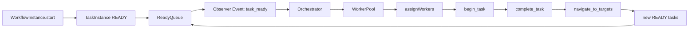

# README — Entrega 05: Orquestador + Cola Observer

**Proyecto:** App Detección Prod — Motor de Workflow BPMN 2.0  
**Curso:** Fundamentos de Programación y Frameworks Modernos para IA  
**Estado:** APROBADO / ENTREGA FINAL  
**Modelo de objetos:** inglés  
**Documentación:** español

## 1. Propósito del entregable

Este entregable implementa la capa de **orquestación** del motor de workflow. Su objetivo es convertir las tareas `READY` generadas por el runtime en asignaciones concretas a trabajadores, usando una cola FIFO y un orquestador basado en patrón **Observer**.

En el caso App Detección Prod, esta capa representa el mecanismo que permite que un caso de producto próximo a vencer avance de forma ordenada entre mercaderista, supervisor, vendedor, gerencia y worker de IA, sin depender de WhatsApp, Excel, cron ni validaciones manuales dispersas.

## 2. Archivos implementados

```text
src/orchestration/
├── __init__.py
├── assignment.py
├── events.py
├── orchestrator.py
└── queue.py
```

## 3. Componentes principales

| Componente | Archivo | Responsabilidad |
|---|---|---|
| `OrchestrationEvent` | `events.py` | Evento auditable para `task_ready`, `task_assigned`, `task_completed`, `sla_breached` |
| `OrchestrationObserver` | `events.py` | Contrato Observer para reaccionar ante eventos |
| `InMemoryEventLog` | `events.py` | Observer simple para pruebas y demo |
| `ReadyQueue` | `queue.py` | Cola FIFO basada en `collections.deque` |
| `ReadyQueueItem` | `queue.py` | Referencia a una tarea lista por `workflow_id` + `task_id` |
| `WorkerPool` | `assignment.py` | Pool de trabajadores con control de capacidad |
| `Assignment` | `assignment.py` | Resultado auditable de una asignación |
| `Orchestrator` | `orchestrator.py` | Asigna workers, inicia tareas, completa tareas, hidrata cola y verifica SLA reactivo |

## 4. Decisiones de diseño

### 4.1 Cola FIFO con `collections.deque`

Se usa `collections.deque` porque cumple la semántica de una cola liviana, simple de probar y suficiente para el MVP académico. El FSD justifica que en la etapa siguiente esta cola pueda persistirse en SQLite si se requiere recuperación tras caída.

### 4.2 Observer en vez de cron

El motor no depende de cron. La cola emite eventos cuando una tarea entra a `READY`; el orquestador se suscribe como Observer y reacciona a eventos de negocio. Esto está alineado con el enfoque de emular AWS SQS y con la analogía de Job Executor / External Task de motores BPMN.

### 4.3 Asignación `skill-based + least-loaded`

La política final implementada es:

```text
1. Filtrar workers por especialidad requerida por la tarea.
2. Excluir workers sin capacidad disponible.
3. Elegir el worker con menor carga activa relativa.
4. Desempatar por cantidad absoluta de asignaciones y luego por employee_id.
```

Esta política es defendible porque balancea carga sin perder trazabilidad ni introducir complejidad innecesaria como el algoritmo húngaro en esta etapa.

### 4.4 Runtime conserva la verdad del estado

El orquestador **no reemplaza** al runtime. El runtime sigue siendo la fuente de verdad para:

- estado de `WorkflowInstance`;
- estado de `TaskInstance`;
- navegación `FORWARD`;
- incidentes `BACKWARD`;
- reset;
- recursos;
- `execution_path`.

El orquestador solo agrega cola, eventos, asignación y reacción operacional.

## 5. Flujo implementado



## 6. Relación con App Detección Prod

| Necesidad del proyecto | Respuesta del orquestador |
|---|---|
| Mercaderista reporta producto próximo a vencer | `ReadyQueue` habilita `detect_product_case` |
| Supervisor debe validar evidencia sin perder trazabilidad | `WorkerPool` asigna tareas tipo `SUPERVISOR` |
| Vendedor debe gestionar acción comercial | `WorkerPool` asigna tareas tipo `SELLER` |
| Gerencia debe aprobar cambio de precio | `WorkerPool` asigna tareas tipo `MANAGER` |
| IA clasifica riesgo sin decidir por humanos | tareas tipo `SYSTEM_AI` se asignan a worker especializado |
| La operación no debe depender de cron | `Orchestrator` reacciona a eventos |
| El docente debe ver trazabilidad | eventos + `execution_path` documentan cada paso |

## 7. Evidencia técnica

Comandos ejecutados desde la raíz del paquete:

```bash
python -m compileall src
python -m unittest discover -s tests
```

Resultado validado:

```text
Ran 13 tests
OK
```

## 8. Pruebas agregadas

Archivo:

```text
tests/test_orchestration.py
```

Casos cubiertos:

1. `ReadyQueue` notifica a observers cuando entra una tarea `READY`.
2. `Orchestrator` asigna una tarea lista por especialidad.
3. `Orchestrator` completa una tarea y encola el siguiente target `FORWARD`.
4. `WorkerPool` selecciona el candidato menos cargado.

## 9. Criterio de revisión

Este entregable queda correcto si el docente puede verificar que:

- existe una cola real basada en `deque`;
- el orquestador está desacoplado mediante Observer;
- la asignación respeta especialidad y capacidad;
- no se usa cron;
- el runtime sigue conservando la verdad del estado;
- las pruebas pasan;
- la trazabilidad documental conecta FSD → código → tests.
