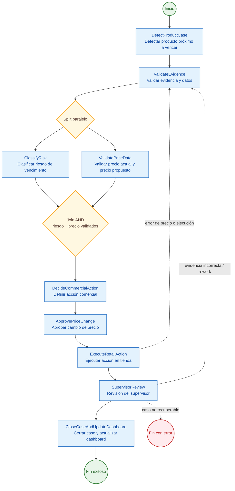
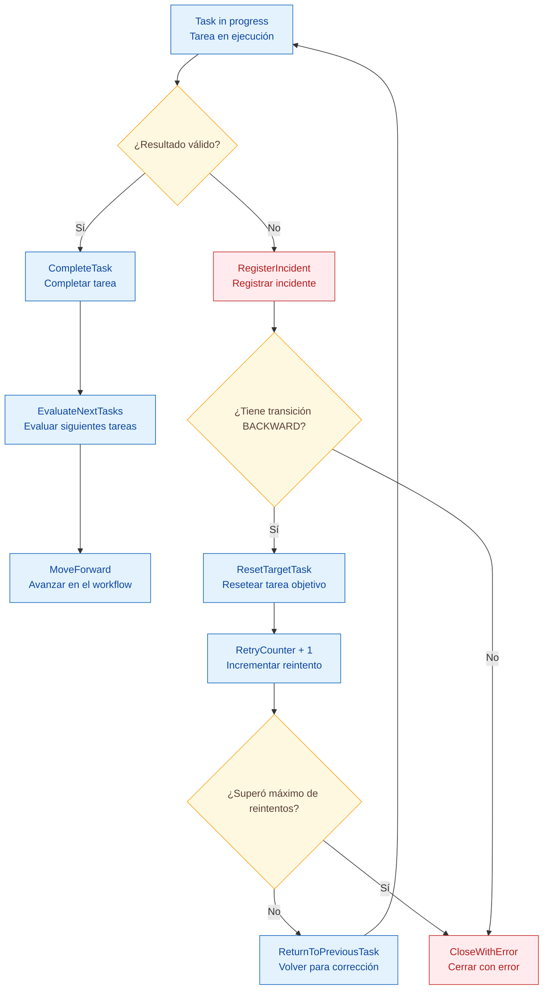
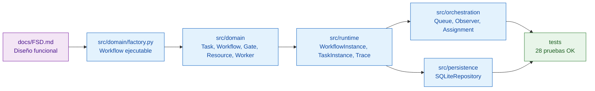

# Workflow visual — App Detección Prod BPMN Engine

**Estado:** APROBADO / COMPLEMENTO VISUAL DE DEFENSA  
**Ubicación técnica relacionada:** `src/domain/factory.py`  
**Ubicación funcional relacionada:** `docs/FSD.md`  
**Propósito:** Mostrar de forma visual cómo fluye el workflow principal implementado en Python.

---

## 1. Vista ejecutiva del workflow principal

Este diagrama representa el flujo principal del motor BPMN aplicado a **App Detección Prod**. El proceso inicia cuando el mercaderista detecta un producto próximo a vencer y termina cuando el caso queda cerrado con trazabilidad y dashboard actualizado.



---

## 2. Lectura simple del flujo

| Paso | Tarea técnica | Explicación funcional |
|---:|---|---|
| 1 | `DetectProductCase` | El mercaderista registra producto, foto, vencimiento, precio y cantidad. |
| 2 | `ValidateEvidence` | Se valida que la evidencia sea usable y que los datos mínimos estén completos. |
| 3 | `ClassifyRisk` | El sistema clasifica el riesgo operativo/financiero del caso. |
| 4 | `ValidatePriceData` | Se valida precio actual, precio propuesto y datos económicos. |
| 5 | `DecideCommercialAction` | Ventas define descuento, bandeo, retiro, promoción o monitoreo. |
| 6 | `ApprovePriceChange` | Se aprueba humanamente cualquier cambio de precio. |
| 7 | `ExecuteRetailAction` | Se ejecuta la acción en tienda y se adjunta evidencia. |
| 8 | `SupervisorReview` | El supervisor revisa que la acción esté correctamente aplicada. |
| 9 | `CloseCaseAndUpdateDashboard` | Se cierra el caso y se actualizan métricas gerenciales. |

---

## 3. Vista de incidentes, rework y reintentos

El motor no solo avanza en línea recta. También permite volver atrás cuando falta evidencia, hay error de precio, hay mala ejecución o se supera el número máximo de reintentos.



---

## 4. Vista por capas del motor

Este diagrama muestra cómo se relaciona la documentación, el modelo de dominio, el runtime, la orquestación, la persistencia y las pruebas.



---

## 5. Relación con el código

El diagrama principal se implementa en:

```text
src/domain/factory.py
```

La función responsable es:

```python
build_app_deteccion_workflow()
```

La equivalencia es:

| Diagrama | Código Python |
|---|---|
| Caja del workflow | `Task(...)` |
| Flecha de avance | `add_target(...)` |
| Retorno por error | `add_backward_transition(...)` |
| Compuerta lógica | `LogicGate(...)` |
| Recurso obligatorio | `ResourceSpec(...)` |
| Responsable | `WorkerType` |

---

## 6. Cómo explicarlo en defensa

> Este diagrama muestra el workflow principal implementado en Python. No es una imagen decorativa: cada bloque corresponde a una tarea `Task` dentro de `src/domain/factory.py`. Las flechas se implementan con transiciones del motor y los retornos por error se implementan con transiciones `BACKWARD`. La ventaja es que el flujo no queda solo documentado, sino que también es ejecutable y validado por pruebas automatizadas.

---

## 7. Comando de validación

Para demostrar que el workflow está implementado y probado:

```bash
python -m unittest discover -s tests
```

Resultado esperado:

```text
Ran 28 tests
OK
```
