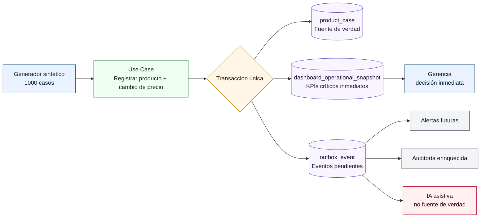

# POC-01 — Registro transaccional, dashboard gerencial inmediato y Outbox confiable

> **Proyecto:** App Detección Prod  
> **Ruta requerida:** `pocs/POC-01/POC-01.md`  
> **Versión:** `v3.0 - defensa final / nivel doctorado / coherencia transversal`  
> **Estado:** Completada para revisión  
> **Fecha:** 27/05/2026  
> **Autora:** Gina Fabiana Villanueva Viscarra  
> **Documentos base aprobados:** BRD v1.1 KPI Precio, MRD v1.1 KPI Precio, PRD v1.1 KPI Precio, FSD v1.1 KPI Precio, DTI v1.3 Defensa Final, ADR-0001 a ADR-0005, Diagramas profesionales.

---

## 0. Metadatos

| Campo | Valor |
|---|---|
| ID | `POC-01` |
| Título | Registro transaccional + dashboard inmediato + Outbox confiable |
| Tipo | Prueba de Concepto arquitectónica y funcional |
| Grupo / Responsable | Gina Fabiana Villanueva Viscarra |
| Fecha de inicio | 27/05/2026 |
| Fecha objetivo de cierre | 27/05/2026 |
| Estado | Completada para revisión |
| ADR principal | `ADR-0003-event-driven-outbox-dashboard-tiempo-real` |
| ADRs relacionados | `ADR-0001`, `ADR-0002`, `ADR-0004`, `ADR-0005` |
| FSD relacionado | Registro de producto próximo a vencer, cambio de precio auditado, dashboard gerencial, eventos de dominio |
| DTI relacionado | C4, arquitectura hexagonal, event-driven/outbox, dashboard inmediato, AWS, observabilidad, POCs |
| Entrega esperada | Carpeta `pocs/POC-01/` con documentación, script, evidencia, diagramas y veredicto |

---

## 1. Qué hace esta POC, para qué sirve y por qué existe

Esta POC valida el **núcleo operacional y financiero** de App Detección Prod: registrar un producto próximo a vencer, registrar su cambio de precio, actualizar inmediatamente los indicadores críticos que ve gerencia y dejar eventos confiables para auditoría, alertas, IA e integraciones futuras.

No es un MVP ni una pantalla final. Es una prueba controlada para resolver una incertidumbre técnica y de negocio antes de construir todo el sistema.

### 1.1 Qué hace exactamente

La POC ejecuta 1.000 registros sintéticos de productos próximos a vencer. Para cada registro realiza una transacción única que:

1. Guarda el caso del producto próximo a vencer.
2. Guarda datos críticos del negocio: SKU, sala, lote, fecha relativa de vencimiento, cantidad, precio anterior, precio nuevo, variación de precio y nivel de riesgo.
3. Calcula el valor financiero en riesgo.
4. Calcula el valor económico intervenido por cambio de precio.
5. Actualiza el dashboard operacional gerencial en la misma transacción.
6. Inserta eventos en tabla Outbox:
   - `ProductNearExpiryRegistered.v1`
   - `PriceChanged.v1`
7. Exporta evidencia numérica, base de datos, CSV y gráficos.

### 1.2 Para qué sirve

Sirve para demostrar que la arquitectura aprobada puede sostener una necesidad crítica del negocio: **gerencia no puede decidir con información atrasada o dispersa**. Por eso, los KPIs críticos del dashboard no se delegan únicamente a un proceso asíncrono; se actualizan junto al estado fuente.

La POC también demuestra que el cambio de precio no debe tratarse como un comentario ni como dato secundario. Es un dato financiero trazable, auditable y medible.

### 1.3 Qué NO intenta demostrar

| No valida | Motivo |
|---|---|
| Pantalla móvil final | La POC valida arquitectura y consistencia, no diseño visual. |
| Integración AWS real | La decisión cloud está en ADR-0005; aquí se valida la lógica previa. |
| IA real | La IA se cubre en POC-02; aquí solo se asegura que existan datos confiables para IA. |
| Concurrencia multiusuario real | Queda como riesgo remanente para prueba posterior con PostgreSQL/k6/Locust. |
| Operación offline | Es otro riesgo relevante, pero no el objetivo de esta POC. |

---

## 2. Coherencia transversal con los entregables aprobados

| Documento aprobado | Decisión / necesidad aprobada | Cómo la valida esta POC |
|---|---|---|
| BRD v1.1 KPI Precio | Reducir merma, controlar precio, medir impacto financiero y trazabilidad. | Simula valor financiero en riesgo, precio anterior, precio nuevo y valor intervenido. |
| MRD v1.1 KPI Precio | El mercado necesita visibilidad, eficiencia y trazabilidad frente a WhatsApp/Excel. | Sustituye registros dispersos por datos estructurados y evidencia medible. |
| PRD v1.1 KPI Precio | El producto debe registrar vencimientos, acciones, precios, cantidades y KPIs. | Ejecuta el flujo base de registro + cambio de precio + dashboard. |
| FSD v1.1 KPI Precio | Los casos de uso deben ser verificables, auditables y medibles. | Implementa una versión mínima ejecutable del flujo funcional crítico. |
| ADR-0001 | Monolito modular evolutivo. | Valida que no se necesita microservicios desde el día uno para este flujo. |
| ADR-0002 | Core hexagonal. | Simula el caso de uso como centro, separable de infraestructura real. |
| ADR-0003 | Dashboard inmediato + Outbox. | Valida exactamente esa decisión: transacción fuerte + eventos confiables. |
| ADR-0004 | IA con guardrails, no fuente de verdad. | La IA queda como consumidor posterior; no modifica precios ni estados. |
| ADR-0005 | AWS evolutivo, observabilidad y seguridad. | Genera la base para mapear a RDS, EventBridge/SQS, CloudWatch y auditoría. |
| DTI v1.3 | Contrato técnico rector. | Aporta evidencia ejecutada para sostener arquitectura, trade-offs y POCs. |
| Diagramas profesionales | Representación visual de C4, hexagonal, eventos y AWS. | La POC ejecuta el flujo modelado en los diagramas. |

---

## 3. Riesgo que mitiga

### 3.1 Riesgo principal

> Que la arquitectura definida en el DTI no garantice consistencia entre el registro operativo, el dashboard gerencial inmediato, la auditoría del cambio de precio y los eventos de dominio.

### 3.2 Riesgos específicos

| Código | Riesgo | Impacto si ocurre | Mecanismo validado |
|---|---|---|---|
| R-POC01-01 | Dashboard gerencial atrasado | Gerencia decidiría con datos incompletos. | KPIs críticos se actualizan en la transacción. |
| R-POC01-02 | Precio no auditable | No se puede medir rentabilidad ni margen protegido. | Se registran precio anterior, precio nuevo, delta y `PriceChanged.v1`. |
| R-POC01-03 | Pérdida de eventos | Alertas/IA/auditoría tendrían información incompleta. | Outbox transaccional con eventos por caso. |
| R-POC01-04 | Latencia operativa alta | Baja adopción por mercaderistas/supervisores/vendedores. | Medición p50, p95, p99 y throughput. |
| R-POC01-05 | Microservicios prematuros | Complejidad innecesaria para MVP. | Validación local con core transaccional y Outbox. |
| R-POC01-06 | Desalineación documental | Entregables se verían aislados. | Matriz BRD → MRD → PRD → FSD → ADR → DTI → POC. |

---

## 4. Hipótesis falsable

> Creemos que un **monolito modular con arquitectura hexagonal**, actualización transaccional de dashboard operacional y patrón **Outbox** permitirá registrar 1.000 casos simulados de productos próximos a vencer con cambio de precio, manteniendo consistencia inmediata de KPIs críticos, cero pérdida de eventos y latencia p95 menor a 500 ms en entorno local controlado.

La hipótesis falla si ocurre cualquiera de estas condiciones:

- Latencia p95 mayor o igual a 500 ms.
- Errores transaccionales mayores a 0.
- Menos de 2 eventos Outbox por caso.
- Dashboard inconsistente frente a registros fuente.
- Casos con cambio de precio sin evento `PriceChanged.v1`.

---

## 5. Criterios de éxito medibles SMART

| Métrica | Umbral éxito | Umbral fracaso | Valor obtenido | Veredicto |
|---|---:|---:|---:|---|
| Registros procesados | ≥ 1.000 | < 1.000 | 1000 | ✅ |
| Errores transaccionales | 0 | > 0 | 0 | ✅ |
| Latencia p95 | < 500 ms | ≥ 500 ms | 1.417 ms | ✅ |
| Latencia p99 | < 1.000 ms | ≥ 1.000 ms | 2.696 ms | ✅ |
| Throughput | ≥ 100 registros/s | < 100 registros/s | 1660.59 registros/s | ✅ |
| Eventos Outbox | 2 por caso | < 2 por caso | 2000 | ✅ |
| Eventos `PriceChanged.v1` | 1 por caso con cambio de precio | < 1 por caso | 1000 | ✅ |
| Consistencia dashboard/casos/eventos | 100 % | < 100 % | True | ✅ |

> **Aclaración técnica:** la latencia está expresada en milisegundos. Un p95 de `1.417 ms` está muy por debajo del umbral de `500 ms`.

---

## 6. Alcance reducido time-boxed

### 6.1 Funcionalidades incluidas

- Registro sintético de producto próximo a vencer.
- Registro de SKU, sala, lote, días para vencer, cantidad, precio anterior, precio nuevo, variación y criticidad.
- Cálculo de valor financiero en riesgo.
- Cálculo de valor económico intervenido por cambio de precio.
- Actualización inmediata del dashboard operacional.
- Inserción de eventos Outbox:
  - `ProductNearExpiryRegistered.v1`
  - `PriceChanged.v1`
- Exportación de evidencia: JSON, CSV, SQLite y gráficos.

### 6.2 Funcionalidades excluidas

| Exclusión | Motivo |
|---|---|
| Frontend móvil real | No es necesario para validar el patrón transaccional. |
| Autenticación real | Se valida en seguridad/roles del producto, no en esta POC. |
| AWS real | Esta POC valida la lógica previa; el mapeo AWS está en ADR-0005. |
| Bus real de eventos | Primero se valida Outbox; luego se integra EventBridge/SQS. |
| IA real | La IA se valida en POC-02. |
| Offline móvil | Riesgo importante, pero no corresponde al objetivo de POC-01. |

### 6.3 Duración

Time-box de **1 día académico**: implementación mínima, ejecución, captura de evidencia y análisis.

---

## 7. Diseño de la prueba

### 7.1 Stack usado

| Componente | Tecnología | Modo | Justificación |
|---|---|---|---|
| Lenguaje | Python 3.x | Local | Script reproducible y auditable. |
| Persistencia | SQLite | Local transaccional | Simula lógica relacional antes de RDS/PostgreSQL. |
| Métricas | `time.perf_counter` | Local | Medición simple y verificable. |
| Evidencia | JSON/CSV/SQLite/PNG | Versionable | Fácil de subir a GitHub. |
| Patrón | Outbox | Tabla transaccional | Valida no pérdida de eventos sin infraestructura externa. |

### 7.2 Arquitectura de la POC



### 7.3 Datos de prueba

| Variable | Valor / rango |
|---|---|
| Volumen | 1.000 registros sintéticos |
| Salas simuladas | 25 |
| Días para vencer | 7, 15, 30, 45, 60, 75, 89 |
| Precio anterior | Rango sintético entre 8 y 180 |
| Descuento simulado | 5 % a 30 % |
| Cantidad | 1 a 80 unidades |
| Casos con cambio de precio | 1.000 |
| Tipo de evidencia | Sintética, sin datos personales ni información real sensible |

### 7.4 Procedimiento experimental

1. Eliminar base local previa.
2. Crear tablas `product_case`, `dashboard_operational_snapshot` y `outbox_event`.
3. Generar 1.000 casos sintéticos.
4. Ejecutar una transacción por caso:
   1. insertar caso fuente;
   2. registrar precio anterior y nuevo;
   3. calcular delta y valor intervenido;
   4. actualizar dashboard inmediato;
   5. insertar `ProductNearExpiryRegistered.v1`;
   6. insertar `PriceChanged.v1`;
   7. confirmar transacción.
5. Medir latencia por operación.
6. Exportar evidencia.
7. Validar consistencia entre casos, dashboard y eventos.

---

## 8. Resultados

### 8.1 Métricas técnicas

| Métrica | Valor obtenido | Interpretación |
|---|---:|---|
| Registros intentados | 1000 | Carga objetivo completa. |
| Registros insertados | 1000 | No hubo pérdida de registros. |
| Errores | 0 | Flujo estable en entorno local. |
| Throughput | 1660.59 registros/s | Superior al umbral académico. |
| Latencia promedio | 0.567 ms | Operación liviana. |
| Latencia p50 | 0.421 ms | Mediana estable. |
| Latencia p95 | 1.417 ms | Cumple ampliamente. |
| Latencia p99 | 2.696 ms | Sin colas largas relevantes. |
| Eventos Outbox | 2000 | 2 eventos por caso. |
| Eventos `PriceChanged.v1` | 1000 | 1 evento por cambio de precio. |

### 8.2 Métricas de negocio

| KPI | Valor obtenido | Relevancia |
|---|---:|---|
| Casos abiertos | 1000 | Visibilidad operativa total. |
| Casos críticos | 418 | Priorización para supervisión y gerencia. |
| Unidades en riesgo | 40898 | Exposición operativa. |
| Valor financiero en riesgo | 3,893,025.68 | Riesgo económico antes de acción. |
| Casos con cambio de precio | 1000 | Cobertura del KPI de precio. |
| Valor intervenido por cambio de precio | 709,010.45 | Impacto económico de acción comercial. |
| Consistencia dashboard/casos/eventos | True | Dashboard refleja fuente de verdad. |

---

## 9. Evidencia generada

| Archivo | Descripción | Cómo defenderlo |
|---|---|---|
| `scripts/poc01_benchmark.py` | Script ejecutable. | Muestra que la POC no es teórica. |
| `evidencia/metrics.json` | Métricas consolidadas. | Demuestra resultados cuantitativos. |
| `evidencia/latencies.csv` | Latencias por operación. | Permite auditar p50/p95/p99. |
| `evidencia/dashboard_snapshot.json` | Snapshot de KPIs. | Demuestra dashboard inmediato. |
| `evidencia/poc01_app_deteccion_prod.sqlite` | Base generada. | Permite verificar tablas y registros. |
| `evidencia/*.png` | Gráficos. | Evidencia visual para defensa. |
| `diagramas/*.mmd` | Diagramas de arquitectura, secuencia y trazabilidad. | Conecta POC con DTI/ADR. |
| `docs/COHERENCE_AUDIT.md` | Auditoría de coherencia transversal. | Demuestra que no es un artefacto aislado. |
| `docs/DEFENSE_GUIDE.md` | Guion de defensa. | Ayuda a explicar la POC oralmente. |
| `docs/TRACEABILITY_MATRIX.md` | Matriz de trazabilidad. | Une negocio, producto, arquitectura y evidencia. |

---

## 10. Veredicto

**Veredicto: ✅ Éxito técnico, arquitectónico y documental.**

La POC valida que la arquitectura aprobada es viable para el primer release porque:

- Mantiene consistencia fuerte en el dato fuente.
- Actualiza el dashboard gerencial crítico sin esperar consumidores asíncronos.
- Registra cambio de precio como KPI financiero y evento de dominio.
- Usa Outbox para confiabilidad de eventos sin introducir microservicios prematuros.
- Genera evidencia reproducible y defendible.
- Se mantiene coherente con BRD, MRD, PRD, FSD, ADRs, DTI y diagramas.

---

## 11. Cómo defender esta POC ante el docente

### 11.1 Guion corto

> Esta POC valida el flujo arquitectónico más crítico de App Detección Prod: registrar productos próximos a vencer con cambio de precio, actualizar el dashboard gerencial de forma inmediata y dejar eventos confiables en Outbox. Es importante porque gerencia no puede tomar decisiones con datos atrasados y porque el cambio de precio afecta directamente rentabilidad, margen y merma. La POC demuestra que el monolito modular con core hexagonal y Outbox permite consistencia transaccional sin caer en microservicios prematuros.

### 11.2 Preguntas probables y respuestas

| Pregunta | Respuesta recomendada |
|---|---|
| ¿Por qué no usar solo eventos para actualizar el dashboard? | Porque gerencia requiere KPIs críticos inmediatos; si el dashboard dependiera solo de un consumidor asíncrono podría estar atrasado. |
| ¿Para qué sirve Outbox entonces? | Para procesos posteriores: alertas, auditoría enriquecida, IA, notificaciones e integraciones, sin perder eventos. |
| ¿Por qué SQLite y no AWS? | Porque la POC valida el patrón y reduce incertidumbre antes de pagar infraestructura; en producción se mapea a RDS/PostgreSQL. |
| ¿Qué demuestra el cambio de precio? | Que precio anterior, precio nuevo, delta y valor intervenido son datos financieros auditables, no campos secundarios. |
| ¿La POC prueba todo el sistema? | No. Prueba un riesgo crítico acotado, como exige la plantilla de POC. |
| ¿Qué queda pendiente? | Concurrencia real, offline móvil, RBAC, AWS real e IA, que se cubren con otras pruebas o fases. |

---

## 12. Riesgos remanentes

| Riesgo remanente | Por qué sigue abierto | Mitigación propuesta |
|---|---|---|
| Concurrencia multiusuario real | La POC es local y secuencial. | Prueba con k6/Locust + PostgreSQL. |
| Conectividad móvil variable | No valida operación en campo sin internet. | POC offline-first. |
| AWS real | No se desplegó infraestructura productiva. | POC de despliegue mínimo RDS/ECS/Lambda. |
| Seguridad/RBAC | No valida autenticación ni autorización. | Pruebas por rol. |
| Calidad de fotos | No valida captura móvil. | Prueba UX/prototipo. |
| IA real | No clasifica riesgo con LLM. | POC-02 IA con guardrails. |

---

## 13. Comandos de reproducción

Desde la raíz del repositorio:

```bash
cd pocs/POC-01
python scripts/poc01_benchmark.py
```

Evidencia esperada:

```text
pocs/POC-01/evidencia/metrics.json
pocs/POC-01/evidencia/latencies.csv
pocs/POC-01/evidencia/dashboard_snapshot.json
pocs/POC-01/evidencia/poc01_app_deteccion_prod.sqlite
```

---

## 14. Checklist de cierre de POC

| Criterio de cierre | Estado |
|---|---|
| Hipótesis declarada antes de ejecutar | ✅ |
| Criterio de éxito medible definido | ✅ |
| Umbral de fracaso definido | ✅ |
| Alcance time-boxed | ✅ |
| Script ejecutable incluido | ✅ |
| Evidencia numérica incluida | ✅ |
| Evidencia visual incluida | ✅ |
| Veredicto explícito | ✅ |
| Aprendizajes capturados | ✅ |
| Riesgos remanentes documentados | ✅ |
| Relación con ADRs documentada | ✅ |
| Relación con DTI/FSD documentada | ✅ |
| Relación con KPI de cambio de precio documentada | ✅ |
| Guion de defensa incluido | ✅ |

---

## 15. Historial

| Versión | Fecha | Autor | Cambio |
|---|---|---|---|
| v1.0 | 27/05/2026 | Gina Fabiana Villanueva Viscarra | POC inicial con script y métricas. |
| v2.0 | 27/05/2026 | Gina Fabiana Villanueva Viscarra | Reestructuración según plantilla POC. |
| v3.0 | 27/05/2026 | Gina Fabiana Villanueva Viscarra | Auditoría de coherencia transversal, defensa oral, trazabilidad completa y alineación con entregables aprobados. |
