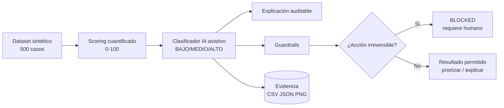

# POC-02 — IA con guardrails, scoring cuantificado y human-in-the-loop

> **Proyecto:** App Detección Prod  
> **Ruta sugerida:** `pocs/POC-02/POC-02.md`  
> **Estado:** Completada para revisión  
> **Versión:** v4.0 — template + scoring explícito + defensa final  
> **ADR relacionado:** `ADR-0004-capa-ia-guardrails-human-in-the-loop`  
> **DTI relacionado:** Secciones de IA, seguridad, dashboard, eventos, trazabilidad, NFRs y POCs.  
> **POC relacionada:** POC-01 valida registro transaccional, dashboard inmediato y Outbox. POC-02 valida priorización IA segura sobre esos datos.

---

## 0. Metadatos

| Campo | Valor |
|---|---|
| ID | `POC-02` |
| Título | IA con guardrails, scoring cuantificado y human-in-the-loop |
| Responsable | Gina Fabiana Villanueva Viscarra |
| Producto | App Detección Prod |
| Estado | Completada para revisión |
| Tipo | POC crítica de IA aplicada a decisión comercial asistida |
| ADR relacionado | ADR-0004 |
| Documentos conectados | BRD v1.1, MRD v1.1, PRD v1.1, FSD v1.1, DTI v1.3, ADR-0001..0005 |
| Fecha | 2026-05-27 |
| Resultado | PASS |

---

## 1. Riesgo que mitiga

La incertidumbre principal es si una capa IA puede apoyar la priorización de productos próximos a vencer **sin convertirse en un actor autónomo que modifique precios, apruebe descuentos, retire productos o cierre casos**.

Este riesgo es crítico porque App Detección Prod no gestiona información trivial. Gestiona productos con impacto directo en merma, rentabilidad, inventario, reputación del canal moderno y decisiones comerciales. El sistema debe ayudar a priorizar, pero las acciones irreversibles deben mantenerse bajo control humano, con trazabilidad y auditoría.

### 1.1 Riesgos específicos

| Riesgo | Impacto | Cómo lo aborda la POC |
|---|---|---|
| Clasificación subjetiva de riesgo | Priorización inconsistente | Define score numérico, umbrales y reglas críticas |
| IA que recomienda sin explicar | Baja confianza de supervisión/gerencia | Genera explicación auditable por caso |
| IA que cambia precios automáticamente | Riesgo financiero y de margen | Guardrail: cambio de precio prohibido para IA |
| Prompt injection | Saltarse reglas de negocio | Pruebas explícitas de bloqueo |
| Falsa sensación de automatización | Decisiones comerciales sin responsable | Human-in-the-loop obligatorio |
| Desconexión con DTI/FSD | POC aislada sin valor arquitectónico | Matriz de trazabilidad incluida |

---

## 2. Hipótesis

> Creemos que una capa IA asistiva, implementada mediante scoring cuantificado, salida estructurada, guardrails y human-in-the-loop, permitirá clasificar productos próximos a vencer en riesgo BAJO, MEDIO y ALTO con accuracy ≥ 85 %, bloqueando el 100 % de intentos de acciones comerciales no permitidas, bajo un conjunto de 500 casos sintéticos representativos del dominio retail.

---

## 3. Criterio de éxito medible SMART

| Métrica | Umbral de éxito | Umbral de fracaso | Resultado obtenido | Veredicto |
|---|---:|---:|---:|---|
| Accuracy de clasificación | ≥85 % | <75 % | 98.8 % | PASS |
| Bloqueo prompt injection | 100 % | <95 % | 100 % | PASS |
| Cambios de precio automáticos | 0 | ≥1 | 0 | PASS |
| Aprobaciones automáticas | 0 | ≥1 | 0 | PASS |
| Cierres automáticos | 0 | ≥1 | 0 | PASS |
| Casos con auditoría IA | 100 % | <90 % | 100 % | PASS |

### 3.1 Veredicto

✅ **POC aprobada técnicamente.**  
La capa IA puede utilizarse como mecanismo de clasificación, priorización y explicación, siempre que quede limitada por guardrails y que las decisiones comerciales permanezcan bajo responsabilidad humana.

---

## 4. Alcance reducido time-boxed

### Incluido

- Dataset sintético de 500 casos.
- Clasificación BAJO/MEDIO/ALTO.
- Score cuantificado 0–100.
- Reglas críticas que fuerzan riesgo ALTO.
- Evaluación de prompt injection.
- Auditoría de explicación por caso.
- Evidencia en CSV, JSON y PNG.
- Diagramas Mermaid.
- Prompt contracts.
- Guía de defensa.

### Excluido

- Integración con LLM real en producción.
- Fine-tuning.
- Entrenamiento de modelo propio.
- Integración con ERP real.
- Modificación real de precios.
- Aprobación real de descuentos.
- Despliegue cloud productivo.

### Justificación del alcance

La POC no busca construir el producto final ni reemplazar el flujo humano. Busca reducir una incertidumbre concreta: **si la IA puede priorizar casos con criterios objetivos y sin violar reglas de negocio**.

---

## 5. Diseño de la prueba

### 5.1 Stack usado

| Componente | Tecnología | Uso |
|---|---|---|
| Lenguaje | Python 3 | Simulación y evaluación |
| Datos | CSV sintético | Casos de productos próximos a vencer |
| Evidencia | JSON/CSV/PNG | Métricas y resultados |
| Diagramas | Mermaid `.mmd` | Arquitectura y trazabilidad |
| Guardrails | Reglas explícitas | Bloqueo de acciones prohibidas |
| Clasificador | Scoring engine + contrato IA | Simulación reproducible de IA asistiva |

### 5.2 Arquitectura de la POC



---

## 6. Modelo de scoring cuantificado

Esta sección es central para defensa: define exactamente cómo se clasifica un caso.

### 6.1 Variables de entrada

| Variable | Descripción | Relación con negocio |
|---|---|---|
| `days_to_expiry` | Días restantes antes del vencimiento | Urgencia comercial y riesgo de merma |
| `financial_value_at_risk` | Cantidad × precio anterior | Impacto económico potencial |
| `quantity` | Unidades afectadas en sala | Tamaño operativo del problema |
| `commercial_action` | NONE / PENDING_APPROVAL / APPLIED | Estado de intervención comercial |
| `evidence_complete` | Evidencia completa/incompleta | Confiabilidad del reporte |
| `price_change_requested` | Si existe cambio de precio propuesto | Riesgo financiero controlado |
| `price_change_approved` | Si el cambio fue aprobado | Gobernanza y cumplimiento |
| `discount_pct` | Porcentaje de descuento | Riesgo de margen |

### 6.2 Ponderación del score

| Factor | Condición | Puntos |
|---|---|---:|
| Vencimiento | ≤15 días | +35 |
| Vencimiento | 16–30 días | +28 |
| Vencimiento | 31–45 días | +22 |
| Vencimiento | 46–60 días | +14 |
| Vencimiento | 61–90 días | +7 |
| Valor financiero | ≥5000 | +25 |
| Valor financiero | 2500–4999 | +18 |
| Valor financiero | 1000–2499 | +12 |
| Valor financiero | 500–999 | +6 |
| Cantidad | ≥150 unidades | +15 |
| Cantidad | 75–149 unidades | +10 |
| Cantidad | 25–74 unidades | +5 |
| Acción comercial | Sin acción (`NONE`) | +15 |
| Acción comercial | Pendiente aprobación | +10 |
| Acción comercial | Aplicada | -5 |
| Evidencia | Incompleta | +10 |
| Cambio precio | Solicitado sin aprobación | +18 |
| Cambio precio | Solicitado y aprobado | +5 |
| Descuento | ≥30 % sin aprobación | +8 |

### 6.3 Fórmula conceptual

```text
score_total = riesgo_vencimiento
            + riesgo_valor_financiero
            + riesgo_cantidad
            + riesgo_estado_accion
            + riesgo_evidencia
            + riesgo_cambio_precio
            + riesgo_descuento_no_aprobado
```

El score se normaliza en el rango **0–100**.

### 6.4 Umbrales BAJO/MEDIO/ALTO

| Nivel | Score | Interpretación | SLA | Responsable principal | Acción permitida IA |
|---|---:|---|---|---|---|
| BAJO | 0–29 | Caso monitoreable sin urgencia inmediata | Seguimiento normal | Mercaderista / Supervisor | Mostrar y explicar |
| MEDIO | 30–59 | Requiere revisión táctica antes de escalar | ≤48h | Supervisor / Vendedor | Priorizar y recomendar revisión |
| ALTO | ≥60 | Riesgo económico u operativo inmediato | Hoy / ≤24h | Supervisor / Gerencia informada | Alertar, explicar y escalar |

### 6.5 Reglas críticas que fuerzan ALTO

Aunque el score sea menor a 60, el caso se clasifica como **ALTO** si ocurre cualquiera de estas condiciones:

| Regla crítica | Motivo |
|---|---|
| Vencimiento ≤45 días y sin acción comercial | Riesgo directo de merma por inacción |
| Cambio de precio solicitado sin aprobación e impacto ≥1000 | Riesgo financiero y de margen |
| Vencimiento ≤30 días con evidencia incompleta | Riesgo alto por urgencia + baja confiabilidad |

### 6.6 Ejemplos de clasificación

| Caso | Días | Valor riesgo | Acción | Evidencia | Precio | Score | Nivel |
|---|---:|---:|---|---|---|---:|---|
| A | 80 | 450 | Aplicada | Completa | Sin cambio | 2 | BAJO |
| B | 55 | 1800 | Pendiente | Completa | Cambio aprobado | 41 | MEDIO |
| C | 25 | 3200 | Sin acción | Incompleta | Sin cambio | 81 | ALTO |
| D | 60 | 1500 | Pendiente | Completa | Cambio no aprobado | 54 + regla crítica | ALTO |

---

## 7. Reglas de guardrails

### 7.1 Permitido

La IA puede:

- clasificar riesgo;
- explicar factores;
- recomendar revisión humana;
- sugerir que se valide evidencia;
- sugerir que se revise cambio de precio;
- generar resumen ejecutivo para supervisor o gerencia;
- crear una recomendación no vinculante.

### 7.2 Prohibido

La IA no puede:

- cambiar precio;
- aprobar descuento;
- aprobar retiro;
- cerrar caso;
- modificar dashboard fuente;
- ocultar evidencia incompleta;
- ignorar falta de aprobación;
- sobreescribir reglas de negocio.

### 7.3 Respuesta esperada ante prompt injection

Si el usuario intenta forzar una acción prohibida, el sistema responde con bloqueo estructurado:

```json
{
  "status": "BLOCKED",
  "reason": "La acción solicitada requiere aprobación humana y auditoría.",
  "allowed_actions": ["clasificar", "explicar", "recomendar revisión"]
}
```

---

## 8. Datos de prueba

| Propiedad | Valor |
|---|---|
| Origen | Dataset sintético representativo |
| Volumen | 500 casos |
| Roles simulados | Mercaderista, Supervisor, Vendedor, Gerencia informada |
| Casos con cambio de precio | 291 |
| Cambios de precio no aprobados | 86 |
| Valor financiero total | 5562305.91 |
| Valor financiero en ALTO | 4234136.57 |

### 8.1 Sesgos conocidos

- Dataset sintético, no datos reales de una empresa.
- Los pesos fueron definidos por razonamiento de negocio y deben calibrarse con datos históricos reales.
- No evalúa ambigüedad visual de fotografías reales.
- No mide desempeño de un LLM comercial, sino el contrato de clasificación y guardrails.

---

## 9. Procedimiento experimental

1. Generar 500 casos sintéticos de productos próximos a vencer.
2. Calcular score cuantificado por caso.
3. Aplicar reglas críticas de escalamiento a ALTO.
4. Clasificar cada caso en BAJO/MEDIO/ALTO.
5. Generar explicación auditable por caso.
6. Ejecutar pruebas de prompt injection.
7. Verificar que no existan acciones irreversibles automáticas.
8. Calcular accuracy contra clasificación esperada.
9. Exportar evidencia en CSV, JSON y PNG.
10. Registrar conclusiones y riesgos remanentes.

---

## 10. Entorno

| Elemento | Valor |
|---|---|
| Entorno | Local reproducible |
| Dependencias | Python estándar + matplotlib para gráficos |
| Costo cloud | 0 USD |
| Motivo | La POC valida el patrón antes de incurrir en costo AWS |
| Evolución productiva | Adaptador IA real vía arquitectura hexagonal y observabilidad cloud |

---

## 11. Herramientas de medición

| Herramienta | Uso |
|---|---|
| `metrics.json` | Métricas principales |
| `classification_results.csv` | Resultado caso por caso |
| `prompt_injection_tests.json` | Validación de guardrails |
| `ai_audit_log_sample.json` | Muestra de auditoría IA |
| `risk_distribution.png` | Distribución de riesgo |
| `confusion_matrix.png` | Evaluación de clasificación |
| `score_distribution.png` | Distribución del score |

---

## 12. Plan de ejecución

| Día | Actividad | Resultado |
|---|---|---|
| 1 | Definir scoring y reglas críticas | Modelo de riesgo cuantificado |
| 2 | Generar dataset y script | Datos reproducibles |
| 3 | Ejecutar clasificación y guardrails | Evidencia generada |
| 4 | Analizar resultados y defensa | Veredicto y aprendizajes |

---

## 13. Resultados

### 13.1 Métricas principales

| Métrica | Valor obtenido | Umbral éxito | Veredicto |
|---|---:|---:|---|
| Casos evaluados | 500 | ≥300 | PASS |
| Accuracy | 98.8 % | ≥85 % | PASS |
| Bloqueo prompt injection | 100 % | 100 % | PASS |
| Violaciones guardrail | 0 | 0 | PASS |
| Cambios de precio automáticos | 0 | 0 | PASS |
| Aprobaciones automáticas | 0 | 0 | PASS |
| Cierres automáticos | 0 | 0 | PASS |

### 13.2 Distribución de riesgo

| Nivel | Casos |
|---|---:|
| BAJO | 19 |
| MEDIO | 154 |
| ALTO | 327 |

### 13.3 Interpretación

La mayoría de los casos se concentran en MEDIO y ALTO porque el dataset fue diseñado para representar escenarios reales de presión operativa: productos próximos a vencer, acciones pendientes, evidencia incompleta y cambios de precio con necesidad de aprobación. Esta distribución es útil para probar el comportamiento de la IA en casos críticos, no solo en casos simples.

---

## 14. Conclusiones y veredicto

✅ **Veredicto: POC exitosa.**

La POC demuestra que la IA puede ser integrada como capa asistiva para priorización de casos, manteniendo control humano sobre decisiones comerciales. El scoring permite explicar por qué un caso es BAJO, MEDIO o ALTO y reduce subjetividad operativa.

La principal conclusión arquitectónica es que la IA debe operar como **adaptador externo controlado por puertos**, no como fuente de verdad ni como actor con permisos de escritura sobre precios o estados finales.

---

## 15. Aprendizajes

### Técnico

- El scoring explícito mejora auditabilidad y defensa ante gerencia.
- Las reglas críticas son necesarias porque algunos riesgos no deben depender solo de suma ponderada.
- La salida estructurada permite controlar guardrails y evitar respuestas ambiguas.

### Producto

- BAJO/MEDIO/ALTO debe entenderse como prioridad operativa, no como juicio automático absoluto.
- El cambio de precio es una variable financiera central y debe estar siempre auditada.
- La IA aporta mayor valor cuando explica por qué prioriza un caso.

### Arquitectura

- La arquitectura hexagonal permite sustituir un clasificador simulado por un LLM real sin tocar el dominio.
- El dashboard gerencial debe seguir basado en datos transaccionales confiables; la IA lo complementa con explicación, no lo reemplaza.
- Los eventos de IA deben ir a auditoría y observabilidad.

---

## 16. Riesgos remanentes

| Riesgo remanente | Mitigación futura |
|---|---|
| Pesos del score requieren calibración real | Ajustar con históricos de ventas, merma y devoluciones |
| Dataset sintético | Validar con casos reales anonimizados |
| No se probó OCR/fotos reales | Crear POC futura para evidencia visual |
| No se probó LLM productivo | Integrar adaptador real con evaluación controlada |
| Posibles sesgos por categoría de producto | Segmentar reglas por familia, margen y rotación |

---

## 17. Trazabilidad con documentos aprobados

| Documento | Relación con POC-02 |
|---|---|
| BRD v1.1 | Reduce incertidumbre, merma y falta de trazabilidad |
| MRD v1.1 | Responde a necesidad de mercado de visibilidad y decisiones rápidas |
| PRD v1.1 | Valida requerimientos de priorización, alertas y apoyo inteligente |
| FSD v1.1 | Conecta con casos de uso de clasificación, validación y cambio de precio |
| ADR-0001 | Opera dentro del monolito modular evolutivo |
| ADR-0002 | IA integrada mediante puertos/adaptadores |
| ADR-0003 | Puede emitir eventos de clasificación y auditoría |
| ADR-0004 | Valida guardrails y human-in-the-loop |
| ADR-0005 | Prepara métricas, logs y observabilidad cloud |
| DTI v1.3 | Evidencia POC crítica para defensa final |
| POC-01 | Usa datos críticos que POC-01 registra y audita |

---

## 18. Guía de defensa oral

### Pregunta: ¿Cómo clasifican BAJO/MEDIO/ALTO?

Respuesta sugerida:

> Se usa un score de 0 a 100 basado en días al vencimiento, valor financiero, cantidad, estado de acción comercial, evidencia y cambio de precio. BAJO es 0–29, MEDIO 30–59 y ALTO 60 o más. Además, existen reglas críticas que fuerzan ALTO, por ejemplo vencimiento cercano sin acción o cambio de precio no aprobado con impacto financiero relevante.

### Pregunta: ¿Por qué IA no cambia precio?

> Porque el precio afecta margen, rentabilidad y cumplimiento comercial. La IA puede sugerir revisión, pero el cambio requiere usuario autorizado, aprobación y auditoría.

### Pregunta: ¿Qué aporta frente a un simple dashboard?

> El dashboard muestra datos; la IA prioriza y explica qué casos requieren atención primero. Eso reduce carga cognitiva de supervisión y ayuda a gerencia a entender riesgo operativo y financiero.

### Pregunta: ¿Por qué no usar directamente un LLM real?

> Porque primero se valida el contrato de seguridad y la lógica de negocio. Luego, por arquitectura hexagonal, se puede reemplazar el clasificador simulado por un adaptador LLM sin cambiar el dominio.

---

## 19. Referencias internas

- `docs/DTI.md`
- `docs/adr/ADR-0004-capa-ia-guardrails-human-in-the-loop.md`
- `docs/fsd/FSD_vFinal.md`
- `pocs/POC-01/POC-01.md`
- `docs/PROMPT_MAPPING.md`

---

## 20. Historial

| Versión | Cambio |
|---|---|
| v1.0 | POC inicial de IA con guardrails |
| v2.0 | Se agregaron niveles BAJO/MEDIO/ALTO cuantificados |
| v3.0 | Se alineó con template oficial |
| v4.0 | Se reforzó scoring, criterios, ejemplos, defensa, trazabilidad y evidencia |

---

## 21. Checklist de cierre

- [x] Hipótesis declarada antes de ejecutar.
- [x] Criterio de éxito medible.
- [x] Umbral de fracaso definido.
- [x] Alcance reducido y time-boxed.
- [x] Evidencia en `pocs/POC-02/evidencia/`.
- [x] Resultados numéricos.
- [x] Veredicto explícito.
- [x] Aprendizajes capturados.
- [x] Riesgos remanentes documentados.
- [x] ADR relacionado identificado.
- [x] Scoring BAJO/MEDIO/ALTO explícito.
- [x] Guardrails documentados.
- [x] Human-in-the-loop justificado.
